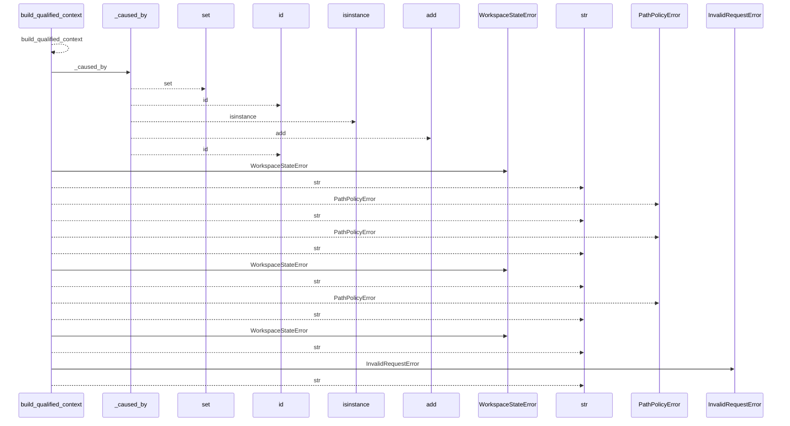
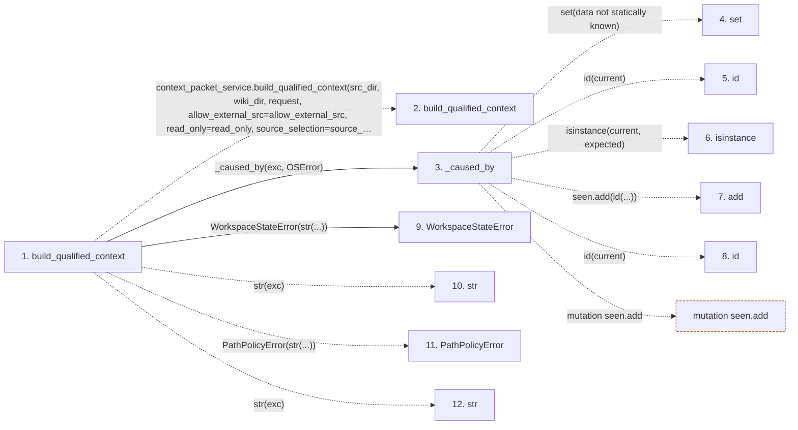

# build_qualified_context

**Entry point:** `build_qualified_context` (`api`)
**Source:** [api](../modules/api.md)
**Modules touched:** [api](../modules/api.md)

## Call sequence

<!-- Auto-generated from static call edges. Dashed arrows are external or unresolved calls. Reviewed runtime conditions and side effects belong in Behavior. -->

## Data flow

<!-- Auto-generated static analysis. Treat values and boundaries as best-effort hints, not runtime proof. -->

### Step data

| Step | Inputs | Reads | Writes | Returns |
|---|---|---|---|---|
| `build_qualified_context` | `src_dir: str`, `wiki_dir: str`, `request: Mapping[str, Any] \| None`, `allow_external_src: bool`, `read_only: bool`, `source_selection: str \| Path \| None` | `PathValidationError`, `context_packet_service`, `context_packet_service`, `context_packet_service`, `context_cmd` | - | `packet` |
| `build_qualified_context` | - | - | - | - |
| `_caused_by` | `exc: BaseException`, `expected: type[BaseException]` | - | - | `True`, `False` |
| `set` | - | - | - | - |
| `id` | - | - | - | - |
| `isinstance` | - | - | - | - |
| `add` | - | - | - | - |
| `id` | - | - | - | - |
| `WorkspaceStateError` | - | - | - | - |
| `str` | - | - | - | - |
| `PathPolicyError` | - | - | - | - |
| `str` | - | - | - | - |

### Call data

| From | To | Line | Call |
|---|---|---:|---|
| build_qualified_context | build_qualified_context | 697 | `context_packet_service.build_qualified_context(src_dir, wiki_dir, request, allow_external_src=allow_external_src, read_only=read_only, source_selection=source_selection)` |
| build_qualified_context | _caused_by | 706 | `_caused_by(exc, OSError)` |
| _caused_by | set | 382 | `set(data not statically known)` |
| _caused_by | id | 383 | `id(current)` |
| _caused_by | isinstance | 384 | `isinstance(current, expected)` |
| _caused_by | add | 386 | `seen.add(id(...))` |
| _caused_by | id | 386 | `id(current)` |
| build_qualified_context | WorkspaceStateError | 707 | `WorkspaceStateError(str(...))` |
| build_qualified_context | str | 707 | `str(exc)` |
| build_qualified_context | PathPolicyError | 708 | `PathPolicyError(str(...))` |
| build_qualified_context | str | 708 | `str(exc)` |

### Boundary effects

| Kind | Target | Step | Line |
|---|---|---|---:|
| mutation | `seen.add` | `_caused_by` | 386 |

### Static analysis gaps

| Kind | Step | Target | Line |
|---|---|---|---:|
| external_call | `build_qualified_context` | `context_packet_service.build_qualified_context` | 697 |
| unresolved_call | `_caused_by` | `id` | 383 |
| unresolved_call | `_caused_by` | `isinstance` | 384 |
| unresolved_call | `build_qualified_context` | `PathPolicyError` | 708 |
| step_limit | `build_qualified_context` | `first 12 steps` | 0 |

## Behavior

This flow starts at `build_qualified_context` and is classified as `api`. The generated call and data-flow sections are bounded static projections; runtime conditions and side effects require source-level confirmation.
