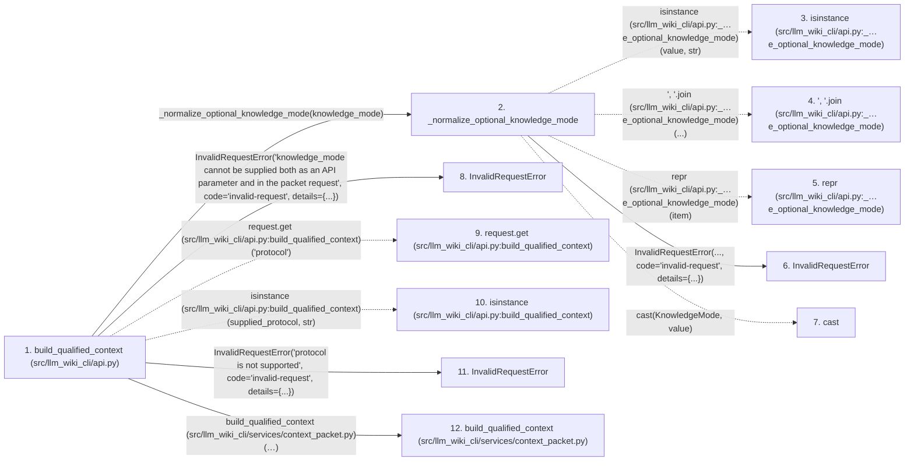

# build_qualified_context

**Entry point:** `build_qualified_context` (`api`)
**Source:** [api](../modules/api.md)
**Modules touched:** [api](../modules/api.md), [common](../modules/common.md), [config](../modules/config.md), [context_packet](../modules/context_packet.md), and 35 more

**Complete modules touched:**

- [api](../modules/api.md)
- [common](../modules/common.md)
- [config](../modules/config.md)
- [context_packet](../modules/context_packet.md)
- [context_service](../modules/context_service.md)
- [data_flow](../modules/data_flow.md)
- [dependency_versions](../modules/dependency_versions.md)
- [documentation_queries](../modules/documentation_queries.md)
- [documentation_query_builder](../modules/documentation_query_builder.md)
- [entrypoints](../modules/entrypoints.md)
- [extraction_service](../modules/extraction_service.md)
- [filesystem_guard](../modules/filesystem_guard.md)
- [imports](../modules/imports.md)
- [infrastructure_inventory](../modules/infrastructure_inventory.md)
- [infrastructure_sync](../modules/infrastructure_sync.md)
- [io](../modules/io.md)
- [knowledge_artifacts](../modules/knowledge_artifacts.md)
- [knowledge_consumption](../modules/knowledge_consumption.md)
- [knowledge_envelope](../modules/knowledge_envelope.md)
- [knowledge_evidence](../modules/knowledge_evidence.md)
- [knowledge_freshness](../modules/knowledge_freshness.md)
- [knowledge_generation](../modules/knowledge_generation.md)
- [knowledge_loader](../modules/knowledge_loader.md)
- [knowledge_model](../modules/knowledge_model.md)
- [knowledge_orchestration](../modules/knowledge_orchestration.md)
- [knowledge_verification](../modules/knowledge_verification.md)
- [packages](../modules/packages.md)
- [plugins](../modules/plugins.md)
- [python_calls](../modules/python_calls.md)
- [python_imports](../modules/python_imports.md)
- [services_dependencies](../modules/services_dependencies.md)
- [source_selection](../modules/source_selection.md)
- [source_snapshot](../modules/source_snapshot.md)
- [sync_manifest](../modules/sync_manifest.md)
- [validation](../modules/validation.md)
- [verification_contracts](../modules/verification_contracts.md)
- [wiki_media](../modules/wiki_media.md)
- [wiki_surface](../modules/wiki_surface.md)
- [wiki_surface_index](../modules/wiki_surface_index.md)

## Call sequence

```mermaid
sequenceDiagram
    participant p0 as build_qualified_context (src/llm_wiki_cli/api.py)
    participant p1 as _normalize_optional_knowledge_mode
    participant p2 as isinstance (src/llm_wiki_cli/api.py:_…e_optional_knowledge_mode)
    participant p3 as ', '.join (src/llm_wiki_cli/api.py:_…e_optional_knowledge_mode)
    participant p4 as repr (src/llm_wiki_cli/api.py:_…e_optional_knowledge_mode)
    participant p5 as InvalidRequestError
    participant p6 as cast
    participant p7 as request.get (src/llm_wiki_cli/api.py:build_qualified_context)
    participant p8 as isinstance (src/llm_wiki_cli/api.py:build_qualified_context)
    participant p9 as build_qualified_context (src/llm_wiki_cli/services/context_packet.py)
    participant p10 as _normalized_request
    participant p11 as isinstance (src/llm_wiki_cli/services…et.py:_normalized_request)
    participant p12 as ProtocolRequestError
    participant p13 as deepcopy (src/llm_wiki_cli/services…et.py:_normalized_request)
    participant p14 as dict (src/llm_wiki_cli/services…et.py:_normalized_request)
    participant p15 as candidate.setdefault
    participant p16 as _validate_protocol_request
    participant p17 as isinstance (src/llm_wiki_cli/services…validate_protocol_request)
    participant p18 as data.get (src/llm_wiki_cli/services…validate_protocol_request)
    participant p19 as _validate_protocol_request_impl
    participant p20 as isinstance (src/llm_wiki_cli/services…ate_protocol_request_impl)
    participant p21 as any (src/llm_wiki_cli/services…ate_protocol_request_impl)
    participant p22 as data.get (src/llm_wiki_cli/services…ate_protocol_request_impl)
    participant p23 as sorted (src/llm_wiki_cli/services…ate_protocol_request_impl)
    p0->>p1: _normalize_optional_knowledge_mode
    p1-->>p2: isinstance (src/llm_wiki_cli/api.py:_…e_optional_knowledge_mode)
    p1-->>p3: ', '.join (src/llm_wiki_cli/api.py:_…e_optional_knowledge_mode)
    p1-->>p4: repr (src/llm_wiki_cli/api.py:_…e_optional_knowledge_mode)
    p1->>p5: InvalidRequestError
    p1-->>p6: cast
    p0->>p5: InvalidRequestError
    p0-->>p7: request.get (src/llm_wiki_cli/api.py:build_qualified_context)
    p0-->>p8: isinstance (src/llm_wiki_cli/api.py:build_qualified_context)
    p0->>p5: InvalidRequestError
    p0->>p9: build_qualified_context (src/llm_wiki_cli/services/context_packet.py)
    p9->>p10: _normalized_request
    p10-->>p11: isinstance (src/llm_wiki_cli/services…et.py:_normalized_request)
    p10->>p12: ProtocolRequestError
    p10-->>p13: deepcopy (src/llm_wiki_cli/services…et.py:_normalized_request)
    p10-->>p14: dict (src/llm_wiki_cli/services…et.py:_normalized_request)
    p10-->>p15: candidate.setdefault
    p10-->>p15: candidate.setdefault
    p10->>p16: _validate_protocol_request
    p16-->>p17: isinstance (src/llm_wiki_cli/services…validate_protocol_request)
    p16-->>p18: data.get (src/llm_wiki_cli/services…validate_protocol_request)
    p16->>p19: _validate_protocol_request_impl
    p19-->>p20: isinstance (src/llm_wiki_cli/services…ate_protocol_request_impl)
    p19->>p12: ProtocolRequestError
    p19-->>p21: any (src/llm_wiki_cli/services…ate_protocol_request_impl)
    p19-->>p20: isinstance (src/llm_wiki_cli/services…ate_protocol_request_impl)
    p19->>p12: ProtocolRequestError
    p19-->>p22: data.get (src/llm_wiki_cli/services…ate_protocol_request_impl)
    p19->>p12: ProtocolRequestError
    p19-->>p23: sorted (src/llm_wiki_cli/services…ate_protocol_request_impl)
```

<!-- Auto-generated from static call edges. Dashed arrows are external or unresolved calls. Reviewed runtime conditions and side effects belong in Behavior. -->

> Call sequence diagram shows 30 of 3310 interactions; 3280 omitted to keep the visualization within the 30-interaction and generated-diagram limits.

> Trace truncated at the depth limit; deeper calls are omitted.

## Data flow

<!-- Auto-generated static analysis. Treat values and boundaries as best-effort hints, not runtime proof. -->

### Step data

| Step | Inputs | Reads | Writes | Returns |
|---|---|---|---|---|
| `build_qualified_context (src/llm_wiki_cli/api.py)` | `src_dir: str`, `wiki_dir: str`, `request: Mapping[str, Any] \| None`, `allow_external_src: bool`, `read_only: bool`, `source_selection: str \| Path \| None`, `knowledge_mode: KnowledgeMode \| None` | `KNOWLEDGE_MODE_REQUEST_FIELD`, `KNOWLEDGE_MODE_REQUEST_FIELD`, `context_cmd`, `CONTEXT_KNOWLEDGE_PROTOCOL_VERSION`, `KNOWLEDGE_MODE_REQUEST_FIELD`, `CONTEXT_KNOWLEDGE_PROTOCOL_VERSION`, `KNOWLEDGE_MODE_REQUEST_FIELD`, `CONTEXT_KNOWLEDGE_PROTOCOL_VERSION` | - | `packet` |
| `_normalize_optional_knowledge_mode` | `value: object` | `KNOWLEDGE_MODE_VALUES`, `KNOWLEDGE_MODE_VALUES`, `KNOWLEDGE_MODE_REQUEST_FIELD`, `KnowledgeMode` | - | `None`, `cast(...)` |
| `isinstance (src/llm_wiki_cli/api.py:_…e_optional_knowledge_mode)` | - | - | - | - |
| `', '.join (src/llm_wiki_cli/api.py:_…e_optional_knowledge_mode)` | - | - | - | - |
| `repr (src/llm_wiki_cli/api.py:_…e_optional_knowledge_mode)` | - | - | - | - |
| `InvalidRequestError` | - | - | - | - |
| `cast` | - | - | - | - |
| `InvalidRequestError` | - | - | - | - |
| `request.get (src/llm_wiki_cli/api.py:build_qualified_context)` | - | - | - | - |
| `isinstance (src/llm_wiki_cli/api.py:build_qualified_context)` | - | - | - | - |
| `InvalidRequestError` | - | - | - | - |
| `build_qualified_context (src/llm_wiki_cli/services/context_packet.py)` | `src_dir: str`, `wiki_dir: str`, `request: Mapping[str, Any] \| None`, `allow_external_src: bool`, `read_only: bool`, `job_request: ExtractionJobRequest \| None`, `plan_reporter: Callable[[ExtractionJobPlan], None] \| None`, `source_selection: str \| Path \| None` | `_KNOWLEDGE_PACKET_CONTRACT`, `_KNOWLEDGE_PACKET_CONTRACT`, `_KNOWLEDGE_PACKET_CONTRACT` | `response[...]` | `validated.packet` |

### Call data

| From | To | Line | Call |
|---|---|---:|---|
| build_qualified_context (src/llm_wiki_cli/api.py) | _normalize_optional_knowledge_mode | 895 | `_normalize_optional_knowledge_mode(knowledge_mode)` |
| _normalize_optional_knowledge_mode | isinstance (src/llm_wiki_cli/api.py:_…e_optional_knowledge_mode) | 369 | `isinstance(value, str)` |
| _normalize_optional_knowledge_mode | ', '.join (src/llm_wiki_cli/api.py:_…e_optional_knowledge_mode) | 370 | `', '.join(...)` |
| _normalize_optional_knowledge_mode | repr (src/llm_wiki_cli/api.py:_…e_optional_knowledge_mode) | 370 | `repr(item)` |
| _normalize_optional_knowledge_mode | InvalidRequestError | 371 | `InvalidRequestError(..., code='invalid-request', details={...})` |
| _normalize_optional_knowledge_mode | cast | 376 | `cast(KnowledgeMode, value)` |
| build_qualified_context (src/llm_wiki_cli/api.py) | InvalidRequestError | 899 | `InvalidRequestError('knowledge_mode cannot be supplied both as an API parameter and in the packet request', code='invalid-request', details={...})` |
| build_qualified_context (src/llm_wiki_cli/api.py) | request.get (src/llm_wiki_cli/api.py:build_qualified_context) | 905 | `request.get('protocol')` |
| build_qualified_context (src/llm_wiki_cli/api.py) | isinstance (src/llm_wiki_cli/api.py:build_qualified_context) | 907 | `isinstance(supplied_protocol, str)` |
| build_qualified_context (src/llm_wiki_cli/api.py) | InvalidRequestError | 914 | `InvalidRequestError('protocol is not supported', code='invalid-request', details={...})` |
| build_qualified_context (src/llm_wiki_cli/api.py) | build_qualified_context (src/llm_wiki_cli/services/context_packet.py) | 937 | `context_packet_service.build_qualified_context(src_dir, wiki_dir, packet_request, allow_external_src=allow_external_src, read_only=read_only, source_selection=source_selection)` |

### Boundary effects

*No boundary effects detected.*

### Static analysis gaps

| Kind | Step | Target | Line |
|---|---|---|---:|
| external_call | `_normalize_optional_knowledge_mode` | `isinstance` | 369 |
| unresolved_call | `_normalize_optional_knowledge_mode` | `', '.join` | 370 |
| external_call | `_normalize_optional_knowledge_mode` | `cast` | 376 |
| unresolved_call | `build_qualified_context` | `request.get` | 905 |
| external_call | `build_qualified_context` | `isinstance` | 907 |
| step_limit | `build_qualified_context` | `first 12 steps` | 0 |
| truncated_flow | `build_qualified_context` | `depth limit` | 0 |

## Behavior

This flow starts at `build_qualified_context` and is classified as `api`. The generated call and data-flow sections are bounded static projections; runtime conditions and side effects require source-level confirmation.
