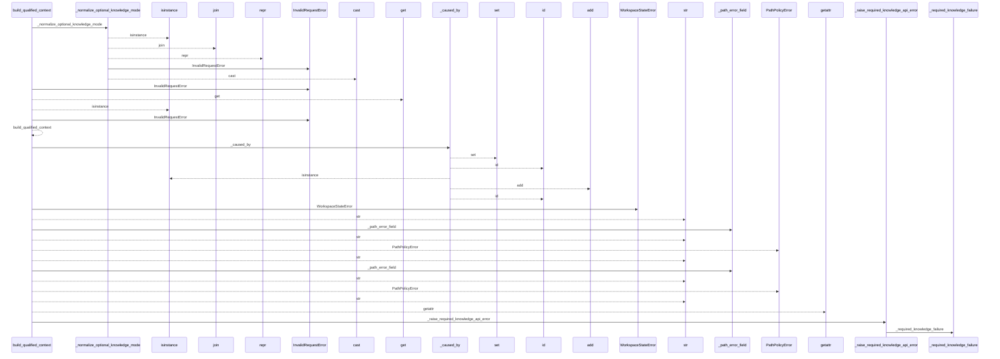
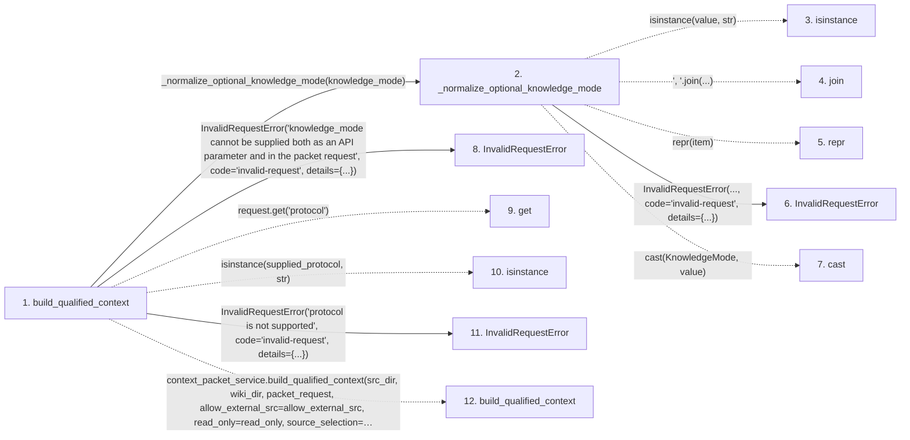

# build_qualified_context

**Entry point:** `build_qualified_context` (`api`)
**Source:** [api](../modules/api.md)
**Modules touched:** [api](../modules/api.md)

## Call sequence

<!-- Auto-generated from static call edges. Dashed arrows are external or unresolved calls. Reviewed runtime conditions and side effects belong in Behavior. -->

> Call sequence diagram shows 30 of 66 interactions; 36 omitted to keep the visualization within the 30-interaction and generated-diagram limits.

## Data flow

<!-- Auto-generated static analysis. Treat values and boundaries as best-effort hints, not runtime proof. -->

### Step data

| Step | Inputs | Reads | Writes | Returns |
|---|---|---|---|---|
| `build_qualified_context` | `src_dir: str`, `wiki_dir: str`, `request: Mapping[str, Any] \| None`, `allow_external_src: bool`, `read_only: bool`, `source_selection: str \| Path \| None`, `knowledge_mode: KnowledgeMode \| None` | `KNOWLEDGE_MODE_REQUEST_FIELD`, `KNOWLEDGE_MODE_REQUEST_FIELD`, `context_cmd`, `CONTEXT_KNOWLEDGE_PROTOCOL_VERSION`, `KNOWLEDGE_MODE_REQUEST_FIELD`, `CONTEXT_KNOWLEDGE_PROTOCOL_VERSION`, `KNOWLEDGE_MODE_REQUEST_FIELD`, `CONTEXT_KNOWLEDGE_PROTOCOL_VERSION` | - | `packet` |
| `_normalize_optional_knowledge_mode` | `value: object` | `KNOWLEDGE_MODE_VALUES`, `KNOWLEDGE_MODE_VALUES`, `KNOWLEDGE_MODE_REQUEST_FIELD`, `KnowledgeMode` | - | `None`, `cast(...)` |
| `isinstance` | - | - | - | - |
| `join` | - | - | - | - |
| `repr` | - | - | - | - |
| `InvalidRequestError` | - | - | - | - |
| `cast` | - | - | - | - |
| `InvalidRequestError` | - | - | - | - |
| `get` | - | - | - | - |
| `isinstance` | - | - | - | - |
| `InvalidRequestError` | - | - | - | - |
| `build_qualified_context` | - | - | - | - |

### Call data

| From | To | Line | Call |
|---|---|---:|---|
| build_qualified_context | _normalize_optional_knowledge_mode | 835 | `_normalize_optional_knowledge_mode(knowledge_mode)` |
| _normalize_optional_knowledge_mode | isinstance | 360 | `isinstance(value, str)` |
| _normalize_optional_knowledge_mode | join | 361 | `', '.join(...)` |
| _normalize_optional_knowledge_mode | repr | 361 | `repr(item)` |
| _normalize_optional_knowledge_mode | InvalidRequestError | 362 | `InvalidRequestError(..., code='invalid-request', details={...})` |
| _normalize_optional_knowledge_mode | cast | 367 | `cast(KnowledgeMode, value)` |
| build_qualified_context | InvalidRequestError | 839 | `InvalidRequestError('knowledge_mode cannot be supplied both as an API parameter and in the packet request', code='invalid-request', details={...})` |
| build_qualified_context | get | 845 | `request.get('protocol')` |
| build_qualified_context | isinstance | 847 | `isinstance(supplied_protocol, str)` |
| build_qualified_context | InvalidRequestError | 854 | `InvalidRequestError('protocol is not supported', code='invalid-request', details={...})` |
| build_qualified_context | build_qualified_context | 877 | `context_packet_service.build_qualified_context(src_dir, wiki_dir, packet_request, allow_external_src=allow_external_src, read_only=read_only, source_selection=source_selection)` |

### Boundary effects

*No boundary effects detected.*

### Static analysis gaps

| Kind | Step | Target | Line |
|---|---|---|---:|
| unresolved_call | `_normalize_optional_knowledge_mode` | `isinstance` | 360 |
| unresolved_call | `_normalize_optional_knowledge_mode` | `', '.join` | 361 |
| external_call | `_normalize_optional_knowledge_mode` | `cast` | 367 |
| unresolved_call | `build_qualified_context` | `request.get` | 845 |
| unresolved_call | `build_qualified_context` | `isinstance` | 847 |
| external_call | `build_qualified_context` | `context_packet_service.build_qualified_context` | 877 |
| step_limit | `build_qualified_context` | `first 12 steps` | 0 |

## Behavior

This flow starts at `build_qualified_context` and is classified as `api`. The generated call and data-flow sections are bounded static projections; runtime conditions and side effects require source-level confirmation.
