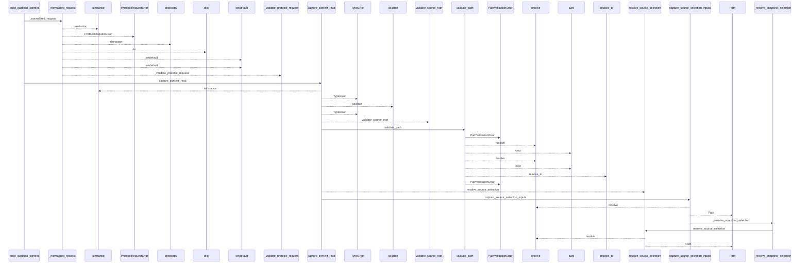
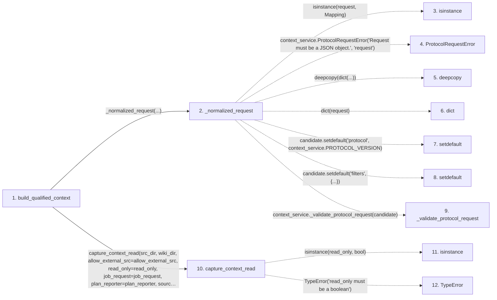

# build_qualified_context

**Entry point:** `build_qualified_context` (`api`)
**Source:** [context_packet](../modules/context_packet.md)
**Modules touched:** [common](../modules/common.md), [config](../modules/config.md), [context_packet](../modules/context_packet.md), [dependency_versions](../modules/dependency_versions.md), and 16 more

**Complete modules touched:**

- [common](../modules/common.md)
- [config](../modules/config.md)
- [context_packet](../modules/context_packet.md)
- [dependency_versions](../modules/dependency_versions.md)
- [documentation_queries](../modules/documentation_queries.md)
- [documentation_query_builder](../modules/documentation_query_builder.md)
- [imports](../modules/imports.md)
- [knowledge_envelope](../modules/knowledge_envelope.md)
- [knowledge_evidence](../modules/knowledge_evidence.md)
- [knowledge_observability](../modules/knowledge_observability.md)
- [knowledge_verification](../modules/knowledge_verification.md)
- [paths](../modules/paths.md)
- [plugins](../modules/plugins.md)
- [services_dependencies](../modules/services_dependencies.md)
- [source_selection](../modules/source_selection.md)
- [source_snapshot](../modules/source_snapshot.md)
- [validation](../modules/validation.md)
- [wiki_media](../modules/wiki_media.md)
- [wiki_surface](../modules/wiki_surface.md)
- [wiki_surface_index](../modules/wiki_surface_index.md)

## Call sequence

<!-- Auto-generated from static call edges. Dashed arrows are external or unresolved calls. Reviewed runtime conditions and side effects belong in Behavior. -->

> Call sequence diagram shows 30 of 1593 interactions; 1563 omitted to keep the visualization within the 30-interaction and generated-diagram limits.

> Trace truncated at the depth limit; deeper calls are omitted.

## Data flow

<!-- Auto-generated static analysis. Treat values and boundaries as best-effort hints, not runtime proof. -->

### Step data

| Step | Inputs | Reads | Writes | Returns |
|---|---|---|---|---|
| `build_qualified_context` | `src_dir: str`, `wiki_dir: str`, `request: Mapping[str, Any] \| None`, `allow_external_src: bool`, `read_only: bool`, `job_request: ExtractionJobRequest \| None`, `plan_reporter: Callable[[ExtractionJobPlan], None] \| None`, `source_selection: str \| Path \| None` | `CONTEXT_PACKET_SCHEMA_VERSION`, `CONTEXT_PACKET_SCHEMA_VERSION` | - | `validated.packet` |
| `_normalized_request` | `request: Mapping[str, Any]` | `Mapping`, `context_service` | - | `context_service._validate_protocol_request(...)` |
| `isinstance` | - | - | - | - |
| `ProtocolRequestError` | - | - | - | - |
| `deepcopy` | - | - | - | - |
| `dict` | - | - | - | - |
| `setdefault` | - | - | - | - |
| `setdefault` | - | - | - | - |
| `_validate_protocol_request` | - | - | - | - |
| `capture_context_read` | `src_dir: str`, `wiki_dir: str`, `allow_external_src: bool`, `read_only: bool`, `job_request: ExtractionJobRequest \| None`, `plan_reporter: Callable[[ExtractionJobPlan], None] \| None`, `source_selection: str \| Path \| None` | `PathValidationError`, `DocumentationQueryError`, `context_service`, `InventoryResult`, `SourceSnapshot`, `DocumentationQueryError`, `DocumentationQueryError`, `DocumentationQueryError` | - | `CapturedContextRead(...)` |
| `isinstance` | - | - | - | - |
| `TypeError` | - | - | - | - |

### Call data

| From | To | Line | Call |
|---|---|---:|---|
| build_qualified_context | _normalized_request | 807 | `_normalized_request(...)` |
| _normalized_request | isinstance | 1098 | `isinstance(request, Mapping)` |
| _normalized_request | ProtocolRequestError | 1099 | `context_service.ProtocolRequestError('Request must be a JSON object.', 'request')` |
| _normalized_request | deepcopy | 1103 | `deepcopy(dict(...))` |
| _normalized_request | dict | 1103 | `dict(request)` |
| _normalized_request | setdefault | 1104 | `candidate.setdefault('protocol', context_service.PROTOCOL_VERSION)` |
| _normalized_request | setdefault | 1105 | `candidate.setdefault('filters', {...})` |
| _normalized_request | _validate_protocol_request | 1106 | `context_service._validate_protocol_request(candidate)` |
| build_qualified_context | capture_context_read | 817 | `capture_context_read(src_dir, wiki_dir, allow_external_src=allow_external_src, read_only=read_only, job_request=job_request, plan_reporter=plan_reporter, source_selection=source_selection)` |
| capture_context_read | isinstance | 498 | `isinstance(read_only, bool)` |
| capture_context_read | TypeError | 499 | `TypeError('read_only must be a boolean')` |

### Boundary effects

*No boundary effects detected.*

### Static analysis gaps

| Kind | Step | Target | Line |
|---|---|---|---:|
| unresolved_call | `_normalized_request` | `isinstance` | 1098 |
| external_call | `_normalized_request` | `context_service.ProtocolRequestError` | 1099 |
| external_call | `_normalized_request` | `deepcopy` | 1103 |
| unresolved_call | `_normalized_request` | `candidate.setdefault` | 1104 |
| unresolved_call | `_normalized_request` | `candidate.setdefault` | 1105 |
| external_call | `_normalized_request` | `context_service._validate_protocol_request` | 1106 |
| unresolved_call | `capture_context_read` | `isinstance` | 498 |
| unresolved_call | `capture_context_read` | `TypeError` | 499 |
| step_limit | `build_qualified_context` | `first 12 steps` | 0 |
| truncated_flow | `build_qualified_context` | `depth limit` | 0 |

## Behavior

This flow starts at `build_qualified_context` and is classified as `api`. The generated call and data-flow sections are bounded static projections; runtime conditions and side effects require source-level confirmation.
