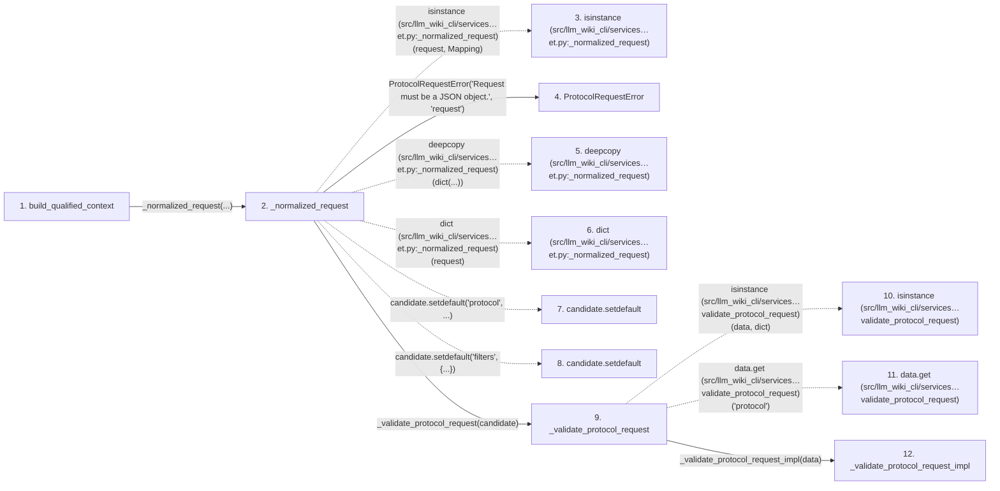

# build_qualified_context

**Entry point:** `build_qualified_context` (`api`)
**Source:** [context_packet](../modules/context_packet.md)
**Modules touched:** [common](../modules/common.md), [config](../modules/config.md), [context_packet](../modules/context_packet.md), [context_service](../modules/context_service.md), and 47 more

**Complete modules touched:**

- [common](../modules/common.md)
- [config](../modules/config.md)
- [context_packet](../modules/context_packet.md)
- [context_service](../modules/context_service.md)
- [data_flow](../modules/data_flow.md)
- [dependency_versions](../modules/dependency_versions.md)
- [documentation_queries](../modules/documentation_queries.md)
- [documentation_query_builder](../modules/documentation_query_builder.md)
- [entrypoints](../modules/entrypoints.md)
- [extraction_jobs](../modules/extraction_jobs.md)
- [extraction_service](../modules/extraction_service.md)
- [filesystem_guard](../modules/filesystem_guard.md)
- [immutable](../modules/immutable.md)
- [imports](../modules/imports.md)
- [infrastructure_inventory](../modules/infrastructure_inventory.md)
- [infrastructure_sync](../modules/infrastructure_sync.md)
- [inventory_cache](../modules/inventory_cache.md)
- [io](../modules/io.md)
- [knowledge_artifacts](../modules/knowledge_artifacts.md)
- [knowledge_consumption](../modules/knowledge_consumption.md)
- [knowledge_envelope](../modules/knowledge_envelope.md)
- [knowledge_evidence](../modules/knowledge_evidence.md)
- [knowledge_freshness](../modules/knowledge_freshness.md)
- [knowledge_generation](../modules/knowledge_generation.md)
- [knowledge_governance](../modules/knowledge_governance.md)
- [knowledge_graph](../modules/knowledge_graph.md)
- [knowledge_index](../modules/knowledge_index.md)
- [knowledge_loader](../modules/knowledge_loader.md)
- [knowledge_model](../modules/knowledge_model.md)
- [knowledge_observability](../modules/knowledge_observability.md)
- [knowledge_orchestration](../modules/knowledge_orchestration.md)
- [knowledge_reuse](../modules/knowledge_reuse.md)
- [knowledge_verification](../modules/knowledge_verification.md)
- [packages](../modules/packages.md)
- [paths](../modules/paths.md)
- [plugins](../modules/plugins.md)
- [progress](../modules/progress.md)
- [python_calls](../modules/python_calls.md)
- [python_contracts](../modules/python_contracts.md)
- [python_imports](../modules/python_imports.md)
- [python_observations](../modules/python_observations.md)
- [section_ownership](../modules/section_ownership.md)
- [services_dependencies](../modules/services_dependencies.md)
- [source_selection](../modules/source_selection.md)
- [source_snapshot](../modules/source_snapshot.md)
- [sync_manifest](../modules/sync_manifest.md)
- [validation](../modules/validation.md)
- [verification_contracts](../modules/verification_contracts.md)
- [wiki_media](../modules/wiki_media.md)
- [wiki_surface](../modules/wiki_surface.md)
- [wiki_surface_index](../modules/wiki_surface_index.md)

## Call sequence

```mermaid
sequenceDiagram
    participant p0 as build_qualified_context
    participant p1 as _normalized_request
    participant p2 as isinstance (src/llm_wiki_cli/services…et.py:_normalized_request)
    participant p3 as ProtocolRequestError
    participant p4 as deepcopy (src/llm_wiki_cli/services…et.py:_normalized_request)
    participant p5 as dict (src/llm_wiki_cli/services…et.py:_normalized_request)
    participant p6 as candidate.setdefault
    participant p7 as _validate_protocol_request
    participant p8 as isinstance (src/llm_wiki_cli/services…validate_protocol_request)
    participant p9 as data.get (src/llm_wiki_cli/services…validate_protocol_request)
    participant p10 as _validate_protocol_request_impl
    participant p11 as isinstance (src/llm_wiki_cli/services…ate_protocol_request_impl)
    participant p12 as any (src/llm_wiki_cli/services…ate_protocol_request_impl)
    participant p13 as data.get (src/llm_wiki_cli/services…ate_protocol_request_impl)
    participant p14 as sorted (src/llm_wiki_cli/services…ate_protocol_request_impl)
    participant p15 as set (src/llm_wiki_cli/services…ate_protocol_request_impl)
    participant p16 as _normalise_protocol_focus
    participant p17 as isinstance (src/llm_wiki_cli/services…_normalise_protocol_focus)
    p0->>p1: _normalized_request
    p1-->>p2: isinstance (src/llm_wiki_cli/services…et.py:_normalized_request)
    p1->>p3: ProtocolRequestError
    p1-->>p4: deepcopy (src/llm_wiki_cli/services…et.py:_normalized_request)
    p1-->>p5: dict (src/llm_wiki_cli/services…et.py:_normalized_request)
    p1-->>p6: candidate.setdefault
    p1-->>p6: candidate.setdefault
    p1->>p7: _validate_protocol_request
    p7-->>p8: isinstance (src/llm_wiki_cli/services…validate_protocol_request)
    p7-->>p9: data.get (src/llm_wiki_cli/services…validate_protocol_request)
    p7->>p10: _validate_protocol_request_impl
    p10-->>p11: isinstance (src/llm_wiki_cli/services…ate_protocol_request_impl)
    p10->>p3: ProtocolRequestError
    p10-->>p12: any (src/llm_wiki_cli/services…ate_protocol_request_impl)
    p10-->>p11: isinstance (src/llm_wiki_cli/services…ate_protocol_request_impl)
    p10->>p3: ProtocolRequestError
    p10-->>p13: data.get (src/llm_wiki_cli/services…ate_protocol_request_impl)
    p10->>p3: ProtocolRequestError
    p10-->>p14: sorted (src/llm_wiki_cli/services…ate_protocol_request_impl)
    p10-->>p15: set (src/llm_wiki_cli/services…ate_protocol_request_impl)
    p10->>p3: ProtocolRequestError
    p10->>p3: ProtocolRequestError
    p10-->>p11: isinstance (src/llm_wiki_cli/services…ate_protocol_request_impl)
    p10-->>p11: isinstance (src/llm_wiki_cli/services…ate_protocol_request_impl)
    p10->>p3: ProtocolRequestError
    p10-->>p13: data.get (src/llm_wiki_cli/services…ate_protocol_request_impl)
    p10-->>p11: isinstance (src/llm_wiki_cli/services…ate_protocol_request_impl)
    p10->>p3: ProtocolRequestError
    p10->>p16: _normalise_protocol_focus
    p16-->>p17: isinstance (src/llm_wiki_cli/services…_normalise_protocol_focus)
```

<!-- Auto-generated from static call edges. Dashed arrows are external or unresolved calls. Reviewed runtime conditions and side effects belong in Behavior. -->

> Call sequence diagram shows 30 of 4472 interactions; 4442 omitted to keep the visualization within the 30-interaction and generated-diagram limits.

> Trace truncated at the depth limit; deeper calls are omitted.

## Data flow

<!-- Auto-generated static analysis. Treat values and boundaries as best-effort hints, not runtime proof. -->

### Step data

| Step | Inputs | Reads | Writes | Returns |
|---|---|---|---|---|
| `build_qualified_context` | `src_dir: str`, `wiki_dir: str`, `request: Mapping[str, Any] \| None`, `allow_external_src: bool`, `read_only: bool`, `job_request: ExtractionJobRequest \| None`, `plan_reporter: Callable[[ExtractionJobPlan], None] \| None`, `source_selection: str \| Path \| None` | `_KNOWLEDGE_PACKET_CONTRACT`, `_KNOWLEDGE_PACKET_CONTRACT`, `_KNOWLEDGE_PACKET_CONTRACT` | `response[...]` | `validated.packet` |
| `_normalized_request` | `request: Mapping[str, Any]` | `Mapping`, `CONTEXT_KNOWLEDGE_PROTOCOL_VERSION`, `context_service` | - | `context_service._validate_protocol_request(...)` |
| `isinstance (src/llm_wiki_cli/services…et.py:_normalized_request)` | - | - | - | - |
| `ProtocolRequestError` | - | - | - | - |
| `deepcopy (src/llm_wiki_cli/services…et.py:_normalized_request)` | - | - | - | - |
| `dict (src/llm_wiki_cli/services…et.py:_normalized_request)` | - | - | - | - |
| `candidate.setdefault` | - | - | - | - |
| `candidate.setdefault` | - | - | - | - |
| `_validate_protocol_request` | `data: object` | `PROTOCOL_VERSION`, `ProtocolRequestError`, `PROTOCOL_VERSION`, `KNOWLEDGE_PROTOCOL_VERSION` | `exc.protocol` | `_validate_protocol_request_impl(...)` |
| `isinstance (src/llm_wiki_cli/services…validate_protocol_request)` | - | - | - | - |
| `data.get (src/llm_wiki_cli/services…validate_protocol_request)` | - | - | - | - |
| `_validate_protocol_request_impl` | `data: object` | `PROTOCOL_VERSION`, `_V1_REQUEST_KEYS`, `KNOWLEDGE_PROTOCOL_VERSION`, `_V2_REQUEST_KEYS`, `PROTOCOL_VERSION`, `KNOWLEDGE_PROTOCOL_VERSION`, `_FORMATS`, `KNOWLEDGE_PROTOCOL_VERSION` | `normalized[...]` | `normalized` |

### Call data

| From | To | Line | Call |
|---|---|---:|---|
| build_qualified_context | _normalized_request | 1231 | `_normalized_request(...)` |
| _normalized_request | isinstance (src/llm_wiki_cli/services…et.py:_normalized_request) | 1726 | `isinstance(request, Mapping)` |
| _normalized_request | ProtocolRequestError | 1727 | `context_service.ProtocolRequestError('Request must be a JSON object.', 'request')` |
| _normalized_request | deepcopy (src/llm_wiki_cli/services…et.py:_normalized_request) | 1731 | `deepcopy(dict(...))` |
| _normalized_request | dict (src/llm_wiki_cli/services…et.py:_normalized_request) | 1731 | `dict(request)` |
| _normalized_request | candidate.setdefault | 1732 | `candidate.setdefault('protocol', ...)` |
| _normalized_request | candidate.setdefault | 1740 | `candidate.setdefault('filters', {...})` |
| _normalized_request | _validate_protocol_request | 1741 | `context_service._validate_protocol_request(candidate)` |
| _validate_protocol_request | isinstance (src/llm_wiki_cli/services…validate_protocol_request) | 1071 | `isinstance(data, dict)` |
| _validate_protocol_request | data.get (src/llm_wiki_cli/services…validate_protocol_request) | 1071 | `data.get('protocol')` |
| _validate_protocol_request | _validate_protocol_request_impl | 1073 | `_validate_protocol_request_impl(data)` |

### Boundary effects

*No boundary effects detected.*

### Static analysis gaps

| Kind | Step | Target | Line |
|---|---|---|---:|
| external_call | `_normalized_request` | `isinstance` | 1726 |
| external_call | `_normalized_request` | `deepcopy` | 1731 |
| unresolved_call | `_normalized_request` | `candidate.setdefault` | 1732 |
| unresolved_call | `_normalized_request` | `candidate.setdefault` | 1740 |
| external_call | `_validate_protocol_request` | `isinstance` | 1071 |
| unresolved_call | `_validate_protocol_request` | `data.get` | 1071 |
| step_limit | `build_qualified_context` | `first 12 steps` | 0 |
| truncated_flow | `build_qualified_context` | `depth limit` | 0 |

## Behavior

This flow starts at `build_qualified_context` and is classified as `api`. The generated call and data-flow sections are bounded static projections; runtime conditions and side effects require source-level confirmation.
