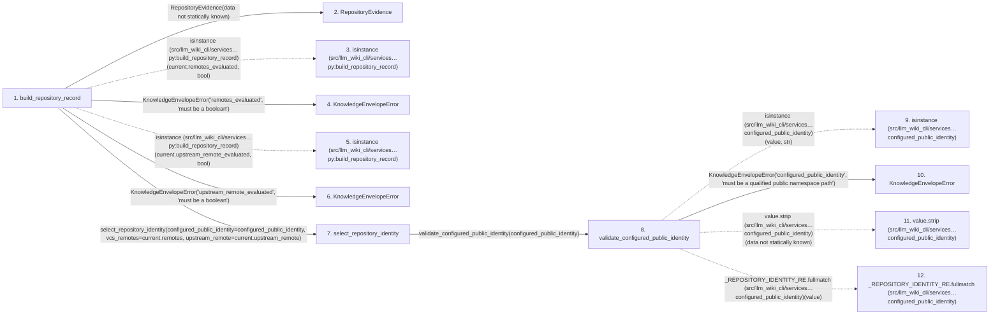

# build_repository_record

**Entry point:** `build_repository_record` (`api`)
**Source:** [knowledge_envelope](../modules/knowledge_envelope.md)
**Modules touched:** [knowledge_envelope](../modules/knowledge_envelope.md), [knowledge_model](../modules/knowledge_model.md)

## Call sequence

```mermaid
sequenceDiagram
    participant p0 as build_repository_record
    participant p1 as RepositoryEvidence
    participant p2 as isinstance (src/llm_wiki_cli/services…py:build_repository_record)
    participant p3 as KnowledgeEnvelopeError
    participant p4 as select_repository_identity
    participant p5 as validate_configured_public_identity
    participant p6 as isinstance (src/llm_wiki_cli/services…configured_public_identity)
    participant p7 as value.strip (src/llm_wiki_cli/services…configured_public_identity)
    participant p8 as _REPOSITORY_IDENTITY_RE.fullmatch (src/llm_wiki_cli/services…configured_public_identity)
    participant p9 as value.casefold().endswith
    participant p10 as value.casefold
    participant p11 as _remote_mapping
    participant p12 as isinstance (src/llm_wiki_cli/services…nvelope.py:_remote_mapping)
    participant p13 as value.items
    participant p14 as len
    participant p15 as next
    participant p16 as iter
    participant p17 as remotes.get
    participant p18 as isinstance (src/llm_wiki_cli/services…select_repository_identity)
    participant p19 as normalize_vcs_remote
    participant p20 as isinstance (src/llm_wiki_cli/services…pe.py:normalize_vcs_remote)
    participant p21 as value.strip (src/llm_wiki_cli/services…pe.py:normalize_vcs_remote)
    p0->>p1: RepositoryEvidence
    p0-->>p2: isinstance (src/llm_wiki_cli/services…py:build_repository_record)
    p0->>p3: KnowledgeEnvelopeError
    p0-->>p2: isinstance (src/llm_wiki_cli/services…py:build_repository_record)
    p0->>p3: KnowledgeEnvelopeError
    p0->>p4: select_repository_identity
    p4->>p5: validate_configured_public_identity
    p5-->>p6: isinstance (src/llm_wiki_cli/services…configured_public_identity)
    p5->>p3: KnowledgeEnvelopeError
    p5-->>p7: value.strip (src/llm_wiki_cli/services…configured_public_identity)
    p5-->>p8: _REPOSITORY_IDENTITY_RE.fullmatch (src/llm_wiki_cli/services…configured_public_identity)
    p5-->>p9: value.casefold().endswith
    p5-->>p10: value.casefold
    p5->>p3: KnowledgeEnvelopeError
    p4->>p11: _remote_mapping
    p11-->>p12: isinstance (src/llm_wiki_cli/services…nvelope.py:_remote_mapping)
    p11->>p3: KnowledgeEnvelopeError
    p11-->>p13: value.items
    p11-->>p12: isinstance (src/llm_wiki_cli/services…nvelope.py:_remote_mapping)
    p11->>p3: KnowledgeEnvelopeError
    p11-->>p12: isinstance (src/llm_wiki_cli/services…nvelope.py:_remote_mapping)
    p11->>p3: KnowledgeEnvelopeError
    p4-->>p14: len
    p4-->>p15: next
    p4-->>p16: iter
    p4-->>p17: remotes.get
    p4-->>p18: isinstance (src/llm_wiki_cli/services…select_repository_identity)
    p4->>p19: normalize_vcs_remote
    p19-->>p20: isinstance (src/llm_wiki_cli/services…pe.py:normalize_vcs_remote)
    p19-->>p21: value.strip (src/llm_wiki_cli/services…pe.py:normalize_vcs_remote)
```

<!-- Auto-generated from static call edges. Dashed arrows are external or unresolved calls. Reviewed runtime conditions and side effects belong in Behavior. -->

> Call sequence diagram shows 30 of 71 interactions; 41 omitted to keep the visualization within the 30-interaction and generated-diagram limits.

## Data flow

<!-- Auto-generated static analysis. Treat values and boundaries as best-effort hints, not runtime proof. -->

### Step data

| Step | Inputs | Reads | Writes | Returns |
|---|---|---|---|---|
| `build_repository_record` | `configured_public_identity: str \| None`, `evidence: RepositoryEvidence \| None` | `RepositoryIdentitySource`, `RepositoryIdentitySource` | `extensions[...]` | `RepositoryRecord(...)` |
| `RepositoryEvidence` | - | - | - | - |
| `isinstance (src/llm_wiki_cli/services…py:build_repository_record)` | - | - | - | - |
| `KnowledgeEnvelopeError` | - | - | - | - |
| `isinstance (src/llm_wiki_cli/services…py:build_repository_record)` | - | - | - | - |
| `KnowledgeEnvelopeError` | - | - | - | - |
| `select_repository_identity` | `configured_public_identity: str \| None`, `vcs_remotes: Mapping[str, str \| None]`, `upstream_remote: str \| None` | `RepositoryIdentitySource`, `RepositoryIdentitySource`, `RepositoryIdentitySource`, `RepositoryIdentitySource` | - | `(...)`, `(...)`, `(...)`, `(...)` |
| `validate_configured_public_identity` | `value: object` | - | - | `value` |
| `isinstance (src/llm_wiki_cli/services…configured_public_identity)` | - | - | - | - |
| `KnowledgeEnvelopeError` | - | - | - | - |
| `value.strip (src/llm_wiki_cli/services…configured_public_identity)` | - | - | - | - |
| `_REPOSITORY_IDENTITY_RE.fullmatch (src/llm_wiki_cli/services…configured_public_identity)` | - | - | - | - |

### Call data

| From | To | Line | Call |
|---|---|---:|---|
| build_repository_record | RepositoryEvidence | 615 | `RepositoryEvidence(data not statically known)` |
| build_repository_record | isinstance (src/llm_wiki_cli/services…py:build_repository_record) | 616 | `isinstance(current.remotes_evaluated, bool)` |
| build_repository_record | KnowledgeEnvelopeError | 617 | `KnowledgeEnvelopeError('remotes_evaluated', 'must be a boolean')` |
| build_repository_record | isinstance (src/llm_wiki_cli/services…py:build_repository_record) | 621 | `isinstance(current.upstream_remote_evaluated, bool)` |
| build_repository_record | KnowledgeEnvelopeError | 622 | `KnowledgeEnvelopeError('upstream_remote_evaluated', 'must be a boolean')` |
| build_repository_record | select_repository_identity | 631 | `select_repository_identity(configured_public_identity=configured_public_identity, vcs_remotes=current.remotes, upstream_remote=current.upstream_remote)` |
| select_repository_identity | validate_configured_public_identity | 658 | `validate_configured_public_identity(configured_public_identity)` |
| validate_configured_public_identity | isinstance (src/llm_wiki_cli/services…configured_public_identity) | 687 | `isinstance(value, str)` |
| validate_configured_public_identity | KnowledgeEnvelopeError | 688 | `KnowledgeEnvelopeError('configured_public_identity', 'must be a qualified public namespace path')` |
| validate_configured_public_identity | value.strip (src/llm_wiki_cli/services…configured_public_identity) | 693 | `value.strip(data not statically known)` |
| validate_configured_public_identity | _REPOSITORY_IDENTITY_RE.fullmatch (src/llm_wiki_cli/services…configured_public_identity) | 694 | `_REPOSITORY_IDENTITY_RE.fullmatch(value)` |

### Boundary effects

*No boundary effects detected.*

### Static analysis gaps

| Kind | Step | Target | Line |
|---|---|---|---:|
| external_call | `build_repository_record` | `isinstance` | 616 |
| external_call | `build_repository_record` | `isinstance` | 621 |
| external_call | `validate_configured_public_identity` | `isinstance` | 687 |
| unresolved_call | `validate_configured_public_identity` | `value.strip` | 693 |
| unresolved_call | `validate_configured_public_identity` | `_REPOSITORY_IDENTITY_RE.fullmatch` | 694 |
| step_limit | `build_repository_record` | `first 12 steps` | 0 |

## Behavior

This flow starts at `build_repository_record` and is classified as `api`. The generated call and data-flow sections are bounded static projections; runtime conditions and side effects require source-level confirmation.
