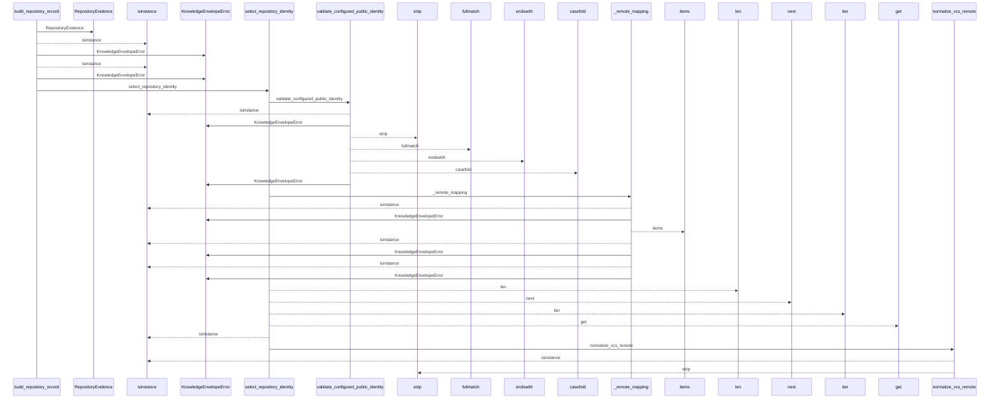
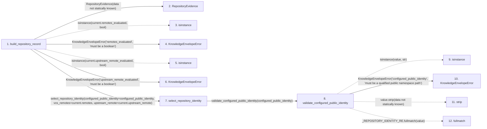

# build_repository_record

**Entry point:** `build_repository_record` (`api`)
**Source:** [knowledge_envelope](../modules/knowledge_envelope.md)
**Modules touched:** [knowledge_envelope](../modules/knowledge_envelope.md), [knowledge_model](../modules/knowledge_model.md)

## Call sequence

<!-- Auto-generated from static call edges. Dashed arrows are external or unresolved calls. Reviewed runtime conditions and side effects belong in Behavior. -->

> Call sequence diagram shows 30 of 71 interactions; 41 omitted to keep the visualization within the 30-interaction and generated-diagram limits.

## Data flow

<!-- Auto-generated static analysis. Treat values and boundaries as best-effort hints, not runtime proof. -->

### Step data

| Step | Inputs | Reads | Writes | Returns |
|---|---|---|---|---|
| `build_repository_record` | `configured_public_identity: str \| None`, `evidence: RepositoryEvidence \| None` | `RepositoryIdentitySource`, `RepositoryIdentitySource` | `extensions[...]` | `RepositoryRecord(...)` |
| `RepositoryEvidence` | - | - | - | - |
| `isinstance` | - | - | - | - |
| `KnowledgeEnvelopeError` | - | - | - | - |
| `isinstance` | - | - | - | - |
| `KnowledgeEnvelopeError` | - | - | - | - |
| `select_repository_identity` | `configured_public_identity: str \| None`, `vcs_remotes: Mapping[str, str \| None]`, `upstream_remote: str \| None` | `RepositoryIdentitySource`, `RepositoryIdentitySource`, `RepositoryIdentitySource`, `RepositoryIdentitySource` | - | `(...)`, `(...)`, `(...)`, `(...)` |
| `validate_configured_public_identity` | `value: object` | - | - | `value` |
| `isinstance` | - | - | - | - |
| `KnowledgeEnvelopeError` | - | - | - | - |
| `strip` | - | - | - | - |
| `fullmatch` | - | - | - | - |

### Call data

| From | To | Line | Call |
|---|---|---:|---|
| build_repository_record | RepositoryEvidence | 606 | `RepositoryEvidence(data not statically known)` |
| build_repository_record | isinstance | 607 | `isinstance(current.remotes_evaluated, bool)` |
| build_repository_record | KnowledgeEnvelopeError | 608 | `KnowledgeEnvelopeError('remotes_evaluated', 'must be a boolean')` |
| build_repository_record | isinstance | 612 | `isinstance(current.upstream_remote_evaluated, bool)` |
| build_repository_record | KnowledgeEnvelopeError | 613 | `KnowledgeEnvelopeError('upstream_remote_evaluated', 'must be a boolean')` |
| build_repository_record | select_repository_identity | 622 | `select_repository_identity(configured_public_identity=configured_public_identity, vcs_remotes=current.remotes, upstream_remote=current.upstream_remote)` |
| select_repository_identity | validate_configured_public_identity | 649 | `validate_configured_public_identity(configured_public_identity)` |
| validate_configured_public_identity | isinstance | 678 | `isinstance(value, str)` |
| validate_configured_public_identity | KnowledgeEnvelopeError | 679 | `KnowledgeEnvelopeError('configured_public_identity', 'must be a qualified public namespace path')` |
| validate_configured_public_identity | strip | 684 | `value.strip(data not statically known)` |
| validate_configured_public_identity | fullmatch | 685 | `_REPOSITORY_IDENTITY_RE.fullmatch(value)` |

### Boundary effects

*No boundary effects detected.*

### Static analysis gaps

| Kind | Step | Target | Line |
|---|---|---|---:|
| unresolved_call | `build_repository_record` | `isinstance` | 607 |
| unresolved_call | `build_repository_record` | `isinstance` | 612 |
| unresolved_call | `validate_configured_public_identity` | `isinstance` | 678 |
| unresolved_call | `validate_configured_public_identity` | `value.strip` | 684 |
| unresolved_call | `validate_configured_public_identity` | `_REPOSITORY_IDENTITY_RE.fullmatch` | 685 |
| step_limit | `build_repository_record` | `first 12 steps` | 0 |

## Behavior

This flow starts at `build_repository_record` and is classified as `api`. The generated call and data-flow sections are bounded static projections; runtime conditions and side effects require source-level confirmation.
