# build_runtime_knowledge_plan

**Entry point:** `build_runtime_knowledge_plan` (`api`)
**Source:** [knowledge_orchestration](../modules/knowledge_orchestration.md)
**Modules touched:** [canonical_json](../modules/canonical_json.md), [common](../modules/common.md), [concept_identity](../modules/concept_identity.md), [immutable](../modules/immutable.md), and 26 more

**Complete modules touched:**

- [canonical_json](../modules/canonical_json.md)
- [common](../modules/common.md)
- [concept_identity](../modules/concept_identity.md)
- [immutable](../modules/immutable.md)
- [infrastructure_sync](../modules/infrastructure_sync.md)
- [io](../modules/io.md)
- [knowledge_artifacts](../modules/knowledge_artifacts.md)
- [knowledge_envelope](../modules/knowledge_envelope.md)
- [knowledge_evidence](../modules/knowledge_evidence.md)
- [knowledge_generation](../modules/knowledge_generation.md)
- [knowledge_governance](../modules/knowledge_governance.md)
- [knowledge_graph](../modules/knowledge_graph.md)
- [knowledge_index](../modules/knowledge_index.md)
- [knowledge_links](../modules/knowledge_links.md)
- [knowledge_model](../modules/knowledge_model.md)
- [knowledge_orchestration](../modules/knowledge_orchestration.md)
- [knowledge_packs](../modules/knowledge_packs.md)
- [knowledge_reuse](../modules/knowledge_reuse.md)
- [knowledge_storage](../modules/knowledge_storage.md)
- [knowledge_storage_io](../modules/knowledge_storage_io.md)
- [manifest_storage](../modules/manifest_storage.md)
- [markdown_sections](../modules/markdown_sections.md)
- [progress](../modules/progress.md)
- [section_ownership](../modules/section_ownership.md)
- [source_selection](../modules/source_selection.md)
- [storage_spool](../modules/storage_spool.md)
- [sync_manifest](../modules/sync_manifest.md)
- [validation](../modules/validation.md)
- [wiki_media](../modules/wiki_media.md)
- [wiki_surface](../modules/wiki_surface.md)

## Call sequence

```mermaid
sequenceDiagram
    participant p0 as build_runtime_knowledge_plan
    participant p1 as isinstance (src/llm_wiki_cli/services…ld_runtime_knowledge_plan)
    participant p2 as TypeError (src/llm_wiki_cli/services…ld_runtime_knowledge_plan)
    participant p3 as capture_committed_knowledge
    participant p4 as Path(…).resolve
    participant p5 as Path (src/llm_wiki_cli/services…pture_committed_knowledge)
    participant p6 as (…).read_bytes
    participant p7 as SyncManifest.from_payload
    participant p8 as _mapping_value
    participant p9 as require_mapping
    participant p10 as isinstance (src/llm_wiki_cli/services…dation.py:require_mapping)
    participant p11 as key.encode
    participant p12 as SyncManifestError
    participant p13 as data.get (src/llm_wiki_cli/services…SyncManifest.from_payload)
    participant p14 as type (src/llm_wiki_cli/services…SyncManifest.from_payload)
    participant p15 as ManifestStoreReader
    participant p16 as reader.materialize
    participant p17 as isinstance (src/llm_wiki_cli/services…SyncManifest.from_payload)
    participant p18 as _copy_sources
    participant p19 as data.items
    participant p20 as isinstance (src/llm_wiki_cli/services…manifest.py:_copy_sources)
    p0-->>p1: isinstance (src/llm_wiki_cli/services…ld_runtime_knowledge_plan)
    p0-->>p2: TypeError (src/llm_wiki_cli/services…ld_runtime_knowledge_plan)
    p0->>p3: capture_committed_knowledge
    p3-->>p4: Path(…).resolve
    p3-->>p5: Path (src/llm_wiki_cli/services…pture_committed_knowledge)
    p3-->>p6: (…).read_bytes
    p3->>p7: SyncManifest.from_payload
    p7->>p8: _mapping_value
    p8->>p9: require_mapping
    p9-->>p10: isinstance (src/llm_wiki_cli/services…dation.py:require_mapping)
    p9-->>p10: isinstance (src/llm_wiki_cli/services…dation.py:require_mapping)
    p9-->>p11: key.encode
    p8->>p12: SyncManifestError
    p8->>p12: SyncManifestError
    p7-->>p13: data.get (src/llm_wiki_cli/services…SyncManifest.from_payload)
    p7-->>p14: type (src/llm_wiki_cli/services…SyncManifest.from_payload)
    p7->>p12: SyncManifestError
    p7->>p15: ManifestStoreReader
    p7->>p7: SyncManifest.from_payload
    p7-->>p16: reader.materialize
    p7-->>p17: isinstance (src/llm_wiki_cli/services…SyncManifest.from_payload)
    p7-->>p17: isinstance (src/llm_wiki_cli/services…SyncManifest.from_payload)
    p7->>p12: SyncManifestError
    p7->>p12: SyncManifestError
    p7->>p12: SyncManifestError
    p7->>p18: _copy_sources
    p18->>p8: _mapping_value
    p18-->>p19: data.items
    p18-->>p20: isinstance (src/llm_wiki_cli/services…manifest.py:_copy_sources)
    p18->>p12: SyncManifestError
```

<!-- Auto-generated from static call edges. Dashed arrows are external or unresolved calls. Reviewed runtime conditions and side effects belong in Behavior. -->

> Call sequence diagram shows 30 of 2721 interactions; 2691 omitted to keep the visualization within the 30-interaction and generated-diagram limits.

> Trace truncated at the depth limit; deeper calls are omitted.

## Data flow

```mermaid
flowchart LR
    s1["1. build_runtime_knowledge_plan"]
    s2["2. isinstance (src/llm_wiki_cli/services…ld_runtime_knowledge_plan)"]
    s3["3. TypeError (src/llm_wiki_cli/services…ld_runtime_knowledge_plan)"]
    s4["4. capture_committed_knowledge"]
    s5["5. Path(…).resolve"]
    s6["6. Path (src/llm_wiki_cli/services…pture_committed_knowledge)"]
    s7["7. (…).read_bytes"]
    s8["8. SyncManifest.from_payload"]
    s9["9. _mapping_value"]
    s10["10. require_mapping"]
    s11["11. isinstance (src/llm_wiki_cli/services…dation.py:require_mapping)"]
    s12["12. isinstance (src/llm_wiki_cli/services…dation.py:require_mapping)"]
    s1 -. "isinstance (src/llm_wiki_cli/services…ld_runtime_knowledge_plan)(inputs, RuntimeKnowledgeInputs)" .-> s2
    s1 -. "TypeError (src/llm_wiki_cli/services…ld_runtime_knowledge_plan)('inputs must be a RuntimeKnowledgeInputs')" .-> s3
    s1 -->|"capture_committed_knowledge(inputs.target_wiki_dir, inputs.previous_manifest)"| s4
    s4 -. "Path(…).resolve(data not statically known)" .-> s5
    s4 -. "Path (src/llm_wiki_cli/services…pture_committed_knowledge)(wiki_dir)" .-> s6
    s4 -. "(…).read_bytes(data not statically known)" .-> s7
    s4 -->|"SyncManifest.from_payload(_decode_json_object(...), object_reader=...)"| s8
    s8 -->|"_mapping_value(value, 'manifest')"| s9
    s9 -->|"require_mapping(value, error=SyncManifestError(...), require_string_keys=True, key_error=SyncManifestError(...))"| s10
    s10 -. "isinstance (src/llm_wiki_cli/services…dation.py:require_mapping)(value, Mapping)" .-> s11
    s10 -. "isinstance (src/llm_wiki_cli/services…dation.py:require_mapping)(key, str)" .-> s12
    b0["mutation captured.update"]
    s4 -. "mutation captured.update" .-> b0
    click s1 "../modules/knowledge_orchestration.md"
    click s4 "../modules/knowledge_orchestration.md"
    click s8 "../modules/sync_manifest.md"
    click s9 "../modules/sync_manifest.md"
    click s10 "../modules/validation.md"
    classDef boundary stroke:#b45309,stroke-dasharray: 4 2
    class b0 boundary
```

<!-- Auto-generated static analysis. Treat values and boundaries as best-effort hints, not runtime proof. -->

### Step data

| Step | Inputs | Reads | Writes | Returns |
|---|---|---|---|---|
| `build_runtime_knowledge_plan` | `inputs: RuntimeKnowledgeInputs` | `RuntimeKnowledgeInputs`, `SourceSelectionError`, `__version__`, `KNOWLEDGE_SCHEMA_VERSION`, `WIKI_SURFACE_INDEX_SCHEMA_VERSION` | - | `_stabilize_revision_only_noop(...)` |
| `isinstance (src/llm_wiki_cli/services…ld_runtime_knowledge_plan)` | - | - | - | - |
| `TypeError (src/llm_wiki_cli/services…ld_runtime_knowledge_plan)` | - | - | - | - |
| `capture_committed_knowledge` | `wiki_dir: str \| Path`, `manifest: SyncManifest \| None` | `SURFACE_INDEX_FILENAME`, `KNOWLEDGE_INDEX_FILENAME`, `MANIFEST_FILENAME`, `MANIFEST_FILENAME`, `SURFACE_INDEX_FILENAME`, `KNOWLEDGE_INDEX_FILENAME`, `KnowledgeArtifactError`, `_COMMITTED_STATE_TOKEN` | `captured[...]`, `captured[...]` | `state` |
| `Path(…).resolve` | - | - | - | - |
| `Path (src/llm_wiki_cli/services…pture_committed_knowledge)` | - | - | - | - |
| `(…).read_bytes` | - | - | - | - |
| `SyncManifest.from_payload` | `value: object`, `object_reader` | `MANIFEST_VERSION`, `LEGACY_MANIFEST_VERSION`, `Mapping`, `LEGACY_MANIFEST_VERSION`, `Mapping`, `LEGACY_MANIFEST_VERSION`, `Mapping`, `Mapping` | `manifest.storage_version`, `manifest.storage_objects`, `legacy_surfaces[...]`, `surfaces[...]` | `manifest`, `manifest`, `manifest` |
| `_mapping_value` | `value: object`, `field_name: str` | - | - | `require_mapping(...)` |
| `require_mapping` | `value: object`, `error: Exception`, `require_string_keys: bool`, `key_error: Exception \| None`, `require_utf8_keys: bool`, `utf8_key_error: Exception \| None` | `Mapping` | - | `value` |
| `isinstance (src/llm_wiki_cli/services…dation.py:require_mapping)` | - | - | - | - |
| `isinstance (src/llm_wiki_cli/services…dation.py:require_mapping)` | - | - | - | - |

### Call data

| From | To | Line | Call |
|---|---|---:|---|
| build_runtime_knowledge_plan | isinstance (src/llm_wiki_cli/services…ld_runtime_knowledge_plan) | 365 | `isinstance(inputs, RuntimeKnowledgeInputs)` |
| build_runtime_knowledge_plan | TypeError (src/llm_wiki_cli/services…ld_runtime_knowledge_plan) | 366 | `TypeError('inputs must be a RuntimeKnowledgeInputs')` |
| build_runtime_knowledge_plan | capture_committed_knowledge | 369 | `capture_committed_knowledge(inputs.target_wiki_dir, inputs.previous_manifest)` |
| capture_committed_knowledge | Path(…).resolve | 228 | `Path(wiki_dir).resolve(data not statically known)` |
| capture_committed_knowledge | Path (src/llm_wiki_cli/services…pture_committed_knowledge) | 228 | `Path(wiki_dir)` |
| capture_committed_knowledge | (…).read_bytes | 232 | `(root / name).read_bytes(data not statically known)` |
| capture_committed_knowledge | SyncManifest.from_payload | 239 | `SyncManifest.from_payload(_decode_json_object(...), object_reader=...)` |
| SyncManifest.from_payload | _mapping_value | 992 | `_mapping_value(value, 'manifest')` |
| _mapping_value | require_mapping | 139 | `require_mapping(value, error=SyncManifestError(...), require_string_keys=True, key_error=SyncManifestError(...))` |
| require_mapping | isinstance (src/llm_wiki_cli/services…dation.py:require_mapping) | 765 | `isinstance(value, Mapping)` |
| require_mapping | isinstance (src/llm_wiki_cli/services…dation.py:require_mapping) | 769 | `isinstance(key, str)` |

### Boundary effects

| Kind | Target | Step | Line |
|---|---|---|---:|
| mutation | `captured.update` | `capture_committed_knowledge` | 254 |

### Static analysis gaps

| Kind | Step | Target | Line |
|---|---|---|---:|
| external_call | `build_runtime_knowledge_plan` | `isinstance` | 365 |
| external_call | `build_runtime_knowledge_plan` | `TypeError` | 366 |
| unresolved_call | `capture_committed_knowledge` | `Path(wiki_dir).resolve` | 228 |
| unresolved_call | `capture_committed_knowledge` | `(root / name).read_bytes` | 232 |
| external_call | `require_mapping` | `isinstance` | 765 |
| external_call | `require_mapping` | `isinstance` | 769 |
| step_limit | `build_runtime_knowledge_plan` | `first 12 steps` | 0 |
| truncated_flow | `build_runtime_knowledge_plan` | `depth limit` | 0 |

## Behavior

This flow starts at `build_runtime_knowledge_plan` and is classified as `api`. The generated call and data-flow sections are bounded static projections; runtime conditions and side effects require source-level confirmation.
