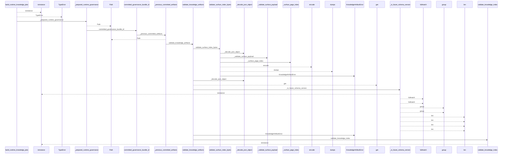

# build_runtime_knowledge_plan

**Entry point:** `build_runtime_knowledge_plan` (`api`)
**Source:** [knowledge_orchestration](../modules/knowledge_orchestration.md)
**Modules touched:** [concept_identity](../modules/concept_identity.md), [infrastructure_sync](../modules/infrastructure_sync.md), [io](../modules/io.md), [knowledge_artifacts](../modules/knowledge_artifacts.md), and 16 more

**Complete modules touched:**

- [concept_identity](../modules/concept_identity.md)
- [infrastructure_sync](../modules/infrastructure_sync.md)
- [io](../modules/io.md)
- [knowledge_artifacts](../modules/knowledge_artifacts.md)
- [knowledge_envelope](../modules/knowledge_envelope.md)
- [knowledge_evidence](../modules/knowledge_evidence.md)
- [knowledge_generation](../modules/knowledge_generation.md)
- [knowledge_governance](../modules/knowledge_governance.md)
- [knowledge_graph](../modules/knowledge_graph.md)
- [knowledge_index](../modules/knowledge_index.md)
- [knowledge_links](../modules/knowledge_links.md)
- [knowledge_model](../modules/knowledge_model.md)
- [knowledge_orchestration](../modules/knowledge_orchestration.md)
- [markdown_sections](../modules/markdown_sections.md)
- [section_ownership](../modules/section_ownership.md)
- [source_selection](../modules/source_selection.md)
- [sync_manifest](../modules/sync_manifest.md)
- [validation](../modules/validation.md)
- [wiki_media](../modules/wiki_media.md)
- [wiki_surface](../modules/wiki_surface.md)

## Call sequence

<!-- Auto-generated from static call edges. Dashed arrows are external or unresolved calls. Reviewed runtime conditions and side effects belong in Behavior. -->

> Call sequence diagram shows 30 of 1739 interactions; 1709 omitted to keep the visualization within the 30-interaction and generated-diagram limits.

> Trace truncated at the depth limit; deeper calls are omitted.

## Data flow

```mermaid
flowchart LR
    s1["1. build_runtime_knowledge_plan"]
    s2["2. isinstance"]
    s3["3. TypeError"]
    s4["4. _prepared_runtime_governance"]
    s5["5. Path"]
    s6["6. committed_governance_bundle_id"]
    s7["7. _previous_committed_artifacts"]
    s8["8. Path"]
    s9["9. validate_knowledge_artifacts"]
    s10["10. validate_surface_index_bytes"]
    s11["11. _decode_json_object"]
    s12["12. _validate_surface_payload"]
    s1 -. "isinstance(inputs, RuntimeKnowledgeInputs)" .-> s2
    s1 -. "TypeError('inputs must be a RuntimeKnowledgeInputs')" .-> s3
    s1 -->|"_prepared_runtime_governance(inputs)"| s4
    s4 -. "Path(inputs.target_wiki_dir)" .-> s5
    s4 -->|"committed_governance_bundle_id(root, inputs.previous_manifest)"| s6
    s6 -->|"_previous_committed_artifacts(wiki_dir, manifest)"| s7
    s7 -. "Path(wiki_dir)" .-> s8
    s7 -->|"validate_knowledge_artifacts(surface_index_bytes=..., knowledge_index_bytes=..., manifest=manifest)"| s9
    s9 -->|"validate_surface_index_bytes(surface_index_bytes)"| s10
    s10 -->|"_decode_json_object(surface_index_bytes, 'surface_index_bytes')"| s11
    s10 -->|"_validate_surface_payload(surface_payload)"| s12
    b0["mutation references.append"]
    s4 -. "mutation references.append" .-> b0
    click s1 "../modules/knowledge_orchestration.md"
    click s4 "../modules/knowledge_orchestration.md"
    click s6 "../modules/knowledge_orchestration.md"
    click s7 "../modules/knowledge_orchestration.md"
    click s9 "../modules/knowledge_artifacts.md"
    click s10 "../modules/knowledge_artifacts.md"
    click s11 "../modules/knowledge_artifacts.md"
    click s12 "../modules/knowledge_artifacts.md"
    classDef boundary stroke:#b45309,stroke-dasharray: 4 2
    class b0 boundary
```

<!-- Auto-generated static analysis. Treat values and boundaries as best-effort hints, not runtime proof. -->

### Step data

| Step | Inputs | Reads | Writes | Returns |
|---|---|---|---|---|
| `build_runtime_knowledge_plan` | `inputs: RuntimeKnowledgeInputs` | `RuntimeKnowledgeInputs`, `SourceSelectionError`, `__version__`, `KNOWLEDGE_SCHEMA_VERSION`, `WIKI_SURFACE_INDEX_SCHEMA_VERSION` | - | `_stabilize_revision_only_noop(...)` |
| `isinstance` | - | - | - | - |
| `TypeError` | - | - | - | - |
| `_prepared_runtime_governance` | `inputs: RuntimeKnowledgeInputs` | `GOVERNANCE_FILENAME` | - | `None`, `reconcile_concepts(...)` |
| `Path` | - | - | - | - |
| `committed_governance_bundle_id` | `wiki_dir: str \| Path`, `manifest: SyncManifest \| None` | - | - | `None`, `governance_bundle_id_from_knowledge(...)` |
| `_previous_committed_artifacts` | `wiki_dir: str \| Path`, `manifest: SyncManifest \| None` | `KnowledgeArtifactError` | - | `None`, `None`, `None`, `validated` |
| `Path` | - | - | - | - |
| `validate_knowledge_artifacts` | `surface_index_bytes: bytes`, `knowledge_index_bytes: bytes`, `manifest: SyncManifest` | `KNOWLEDGE_SCHEMA_VERSION`, `_KNOWLEDGE_SCHEMA_VERSION_RE`, `ConceptKind`, `KnowledgeGraphError`, `TYPED_GRAPH_EXTENSION_KEY`, `INVENTORY_HASH_EXTENSION`, `TYPED_GRAPH_EXTENSION_KEY`, `SECTION_OWNERSHIP_EXTENSION_KEY` | - | `ValidatedKnowledgeArtifacts(...)` |
| `validate_surface_index_bytes` | `surface_index_bytes: bytes` | - | - | `surface_payload` |
| `_decode_json_object` | `content: bytes`, `field: str` | `KnowledgeArtifactError`, `Mapping` | - | `value` |
| `_validate_surface_payload` | `payload: Mapping[str, Any]` | `WIKI_SURFACE_INDEX_SCHEMA_VERSION`, `WIKI_SURFACE_INDEX_SCHEMA_VERSION`, `WIKI_SURFACE_INDEX_SCHEMA_VERSION`, `_SURFACE_SCHEMA_VERSION_RE`, `Mapping`, `Mapping` | - | - |

### Call data

| From | To | Line | Call |
|---|---|---:|---|
| build_runtime_knowledge_plan | isinstance | 262 | `isinstance(inputs, RuntimeKnowledgeInputs)` |
| build_runtime_knowledge_plan | TypeError | 263 | `TypeError('inputs must be a RuntimeKnowledgeInputs')` |
| build_runtime_knowledge_plan | _prepared_runtime_governance | 264 | `_prepared_runtime_governance(inputs)` |
| _prepared_runtime_governance | Path | 747 | `Path(inputs.target_wiki_dir)` |
| _prepared_runtime_governance | committed_governance_bundle_id | 748 | `committed_governance_bundle_id(root, inputs.previous_manifest)` |
| committed_governance_bundle_id | _previous_committed_artifacts | 602 | `_previous_committed_artifacts(wiki_dir, manifest)` |
| _previous_committed_artifacts | Path | 576 | `Path(wiki_dir)` |
| _previous_committed_artifacts | validate_knowledge_artifacts | 578 | `validate_knowledge_artifacts(surface_index_bytes=..., knowledge_index_bytes=..., manifest=manifest)` |
| validate_knowledge_artifacts | validate_surface_index_bytes | 205 | `validate_surface_index_bytes(surface_index_bytes)` |
| validate_surface_index_bytes | _decode_json_object | 174 | `_decode_json_object(surface_index_bytes, 'surface_index_bytes')` |
| validate_surface_index_bytes | _validate_surface_payload | 178 | `_validate_surface_payload(surface_payload)` |

### Boundary effects

| Kind | Target | Step | Line |
|---|---|---|---:|
| mutation | `references.append` | `_prepared_runtime_governance` | 780 |

### Static analysis gaps

| Kind | Step | Target | Line |
|---|---|---|---:|
| unresolved_call | `build_runtime_knowledge_plan` | `isinstance` | 262 |
| unresolved_call | `build_runtime_knowledge_plan` | `TypeError` | 263 |
| step_limit | `build_runtime_knowledge_plan` | `first 12 steps` | 0 |
| truncated_flow | `build_runtime_knowledge_plan` | `depth limit` | 0 |

## Behavior

This flow starts at `build_runtime_knowledge_plan` and is classified as `api`. The generated call and data-flow sections are bounded static projections; runtime conditions and side effects require source-level confirmation.
