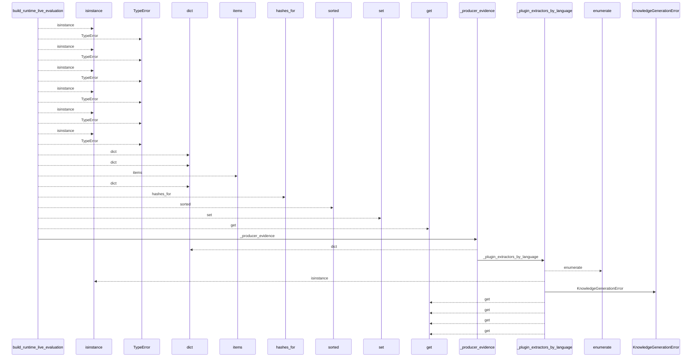
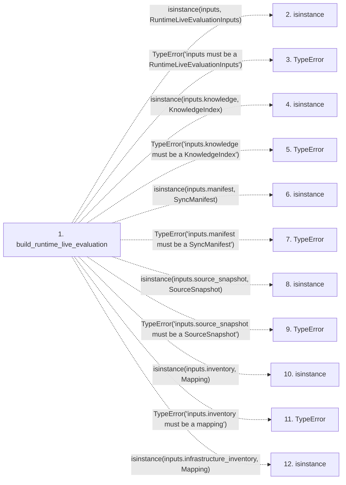

# build_runtime_live_evaluation

**Entry point:** `build_runtime_live_evaluation` (`api`)
**Source:** [knowledge_orchestration](../modules/knowledge_orchestration.md)
**Modules touched:** [infrastructure_inventory](../modules/infrastructure_inventory.md), [infrastructure_sync](../modules/infrastructure_sync.md), [knowledge_envelope](../modules/knowledge_envelope.md), and 6 more

**Complete modules touched:**

- [infrastructure_inventory](../modules/infrastructure_inventory.md)
- [infrastructure_sync](../modules/infrastructure_sync.md)
- [knowledge_envelope](../modules/knowledge_envelope.md)
- [knowledge_evidence](../modules/knowledge_evidence.md)
- [knowledge_freshness](../modules/knowledge_freshness.md)
- [knowledge_generation](../modules/knowledge_generation.md)
- [knowledge_model](../modules/knowledge_model.md)
- [knowledge_orchestration](../modules/knowledge_orchestration.md)
- [validation](../modules/validation.md)

## Call sequence

<!-- Auto-generated from static call edges. Dashed arrows are external or unresolved calls. Reviewed runtime conditions and side effects belong in Behavior. -->

> Call sequence diagram shows 30 of 491 interactions; 461 omitted to keep the visualization within the 30-interaction and generated-diagram limits.

> Trace truncated at the depth limit; deeper calls are omitted.

## Data flow

<!-- Auto-generated static analysis. Treat values and boundaries as best-effort hints, not runtime proof. -->

### Step data

| Step | Inputs | Reads | Writes | Returns |
|---|---|---|---|---|
| `build_runtime_live_evaluation` | `inputs: RuntimeLiveEvaluationInputs` | `RuntimeLiveEvaluationInputs`, `KnowledgeIndex`, `SyncManifest`, `SourceSnapshot`, `Mapping`, `Mapping`, `ObservationScope`, `__version__` | `source_hashes[...]` | `LiveKnowledgeEvaluation(...)` |
| `isinstance` | - | - | - | - |
| `TypeError` | - | - | - | - |
| `isinstance` | - | - | - | - |
| `TypeError` | - | - | - | - |
| `isinstance` | - | - | - | - |
| `TypeError` | - | - | - | - |
| `isinstance` | - | - | - | - |
| `TypeError` | - | - | - | - |
| `isinstance` | - | - | - | - |
| `TypeError` | - | - | - | - |
| `isinstance` | - | - | - | - |

### Call data

| From | To | Line | Call |
|---|---|---:|---|
| build_runtime_live_evaluation | isinstance | 375 | `isinstance(inputs, RuntimeLiveEvaluationInputs)` |
| build_runtime_live_evaluation | TypeError | 376 | `TypeError('inputs must be a RuntimeLiveEvaluationInputs')` |
| build_runtime_live_evaluation | isinstance | 377 | `isinstance(inputs.knowledge, KnowledgeIndex)` |
| build_runtime_live_evaluation | TypeError | 378 | `TypeError('inputs.knowledge must be a KnowledgeIndex')` |
| build_runtime_live_evaluation | isinstance | 379 | `isinstance(inputs.manifest, SyncManifest)` |
| build_runtime_live_evaluation | TypeError | 380 | `TypeError('inputs.manifest must be a SyncManifest')` |
| build_runtime_live_evaluation | isinstance | 381 | `isinstance(inputs.source_snapshot, SourceSnapshot)` |
| build_runtime_live_evaluation | TypeError | 382 | `TypeError('inputs.source_snapshot must be a SourceSnapshot')` |
| build_runtime_live_evaluation | isinstance | 383 | `isinstance(inputs.inventory, Mapping)` |
| build_runtime_live_evaluation | TypeError | 384 | `TypeError('inputs.inventory must be a mapping')` |
| build_runtime_live_evaluation | isinstance | 385 | `isinstance(inputs.infrastructure_inventory, Mapping)` |

### Boundary effects

*No boundary effects detected.*

### Static analysis gaps

| Kind | Step | Target | Line |
|---|---|---|---:|
| unresolved_call | `build_runtime_live_evaluation` | `isinstance` | 375 |
| unresolved_call | `build_runtime_live_evaluation` | `TypeError` | 376 |
| unresolved_call | `build_runtime_live_evaluation` | `isinstance` | 377 |
| unresolved_call | `build_runtime_live_evaluation` | `TypeError` | 378 |
| unresolved_call | `build_runtime_live_evaluation` | `isinstance` | 379 |
| unresolved_call | `build_runtime_live_evaluation` | `TypeError` | 380 |
| unresolved_call | `build_runtime_live_evaluation` | `isinstance` | 381 |
| unresolved_call | `build_runtime_live_evaluation` | `TypeError` | 382 |
| unresolved_call | `build_runtime_live_evaluation` | `isinstance` | 383 |
| unresolved_call | `build_runtime_live_evaluation` | `TypeError` | 384 |
| unresolved_call | `build_runtime_live_evaluation` | `isinstance` | 385 |
| step_limit | `build_runtime_live_evaluation` | `first 12 steps` | 0 |

## Behavior

This flow starts at `build_runtime_live_evaluation` and is classified as `api`. The generated call and data-flow sections are bounded static projections; runtime conditions and side effects require source-level confirmation.
