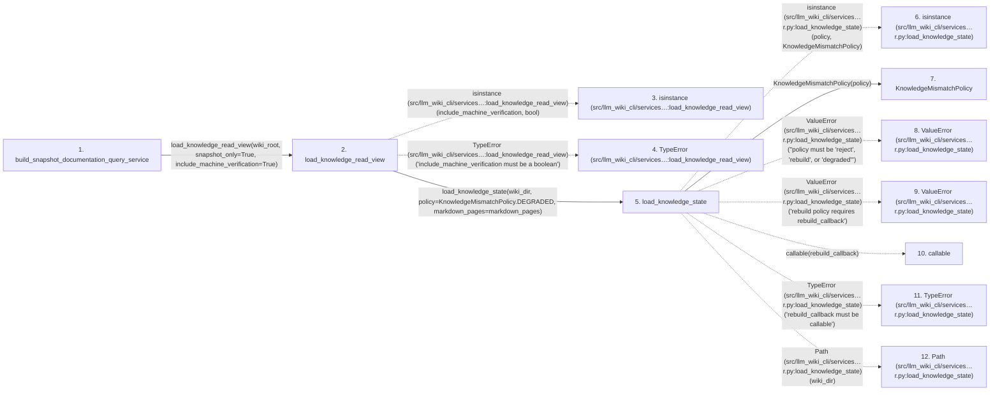

# build_snapshot_documentation_query_service

**Entry point:** `build_snapshot_documentation_query_service` (`api`)
**Source:** [documentation_query_builder](../modules/documentation_query_builder.md)
**Modules touched:** [documentation_query_builder](../modules/documentation_query_builder.md), [immutable](../modules/immutable.md), [infrastructure_sync](../modules/infrastructure_sync.md), [io](../modules/io.md), and 16 more

**Complete modules touched:**

- [documentation_query_builder](../modules/documentation_query_builder.md)
- [immutable](../modules/immutable.md)
- [infrastructure_sync](../modules/infrastructure_sync.md)
- [io](../modules/io.md)
- [knowledge_artifacts](../modules/knowledge_artifacts.md)
- [knowledge_consumption](../modules/knowledge_consumption.md)
- [knowledge_envelope](../modules/knowledge_envelope.md)
- [knowledge_evidence](../modules/knowledge_evidence.md)
- [knowledge_freshness](../modules/knowledge_freshness.md)
- [knowledge_governance](../modules/knowledge_governance.md)
- [knowledge_graph](../modules/knowledge_graph.md)
- [knowledge_index](../modules/knowledge_index.md)
- [knowledge_loader](../modules/knowledge_loader.md)
- [knowledge_model](../modules/knowledge_model.md)
- [knowledge_reuse](../modules/knowledge_reuse.md)
- [knowledge_verification](../modules/knowledge_verification.md)
- [section_ownership](../modules/section_ownership.md)
- [sync_manifest](../modules/sync_manifest.md)
- [verification_contracts](../modules/verification_contracts.md)
- [wiki_surface](../modules/wiki_surface.md)

## Call sequence

```mermaid
sequenceDiagram
    participant p0 as build_snapshot_documentation_query_service
    participant p1 as load_knowledge_read_view
    participant p2 as isinstance (src/llm_wiki_cli/services…:load_knowledge_read_view)
    participant p3 as TypeError (src/llm_wiki_cli/services…:load_knowledge_read_view)
    participant p4 as load_knowledge_state
    participant p5 as isinstance (src/llm_wiki_cli/services…r.py:load_knowledge_state)
    participant p6 as KnowledgeMismatchPolicy
    participant p7 as ValueError (src/llm_wiki_cli/services…r.py:load_knowledge_state)
    participant p8 as callable
    participant p9 as TypeError (src/llm_wiki_cli/services…r.py:load_knowledge_state)
    participant p10 as Path (src/llm_wiki_cli/services…r.py:load_knowledge_state)
    participant p11 as _load_once
    participant p12 as _read_artifact
    participant p13 as path.is_symlink (src/llm_wiki_cli/services…_loader.py:_read_artifact)
    participant p14 as KnowledgeLoadIssue
    participant p15 as path.exists (src/llm_wiki_cli/services…_loader.py:_read_artifact)
    participant p16 as path.is_file (src/llm_wiki_cli/services…_loader.py:_read_artifact)
    participant p17 as path.read_bytes (src/llm_wiki_cli/services…_loader.py:_read_artifact)
    participant p18 as KnowledgeLoadResult
    participant p19 as validate_surface_index_bytes
    participant p20 as _decode_json_object
    participant p21 as isinstance (src/llm_wiki_cli/services…ts.py:_decode_json_object)
    participant p22 as KnowledgeArtifactError
    participant p23 as content.decode (src/llm_wiki_cli/services…ts.py:_decode_json_object)
    participant p24 as json.loads (src/llm_wiki_cli/services…ts.py:_decode_json_object)
    participant p25 as _unique_json_object
    p0->>p1: load_knowledge_read_view
    p1-->>p2: isinstance (src/llm_wiki_cli/services…:load_knowledge_read_view)
    p1-->>p3: TypeError (src/llm_wiki_cli/services…:load_knowledge_read_view)
    p1->>p4: load_knowledge_state
    p4-->>p5: isinstance (src/llm_wiki_cli/services…r.py:load_knowledge_state)
    p4->>p6: KnowledgeMismatchPolicy
    p4-->>p7: ValueError (src/llm_wiki_cli/services…r.py:load_knowledge_state)
    p4-->>p7: ValueError (src/llm_wiki_cli/services…r.py:load_knowledge_state)
    p4-->>p8: callable
    p4-->>p9: TypeError (src/llm_wiki_cli/services…r.py:load_knowledge_state)
    p4-->>p10: Path (src/llm_wiki_cli/services…r.py:load_knowledge_state)
    p4->>p11: _load_once
    p11->>p12: _read_artifact
    p12-->>p13: path.is_symlink (src/llm_wiki_cli/services…_loader.py:_read_artifact)
    p12->>p14: KnowledgeLoadIssue
    p12-->>p15: path.exists (src/llm_wiki_cli/services…_loader.py:_read_artifact)
    p12->>p14: KnowledgeLoadIssue
    p12-->>p16: path.is_file (src/llm_wiki_cli/services…_loader.py:_read_artifact)
    p12->>p14: KnowledgeLoadIssue
    p12-->>p17: path.read_bytes (src/llm_wiki_cli/services…_loader.py:_read_artifact)
    p12->>p14: KnowledgeLoadIssue
    p11->>p18: KnowledgeLoadResult
    p11->>p19: validate_surface_index_bytes
    p19->>p20: _decode_json_object
    p20-->>p21: isinstance (src/llm_wiki_cli/services…ts.py:_decode_json_object)
    p20->>p22: KnowledgeArtifactError
    p20-->>p23: content.decode (src/llm_wiki_cli/services…ts.py:_decode_json_object)
    p20->>p22: KnowledgeArtifactError
    p20-->>p24: json.loads (src/llm_wiki_cli/services…ts.py:_decode_json_object)
    p20->>p25: _unique_json_object
```

<!-- Auto-generated from static call edges. Dashed arrows are external or unresolved calls. Reviewed runtime conditions and side effects belong in Behavior. -->

> Call sequence diagram shows 30 of 659 interactions; 629 omitted to keep the visualization within the 30-interaction and generated-diagram limits.

> Trace truncated at the depth limit; deeper calls are omitted.

## Data flow

<!-- Auto-generated static analysis. Treat values and boundaries as best-effort hints, not runtime proof. -->

### Step data

| Step | Inputs | Reads | Writes | Returns |
|---|---|---|---|---|
| `build_snapshot_documentation_query_service` | `wiki_root: Path`, `limit: int` | - | - | `build_documentation_query_service_from_view(...)` |
| `load_knowledge_read_view` | `wiki_dir: str \| Path`, `live_evaluation: LiveKnowledgeEvaluation \| None`, `snapshot_only: bool`, `mode: KnowledgeReadMode \| str \| None`, `markdown_pages: Mapping[str, str \| bytes] \| None`, `include_machine_verification: bool` | `KnowledgeMismatchPolicy`, `KnowledgeStateLoadError`, `KnowledgeLoadState` | - | `view`, `attach_machine_verification_read_view(...)` |
| `isinstance (src/llm_wiki_cli/services…:load_knowledge_read_view)` | - | - | - | - |
| `TypeError (src/llm_wiki_cli/services…:load_knowledge_read_view)` | - | - | - | - |
| `load_knowledge_state` | `wiki_dir: str \| Path`, `policy: KnowledgeMismatchPolicy \| str`, `rebuild_callback: RebuildCallback \| None`, `markdown_pages: Mapping[str, str \| bytes] \| None` | `KnowledgeMismatchPolicy`, `KnowledgeMismatchPolicy`, `KnowledgeLoadState`, `KnowledgeMismatchPolicy`, `KnowledgeLoadState`, `KnowledgeMismatchPolicy`, `KnowledgeLoadState` | - | `result`, `replace(...)`, `KnowledgeLoadResult(...)` |
| `isinstance (src/llm_wiki_cli/services…r.py:load_knowledge_state)` | - | - | - | - |
| `KnowledgeMismatchPolicy` | - | - | - | - |
| `ValueError (src/llm_wiki_cli/services…r.py:load_knowledge_state)` | - | - | - | - |
| `ValueError (src/llm_wiki_cli/services…r.py:load_knowledge_state)` | - | - | - | - |
| `callable` | - | - | - | - |
| `TypeError (src/llm_wiki_cli/services…r.py:load_knowledge_state)` | - | - | - | - |
| `Path (src/llm_wiki_cli/services…r.py:load_knowledge_state)` | - | - | - | - |

### Call data

| From | To | Line | Call |
|---|---|---:|---|
| build_snapshot_documentation_query_service | load_knowledge_read_view | 423 | `load_knowledge_read_view(wiki_root, snapshot_only=True, include_machine_verification=True)` |
| load_knowledge_read_view | isinstance (src/llm_wiki_cli/services…:load_knowledge_read_view) | 671 | `isinstance(include_machine_verification, bool)` |
| load_knowledge_read_view | TypeError (src/llm_wiki_cli/services…:load_knowledge_read_view) | 672 | `TypeError('include_machine_verification must be a boolean')` |
| load_knowledge_read_view | load_knowledge_state | 674 | `load_knowledge_state(wiki_dir, policy=KnowledgeMismatchPolicy.DEGRADED, markdown_pages=markdown_pages)` |
| load_knowledge_state | isinstance (src/llm_wiki_cli/services…r.py:load_knowledge_state) | 112 | `isinstance(policy, KnowledgeMismatchPolicy)` |
| load_knowledge_state | KnowledgeMismatchPolicy | 113 | `KnowledgeMismatchPolicy(policy)` |
| load_knowledge_state | ValueError (src/llm_wiki_cli/services…r.py:load_knowledge_state) | 116 | `ValueError("policy must be 'reject', 'rebuild', or 'degraded'")` |
| load_knowledge_state | ValueError (src/llm_wiki_cli/services…r.py:load_knowledge_state) | 118 | `ValueError('rebuild policy requires rebuild_callback')` |
| load_knowledge_state | callable | 119 | `callable(rebuild_callback)` |
| load_knowledge_state | TypeError (src/llm_wiki_cli/services…r.py:load_knowledge_state) | 120 | `TypeError('rebuild_callback must be callable')` |
| load_knowledge_state | Path (src/llm_wiki_cli/services…r.py:load_knowledge_state) | 122 | `Path(wiki_dir)` |

### Boundary effects

*No boundary effects detected.*

### Static analysis gaps

| Kind | Step | Target | Line |
|---|---|---|---:|
| external_call | `load_knowledge_read_view` | `isinstance` | 671 |
| external_call | `load_knowledge_read_view` | `TypeError` | 672 |
| external_call | `load_knowledge_state` | `isinstance` | 112 |
| external_call | `load_knowledge_state` | `ValueError` | 116 |
| external_call | `load_knowledge_state` | `ValueError` | 118 |
| external_call | `load_knowledge_state` | `callable` | 119 |
| external_call | `load_knowledge_state` | `TypeError` | 120 |
| step_limit | `build_snapshot_documentation_query_service` | `first 12 steps` | 0 |
| truncated_flow | `build_snapshot_documentation_query_service` | `depth limit` | 0 |

## Behavior

This flow starts at `build_snapshot_documentation_query_service` and is classified as `api`. The generated call and data-flow sections are bounded static projections; runtime conditions and side effects require source-level confirmation.
