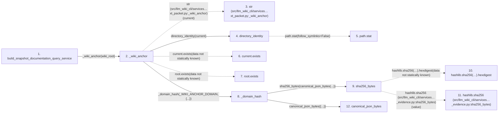

# build_snapshot_documentation_query_service

**Entry point:** `build_snapshot_documentation_query_service` (`api`)
**Source:** [documentation_query_builder](../modules/documentation_query_builder.md)
**Modules touched:** [canonical_json](../modules/canonical_json.md), [context_packet](../modules/context_packet.md), [documentation_query_builder](../modules/documentation_query_builder.md), [immutable](../modules/immutable.md), and 22 more

**Complete modules touched:**

- [canonical_json](../modules/canonical_json.md)
- [context_packet](../modules/context_packet.md)
- [documentation_query_builder](../modules/documentation_query_builder.md)
- [immutable](../modules/immutable.md)
- [infrastructure_sync](../modules/infrastructure_sync.md)
- [io](../modules/io.md)
- [knowledge_artifacts](../modules/knowledge_artifacts.md)
- [knowledge_consumption](../modules/knowledge_consumption.md)
- [knowledge_envelope](../modules/knowledge_envelope.md)
- [knowledge_evidence](../modules/knowledge_evidence.md)
- [knowledge_freshness](../modules/knowledge_freshness.md)
- [knowledge_governance](../modules/knowledge_governance.md)
- [knowledge_graph](../modules/knowledge_graph.md)
- [knowledge_index](../modules/knowledge_index.md)
- [knowledge_loader](../modules/knowledge_loader.md)
- [knowledge_model](../modules/knowledge_model.md)
- [knowledge_packs](../modules/knowledge_packs.md)
- [knowledge_reuse](../modules/knowledge_reuse.md)
- [knowledge_storage](../modules/knowledge_storage.md)
- [knowledge_storage_io](../modules/knowledge_storage_io.md)
- [knowledge_verification](../modules/knowledge_verification.md)
- [section_ownership](../modules/section_ownership.md)
- [source_snapshot](../modules/source_snapshot.md)
- [sync_manifest](../modules/sync_manifest.md)
- [verification_contracts](../modules/verification_contracts.md)
- [wiki_surface](../modules/wiki_surface.md)

## Call sequence

```mermaid
sequenceDiagram
    participant p0 as build_snapshot_documentation_query_service
    participant p1 as _wiki_anchor
    participant p2 as str (src/llm_wiki_cli/services…xt_packet.py:_wiki_anchor)
    participant p3 as directory_identity
    participant p4 as path.stat
    participant p5 as current.exists
    participant p6 as root.exists
    participant p7 as _domain_hash
    participant p8 as sha256_bytes
    participant p9 as hashlib.sha256(…).hexdigest
    participant p10 as hashlib.sha256 (src/llm_wiki_cli/services…_evidence.py:sha256_bytes)
    participant p11 as canonical_json_bytes
    participant p12 as canonical_json_text(…).encode
    participant p13 as canonical_json_text
    participant p14 as json.dumps (src/llm_wiki_cli/services…ce.py:canonical_json_text)
    participant p15 as walk
    participant p16 as Path (src/llm_wiki_cli/services…xt_packet.py:_wiki_anchor)
    participant p17 as _assert_wiki_integrity
    participant p18 as any (src/llm_wiki_cli/services…py:_assert_wiki_integrity)
    participant p19 as Path (src/llm_wiki_cli/services…py:_assert_wiki_integrity)
    participant p20 as tuple (src/llm_wiki_cli/services…py:_assert_wiki_integrity)
    participant p21 as expected.items (src/llm_wiki_cli/services…py:_assert_wiki_integrity)
    participant p22 as ContextPacketSourceMutationError
    participant p23 as load_knowledge_read_view
    participant p24 as isinstance (src/llm_wiki_cli/services…:load_knowledge_read_view)
    participant p25 as TypeError (src/llm_wiki_cli/services…:load_knowledge_read_view)
    participant p26 as load_knowledge_state
    participant p27 as isinstance (src/llm_wiki_cli/services…r.py:load_knowledge_state)
    participant p28 as KnowledgeMismatchPolicy
    p0->>p1: _wiki_anchor
    p1-->>p2: str (src/llm_wiki_cli/services…xt_packet.py:_wiki_anchor)
    p1->>p3: directory_identity
    p3-->>p4: path.stat
    p1-->>p5: current.exists
    p1-->>p6: root.exists
    p1->>p7: _domain_hash
    p7->>p8: sha256_bytes
    p8-->>p9: hashlib.sha256(…).hexdigest
    p8-->>p10: hashlib.sha256 (src/llm_wiki_cli/services…_evidence.py:sha256_bytes)
    p7->>p11: canonical_json_bytes
    p11-->>p12: canonical_json_text(…).encode
    p11->>p13: canonical_json_text
    p13-->>p14: json.dumps (src/llm_wiki_cli/services…ce.py:canonical_json_text)
    p1-->>p15: walk
    p1-->>p16: Path (src/llm_wiki_cli/services…xt_packet.py:_wiki_anchor)
    p1->>p17: _assert_wiki_integrity
    p17-->>p18: any (src/llm_wiki_cli/services…py:_assert_wiki_integrity)
    p17->>p3: directory_identity
    p17-->>p19: Path (src/llm_wiki_cli/services…py:_assert_wiki_integrity)
    p17-->>p20: tuple (src/llm_wiki_cli/services…py:_assert_wiki_integrity)
    p17-->>p21: expected.items (src/llm_wiki_cli/services…py:_assert_wiki_integrity)
    p17->>p22: ContextPacketSourceMutationError
    p1->>p7: _domain_hash
    p0->>p23: load_knowledge_read_view
    p23-->>p24: isinstance (src/llm_wiki_cli/services…:load_knowledge_read_view)
    p23-->>p25: TypeError (src/llm_wiki_cli/services…:load_knowledge_read_view)
    p23->>p26: load_knowledge_state
    p26-->>p27: isinstance (src/llm_wiki_cli/services…r.py:load_knowledge_state)
    p26->>p28: KnowledgeMismatchPolicy
```

<!-- Auto-generated from static call edges. Dashed arrows are external or unresolved calls. Reviewed runtime conditions and side effects belong in Behavior. -->

> Call sequence diagram shows 30 of 773 interactions; 743 omitted to keep the visualization within the 30-interaction and generated-diagram limits.

> Trace truncated at the depth limit; deeper calls are omitted.

## Data flow

<!-- Auto-generated static analysis. Treat values and boundaries as best-effort hints, not runtime proof. -->

### Step data

| Step | Inputs | Reads | Writes | Returns |
|---|---|---|---|---|
| `build_snapshot_documentation_query_service` | `wiki_root: Path`, `limit: int` | - | - | `service` |
| `_wiki_anchor` | `root: Path`, `reject_all_symlinks: bool`, `max_bytes: int \| None`, `metrics: dict[str, int] \| None`, `integrity_out: dict[str, tuple[int, ...]] \| None`, `guard_windows: bool` | `_WIKI_ANCHOR_DOMAIN`, `_WIKI_ANCHOR_DOMAIN` | - | `_domain_hash(...)`, `_domain_hash(...)` |
| `str (src/llm_wiki_cli/services…xt_packet.py:_wiki_anchor)` | - | - | - | - |
| `directory_identity` | `path: Path` | - | - | `(...)`, `(...)` |
| `path.stat` | - | - | - | - |
| `current.exists` | - | - | - | - |
| `root.exists` | - | - | - | - |
| `_domain_hash` | `domain: str`, `value: Mapping[str, Any]` | - | - | `sha256_bytes(...)` |
| `sha256_bytes` | `value: bytes` | - | - | `...` |
| `hashlib.sha256(…).hexdigest` | - | - | - | - |
| `hashlib.sha256 (src/llm_wiki_cli/services…_evidence.py:sha256_bytes)` | - | - | - | - |
| `canonical_json_bytes` | `value: Any` | - | - | `...` |

### Call data

| From | To | Line | Call |
|---|---|---:|---|
| build_snapshot_documentation_query_service | _wiki_anchor | 424 | `_wiki_anchor(wiki_root)` |
| _wiki_anchor | str (src/llm_wiki_cli/services…xt_packet.py:_wiki_anchor) | 4985 | `str(current)` |
| _wiki_anchor | directory_identity | 4985 | `directory_identity(current)` |
| directory_identity | path.stat | 662 | `path.stat(follow_symlinks=False)` |
| _wiki_anchor | current.exists | 4986 | `current.exists(data not statically known)` |
| _wiki_anchor | root.exists | 4989 | `root.exists(data not statically known)` |
| _wiki_anchor | _domain_hash | 4990 | `_domain_hash(_WIKI_ANCHOR_DOMAIN, {...})` |
| _domain_hash | sha256_bytes | 5120 | `sha256_bytes(canonical_json_bytes(...))` |
| sha256_bytes | hashlib.sha256(…).hexdigest | 198 | `hashlib.sha256(value).hexdigest(data not statically known)` |
| sha256_bytes | hashlib.sha256 (src/llm_wiki_cli/services…_evidence.py:sha256_bytes) | 198 | `hashlib.sha256(value)` |
| _domain_hash | canonical_json_bytes | 5121 | `canonical_json_bytes({...})` |

### Boundary effects

*No boundary effects detected.*

### Static analysis gaps

| Kind | Step | Target | Line |
|---|---|---|---:|
| unresolved_call | `directory_identity` | `path.stat` | 662 |
| unresolved_call | `_wiki_anchor` | `current.exists` | 4986 |
| unresolved_call | `_wiki_anchor` | `root.exists` | 4989 |
| unresolved_call | `sha256_bytes` | `hashlib.sha256(value).hexdigest` | 198 |
| external_call | `sha256_bytes` | `hashlib.sha256` | 198 |
| step_limit | `build_snapshot_documentation_query_service` | `first 12 steps` | 0 |
| truncated_flow | `build_snapshot_documentation_query_service` | `depth limit` | 0 |

## Behavior

This flow starts at `build_snapshot_documentation_query_service` and is classified as `api`. The generated call and data-flow sections are bounded static projections; runtime conditions and side effects require source-level confirmation.
