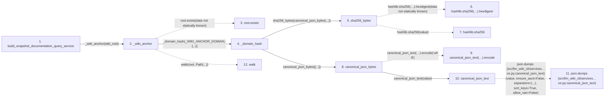

# build_snapshot_documentation_query_service

**Entry point:** `build_snapshot_documentation_query_service` (`api`)
**Source:** [documentation_query_builder](../modules/documentation_query_builder.md)
**Modules touched:** [context_packet](../modules/context_packet.md), [documentation_query_builder](../modules/documentation_query_builder.md), [immutable](../modules/immutable.md), and 18 more

**Complete modules touched:**

- [context_packet](../modules/context_packet.md)
- [documentation_query_builder](../modules/documentation_query_builder.md)
- [immutable](../modules/immutable.md)
- [infrastructure_sync](../modules/infrastructure_sync.md)
- [io](../modules/io.md)
- [knowledge_artifacts](../modules/knowledge_artifacts.md)
- [knowledge_consumption](../modules/knowledge_consumption.md)
- [knowledge_envelope](../modules/knowledge_envelope.md)
- [knowledge_evidence](../modules/knowledge_evidence.md)
- [knowledge_freshness](../modules/knowledge_freshness.md)
- [knowledge_governance](../modules/knowledge_governance.md)
- [knowledge_graph](../modules/knowledge_graph.md)
- [knowledge_index](../modules/knowledge_index.md)
- [knowledge_loader](../modules/knowledge_loader.md)
- [knowledge_model](../modules/knowledge_model.md)
- [knowledge_reuse](../modules/knowledge_reuse.md)
- [knowledge_verification](../modules/knowledge_verification.md)
- [section_ownership](../modules/section_ownership.md)
- [sync_manifest](../modules/sync_manifest.md)
- [verification_contracts](../modules/verification_contracts.md)
- [wiki_surface](../modules/wiki_surface.md)

## Call sequence

```mermaid
sequenceDiagram
    participant p0 as build_snapshot_documentation_query_service
    participant p1 as _wiki_anchor
    participant p2 as root.exists
    participant p3 as _domain_hash
    participant p4 as sha256_bytes
    participant p5 as hashlib.sha256(…).hexdigest
    participant p6 as hashlib.sha256
    participant p7 as canonical_json_bytes
    participant p8 as canonical_json_text(…).encode
    participant p9 as canonical_json_text
    participant p10 as json.dumps (src/llm_wiki_cli/services…ce.py:canonical_json_text)
    participant p11 as walk
    participant p12 as Path (src/llm_wiki_cli/services…xt_packet.py:_wiki_anchor)
    participant p13 as load_knowledge_read_view
    participant p14 as isinstance (src/llm_wiki_cli/services…:load_knowledge_read_view)
    participant p15 as TypeError (src/llm_wiki_cli/services…:load_knowledge_read_view)
    participant p16 as load_knowledge_state
    participant p17 as isinstance (src/llm_wiki_cli/services…r.py:load_knowledge_state)
    participant p18 as KnowledgeMismatchPolicy
    participant p19 as ValueError (src/llm_wiki_cli/services…r.py:load_knowledge_state)
    participant p20 as callable
    participant p21 as TypeError (src/llm_wiki_cli/services…r.py:load_knowledge_state)
    participant p22 as Path (src/llm_wiki_cli/services…r.py:load_knowledge_state)
    participant p23 as _load_once
    participant p24 as _read_artifact
    participant p25 as path.is_symlink (src/llm_wiki_cli/services…_loader.py:_read_artifact)
    participant p26 as KnowledgeLoadIssue
    participant p27 as path.exists (src/llm_wiki_cli/services…_loader.py:_read_artifact)
    p0->>p1: _wiki_anchor
    p1-->>p2: root.exists
    p1->>p3: _domain_hash
    p3->>p4: sha256_bytes
    p4-->>p5: hashlib.sha256(…).hexdigest
    p4-->>p6: hashlib.sha256
    p3->>p7: canonical_json_bytes
    p7-->>p8: canonical_json_text(…).encode
    p7->>p9: canonical_json_text
    p9-->>p10: json.dumps (src/llm_wiki_cli/services…ce.py:canonical_json_text)
    p1-->>p11: walk
    p1-->>p12: Path (src/llm_wiki_cli/services…xt_packet.py:_wiki_anchor)
    p1->>p3: _domain_hash
    p0->>p13: load_knowledge_read_view
    p13-->>p14: isinstance (src/llm_wiki_cli/services…:load_knowledge_read_view)
    p13-->>p15: TypeError (src/llm_wiki_cli/services…:load_knowledge_read_view)
    p13->>p16: load_knowledge_state
    p16-->>p17: isinstance (src/llm_wiki_cli/services…r.py:load_knowledge_state)
    p16->>p18: KnowledgeMismatchPolicy
    p16-->>p19: ValueError (src/llm_wiki_cli/services…r.py:load_knowledge_state)
    p16-->>p19: ValueError (src/llm_wiki_cli/services…r.py:load_knowledge_state)
    p16-->>p20: callable
    p16-->>p21: TypeError (src/llm_wiki_cli/services…r.py:load_knowledge_state)
    p16-->>p22: Path (src/llm_wiki_cli/services…r.py:load_knowledge_state)
    p16->>p23: _load_once
    p23->>p24: _read_artifact
    p24-->>p25: path.is_symlink (src/llm_wiki_cli/services…_loader.py:_read_artifact)
    p24->>p26: KnowledgeLoadIssue
    p24-->>p27: path.exists (src/llm_wiki_cli/services…_loader.py:_read_artifact)
    p24->>p26: KnowledgeLoadIssue
```

<!-- Auto-generated from static call edges. Dashed arrows are external or unresolved calls. Reviewed runtime conditions and side effects belong in Behavior. -->

> Call sequence diagram shows 30 of 675 interactions; 645 omitted to keep the visualization within the 30-interaction and generated-diagram limits.

> Trace truncated at the depth limit; deeper calls are omitted.

## Data flow

<!-- Auto-generated static analysis. Treat values and boundaries as best-effort hints, not runtime proof. -->

### Step data

| Step | Inputs | Reads | Writes | Returns |
|---|---|---|---|---|
| `build_snapshot_documentation_query_service` | `wiki_root: Path`, `limit: int` | - | - | `service` |
| `_wiki_anchor` | `root: Path`, `reject_all_symlinks: bool` | `_WIKI_ANCHOR_DOMAIN`, `_WIKI_ANCHOR_DOMAIN` | - | `_domain_hash(...)`, `_domain_hash(...)` |
| `root.exists` | - | - | - | - |
| `_domain_hash` | `domain: str`, `value: Mapping[str, Any]` | - | - | `sha256_bytes(...)` |
| `sha256_bytes` | `value: bytes` | - | - | `...` |
| `hashlib.sha256(…).hexdigest` | - | - | - | - |
| `hashlib.sha256` | - | - | - | - |
| `canonical_json_bytes` | `value: Any` | - | - | `...` |
| `canonical_json_text(…).encode` | - | - | - | - |
| `canonical_json_text` | `value: Any` | - | - | `json.dumps(...)` |
| `json.dumps (src/llm_wiki_cli/services…ce.py:canonical_json_text)` | - | - | - | - |
| `walk` | - | - | - | - |

### Call data

| From | To | Line | Call |
|---|---|---:|---|
| build_snapshot_documentation_query_service | _wiki_anchor | 424 | `_wiki_anchor(wiki_root)` |
| _wiki_anchor | root.exists | 4883 | `root.exists(data not statically known)` |
| _wiki_anchor | _domain_hash | 4884 | `_domain_hash(_WIKI_ANCHOR_DOMAIN, {...})` |
| _domain_hash | sha256_bytes | 4971 | `sha256_bytes(canonical_json_bytes(...))` |
| sha256_bytes | hashlib.sha256(…).hexdigest | 198 | `hashlib.sha256(value).hexdigest(data not statically known)` |
| sha256_bytes | hashlib.sha256 | 198 | `hashlib.sha256(value)` |
| _domain_hash | canonical_json_bytes | 4972 | `canonical_json_bytes({...})` |
| canonical_json_bytes | canonical_json_text(…).encode | 171 | `canonical_json_text(value).encode('utf-8')` |
| canonical_json_bytes | canonical_json_text | 171 | `canonical_json_text(value)` |
| canonical_json_text | json.dumps (src/llm_wiki_cli/services…ce.py:canonical_json_text) | 159 | `json.dumps(value, ensure_ascii=False, separators=(...), sort_keys=True, allow_nan=False)` |
| _wiki_anchor | walk | 4933 | `walk(root, Path(...))` |

### Boundary effects

*No boundary effects detected.*

### Static analysis gaps

| Kind | Step | Target | Line |
|---|---|---|---:|
| unresolved_call | `_wiki_anchor` | `root.exists` | 4883 |
| unresolved_call | `sha256_bytes` | `hashlib.sha256(value).hexdigest` | 198 |
| external_call | `sha256_bytes` | `hashlib.sha256` | 198 |
| unresolved_call | `canonical_json_bytes` | `canonical_json_text(value).encode` | 171 |
| external_call | `canonical_json_text` | `json.dumps` | 159 |
| unresolved_call | `_wiki_anchor` | `walk` | 4933 |
| step_limit | `build_snapshot_documentation_query_service` | `first 12 steps` | 0 |
| truncated_flow | `build_snapshot_documentation_query_service` | `depth limit` | 0 |

## Behavior

This flow starts at `build_snapshot_documentation_query_service` and is classified as `api`. The generated call and data-flow sections are bounded static projections; runtime conditions and side effects require source-level confirmation.
