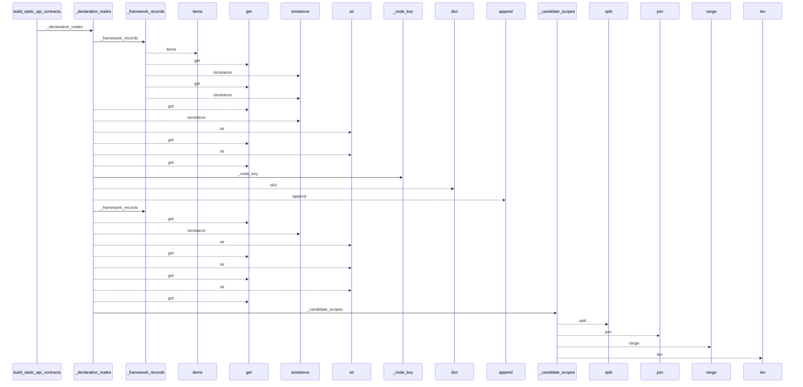
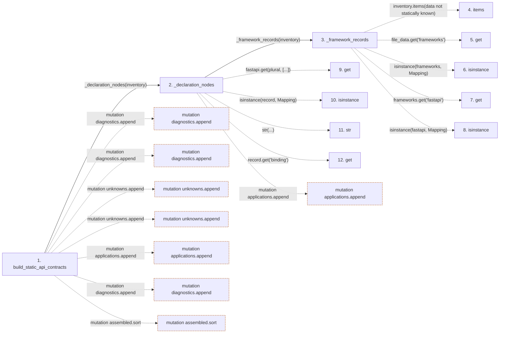

# build_static_api_contracts

**Entry point:** `build_static_api_contracts` (`api`)
**Source:** [api_contracts](../modules/api_contracts.md)
**Modules touched:** [api_contracts](../modules/api_contracts.md), [imports](../modules/imports.md)

## Call sequence

<!-- Auto-generated from static call edges. Dashed arrows are external or unresolved calls. Reviewed runtime conditions and side effects belong in Behavior. -->

> Call sequence diagram shows 30 of 207 interactions; 177 omitted to keep the visualization within the 30-interaction and generated-diagram limits.

## Data flow

<!-- Auto-generated static analysis. Treat values and boundaries as best-effort hints, not runtime proof. -->

### Step data

| Step | Inputs | Reads | Writes | Returns |
|---|---|---|---|---|
| `build_static_api_contracts` | `inventory: Mapping[str, Mapping[str, Any]]` | `Mapping`, `Mapping`, `_UNKNOWN`, `_UNKNOWN` | `config[...]`, `ids[...]`, `operation[...]` | `{...}` |
| `_declaration_nodes` | `inventory: Mapping[str, Mapping[str, Any]]` | `Mapping`, `Mapping` | `nodes[...]` | `(...)` |
| `_framework_records` | `inventory: Mapping[str, Mapping[str, Any]]` | `Mapping`, `Mapping` | - | - |
| `items` | - | - | - | - |
| `get` | - | - | - | - |
| `isinstance` | - | - | - | - |
| `get` | - | - | - | - |
| `isinstance` | - | - | - | - |
| `get` | - | - | - | - |
| `isinstance` | - | - | - | - |
| `str` | - | - | - | - |
| `get` | - | - | - | - |

### Call data

| From | To | Line | Call |
|---|---|---:|---|
| build_static_api_contracts | _declaration_nodes | 736 | `_declaration_nodes(inventory)` |
| _declaration_nodes | _framework_records | 228 | `_framework_records(inventory)` |
| _framework_records | items | 218 | `inventory.items(data not statically known)` |
| _framework_records | get | 219 | `file_data.get('frameworks')` |
| _framework_records | isinstance | 220 | `isinstance(frameworks, Mapping)` |
| _framework_records | get | 220 | `frameworks.get('fastapi')` |
| _framework_records | isinstance | 221 | `isinstance(fastapi, Mapping)` |
| _declaration_nodes | get | 230 | `fastapi.get(plural, [...])` |
| _declaration_nodes | isinstance | 231 | `isinstance(record, Mapping)` |
| _declaration_nodes | str | 233 | `str(...)` |
| _declaration_nodes | get | 233 | `record.get('binding')` |

### Boundary effects

| Kind | Target | Step | Line |
|---|---|---|---:|
| mutation | `diagnostics.append` | `build_static_api_contracts` | 755 |
| mutation | `diagnostics.append` | `build_static_api_contracts` | 792 |
| mutation | `unknowns.append` | `build_static_api_contracts` | 809 |
| mutation | `unknowns.append` | `build_static_api_contracts` | 818 |
| mutation | `applications.append` | `build_static_api_contracts` | 827 |
| mutation | `diagnostics.append` | `build_static_api_contracts` | 1136 |
| mutation | `assembled.sort` | `build_static_api_contracts` | 1154 |
| mutation | `applications.append` | `_declaration_nodes` | 240 |

### Static analysis gaps

| Kind | Step | Target | Line |
|---|---|---|---:|
| unresolved_call | `_framework_records` | `inventory.items` | 218 |
| unresolved_call | `_framework_records` | `file_data.get` | 219 |
| unresolved_call | `_framework_records` | `isinstance` | 220 |
| unresolved_call | `_framework_records` | `frameworks.get` | 220 |
| unresolved_call | `_framework_records` | `isinstance` | 221 |
| unresolved_call | `_declaration_nodes` | `fastapi.get` | 230 |
| unresolved_call | `_declaration_nodes` | `isinstance` | 231 |
| unresolved_call | `_declaration_nodes` | `record.get` | 233 |
| step_limit | `build_static_api_contracts` | `first 12 steps` | 0 |

## Behavior

This flow starts at `build_static_api_contracts` and is classified as `api`. The generated call and data-flow sections are bounded static projections; runtime conditions and side effects require source-level confirmation.
