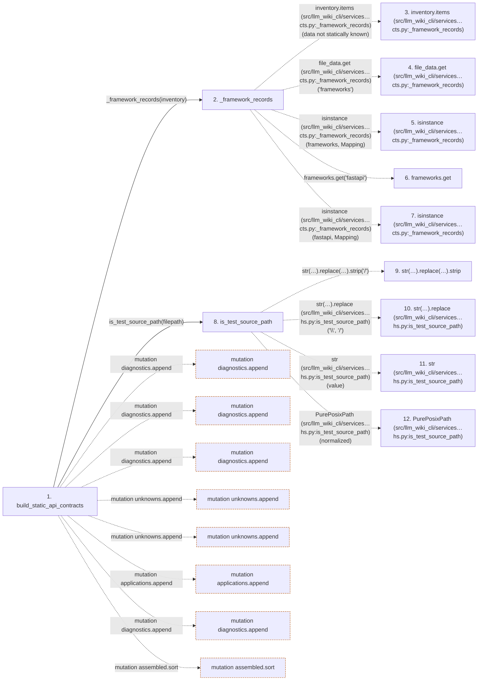

# build_static_api_contracts

**Entry point:** `build_static_api_contracts` (`api`)
**Source:** [api_contracts](../modules/api_contracts.md)
**Modules touched:** [api_contracts](../modules/api_contracts.md), [config](../modules/config.md), [imports](../modules/imports.md), [packages](../modules/packages.md), and 2 more

**Complete modules touched:**

- [api_contracts](../modules/api_contracts.md)
- [config](../modules/config.md)
- [imports](../modules/imports.md)
- [packages](../modules/packages.md)
- [paths](../modules/paths.md)
- [python_imports](../modules/python_imports.md)

## Call sequence

```mermaid
sequenceDiagram
    participant p0 as build_static_api_contracts
    participant p1 as _framework_records
    participant p2 as inventory.items (src/llm_wiki_cli/services…cts.py:_framework_records)
    participant p3 as file_data.get (src/llm_wiki_cli/services…cts.py:_framework_records)
    participant p4 as isinstance (src/llm_wiki_cli/services…cts.py:_framework_records)
    participant p5 as frameworks.get
    participant p6 as is_test_source_path
    participant p7 as str(…).replace(…).strip
    participant p8 as str(…).replace (src/llm_wiki_cli/services…hs.py:is_test_source_path)
    participant p9 as str (src/llm_wiki_cli/services…hs.py:is_test_source_path)
    participant p10 as PurePosixPath (src/llm_wiki_cli/services…hs.py:is_test_source_path)
    participant p11 as tuple (src/llm_wiki_cli/services…hs.py:is_test_source_path)
    participant p12 as part.casefold
    participant p13 as _TEST_DIRECTORY_NAMES.intersection
    participant p14 as path.name.casefold
    participant p15 as path.stem.casefold
    participant p16 as stem.startswith
    participant p17 as stem.endswith
    participant p18 as fastapi.get (src/llm_wiki_cli/services…uild_static_api_contracts)
    participant p19 as isinstance (src/llm_wiki_cli/services…uild_static_api_contracts)
    participant p20 as sum
    participant p21 as max
    participant p22 as len (src/llm_wiki_cli/services…uild_static_api_contracts)
    participant p23 as _operation_methods
    participant p24 as str (src/llm_wiki_cli/services…cts.py:_operation_methods)
    participant p25 as record.get (src/llm_wiki_cli/services…cts.py:_operation_methods)
    participant p26 as decorator.upper
    participant p27 as _kw_value
    participant p28 as _kwargs(…).get (src/llm_wiki_cli/services…pi_contracts.py:_kw_value)
    participant p29 as _kwargs
    p0->>p1: _framework_records
    p1-->>p2: inventory.items (src/llm_wiki_cli/services…cts.py:_framework_records)
    p1-->>p3: file_data.get (src/llm_wiki_cli/services…cts.py:_framework_records)
    p1-->>p4: isinstance (src/llm_wiki_cli/services…cts.py:_framework_records)
    p1-->>p5: frameworks.get
    p1-->>p4: isinstance (src/llm_wiki_cli/services…cts.py:_framework_records)
    p0->>p6: is_test_source_path
    p6-->>p7: str(…).replace(…).strip
    p6-->>p8: str(…).replace (src/llm_wiki_cli/services…hs.py:is_test_source_path)
    p6-->>p9: str (src/llm_wiki_cli/services…hs.py:is_test_source_path)
    p6-->>p10: PurePosixPath (src/llm_wiki_cli/services…hs.py:is_test_source_path)
    p6-->>p11: tuple (src/llm_wiki_cli/services…hs.py:is_test_source_path)
    p6-->>p12: part.casefold
    p6-->>p13: _TEST_DIRECTORY_NAMES.intersection
    p6-->>p14: path.name.casefold
    p6-->>p15: path.stem.casefold
    p6-->>p16: stem.startswith
    p6-->>p17: stem.endswith
    p0-->>p18: fastapi.get (src/llm_wiki_cli/services…uild_static_api_contracts)
    p0-->>p19: isinstance (src/llm_wiki_cli/services…uild_static_api_contracts)
    p0-->>p20: sum
    p0-->>p21: max
    p0-->>p22: len (src/llm_wiki_cli/services…uild_static_api_contracts)
    p0->>p23: _operation_methods
    p23-->>p24: str (src/llm_wiki_cli/services…cts.py:_operation_methods)
    p23-->>p25: record.get (src/llm_wiki_cli/services…cts.py:_operation_methods)
    p23-->>p26: decorator.upper
    p23->>p27: _kw_value
    p27-->>p28: _kwargs(…).get (src/llm_wiki_cli/services…pi_contracts.py:_kw_value)
    p27->>p29: _kwargs
```

<!-- Auto-generated from static call edges. Dashed arrows are external or unresolved calls. Reviewed runtime conditions and side effects belong in Behavior. -->

> Call sequence diagram shows 30 of 591 interactions; 561 omitted to keep the visualization within the 30-interaction and generated-diagram limits.

> Trace truncated at the depth limit; deeper calls are omitted.

## Data flow

<!-- Auto-generated static analysis. Treat values and boundaries as best-effort hints, not runtime proof. -->

### Step data

| Step | Inputs | Reads | Writes | Returns |
|---|---|---|---|---|
| `build_static_api_contracts` | `inventory: Mapping[str, Mapping[str, Any]]` | `Mapping`, `Mapping`, `Mapping`, `_UNKNOWN`, `_UNKNOWN` | `config[...]`, `ids[...]`, `operation[...]` | `{...}` |
| `_framework_records` | `inventory: Mapping[str, Mapping[str, Any]]` | `Mapping`, `Mapping` | - | - |
| `inventory.items (src/llm_wiki_cli/services…cts.py:_framework_records)` | - | - | - | - |
| `file_data.get (src/llm_wiki_cli/services…cts.py:_framework_records)` | - | - | - | - |
| `isinstance (src/llm_wiki_cli/services…cts.py:_framework_records)` | - | - | - | - |
| `frameworks.get` | - | - | - | - |
| `isinstance (src/llm_wiki_cli/services…cts.py:_framework_records)` | - | - | - | - |
| `is_test_source_path` | `value: str \| Path \| None` | `_TEST_FILE_STEMS` | - | `False`, `False`, `True`, `True`, `True`, `...` |
| `str(…).replace(…).strip` | - | - | - | - |
| `str(…).replace (src/llm_wiki_cli/services…hs.py:is_test_source_path)` | - | - | - | - |
| `str (src/llm_wiki_cli/services…hs.py:is_test_source_path)` | - | - | - | - |
| `PurePosixPath (src/llm_wiki_cli/services…hs.py:is_test_source_path)` | - | - | - | - |

### Call data

| From | To | Line | Call |
|---|---|---:|---|
| build_static_api_contracts | _framework_records | 742 | `_framework_records(inventory)` |
| _framework_records | inventory.items (src/llm_wiki_cli/services…cts.py:_framework_records) | 219 | `inventory.items(data not statically known)` |
| _framework_records | file_data.get (src/llm_wiki_cli/services…cts.py:_framework_records) | 220 | `file_data.get('frameworks')` |
| _framework_records | isinstance (src/llm_wiki_cli/services…cts.py:_framework_records) | 221 | `isinstance(frameworks, Mapping)` |
| _framework_records | frameworks.get | 221 | `frameworks.get('fastapi')` |
| _framework_records | isinstance (src/llm_wiki_cli/services…cts.py:_framework_records) | 222 | `isinstance(fastapi, Mapping)` |
| build_static_api_contracts | is_test_source_path | 743 | `is_test_source_path(filepath)` |
| is_test_source_path | str(…).replace(…).strip | 41 | `str(value).replace('\\', '/').strip('/')` |
| is_test_source_path | str(…).replace (src/llm_wiki_cli/services…hs.py:is_test_source_path) | 41 | `str(value).replace('\\', '/')` |
| is_test_source_path | str (src/llm_wiki_cli/services…hs.py:is_test_source_path) | 41 | `str(value)` |
| is_test_source_path | PurePosixPath (src/llm_wiki_cli/services…hs.py:is_test_source_path) | 44 | `PurePosixPath(normalized)` |

### Boundary effects

| Kind | Target | Step | Line |
|---|---|---|---:|
| mutation | `diagnostics.append` | `build_static_api_contracts` | 754 |
| mutation | `diagnostics.append` | `build_static_api_contracts` | 782 |
| mutation | `diagnostics.append` | `build_static_api_contracts` | 819 |
| mutation | `unknowns.append` | `build_static_api_contracts` | 836 |
| mutation | `unknowns.append` | `build_static_api_contracts` | 845 |
| mutation | `applications.append` | `build_static_api_contracts` | 854 |
| mutation | `diagnostics.append` | `build_static_api_contracts` | 1163 |
| mutation | `assembled.sort` | `build_static_api_contracts` | 1181 |

### Static analysis gaps

| Kind | Step | Target | Line |
|---|---|---|---:|
| unresolved_call | `_framework_records` | `inventory.items` | 219 |
| unresolved_call | `_framework_records` | `file_data.get` | 220 |
| external_call | `_framework_records` | `isinstance` | 221 |
| unresolved_call | `_framework_records` | `frameworks.get` | 221 |
| external_call | `_framework_records` | `isinstance` | 222 |
| unresolved_call | `is_test_source_path` | `str(value).replace('\\', '/').strip` | 41 |
| unresolved_call | `is_test_source_path` | `str(value).replace` | 41 |
| external_call | `is_test_source_path` | `PurePosixPath` | 44 |
| step_limit | `build_static_api_contracts` | `first 12 steps` | 0 |
| truncated_flow | `build_static_api_contracts` | `depth limit` | 0 |

## Behavior

This flow starts at `build_static_api_contracts` and is classified as `api`. The generated call and data-flow sections are bounded static projections; runtime conditions and side effects require source-level confirmation.
