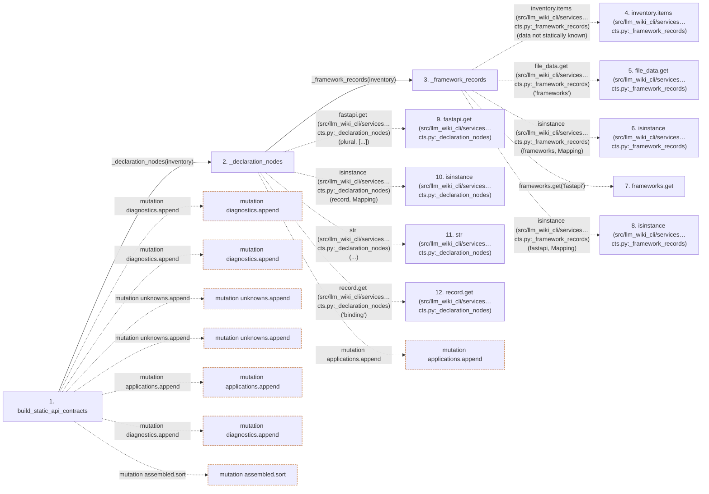

# build_static_api_contracts

**Entry point:** `build_static_api_contracts` (`api`)
**Source:** [api_contracts](../modules/api_contracts.md)
**Modules touched:** [api_contracts](../modules/api_contracts.md), [config](../modules/config.md), [imports](../modules/imports.md), [packages](../modules/packages.md), [python_imports](../modules/python_imports.md)

## Call sequence

```mermaid
sequenceDiagram
    participant p0 as build_static_api_contracts
    participant p1 as _declaration_nodes
    participant p2 as _framework_records
    participant p3 as inventory.items (src/llm_wiki_cli/services…cts.py:_framework_records)
    participant p4 as file_data.get (src/llm_wiki_cli/services…cts.py:_framework_records)
    participant p5 as isinstance (src/llm_wiki_cli/services…cts.py:_framework_records)
    participant p6 as frameworks.get
    participant p7 as fastapi.get (src/llm_wiki_cli/services…cts.py:_declaration_nodes)
    participant p8 as isinstance (src/llm_wiki_cli/services…cts.py:_declaration_nodes)
    participant p9 as str (src/llm_wiki_cli/services…cts.py:_declaration_nodes)
    participant p10 as record.get (src/llm_wiki_cli/services…cts.py:_declaration_nodes)
    participant p11 as _node_key (src/llm_wiki_cli/services/api_contracts.py)
    participant p12 as dict (src/llm_wiki_cli/services…cts.py:_declaration_nodes)
    participant p13 as applications.append (src/llm_wiki_cli/services…cts.py:_declaration_nodes)
    participant p14 as _candidate_scopes
    participant p15 as scope.split
    participant p16 as '.'.join
    participant p17 as range (src/llm_wiki_cli/services…acts.py:_candidate_scopes)
    participant p18 as len (src/llm_wiki_cli/services…acts.py:_candidate_scopes)
    p0->>p1: _declaration_nodes
    p1->>p2: _framework_records
    p2-->>p3: inventory.items (src/llm_wiki_cli/services…cts.py:_framework_records)
    p2-->>p4: file_data.get (src/llm_wiki_cli/services…cts.py:_framework_records)
    p2-->>p5: isinstance (src/llm_wiki_cli/services…cts.py:_framework_records)
    p2-->>p6: frameworks.get
    p2-->>p5: isinstance (src/llm_wiki_cli/services…cts.py:_framework_records)
    p1-->>p7: fastapi.get (src/llm_wiki_cli/services…cts.py:_declaration_nodes)
    p1-->>p8: isinstance (src/llm_wiki_cli/services…cts.py:_declaration_nodes)
    p1-->>p9: str (src/llm_wiki_cli/services…cts.py:_declaration_nodes)
    p1-->>p10: record.get (src/llm_wiki_cli/services…cts.py:_declaration_nodes)
    p1-->>p9: str (src/llm_wiki_cli/services…cts.py:_declaration_nodes)
    p1-->>p10: record.get (src/llm_wiki_cli/services…cts.py:_declaration_nodes)
    p1->>p11: _node_key (src/llm_wiki_cli/services/api_contracts.py)
    p1-->>p12: dict (src/llm_wiki_cli/services…cts.py:_declaration_nodes)
    p1-->>p13: applications.append (src/llm_wiki_cli/services…cts.py:_declaration_nodes)
    p1->>p2: _framework_records
    p1-->>p7: fastapi.get (src/llm_wiki_cli/services…cts.py:_declaration_nodes)
    p1-->>p8: isinstance (src/llm_wiki_cli/services…cts.py:_declaration_nodes)
    p1-->>p9: str (src/llm_wiki_cli/services…cts.py:_declaration_nodes)
    p1-->>p10: record.get (src/llm_wiki_cli/services…cts.py:_declaration_nodes)
    p1-->>p9: str (src/llm_wiki_cli/services…cts.py:_declaration_nodes)
    p1-->>p10: record.get (src/llm_wiki_cli/services…cts.py:_declaration_nodes)
    p1-->>p9: str (src/llm_wiki_cli/services…cts.py:_declaration_nodes)
    p1-->>p10: record.get (src/llm_wiki_cli/services…cts.py:_declaration_nodes)
    p1->>p14: _candidate_scopes
    p14-->>p15: scope.split
    p14-->>p16: '.'.join
    p14-->>p17: range (src/llm_wiki_cli/services…acts.py:_candidate_scopes)
    p14-->>p18: len (src/llm_wiki_cli/services…acts.py:_candidate_scopes)
```

<!-- Auto-generated from static call edges. Dashed arrows are external or unresolved calls. Reviewed runtime conditions and side effects belong in Behavior. -->

> Call sequence diagram shows 30 of 541 interactions; 511 omitted to keep the visualization within the 30-interaction and generated-diagram limits.

> Trace truncated at the depth limit; deeper calls are omitted.

## Data flow

<!-- Auto-generated static analysis. Treat values and boundaries as best-effort hints, not runtime proof. -->

### Step data

| Step | Inputs | Reads | Writes | Returns |
|---|---|---|---|---|
| `build_static_api_contracts` | `inventory: Mapping[str, Mapping[str, Any]]` | `Mapping`, `Mapping`, `_UNKNOWN`, `_UNKNOWN` | `config[...]`, `ids[...]`, `operation[...]` | `{...}` |
| `_declaration_nodes` | `inventory: Mapping[str, Mapping[str, Any]]` | `Mapping`, `Mapping` | `nodes[...]` | `(...)` |
| `_framework_records` | `inventory: Mapping[str, Mapping[str, Any]]` | `Mapping`, `Mapping` | - | - |
| `inventory.items (src/llm_wiki_cli/services…cts.py:_framework_records)` | - | - | - | - |
| `file_data.get (src/llm_wiki_cli/services…cts.py:_framework_records)` | - | - | - | - |
| `isinstance (src/llm_wiki_cli/services…cts.py:_framework_records)` | - | - | - | - |
| `frameworks.get` | - | - | - | - |
| `isinstance (src/llm_wiki_cli/services…cts.py:_framework_records)` | - | - | - | - |
| `fastapi.get (src/llm_wiki_cli/services…cts.py:_declaration_nodes)` | - | - | - | - |
| `isinstance (src/llm_wiki_cli/services…cts.py:_declaration_nodes)` | - | - | - | - |
| `str (src/llm_wiki_cli/services…cts.py:_declaration_nodes)` | - | - | - | - |
| `record.get (src/llm_wiki_cli/services…cts.py:_declaration_nodes)` | - | - | - | - |

### Call data

| From | To | Line | Call |
|---|---|---:|---|
| build_static_api_contracts | _declaration_nodes | 737 | `_declaration_nodes(inventory)` |
| _declaration_nodes | _framework_records | 229 | `_framework_records(inventory)` |
| _framework_records | inventory.items (src/llm_wiki_cli/services…cts.py:_framework_records) | 219 | `inventory.items(data not statically known)` |
| _framework_records | file_data.get (src/llm_wiki_cli/services…cts.py:_framework_records) | 220 | `file_data.get('frameworks')` |
| _framework_records | isinstance (src/llm_wiki_cli/services…cts.py:_framework_records) | 221 | `isinstance(frameworks, Mapping)` |
| _framework_records | frameworks.get | 221 | `frameworks.get('fastapi')` |
| _framework_records | isinstance (src/llm_wiki_cli/services…cts.py:_framework_records) | 222 | `isinstance(fastapi, Mapping)` |
| _declaration_nodes | fastapi.get (src/llm_wiki_cli/services…cts.py:_declaration_nodes) | 231 | `fastapi.get(plural, [...])` |
| _declaration_nodes | isinstance (src/llm_wiki_cli/services…cts.py:_declaration_nodes) | 232 | `isinstance(record, Mapping)` |
| _declaration_nodes | str (src/llm_wiki_cli/services…cts.py:_declaration_nodes) | 234 | `str(...)` |
| _declaration_nodes | record.get (src/llm_wiki_cli/services…cts.py:_declaration_nodes) | 234 | `record.get('binding')` |

### Boundary effects

| Kind | Target | Step | Line |
|---|---|---|---:|
| mutation | `diagnostics.append` | `build_static_api_contracts` | 756 |
| mutation | `diagnostics.append` | `build_static_api_contracts` | 793 |
| mutation | `unknowns.append` | `build_static_api_contracts` | 810 |
| mutation | `unknowns.append` | `build_static_api_contracts` | 819 |
| mutation | `applications.append` | `build_static_api_contracts` | 828 |
| mutation | `diagnostics.append` | `build_static_api_contracts` | 1137 |
| mutation | `assembled.sort` | `build_static_api_contracts` | 1155 |
| mutation | `applications.append` | `_declaration_nodes` | 241 |

### Static analysis gaps

| Kind | Step | Target | Line |
|---|---|---|---:|
| unresolved_call | `_framework_records` | `inventory.items` | 219 |
| unresolved_call | `_framework_records` | `file_data.get` | 220 |
| external_call | `_framework_records` | `isinstance` | 221 |
| unresolved_call | `_framework_records` | `frameworks.get` | 221 |
| external_call | `_framework_records` | `isinstance` | 222 |
| unresolved_call | `_declaration_nodes` | `fastapi.get` | 231 |
| external_call | `_declaration_nodes` | `isinstance` | 232 |
| unresolved_call | `_declaration_nodes` | `record.get` | 234 |
| step_limit | `build_static_api_contracts` | `first 12 steps` | 0 |
| truncated_flow | `build_static_api_contracts` | `depth limit` | 0 |

## Behavior

This flow starts at `build_static_api_contracts` and is classified as `api`. The generated call and data-flow sections are bounded static projections; runtime conditions and side effects require source-level confirmation.
