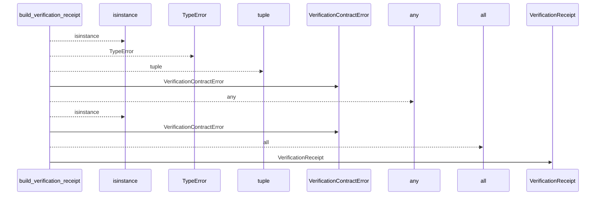
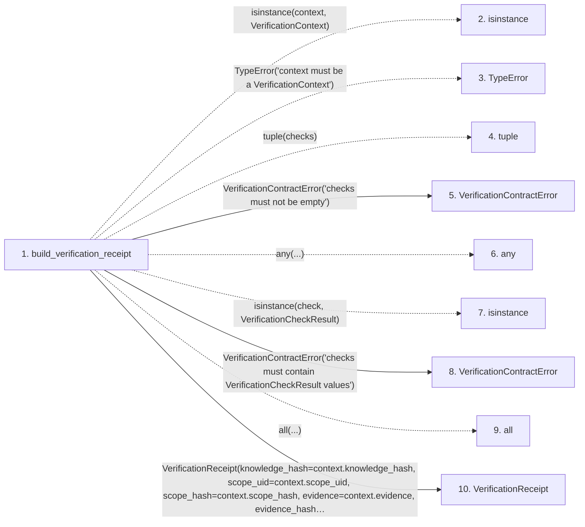

# build_verification_receipt

**Entry point:** `build_verification_receipt` (`api`)
**Source:** [verification_contracts](../modules/verification_contracts.md)
**Modules touched:** [verification_contracts](../modules/verification_contracts.md)

## Call sequence

<!-- Auto-generated from static call edges. Dashed arrows are external or unresolved calls. Reviewed runtime conditions and side effects belong in Behavior. -->

## Data flow

<!-- Auto-generated static analysis. Treat values and boundaries as best-effort hints, not runtime proof. -->

### Step data

| Step | Inputs | Reads | Writes | Returns |
|---|---|---|---|---|
| `build_verification_receipt` | `context: VerificationContext`, `checks: Sequence[VerificationCheckResult]` | `VerificationContext`, `VerificationCheckResult`, `VerificationResult`, `VerificationResult`, `VerificationResult` | - | `VerificationReceipt(...)` |
| `isinstance` | - | - | - | - |
| `TypeError` | - | - | - | - |
| `tuple` | - | - | - | - |
| `VerificationContractError` | - | - | - | - |
| `any` | - | - | - | - |
| `isinstance` | - | - | - | - |
| `VerificationContractError` | - | - | - | - |
| `all` | - | - | - | - |
| `VerificationReceipt` | - | - | - | - |

### Call data

| From | To | Line | Call |
|---|---|---:|---|
| build_verification_receipt | isinstance | 731 | `isinstance(context, VerificationContext)` |
| build_verification_receipt | TypeError | 732 | `TypeError('context must be a VerificationContext')` |
| build_verification_receipt | tuple | 733 | `tuple(checks)` |
| build_verification_receipt | VerificationContractError | 735 | `VerificationContractError('checks must not be empty')` |
| build_verification_receipt | any | 736 | `any(...)` |
| build_verification_receipt | isinstance | 737 | `isinstance(check, VerificationCheckResult)` |
| build_verification_receipt | VerificationContractError | 740 | `VerificationContractError('checks must contain VerificationCheckResult values')` |
| build_verification_receipt | all | 745 | `all(...)` |
| build_verification_receipt | VerificationReceipt | 751 | `VerificationReceipt(knowledge_hash=context.knowledge_hash, scope_uid=context.scope_uid, scope_hash=context.scope_hash, evidence=context.evidence, evidence_hash=context.evidence_hash, evaluated_snapshot=context.evaluated_snapshot, snapshot_hash=context.snapshot_hash, result=result, checks=normalized_checks)` |

### Boundary effects

*No boundary effects detected.*

### Static analysis gaps

| Kind | Step | Target | Line |
|---|---|---|---:|
| unresolved_call | `build_verification_receipt` | `isinstance` | 731 |
| unresolved_call | `build_verification_receipt` | `TypeError` | 732 |
| unresolved_call | `build_verification_receipt` | `any` | 736 |
| unresolved_call | `build_verification_receipt` | `isinstance` | 737 |
| unresolved_call | `build_verification_receipt` | `all` | 745 |

## Behavior

This flow starts at `build_verification_receipt` and is classified as `api`. The generated call and data-flow sections are bounded static projections; runtime conditions and side effects require source-level confirmation.
