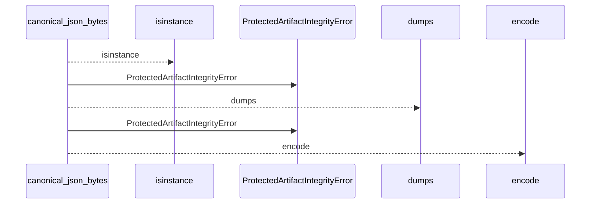
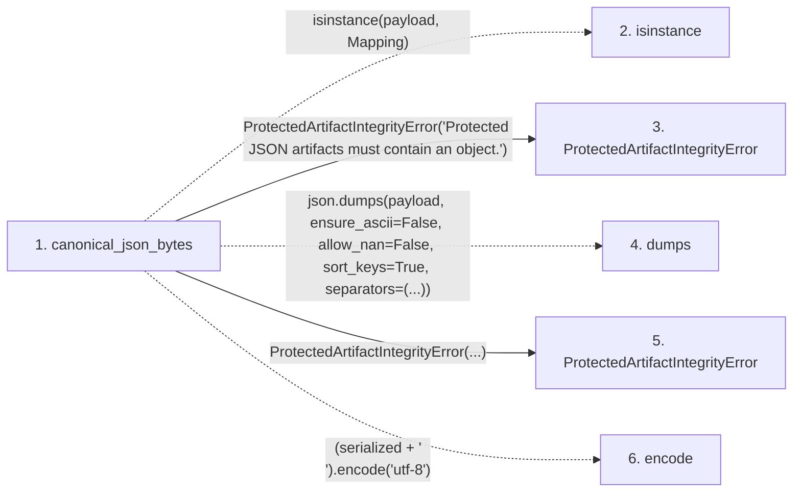

# canonical_json_bytes

**Entry point:** `canonical_json_bytes` (`api`)
**Source:** [protected_artifacts](../modules/protected_artifacts.md)
**Modules touched:** [protected_artifacts](../modules/protected_artifacts.md)

## Call sequence

<!-- Auto-generated from static call edges. Dashed arrows are external or unresolved calls. Reviewed runtime conditions and side effects belong in Behavior. -->

## Data flow

<!-- Auto-generated static analysis. Treat values and boundaries as best-effort hints, not runtime proof. -->

### Step data

| Step | Inputs | Reads | Writes | Returns |
|---|---|---|---|---|
| `canonical_json_bytes` | `payload: Mapping[str, Any]` | `Mapping` | - | `...` |
| `isinstance` | - | - | - | - |
| `ProtectedArtifactIntegrityError` | - | - | - | - |
| `dumps` | - | - | - | - |
| `ProtectedArtifactIntegrityError` | - | - | - | - |
| `encode` | - | - | - | - |

### Call data

| From | To | Line | Call |
|---|---|---:|---|
| canonical_json_bytes | isinstance | 130 | `isinstance(payload, Mapping)` |
| canonical_json_bytes | ProtectedArtifactIntegrityError | 131 | `ProtectedArtifactIntegrityError('Protected JSON artifacts must contain an object.')` |
| canonical_json_bytes | dumps | 135 | `json.dumps(payload, ensure_ascii=False, allow_nan=False, sort_keys=True, separators=(...))` |
| canonical_json_bytes | ProtectedArtifactIntegrityError | 143 | `ProtectedArtifactIntegrityError(...)` |
| canonical_json_bytes | encode | 146 | `(serialized + '\n').encode('utf-8')` |

### Boundary effects

*No boundary effects detected.*

### Static analysis gaps

| Kind | Step | Target | Line |
|---|---|---|---:|
| unresolved_call | `canonical_json_bytes` | `isinstance` | 130 |
| external_call | `canonical_json_bytes` | `json.dumps` | 135 |
| unresolved_call | `canonical_json_bytes` | `(serialized + '\n').encode` | 146 |

## Behavior

This flow starts at `canonical_json_bytes` and is classified as `api`. The generated call and data-flow sections are bounded static projections; runtime conditions and side effects require source-level confirmation.
