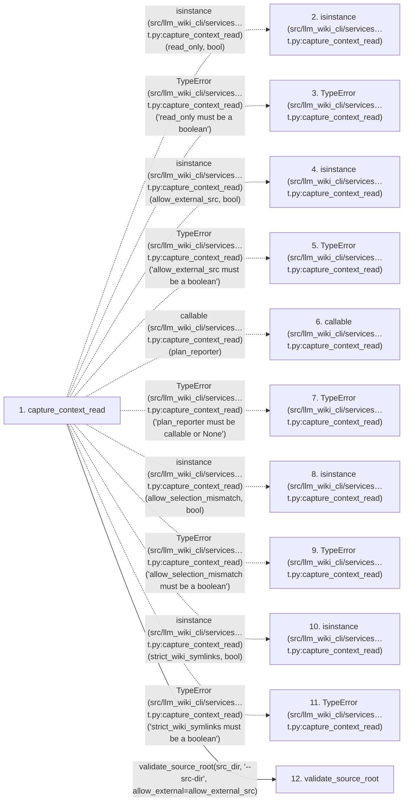

# capture_context_read

**Entry point:** `capture_context_read` (`api`)
**Source:** [context_packet](../modules/context_packet.md)
**Modules touched:** [canonical_json](../modules/canonical_json.md), [common](../modules/common.md), [config](../modules/config.md), [context_packet](../modules/context_packet.md), and 53 more

**Complete modules touched:**

- [canonical_json](../modules/canonical_json.md)
- [common](../modules/common.md)
- [config](../modules/config.md)
- [context_packet](../modules/context_packet.md)
- [context_service](../modules/context_service.md)
- [data_flow](../modules/data_flow.md)
- [dependency_versions](../modules/dependency_versions.md)
- [documentation_queries](../modules/documentation_queries.md)
- [documentation_query_builder](../modules/documentation_query_builder.md)
- [entrypoints](../modules/entrypoints.md)
- [extraction_jobs](../modules/extraction_jobs.md)
- [extraction_service](../modules/extraction_service.md)
- [filesystem_guard](../modules/filesystem_guard.md)
- [go_calls](../modules/go_calls.md)
- [immutable](../modules/immutable.md)
- [imports](../modules/imports.md)
- [infrastructure_inventory](../modules/infrastructure_inventory.md)
- [infrastructure_sync](../modules/infrastructure_sync.md)
- [inventory_cache](../modules/inventory_cache.md)
- [io](../modules/io.md)
- [knowledge_artifacts](../modules/knowledge_artifacts.md)
- [knowledge_consumption](../modules/knowledge_consumption.md)
- [knowledge_envelope](../modules/knowledge_envelope.md)
- [knowledge_evidence](../modules/knowledge_evidence.md)
- [knowledge_freshness](../modules/knowledge_freshness.md)
- [knowledge_generation](../modules/knowledge_generation.md)
- [knowledge_governance](../modules/knowledge_governance.md)
- [knowledge_graph](../modules/knowledge_graph.md)
- [knowledge_index](../modules/knowledge_index.md)
- [knowledge_loader](../modules/knowledge_loader.md)
- [knowledge_model](../modules/knowledge_model.md)
- [knowledge_orchestration](../modules/knowledge_orchestration.md)
- [knowledge_packs](../modules/knowledge_packs.md)
- [knowledge_reuse](../modules/knowledge_reuse.md)
- [knowledge_storage](../modules/knowledge_storage.md)
- [knowledge_storage_io](../modules/knowledge_storage_io.md)
- [knowledge_verification](../modules/knowledge_verification.md)
- [manifest_storage](../modules/manifest_storage.md)
- [packages](../modules/packages.md)
- [paths](../modules/paths.md)
- [plugins](../modules/plugins.md)
- [progress](../modules/progress.md)
- [python_calls](../modules/python_calls.md)
- [python_contracts](../modules/python_contracts.md)
- [python_imports](../modules/python_imports.md)
- [python_observations](../modules/python_observations.md)
- [resource_diagnostics](../modules/resource_diagnostics.md)
- [section_ownership](../modules/section_ownership.md)
- [services_dependencies](../modules/services_dependencies.md)
- [source_selection](../modules/source_selection.md)
- [source_snapshot](../modules/source_snapshot.md)
- [sync_manifest](../modules/sync_manifest.md)
- [validation](../modules/validation.md)
- [verification_contracts](../modules/verification_contracts.md)
- [wiki_media](../modules/wiki_media.md)
- [wiki_surface](../modules/wiki_surface.md)
- [wiki_surface_index](../modules/wiki_surface_index.md)

## Call sequence

```mermaid
sequenceDiagram
    participant p0 as capture_context_read
    participant p1 as isinstance (src/llm_wiki_cli/services…t.py:capture_context_read)
    participant p2 as TypeError (src/llm_wiki_cli/services…t.py:capture_context_read)
    participant p3 as callable (src/llm_wiki_cli/services…t.py:capture_context_read)
    participant p4 as validate_source_root
    participant p5 as validate_path
    participant p6 as PathValidationError
    participant p7 as (…).resolve (src/llm_wiki_cli/config.py:validate_path)
    participant p8 as Path.cwd (src/llm_wiki_cli/config.py:validate_path)
    participant p9 as Path.cwd().resolve (src/llm_wiki_cli/config.py:validate_path)
    participant p10 as resolved.relative_to (src/llm_wiki_cli/config.py:validate_path)
    participant p11 as Path(…).expanduser
    participant p12 as Path (src/llm_wiki_cli/config.py:validate_source_root)
    participant p13 as candidate.is_absolute (src/llm_wiki_cli/config.py:validate_source_root)
    participant p14 as Path.cwd (src/llm_wiki_cli/config.py:validate_source_root)
    participant p15 as candidate.resolve (src/llm_wiki_cli/config.py:validate_source_root)
    participant p16 as resolved.is_dir
    participant p17 as os.path.abspath (src/llm_wiki_cli/config.py:validate_source_root)
    participant p18 as windows_current_user_sid
    p0-->>p1: isinstance (src/llm_wiki_cli/services…t.py:capture_context_read)
    p0-->>p2: TypeError (src/llm_wiki_cli/services…t.py:capture_context_read)
    p0-->>p1: isinstance (src/llm_wiki_cli/services…t.py:capture_context_read)
    p0-->>p2: TypeError (src/llm_wiki_cli/services…t.py:capture_context_read)
    p0-->>p3: callable (src/llm_wiki_cli/services…t.py:capture_context_read)
    p0-->>p2: TypeError (src/llm_wiki_cli/services…t.py:capture_context_read)
    p0-->>p1: isinstance (src/llm_wiki_cli/services…t.py:capture_context_read)
    p0-->>p2: TypeError (src/llm_wiki_cli/services…t.py:capture_context_read)
    p0-->>p1: isinstance (src/llm_wiki_cli/services…t.py:capture_context_read)
    p0-->>p2: TypeError (src/llm_wiki_cli/services…t.py:capture_context_read)
    p0->>p4: validate_source_root
    p4->>p5: validate_path
    p5->>p6: PathValidationError
    p5-->>p7: (…).resolve (src/llm_wiki_cli/config.py:validate_path)
    p5-->>p8: Path.cwd (src/llm_wiki_cli/config.py:validate_path)
    p5-->>p9: Path.cwd().resolve (src/llm_wiki_cli/config.py:validate_path)
    p5-->>p8: Path.cwd (src/llm_wiki_cli/config.py:validate_path)
    p5-->>p10: resolved.relative_to (src/llm_wiki_cli/config.py:validate_path)
    p5->>p6: PathValidationError
    p4-->>p11: Path(…).expanduser
    p4-->>p12: Path (src/llm_wiki_cli/config.py:validate_source_root)
    p4-->>p13: candidate.is_absolute (src/llm_wiki_cli/config.py:validate_source_root)
    p4-->>p14: Path.cwd (src/llm_wiki_cli/config.py:validate_source_root)
    p4-->>p15: candidate.resolve (src/llm_wiki_cli/config.py:validate_source_root)
    p4->>p6: PathValidationError
    p4-->>p16: resolved.is_dir
    p4->>p6: PathValidationError
    p4-->>p12: Path (src/llm_wiki_cli/config.py:validate_source_root)
    p4-->>p17: os.path.abspath (src/llm_wiki_cli/config.py:validate_source_root)
    p4->>p18: windows_current_user_sid
```

<!-- Auto-generated from static call edges. Dashed arrows are external or unresolved calls. Reviewed runtime conditions and side effects belong in Behavior. -->

> Call sequence diagram shows 30 of 4670 interactions; 4640 omitted to keep the visualization within the 30-interaction and generated-diagram limits.

> Trace truncated at the depth limit; deeper calls are omitted.

## Data flow

<!-- Auto-generated static analysis. Treat values and boundaries as best-effort hints, not runtime proof. -->

### Step data

| Step | Inputs | Reads | Writes | Returns |
|---|---|---|---|---|
| `capture_context_read` | `src_dir: str`, `wiki_dir: str`, `allow_external_src: bool`, `read_only: bool`, `job_request: ExtractionJobRequest \| None`, `plan_reporter: Callable[[ExtractionJobPlan], None] \| None`, `source_selection: str \| Path \| None`, `allow_selection_mismatch: bool` | `PathValidationError`, `DocumentationQueryError`, `context_service`, `os`, `InventoryResult`, `SourceSnapshot`, `DocumentationQueryError`, `DocumentationQueryError` | `capture_options[...]`, `capture_options[...]`, `capture_options[...]`, `capture_options[...]`, `capture_options[...]`, `wiki_options[...]`, `wiki_options[...]`, `wiki_check_options[...]` | `CapturedContextRead(...)` |
| `isinstance (src/llm_wiki_cli/services…t.py:capture_context_read)` | - | - | - | - |
| `TypeError (src/llm_wiki_cli/services…t.py:capture_context_read)` | - | - | - | - |
| `isinstance (src/llm_wiki_cli/services…t.py:capture_context_read)` | - | - | - | - |
| `TypeError (src/llm_wiki_cli/services…t.py:capture_context_read)` | - | - | - | - |
| `callable (src/llm_wiki_cli/services…t.py:capture_context_read)` | - | - | - | - |
| `TypeError (src/llm_wiki_cli/services…t.py:capture_context_read)` | - | - | - | - |
| `isinstance (src/llm_wiki_cli/services…t.py:capture_context_read)` | - | - | - | - |
| `TypeError (src/llm_wiki_cli/services…t.py:capture_context_read)` | - | - | - | - |
| `isinstance (src/llm_wiki_cli/services…t.py:capture_context_read)` | - | - | - | - |
| `TypeError (src/llm_wiki_cli/services…t.py:capture_context_read)` | - | - | - | - |
| `validate_source_root` | `path: str`, `label: str`, `allow_external: bool` | `sys`, `os`, `WindowsSecurityGuardError`, `sys` | - | `validate_path(...)`, `resolved` |

### Call data

| From | To | Line | Call |
|---|---|---:|---|
| capture_context_read | isinstance (src/llm_wiki_cli/services…t.py:capture_context_read) | 755 | `isinstance(read_only, bool)` |
| capture_context_read | TypeError (src/llm_wiki_cli/services…t.py:capture_context_read) | 756 | `TypeError('read_only must be a boolean')` |
| capture_context_read | isinstance (src/llm_wiki_cli/services…t.py:capture_context_read) | 757 | `isinstance(allow_external_src, bool)` |
| capture_context_read | TypeError (src/llm_wiki_cli/services…t.py:capture_context_read) | 758 | `TypeError('allow_external_src must be a boolean')` |
| capture_context_read | callable (src/llm_wiki_cli/services…t.py:capture_context_read) | 759 | `callable(plan_reporter)` |
| capture_context_read | TypeError (src/llm_wiki_cli/services…t.py:capture_context_read) | 760 | `TypeError('plan_reporter must be callable or None')` |
| capture_context_read | isinstance (src/llm_wiki_cli/services…t.py:capture_context_read) | 761 | `isinstance(allow_selection_mismatch, bool)` |
| capture_context_read | TypeError (src/llm_wiki_cli/services…t.py:capture_context_read) | 762 | `TypeError('allow_selection_mismatch must be a boolean')` |
| capture_context_read | isinstance (src/llm_wiki_cli/services…t.py:capture_context_read) | 763 | `isinstance(strict_wiki_symlinks, bool)` |
| capture_context_read | TypeError (src/llm_wiki_cli/services…t.py:capture_context_read) | 764 | `TypeError('strict_wiki_symlinks must be a boolean')` |
| capture_context_read | validate_source_root | 769 | `context_service.validate_source_root(src_dir, '--src-dir', allow_external=allow_external_src)` |

### Boundary effects

*No boundary effects detected.*

### Static analysis gaps

| Kind | Step | Target | Line |
|---|---|---|---:|
| external_call | `capture_context_read` | `isinstance` | 755 |
| external_call | `capture_context_read` | `TypeError` | 756 |
| external_call | `capture_context_read` | `isinstance` | 757 |
| external_call | `capture_context_read` | `TypeError` | 758 |
| external_call | `capture_context_read` | `callable` | 759 |
| external_call | `capture_context_read` | `TypeError` | 760 |
| external_call | `capture_context_read` | `isinstance` | 761 |
| external_call | `capture_context_read` | `TypeError` | 762 |
| external_call | `capture_context_read` | `isinstance` | 763 |
| external_call | `capture_context_read` | `TypeError` | 764 |
| step_limit | `capture_context_read` | `first 12 steps` | 0 |
| truncated_flow | `capture_context_read` | `depth limit` | 0 |

## Behavior

This flow starts at `capture_context_read` and is classified as `api`. The generated call and data-flow sections are bounded static projections; runtime conditions and side effects require source-level confirmation.
