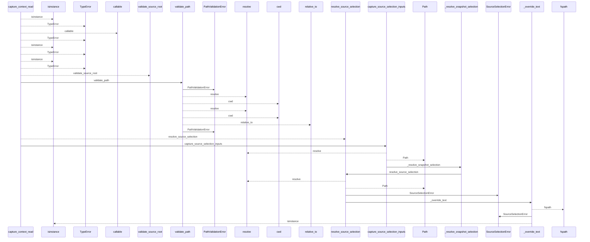
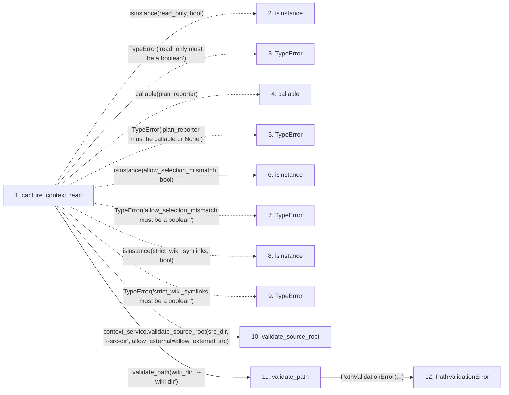

# capture_context_read

**Entry point:** `capture_context_read` (`api`)
**Source:** [context_packet](../modules/context_packet.md)
**Modules touched:** [common](../modules/common.md), [config](../modules/config.md), [context_packet](../modules/context_packet.md), [dependency_versions](../modules/dependency_versions.md), and 13 more

**Complete modules touched:**

- [common](../modules/common.md)
- [config](../modules/config.md)
- [context_packet](../modules/context_packet.md)
- [dependency_versions](../modules/dependency_versions.md)
- [documentation_queries](../modules/documentation_queries.md)
- [documentation_query_builder](../modules/documentation_query_builder.md)
- [imports](../modules/imports.md)
- [knowledge_evidence](../modules/knowledge_evidence.md)
- [paths](../modules/paths.md)
- [plugins](../modules/plugins.md)
- [services_dependencies](../modules/services_dependencies.md)
- [source_selection](../modules/source_selection.md)
- [source_snapshot](../modules/source_snapshot.md)
- [validation](../modules/validation.md)
- [wiki_media](../modules/wiki_media.md)
- [wiki_surface](../modules/wiki_surface.md)
- [wiki_surface_index](../modules/wiki_surface_index.md)

## Call sequence

<!-- Auto-generated from static call edges. Dashed arrows are external or unresolved calls. Reviewed runtime conditions and side effects belong in Behavior. -->

> Call sequence diagram shows 30 of 1517 interactions; 1487 omitted to keep the visualization within the 30-interaction and generated-diagram limits.

> Trace truncated at the depth limit; deeper calls are omitted.

## Data flow

<!-- Auto-generated static analysis. Treat values and boundaries as best-effort hints, not runtime proof. -->

### Step data

| Step | Inputs | Reads | Writes | Returns |
|---|---|---|---|---|
| `capture_context_read` | `src_dir: str`, `wiki_dir: str`, `allow_external_src: bool`, `read_only: bool`, `job_request: ExtractionJobRequest \| None`, `plan_reporter: Callable[[ExtractionJobPlan], None] \| None`, `source_selection: str \| Path \| None`, `allow_selection_mismatch: bool` | `PathValidationError`, `DocumentationQueryError`, `context_service`, `InventoryResult`, `SourceSnapshot`, `DocumentationQueryError`, `DocumentationQueryError`, `wiki_surface` | - | `CapturedContextRead(...)` |
| `isinstance` | - | - | - | - |
| `TypeError` | - | - | - | - |
| `callable` | - | - | - | - |
| `TypeError` | - | - | - | - |
| `isinstance` | - | - | - | - |
| `TypeError` | - | - | - | - |
| `isinstance` | - | - | - | - |
| `TypeError` | - | - | - | - |
| `validate_source_root` | - | - | - | - |
| `validate_path` | `path: str`, `label: str` | - | - | `resolved` |
| `PathValidationError` | - | - | - | - |

### Call data

| From | To | Line | Call |
|---|---|---:|---|
| capture_context_read | isinstance | 624 | `isinstance(read_only, bool)` |
| capture_context_read | TypeError | 625 | `TypeError('read_only must be a boolean')` |
| capture_context_read | callable | 626 | `callable(plan_reporter)` |
| capture_context_read | TypeError | 627 | `TypeError('plan_reporter must be callable or None')` |
| capture_context_read | isinstance | 628 | `isinstance(allow_selection_mismatch, bool)` |
| capture_context_read | TypeError | 629 | `TypeError('allow_selection_mismatch must be a boolean')` |
| capture_context_read | isinstance | 630 | `isinstance(strict_wiki_symlinks, bool)` |
| capture_context_read | TypeError | 631 | `TypeError('strict_wiki_symlinks must be a boolean')` |
| capture_context_read | validate_source_root | 636 | `context_service.validate_source_root(src_dir, '--src-dir', allow_external=allow_external_src)` |
| capture_context_read | validate_path | 641 | `validate_path(wiki_dir, '--wiki-dir')` |
| validate_path | PathValidationError | 132 | `PathValidationError(...)` |

### Boundary effects

*No boundary effects detected.*

### Static analysis gaps

| Kind | Step | Target | Line |
|---|---|---|---:|
| unresolved_call | `capture_context_read` | `isinstance` | 624 |
| unresolved_call | `capture_context_read` | `TypeError` | 625 |
| unresolved_call | `capture_context_read` | `callable` | 626 |
| unresolved_call | `capture_context_read` | `TypeError` | 627 |
| unresolved_call | `capture_context_read` | `isinstance` | 628 |
| unresolved_call | `capture_context_read` | `TypeError` | 629 |
| unresolved_call | `capture_context_read` | `isinstance` | 630 |
| unresolved_call | `capture_context_read` | `TypeError` | 631 |
| external_call | `capture_context_read` | `context_service.validate_source_root` | 636 |
| step_limit | `capture_context_read` | `first 12 steps` | 0 |
| truncated_flow | `capture_context_read` | `depth limit` | 0 |

## Behavior

This flow starts at `capture_context_read` and is classified as `api`. The generated call and data-flow sections are bounded static projections; runtime conditions and side effects require source-level confirmation.
