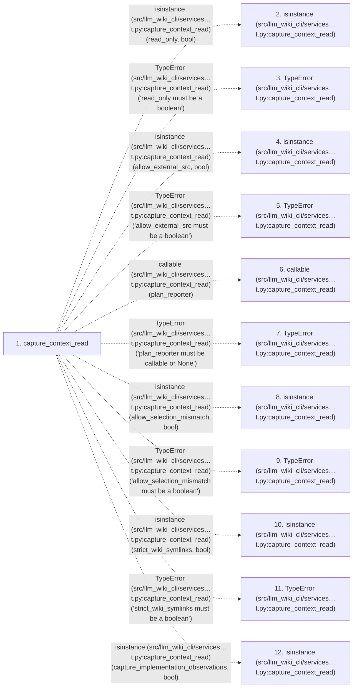

# capture_context_read

**Entry point:** `capture_context_read` (`api`)
**Source:** [context_packet](../modules/context_packet.md)
**Modules touched:** [analysis_capture](../modules/analysis_capture.md), [analysis_compatibility](../modules/analysis_compatibility.md), [bootstrap_recovery](../modules/bootstrap_recovery.md), [common](../modules/common.md), and 63 more

**Complete modules touched:**

- [analysis_capture](../modules/analysis_capture.md)
- [analysis_compatibility](../modules/analysis_compatibility.md)
- [bootstrap_recovery](../modules/bootstrap_recovery.md)
- [common](../modules/common.md)
- [config](../modules/config.md)
- [context_packet](../modules/context_packet.md)
- [context_service](../modules/context_service.md)
- [data_flow](../modules/data_flow.md)
- [dependency_versions](../modules/dependency_versions.md)
- [documentation_queries](../modules/documentation_queries.md)
- [documentation_query_builder](../modules/documentation_query_builder.md)
- [entrypoints](../modules/entrypoints.md)
- [extraction_service](../modules/extraction_service.md)
- [filesystem_guard](../modules/filesystem_guard.md)
- [go_calls](../modules/go_calls.md)
- [immutable](../modules/immutable.md)
- [implementation_evidence](../modules/implementation_evidence.md)
- [imports](../modules/imports.md)
- [infrastructure_inventory](../modules/infrastructure_inventory.md)
- [infrastructure_sync](../modules/infrastructure_sync.md)
- [io](../modules/io.md)
- [knowledge_artifacts](../modules/knowledge_artifacts.md)
- [knowledge_consumption](../modules/knowledge_consumption.md)
- [knowledge_envelope](../modules/knowledge_envelope.md)
- [knowledge_evidence](../modules/knowledge_evidence.md)
- [knowledge_freshness](../modules/knowledge_freshness.md)
- [knowledge_generation](../modules/knowledge_generation.md)
- [knowledge_governance](../modules/knowledge_governance.md)
- [knowledge_graph](../modules/knowledge_graph.md)
- [knowledge_index](../modules/knowledge_index.md)
- [knowledge_loader](../modules/knowledge_loader.md)
- [knowledge_model](../modules/knowledge_model.md)
- [knowledge_orchestration](../modules/knowledge_orchestration.md)
- [knowledge_packs](../modules/knowledge_packs.md)
- [knowledge_reuse](../modules/knowledge_reuse.md)
- [knowledge_storage](../modules/knowledge_storage.md)
- [knowledge_storage_io](../modules/knowledge_storage_io.md)
- [knowledge_verification](../modules/knowledge_verification.md)
- [maintenance_evidence](../modules/maintenance_evidence.md)
- [maintenance_projection](../modules/maintenance_projection.md)
- [maintenance_protocol](../modules/maintenance_protocol.md)
- [maintenance_service](../modules/maintenance_service.md)
- [maintenance_shapes](../modules/maintenance_shapes.md)
- [maintenance_state](../modules/maintenance_state.md)
- [maintenance_status](../modules/maintenance_status.md)
- [manifest_storage](../modules/manifest_storage.md)
- [markdown_sections](../modules/markdown_sections.md)
- [normalization_diagnostics](../modules/normalization_diagnostics.md)
- [paths](../modules/paths.md)
- [plugins](../modules/plugins.md)
- [python_bindings](../modules/python_bindings.md)
- [python_calls](../modules/python_calls.md)
- [python_implementation](../modules/python_implementation.md)
- [python_imports](../modules/python_imports.md)
- [section_ownership](../modules/section_ownership.md)
- [services_dependencies](../modules/services_dependencies.md)
- [source_retirement](../modules/source_retirement.md)
- [source_selection](../modules/source_selection.md)
- [source_snapshot](../modules/source_snapshot.md)
- [sync_manifest](../modules/sync_manifest.md)
- [validation](../modules/validation.md)
- [verification_contracts](../modules/verification_contracts.md)
- [wiki_media](../modules/wiki_media.md)
- [wiki_surface](../modules/wiki_surface.md)
- [wiki_surface_index](../modules/wiki_surface_index.md)
- [yaml_formats](../modules/yaml_formats.md)
- [yaml_syntax](../modules/yaml_syntax.md)

## Call sequence

> Static overview in presentation order, not runtime execution order. Arrows retain captured callers; representative internal continuations and boundary examples precede repeated helper detail.

<!-- Auto-generated from static call edges. Dashed arrows are external or unresolved calls. Reviewed runtime conditions and side effects belong in Behavior. -->

```mermaid
sequenceDiagram
    participant p0 as capture_context_read
    participant p1 as validate_source_root
    participant p2 as guard_maintenance_owner
    participant p3 as resolve_source_selection
    participant p4 as capture_source_selection_inputs
    participant p5 as validate_live_query_source_selection
    participant p6 as build_source_snapshot
    participant p7 as _guard_windows_inputs
    participant p8 as _assert_source_unchanged
    participant p9 as retained_empty_module_paths_from_wiki
    participant p10 as _assert_source_inputs_unchanged
    participant p11 as _wiki_anchor
    participant p12 as get_entry_points
    participant p13 as read_console_scripts
    participant p14 as resolve_call_edges
    participant p15 as build_flow
    participant p16 as build_data_flow_context
    participant p17 as analyze_data_flow
    participant p18 as evaluate_surface_index
    participant p19 as _build_context_knowledge_view
    participant p20 as analyze_dependencies
    participant p21 as _assert_wiki_unchanged
    participant p22 as _selected_git_changed_files
    participant p23 as _freeze_json
    participant p24 as attach_maintenance_status
    participant p25 as validate_path
    participant p26 as ContextPacketUnavailableError
    participant p27 as ContextPacketAuthorityError
    participant p28 as KnowledgeLoadIssue
    participant p29 as isinstance (src/llm_wiki_cli/services…t.py:capture_context_read)
    participant p30 as source_root.is_dir (src/llm_wiki_cli/services…t.py:capture_context_read)
    p0->>p1: validate_source_root
    p0->>p2: guard_maintenance_owner
    p0->>p3: resolve_source_selection
    p0->>p4: capture_source_selection_inputs
    p0->>p5: validate_live_query_source_selection
    p0->>p6: build_source_snapshot
    p0->>p7: _guard_windows_inputs
    p0->>p8: _assert_source_unchanged
    p0->>p9: retained_empty_module_paths_from_wiki
    p0->>p10: _assert_source_inputs_unchanged
    p0->>p11: _wiki_anchor
    p0->>p12: get_entry_points
    p0->>p13: read_console_scripts
    p0->>p14: resolve_call_edges
    p0->>p15: build_flow
    p0->>p16: build_data_flow_context
    p0->>p17: analyze_data_flow
    p0->>p18: evaluate_surface_index
    p0->>p19: _build_context_knowledge_view
    p0->>p20: analyze_dependencies
    p0->>p21: _assert_wiki_unchanged
    p0->>p22: _selected_git_changed_files
    p0->>p23: _freeze_json
    p0->>p24: attach_maintenance_status
    p0->>p25: validate_path
    p0->>p26: ContextPacketUnavailableError
    p0->>p27: ContextPacketAuthorityError
    p0->>p28: KnowledgeLoadIssue
    p0-->>p29: isinstance (src/llm_wiki_cli/services…t.py:capture_context_read)(read_only, bool)
    p0-->>p30: source_root.is_dir (src/llm_wiki_cli/services…t.py:capture_context_read)
```

> Call sequence diagram shows 30 of 5342 interactions; 5312 omitted to keep the visualization within the 30-interaction and generated-diagram limits, with uncertain identities omitted rather than inferred.

> Captured boundary calls: external 1 of 1714 (1713 omitted); unresolved 1 of 1727 (1726 omitted). These counts cover the captured static trace.

Omitted captured detail, grouped by actual caller occurrence and target module:

| Caller | Parent step | Target module | Kind | Omitted interactions |
| --- | --- | --- | --- | --- |
| `src/llm_wiki_cli/services/context_packet.py:capture_context_read` | 1 | - | external | 36 |
| `src/llm_wiki_cli/config.py:validate_source_root` | 14 | [src/llm_wiki_cli/config.py](../modules/config.md) | internal | 7 |
| `src/llm_wiki_cli/config.py:validate_path` | 15 | [src/llm_wiki_cli/config.py](../modules/config.md) | internal | 2 |
| `src/llm_wiki_cli/config.py:validate_path` | 15 | - | unresolved | 3 |
| `src/llm_wiki_cli/config.py:validate_path` | 15 | - | external | 2 |
| `src/llm_wiki_cli/config.py:validate_source_root` | 14 | - | unresolved | 5 |
| `src/llm_wiki_cli/config.py:validate_source_root` | 14 | - | external | 11 |
| `src/llm_wiki_cli/config.py:validate_source_root` | 14 | [src/llm_wiki_cli/services/filesystem_guard.py](../modules/filesystem_guard.md) | internal | 1 |
> Omission summary shows 8 of 1339 groups; 1331 further groups are not expanded here. Counts above include all omitted interactions.
> Detailed flow queries retain their own coverage and limits; omitted paths may execute at runtime.

> Trace truncated at the depth limit; deeper calls are omitted.

## Data flow

<!-- Auto-generated static analysis. Treat values and boundaries as best-effort hints, not runtime proof. -->

```mermaid
flowchart LR
    s1["1. capture_context_read"]
    s2["2. isinstance (src/llm_wiki_cli/services…t.py:capture_context_read)"]
    s3["3. TypeError (src/llm_wiki_cli/services…t.py:capture_context_read)"]
    s4["4. isinstance (src/llm_wiki_cli/services…t.py:capture_context_read)"]
    s5["5. TypeError (src/llm_wiki_cli/services…t.py:capture_context_read)"]
    s6["6. callable (src/llm_wiki_cli/services…t.py:capture_context_read)"]
    s7["7. TypeError (src/llm_wiki_cli/services…t.py:capture_context_read)"]
    s8["8. isinstance (src/llm_wiki_cli/services…t.py:capture_context_read)"]
    s9["9. TypeError (src/llm_wiki_cli/services…t.py:capture_context_read)"]
    s10["10. isinstance (src/llm_wiki_cli/services…t.py:capture_context_read)"]
    s11["11. TypeError (src/llm_wiki_cli/services…t.py:capture_context_read)"]
    s12["12. isinstance (src/llm_wiki_cli/services…t.py:capture_context_read)"]
    s1 -. "isinstance (src/llm_wiki_cli/services…t.py:capture_context_read)(read_only, bool)" .-> s2
    s1 -. "TypeError (src/llm_wiki_cli/services…t.py:capture_context_read)('read_only must be a boolean')" .-> s3
    s1 -. "isinstance (src/llm_wiki_cli/services…t.py:capture_context_read)(allow_external_src, bool)" .-> s4
    s1 -. "TypeError (src/llm_wiki_cli/services…t.py:capture_context_read)('allow_external_src must be a boolean')" .-> s5
    s1 -. "callable (src/llm_wiki_cli/services…t.py:capture_context_read)(plan_reporter)" .-> s6
    s1 -. "TypeError (src/llm_wiki_cli/services…t.py:capture_context_read)('plan_reporter must be callable or None')" .-> s7
    s1 -. "isinstance (src/llm_wiki_cli/services…t.py:capture_context_read)(allow_selection_mismatch, bool)" .-> s8
    s1 -. "TypeError (src/llm_wiki_cli/services…t.py:capture_context_read)('allow_selection_mismatch must be a boolean')" .-> s9
    s1 -. "isinstance (src/llm_wiki_cli/services…t.py:capture_context_read)(strict_wiki_symlinks, bool)" .-> s10
    s1 -. "TypeError (src/llm_wiki_cli/services…t.py:capture_context_read)('strict_wiki_symlinks must be a boolean')" .-> s11
    s1 -. "isinstance (src/llm_wiki_cli/services…t.py:capture_context_read)(capture_implementation_observations, bool)" .-> s12
    click s1 "../modules/context_packet.md"
```

### Step data

| Step | Inputs | Reads | Writes | Returns |
|---|---|---|---|---|
| `capture_context_read` | `src_dir: str`, `wiki_dir: str`, `allow_external_src: bool`, `read_only: bool`, `job_request: ExtractionJobRequest \| None`, `plan_reporter: Callable[[ExtractionJobPlan], None] \| None`, `source_selection: str \| Path \| None`, `allow_selection_mismatch: bool` | `PathValidationError`, `DocumentationQueryError`, `context_service`, `os`, `InventoryResult`, `SourceSnapshot`, `DocumentationQueryError`, `DocumentationQueryError` | `capture_options[...]`, `capture_options[...]`, `capture_options[...]`, `capture_options[...]`, `capture_options[...]`, `helper_options[...]`, `wiki_options[...]`, `wiki_options[...]` | `captured` |
| `isinstance (src/llm_wiki_cli/services…t.py:capture_context_read)` | - | - | - | - |
| `TypeError (src/llm_wiki_cli/services…t.py:capture_context_read)` | - | - | - | - |
| `isinstance (src/llm_wiki_cli/services…t.py:capture_context_read)` | - | - | - | - |
| `TypeError (src/llm_wiki_cli/services…t.py:capture_context_read)` | - | - | - | - |
| `callable (src/llm_wiki_cli/services…t.py:capture_context_read)` | - | - | - | - |
| `TypeError (src/llm_wiki_cli/services…t.py:capture_context_read)` | - | - | - | - |
| `isinstance (src/llm_wiki_cli/services…t.py:capture_context_read)` | - | - | - | - |
| `TypeError (src/llm_wiki_cli/services…t.py:capture_context_read)` | - | - | - | - |
| `isinstance (src/llm_wiki_cli/services…t.py:capture_context_read)` | - | - | - | - |
| `TypeError (src/llm_wiki_cli/services…t.py:capture_context_read)` | - | - | - | - |
| `isinstance (src/llm_wiki_cli/services…t.py:capture_context_read)` | - | - | - | - |

### Call data

| From | To | Line | Call |
|---|---|---:|---|
| capture_context_read | isinstance (src/llm_wiki_cli/services…t.py:capture_context_read) | 800 | `isinstance(read_only, bool)` |
| capture_context_read | TypeError (src/llm_wiki_cli/services…t.py:capture_context_read) | 801 | `TypeError('read_only must be a boolean')` |
| capture_context_read | isinstance (src/llm_wiki_cli/services…t.py:capture_context_read) | 802 | `isinstance(allow_external_src, bool)` |
| capture_context_read | TypeError (src/llm_wiki_cli/services…t.py:capture_context_read) | 803 | `TypeError('allow_external_src must be a boolean')` |
| capture_context_read | callable (src/llm_wiki_cli/services…t.py:capture_context_read) | 804 | `callable(plan_reporter)` |
| capture_context_read | TypeError (src/llm_wiki_cli/services…t.py:capture_context_read) | 805 | `TypeError('plan_reporter must be callable or None')` |
| capture_context_read | isinstance (src/llm_wiki_cli/services…t.py:capture_context_read) | 806 | `isinstance(allow_selection_mismatch, bool)` |
| capture_context_read | TypeError (src/llm_wiki_cli/services…t.py:capture_context_read) | 807 | `TypeError('allow_selection_mismatch must be a boolean')` |
| capture_context_read | isinstance (src/llm_wiki_cli/services…t.py:capture_context_read) | 808 | `isinstance(strict_wiki_symlinks, bool)` |
| capture_context_read | TypeError (src/llm_wiki_cli/services…t.py:capture_context_read) | 809 | `TypeError('strict_wiki_symlinks must be a boolean')` |
| capture_context_read | isinstance (src/llm_wiki_cli/services…t.py:capture_context_read) | 810 | `isinstance(capture_implementation_observations, bool)` |

### Boundary effects

*No boundary effects detected.*

### Static analysis gaps

| Kind | Step | Target | Line |
|---|---|---|---:|
| external_call | `capture_context_read` | `isinstance` | 800 |
| external_call | `capture_context_read` | `TypeError` | 801 |
| external_call | `capture_context_read` | `isinstance` | 802 |
| external_call | `capture_context_read` | `TypeError` | 803 |
| external_call | `capture_context_read` | `callable` | 804 |
| external_call | `capture_context_read` | `TypeError` | 805 |
| external_call | `capture_context_read` | `isinstance` | 806 |
| external_call | `capture_context_read` | `TypeError` | 807 |
| external_call | `capture_context_read` | `isinstance` | 808 |
| external_call | `capture_context_read` | `TypeError` | 809 |
| external_call | `capture_context_read` | `isinstance` | 810 |
| step_limit | `capture_context_read` | `first 12 steps` | 0 |

## Behavior

This flow starts at `capture_context_read` and is classified as `api`. The generated call and data-flow sections are bounded static projections; runtime conditions and side effects require source-level confirmation.

Declared ordinary maintenance authority is required to remain coherent. A damaged owner or immutable marker produces a bounded `maintenance-authority-unavailable` refusal, with a safe original cause and an explicit matching committed-recovery template. No native packet or promoted fallback is returned, and no backup, identity, setup or repair is chosen by the read. The caller must preserve recovery preconditions and the original source/wiki boundaries.
