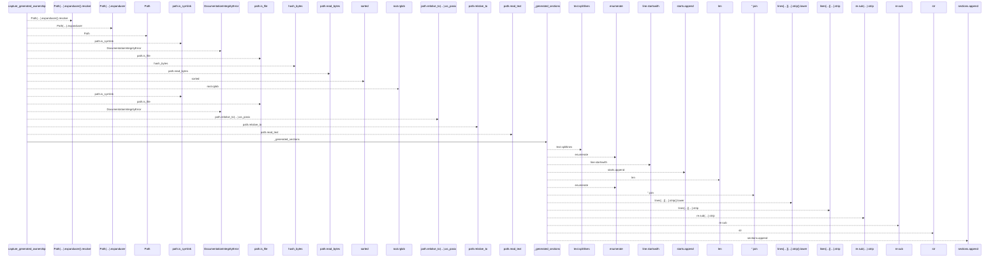
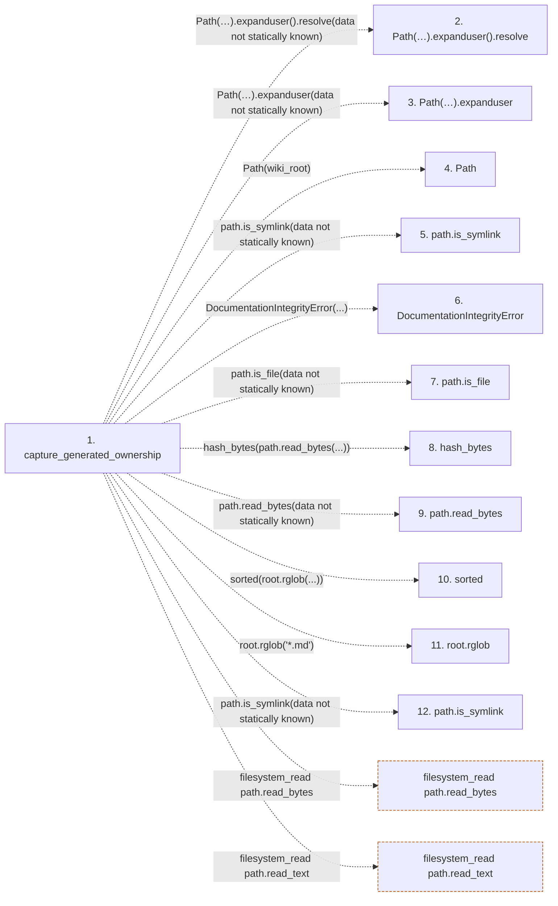

# capture_generated_ownership

**Entry point:** `capture_generated_ownership` (`api`)
**Source:** [integrity](../modules/integrity.md)
**Modules touched:** [integrity](../modules/integrity.md)

## Call sequence

<!-- Auto-generated from static call edges. Dashed arrows are external or unresolved calls. Reviewed runtime conditions and side effects belong in Behavior. -->

> Call sequence diagram shows 30 of 32 interactions; 2 omitted to keep the visualization within the 30-interaction and generated-diagram limits.

## Data flow

<!-- Auto-generated static analysis. Treat values and boundaries as best-effort hints, not runtime proof. -->

### Step data

| Step | Inputs | Reads | Writes | Returns |
|---|---|---|---|---|
| `capture_generated_ownership` | `wiki_root: str \| Path` | - | `fingerprints[...]` | `fingerprints` |
| `Path(…).expanduser().resolve` | - | - | - | - |
| `Path(…).expanduser` | - | - | - | - |
| `Path` | - | - | - | - |
| `path.is_symlink` | - | - | - | - |
| `DocumentationIntegrityError` | - | - | - | - |
| `path.is_file` | - | - | - | - |
| `hash_bytes` | - | - | - | - |
| `path.read_bytes` | - | - | - | - |
| `sorted` | - | - | - | - |
| `root.rglob` | - | - | - | - |
| `path.is_symlink` | - | - | - | - |

### Call data

| From | To | Line | Call |
|---|---|---:|---|
| capture_generated_ownership | Path(…).expanduser().resolve | 13 | `Path(wiki_root).expanduser().resolve(data not statically known)` |
| capture_generated_ownership | Path(…).expanduser | 13 | `Path(wiki_root).expanduser(data not statically known)` |
| capture_generated_ownership | Path | 13 | `Path(wiki_root)` |
| capture_generated_ownership | path.is_symlink | 23 | `path.is_symlink(data not statically known)` |
| capture_generated_ownership | DocumentationIntegrityError | 24 | `DocumentationIntegrityError(...)` |
| capture_generated_ownership | path.is_file | 27 | `path.is_file(data not statically known)` |
| capture_generated_ownership | hash_bytes | 28 | `hash_bytes(path.read_bytes(...))` |
| capture_generated_ownership | path.read_bytes | 28 | `path.read_bytes(data not statically known)` |
| capture_generated_ownership | sorted | 29 | `sorted(root.rglob(...))` |
| capture_generated_ownership | root.rglob | 29 | `root.rglob('*.md')` |
| capture_generated_ownership | path.is_symlink | 30 | `path.is_symlink(data not statically known)` |

### Boundary effects

| Kind | Target | Step | Line |
|---|---|---|---:|
| filesystem_read | `path.read_bytes` | `capture_generated_ownership` | 28 |
| filesystem_read | `path.read_text` | `capture_generated_ownership` | 35 |

### Static analysis gaps

| Kind | Step | Target | Line |
|---|---|---|---:|
| unresolved_call | `capture_generated_ownership` | `Path(wiki_root).expanduser().resolve` | 13 |
| unresolved_call | `capture_generated_ownership` | `Path(wiki_root).expanduser` | 13 |
| unresolved_call | `capture_generated_ownership` | `path.is_symlink` | 23 |
| unresolved_call | `capture_generated_ownership` | `DocumentationIntegrityError` | 24 |
| unresolved_call | `capture_generated_ownership` | `path.is_file` | 27 |
| unresolved_call | `capture_generated_ownership` | `sorted` | 29 |
| unresolved_call | `capture_generated_ownership` | `root.rglob` | 29 |
| unresolved_call | `capture_generated_ownership` | `path.is_symlink` | 30 |
| step_limit | `capture_generated_ownership` | `first 12 steps` | 0 |

## Behavior

This flow starts at `capture_generated_ownership` and is classified as `api`. The generated call and data-flow sections are bounded static projections; runtime conditions and side effects require source-level confirmation.
