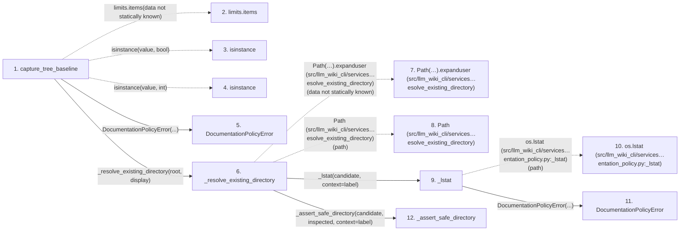

# capture_tree_baseline

**Entry point:** `capture_tree_baseline` (`api`)
**Source:** [documentation_policy](../modules/documentation_policy.md)
**Modules touched:** [documentation_policy](../modules/documentation_policy.md), [filesystem_guard](../modules/filesystem_guard.md)

## Call sequence

```mermaid
sequenceDiagram
    participant p0 as capture_tree_baseline
    participant p1 as limits.items
    participant p2 as isinstance
    participant p3 as DocumentationPolicyError
    participant p4 as _resolve_existing_directory
    participant p5 as Path(…).expanduser (src/llm_wiki_cli/services…esolve_existing_directory)
    participant p6 as Path (src/llm_wiki_cli/services…esolve_existing_directory)
    participant p7 as _lstat
    participant p8 as os.lstat (src/llm_wiki_cli/services…entation_policy.py:_lstat)
    participant p9 as _assert_safe_directory
    participant p10 as stat.S_ISLNK (src/llm_wiki_cli/services…py:_assert_safe_directory)
    participant p11 as _is_windows_reparse_point
    participant p12 as int (src/llm_wiki_cli/services…_is_windows_reparse_point)
    participant p13 as getattr (src/llm_wiki_cli/services…_is_windows_reparse_point)
    participant p14 as bool
    participant p15 as stat.S_ISDIR (src/llm_wiki_cli/services…py:_assert_safe_directory)
    participant p16 as _resolve_path
    participant p17 as Path(…).expanduser().resolve
    participant p18 as Path(…).expanduser (src/llm_wiki_cli/services…n_policy.py:_resolve_path)
    participant p19 as Path (src/llm_wiki_cli/services…n_policy.py:_resolve_path)
    participant p20 as _assert_same_file_identity
    p0-->>p1: limits.items
    p0-->>p2: isinstance
    p0-->>p2: isinstance
    p0->>p3: DocumentationPolicyError
    p0->>p4: _resolve_existing_directory
    p4-->>p5: Path(…).expanduser (src/llm_wiki_cli/services…esolve_existing_directory)
    p4-->>p6: Path (src/llm_wiki_cli/services…esolve_existing_directory)
    p4->>p7: _lstat
    p7-->>p8: os.lstat (src/llm_wiki_cli/services…entation_policy.py:_lstat)
    p7->>p3: DocumentationPolicyError
    p4->>p9: _assert_safe_directory
    p9-->>p10: stat.S_ISLNK (src/llm_wiki_cli/services…py:_assert_safe_directory)
    p9->>p3: DocumentationPolicyError
    p9->>p11: _is_windows_reparse_point
    p11-->>p12: int (src/llm_wiki_cli/services…_is_windows_reparse_point)
    p11-->>p13: getattr (src/llm_wiki_cli/services…_is_windows_reparse_point)
    p11-->>p12: int (src/llm_wiki_cli/services…_is_windows_reparse_point)
    p11-->>p13: getattr (src/llm_wiki_cli/services…_is_windows_reparse_point)
    p11-->>p14: bool
    p9->>p3: DocumentationPolicyError
    p9-->>p15: stat.S_ISDIR (src/llm_wiki_cli/services…py:_assert_safe_directory)
    p9->>p3: DocumentationPolicyError
    p4->>p16: _resolve_path
    p16-->>p17: Path(…).expanduser().resolve
    p16-->>p18: Path(…).expanduser (src/llm_wiki_cli/services…n_policy.py:_resolve_path)
    p16-->>p19: Path (src/llm_wiki_cli/services…n_policy.py:_resolve_path)
    p16->>p3: DocumentationPolicyError
    p4->>p7: _lstat
    p4->>p9: _assert_safe_directory
    p4->>p20: _assert_same_file_identity
```

<!-- Auto-generated from static call edges. Dashed arrows are external or unresolved calls. Reviewed runtime conditions and side effects belong in Behavior. -->

> Call sequence diagram shows 30 of 412 interactions; 382 omitted to keep the visualization within the 30-interaction and generated-diagram limits.

> Trace truncated at the depth limit; deeper calls are omitted.

## Data flow

<!-- Auto-generated static analysis. Treat values and boundaries as best-effort hints, not runtime proof. -->

### Step data

| Step | Inputs | Reads | Writes | Returns |
|---|---|---|---|---|
| `capture_tree_baseline` | `root: str \| Path`, `display: str`, `excluded_directories: Iterable[str]`, `max_files: int`, `max_file_bytes: int`, `max_total_bytes: int` | - | `file_hashes[...]` | `TreeBaseline(...)` |
| `limits.items` | - | - | - | - |
| `isinstance` | - | - | - | - |
| `isinstance` | - | - | - | - |
| `DocumentationPolicyError` | - | - | - | - |
| `_resolve_existing_directory` | `path: str \| Path`, `label: str` | - | - | `resolved` |
| `Path(…).expanduser (src/llm_wiki_cli/services…esolve_existing_directory)` | - | - | - | - |
| `Path (src/llm_wiki_cli/services…esolve_existing_directory)` | - | - | - | - |
| `_lstat` | `path: Path`, `context: str` | - | - | `os.lstat(...)` |
| `os.lstat (src/llm_wiki_cli/services…entation_policy.py:_lstat)` | - | - | - | - |
| `DocumentationPolicyError` | - | - | - | - |
| `_assert_safe_directory` | `path: Path`, `result: os.stat_result`, `context: str` | - | - | - |

### Call data

| From | To | Line | Call |
|---|---|---:|---|
| capture_tree_baseline | limits.items | 304 | `limits.items(data not statically known)` |
| capture_tree_baseline | isinstance | 305 | `isinstance(value, bool)` |
| capture_tree_baseline | isinstance | 305 | `isinstance(value, int)` |
| capture_tree_baseline | DocumentationPolicyError | 306 | `DocumentationPolicyError(...)` |
| capture_tree_baseline | _resolve_existing_directory | 308 | `_resolve_existing_directory(root, display)` |
| _resolve_existing_directory | Path(…).expanduser (src/llm_wiki_cli/services…esolve_existing_directory) | 948 | `Path(path).expanduser(data not statically known)` |
| _resolve_existing_directory | Path (src/llm_wiki_cli/services…esolve_existing_directory) | 948 | `Path(path)` |
| _resolve_existing_directory | _lstat | 949 | `_lstat(candidate, context=label)` |
| _lstat | os.lstat (src/llm_wiki_cli/services…entation_policy.py:_lstat) | 782 | `os.lstat(path)` |
| _lstat | DocumentationPolicyError | 784 | `DocumentationPolicyError(...)` |
| _resolve_existing_directory | _assert_safe_directory | 950 | `_assert_safe_directory(candidate, inspected, context=label)` |

### Boundary effects

*No boundary effects detected.*

### Static analysis gaps

| Kind | Step | Target | Line |
|---|---|---|---:|
| unresolved_call | `capture_tree_baseline` | `limits.items` | 304 |
| external_call | `capture_tree_baseline` | `isinstance` | 305 |
| unresolved_call | `_resolve_existing_directory` | `Path(path).expanduser` | 948 |
| external_call | `_lstat` | `os.lstat` | 782 |
| step_limit | `capture_tree_baseline` | `first 12 steps` | 0 |
| truncated_flow | `capture_tree_baseline` | `depth limit` | 0 |

## Behavior

This flow starts at `capture_tree_baseline` and is classified as `api`. The generated call and data-flow sections are bounded static projections; runtime conditions and side effects require source-level confirmation.
