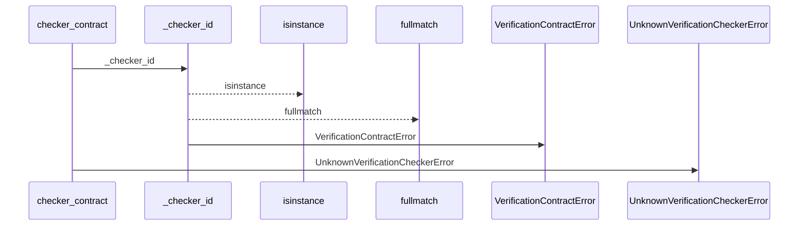
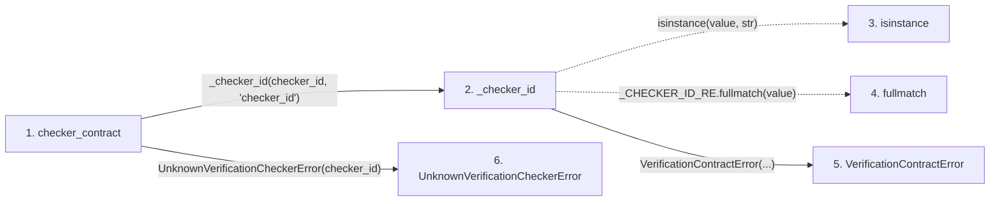

# checker_contract

**Entry point:** `checker_contract` (`api`)
**Source:** [verification_contracts](../modules/verification_contracts.md)
**Modules touched:** [verification_contracts](../modules/verification_contracts.md)

## Call sequence

<!-- Auto-generated from static call edges. Dashed arrows are external or unresolved calls. Reviewed runtime conditions and side effects belong in Behavior. -->

## Data flow

<!-- Auto-generated static analysis. Treat values and boundaries as best-effort hints, not runtime proof. -->

### Step data

| Step | Inputs | Reads | Writes | Returns |
|---|---|---|---|---|
| `checker_contract` | `checker_id: str` | `_CHECKER_REGISTRY` | - | `_CHECKER_REGISTRY[...]` |
| `_checker_id` | `value: object`, `field_name: str` | - | - | `value` |
| `isinstance` | - | - | - | - |
| `fullmatch` | - | - | - | - |
| `VerificationContractError` | - | - | - | - |
| `UnknownVerificationCheckerError` | - | - | - | - |

### Call data

| From | To | Line | Call |
|---|---|---:|---|
| checker_contract | _checker_id | 671 | `_checker_id(checker_id, 'checker_id')` |
| _checker_id | isinstance | 1359 | `isinstance(value, str)` |
| _checker_id | fullmatch | 1359 | `_CHECKER_ID_RE.fullmatch(value)` |
| _checker_id | VerificationContractError | 1360 | `VerificationContractError(...)` |
| checker_contract | UnknownVerificationCheckerError | 675 | `UnknownVerificationCheckerError(checker_id)` |

### Boundary effects

*No boundary effects detected.*

### Static analysis gaps

| Kind | Step | Target | Line |
|---|---|---|---:|
| unresolved_call | `_checker_id` | `isinstance` | 1359 |
| unresolved_call | `_checker_id` | `_CHECKER_ID_RE.fullmatch` | 1359 |

## Behavior

This flow starts at `checker_contract` and is classified as `api`. The generated call and data-flow sections are bounded static projections; runtime conditions and side effects require source-level confirmation.
