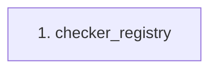

# checker_registry

**Entry point:** `checker_registry` (`api`)
**Source:** [verification_contracts](../modules/verification_contracts.md)
**Modules touched:** [verification_contracts](../modules/verification_contracts.md)

## Call sequence

<!-- Auto-generated from static call edges. Dashed arrows are external or unresolved calls. Reviewed runtime conditions and side effects belong in Behavior. -->
*No outbound calls were detected by static analysis.*

## Data flow

<!-- Auto-generated static analysis. Treat values and boundaries as best-effort hints, not runtime proof. -->

### Step data

| Step | Inputs | Reads | Writes | Returns |
|---|---|---|---|---|
| `checker_registry` | - | `_CHECKER_REGISTRY` | - | `_CHECKER_REGISTRY` |

### Call data

*No call data transfers detected.*

### Boundary effects

*No boundary effects detected.*

### Static analysis gaps

*No static analysis gaps detected.*

## Behavior

This flow starts at `checker_registry` and is classified as `api`. The generated call and data-flow sections are bounded static projections; runtime conditions and side effects require source-level confirmation.
