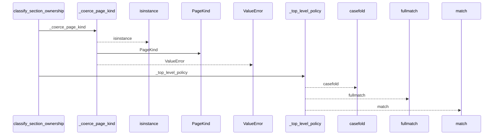
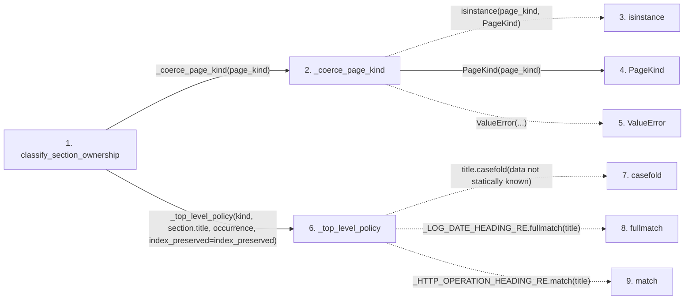

# classify_section_ownership

**Entry point:** `classify_section_ownership` (`api`)
**Source:** [section_ownership](../modules/section_ownership.md)
**Modules touched:** [section_ownership](../modules/section_ownership.md), [wiki_surface](../modules/wiki_surface.md)

## Call sequence

<!-- Auto-generated from static call edges. Dashed arrows are external or unresolved calls. Reviewed runtime conditions and side effects belong in Behavior. -->

## Data flow

<!-- Auto-generated static analysis. Treat values and boundaries as best-effort hints, not runtime proof. -->

### Step data

| Step | Inputs | Reads | Writes | Returns |
|---|---|---|---|---|
| `classify_section_ownership` | `page_kind: PageKind \| str`, `section: MarkdownSection`, `parent_ownership: SectionOwnership \| None`, `canonical_occurrence: int \| None`, `index_preserved: bool` | `PageKind`, `SectionOwnership`, `PageKind`, `SectionOwnership`, `SectionOwnership` | - | `SectionOwnership.SEMANTIC`, `SectionOwnership.GENERATED`, `parent_ownership`, `SectionOwnership.UNKNOWN`, `_top_level_policy(...)` |
| `_coerce_page_kind` | `page_kind: PageKind \| str` | `PageKind` | - | `page_kind`, `PageKind(...)` |
| `isinstance` | - | - | - | - |
| `PageKind` | - | - | - | - |
| `ValueError` | - | - | - | - |
| `_top_level_policy` | `page_kind: PageKind`, `title: str`, `canonical_occurrence: int`, `index_preserved: bool` | `PageKind`, `SectionOwnership`, `PageKind`, `SectionOwnership`, `SectionOwnership`, `PageKind`, `_INDEX_GENERATED_HEADINGS`, `SectionOwnership` | - | `SectionOwnership.SEMANTIC`, `SectionOwnership.GENERATED`, `SectionOwnership.UNKNOWN`, `...`, `...`, `...`, `...`, `...` |
| `casefold` | - | - | - | - |
| `fullmatch` | - | - | - | - |
| `match` | - | - | - | - |

### Call data

| From | To | Line | Call |
|---|---|---:|---|
| classify_section_ownership | _coerce_page_kind | 432 | `_coerce_page_kind(page_kind)` |
| _coerce_page_kind | isinstance | 266 | `isinstance(page_kind, PageKind)` |
| _coerce_page_kind | PageKind | 269 | `PageKind(page_kind)` |
| _coerce_page_kind | ValueError | 271 | `ValueError(...)` |
| classify_section_ownership | _top_level_policy | 442 | `_top_level_policy(kind, section.title, occurrence, index_preserved=index_preserved)` |
| _top_level_policy | casefold | 281 | `title.casefold(data not statically known)` |
| _top_level_policy | fullmatch | 286 | `_LOG_DATE_HEADING_RE.fullmatch(title)` |
| _top_level_policy | match | 384 | `_HTTP_OPERATION_HEADING_RE.match(title)` |

### Boundary effects

*No boundary effects detected.*

### Static analysis gaps

| Kind | Step | Target | Line |
|---|---|---|---:|
| unresolved_call | `_coerce_page_kind` | `isinstance` | 266 |
| unresolved_call | `_coerce_page_kind` | `ValueError` | 271 |
| unresolved_call | `_top_level_policy` | `title.casefold` | 281 |
| unresolved_call | `_top_level_policy` | `_LOG_DATE_HEADING_RE.fullmatch` | 286 |
| unresolved_call | `_top_level_policy` | `_HTTP_OPERATION_HEADING_RE.match` | 384 |

## Behavior

This flow starts at `classify_section_ownership` and is classified as `api`. The generated call and data-flow sections are bounded static projections; runtime conditions and side effects require source-level confirmation.
