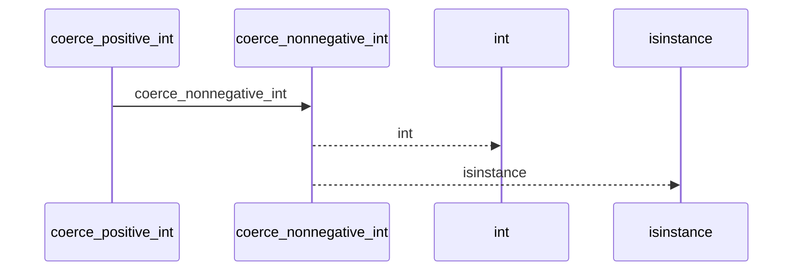
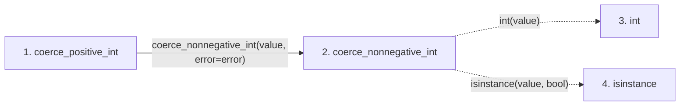

# coerce_positive_int

**Entry point:** `coerce_positive_int` (`api`)
**Source:** [validation](../modules/validation.md)
**Modules touched:** [validation](../modules/validation.md)

## Call sequence

<!-- Auto-generated from static call edges. Dashed arrows are external or unresolved calls. Reviewed runtime conditions and side effects belong in Behavior. -->

## Data flow

<!-- Auto-generated static analysis. Treat values and boundaries as best-effort hints, not runtime proof. -->

### Step data

| Step | Inputs | Reads | Writes | Returns |
|---|---|---|---|---|
| `coerce_positive_int` | `value: object`, `error: Exception` | - | - | `parsed` |
| `coerce_nonnegative_int` | `value: object`, `error: Exception` | - | - | `parsed` |
| `int` | - | - | - | - |
| `isinstance` | - | - | - | - |

### Call data

| From | To | Line | Call |
|---|---|---:|---|
| coerce_positive_int | coerce_nonnegative_int | 898 | `coerce_nonnegative_int(value, error=error)` |
| coerce_nonnegative_int | int | 887 | `int(value)` |
| coerce_nonnegative_int | isinstance | 890 | `isinstance(value, bool)` |

### Boundary effects

*No boundary effects detected.*

### Static analysis gaps

| Kind | Step | Target | Line |
|---|---|---|---:|
| unresolved_call | `coerce_nonnegative_int` | `isinstance` | 890 |

## Behavior

This flow starts at `coerce_positive_int` and is classified as `api`. The generated call and data-flow sections are bounded static projections; runtime conditions and side effects require source-level confirmation.
