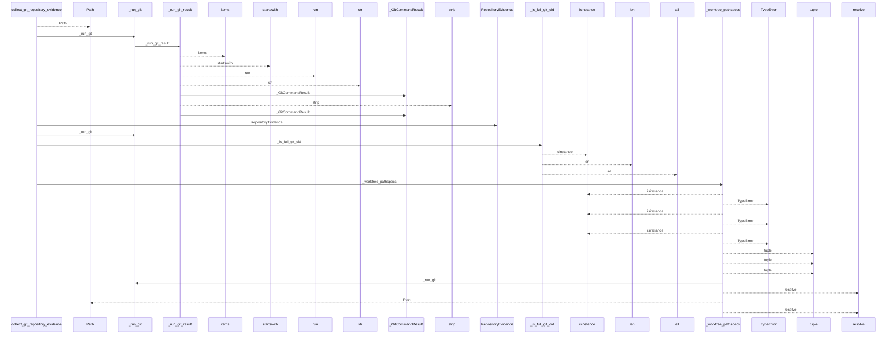
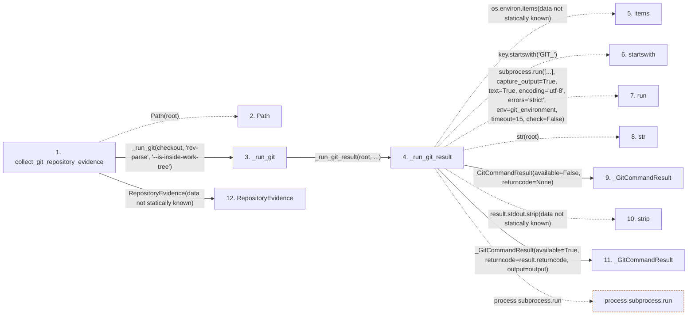

# collect_git_repository_evidence

**Entry point:** `collect_git_repository_evidence` (`api`)
**Source:** [knowledge_envelope](../modules/knowledge_envelope.md)
**Modules touched:** [knowledge_envelope](../modules/knowledge_envelope.md), [validation](../modules/validation.md)

## Call sequence

<!-- Auto-generated from static call edges. Dashed arrows are external or unresolved calls. Reviewed runtime conditions and side effects belong in Behavior. -->

> Call sequence diagram shows 30 of 145 interactions; 115 omitted to keep the visualization within the 30-interaction and generated-diagram limits.

## Data flow

<!-- Auto-generated static analysis. Treat values and boundaries as best-effort hints, not runtime proof. -->

### Step data

| Step | Inputs | Reads | Writes | Returns |
|---|---|---|---|---|
| `collect_git_repository_evidence` | `root: str \| Path`, `included_worktree_paths: Iterable[str \| Path] \| None`, `excluded_worktree_paths: Iterable[str \| Path]`, `excluded_worktree_globs: Iterable[str]`, `worktree_path_filter: Callable[[Path], bool] \| None` | `WorkingTreeState`, `WorkingTreeState`, `WorkingTreeState` | - | `RepositoryEvidence(...)`, `RepositoryEvidence(...)` |
| `Path` | - | - | - | - |
| `_run_git` | `root: Path`, `args: str`, `preserve_empty: bool` | - | - | `None`, `result.output`, `None` |
| `_run_git_result` | `root: Path`, `args: str`, `preserve_output: bool` | `os`, `subprocess` | `git_environment[...]`, `git_environment[...]`, `git_environment[...]`, `git_environment[...]` | `_GitCommandResult(...)`, `_GitCommandResult(...)` |
| `items` | - | - | - | - |
| `startswith` | - | - | - | - |
| `run` | - | - | - | - |
| `str` | - | - | - | - |
| `_GitCommandResult` | - | - | - | - |
| `strip` | - | - | - | - |
| `_GitCommandResult` | - | - | - | - |
| `RepositoryEvidence` | - | - | - | - |

### Call data

| From | To | Line | Call |
|---|---|---:|---|
| collect_git_repository_evidence | Path | 307 | `Path(root)` |
| collect_git_repository_evidence | _run_git | 308 | `_run_git(checkout, 'rev-parse', '--is-inside-work-tree')` |
| _run_git | _run_git_result | 1178 | `_run_git_result(root, ...)` |
| _run_git_result | items | 1192 | `os.environ.items(data not statically known)` |
| _run_git_result | startswith | 1192 | `key.startswith('GIT_')` |
| _run_git_result | run | 1199 | `subprocess.run([...], capture_output=True, text=True, encoding='utf-8', errors='strict', env=git_environment, timeout=15, check=False)` |
| _run_git_result | str | 1200 | `str(root)` |
| _run_git_result | _GitCommandResult | 1215 | `_GitCommandResult(available=False, returncode=None)` |
| _run_git_result | strip | 1216 | `result.stdout.strip(data not statically known)` |
| _run_git_result | _GitCommandResult | 1217 | `_GitCommandResult(available=True, returncode=result.returncode, output=output)` |
| collect_git_repository_evidence | RepositoryEvidence | 310 | `RepositoryEvidence(data not statically known)` |

### Boundary effects

| Kind | Target | Step | Line |
|---|---|---|---:|
| process | `subprocess.run` | `_run_git_result` | 1199 |

### Static analysis gaps

| Kind | Step | Target | Line |
|---|---|---|---:|
| external_call | `_run_git_result` | `os.environ.items` | 1192 |
| unresolved_call | `_run_git_result` | `key.startswith` | 1192 |
| unresolved_call | `_run_git_result` | `result.stdout.strip` | 1216 |
| step_limit | `collect_git_repository_evidence` | `first 12 steps` | 0 |

## Behavior

This flow starts at `collect_git_repository_evidence` and is classified as `api`. The generated call and data-flow sections are bounded static projections; runtime conditions and side effects require source-level confirmation.
