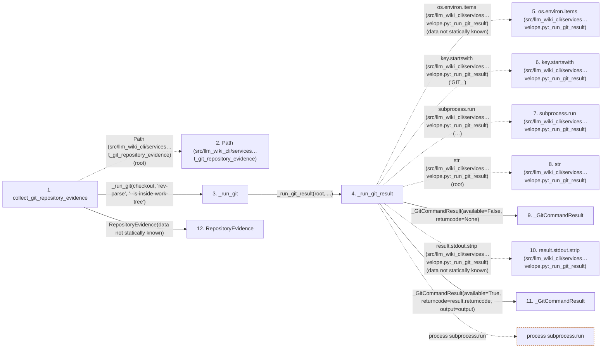

# collect_git_repository_evidence

**Entry point:** `collect_git_repository_evidence` (`api`)
**Source:** [knowledge_envelope](../modules/knowledge_envelope.md)
**Modules touched:** [knowledge_envelope](../modules/knowledge_envelope.md), [validation](../modules/validation.md)

## Call sequence

```mermaid
sequenceDiagram
    participant p0 as collect_git_repository_evidence
    participant p1 as Path (src/llm_wiki_cli/services…t_git_repository_evidence)
    participant p2 as _run_git
    participant p3 as _run_git_result
    participant p4 as os.environ.items (src/llm_wiki_cli/services…velope.py:_run_git_result)
    participant p5 as key.startswith (src/llm_wiki_cli/services…velope.py:_run_git_result)
    participant p6 as subprocess.run (src/llm_wiki_cli/services…velope.py:_run_git_result)
    participant p7 as str (src/llm_wiki_cli/services…velope.py:_run_git_result)
    participant p8 as _GitCommandResult
    participant p9 as result.stdout.strip (src/llm_wiki_cli/services…velope.py:_run_git_result)
    participant p10 as RepositoryEvidence
    participant p11 as _is_full_git_oid
    participant p12 as isinstance (src/llm_wiki_cli/services…elope.py:_is_full_git_oid)
    participant p13 as len (src/llm_wiki_cli/services…elope.py:_is_full_git_oid)
    participant p14 as all
    participant p15 as _worktree_pathspecs
    participant p16 as isinstance (src/llm_wiki_cli/services…pe.py:_worktree_pathspecs)
    participant p17 as TypeError
    participant p18 as tuple (src/llm_wiki_cli/services…pe.py:_worktree_pathspecs)
    participant p19 as Path(…).resolve (src/llm_wiki_cli/services…pe.py:_worktree_pathspecs)
    participant p20 as Path (src/llm_wiki_cli/services…pe.py:_worktree_pathspecs)
    participant p21 as checkout.resolve
    p0-->>p1: Path (src/llm_wiki_cli/services…t_git_repository_evidence)
    p0->>p2: _run_git
    p2->>p3: _run_git_result
    p3-->>p4: os.environ.items (src/llm_wiki_cli/services…velope.py:_run_git_result)
    p3-->>p5: key.startswith (src/llm_wiki_cli/services…velope.py:_run_git_result)
    p3-->>p6: subprocess.run (src/llm_wiki_cli/services…velope.py:_run_git_result)
    p3-->>p7: str (src/llm_wiki_cli/services…velope.py:_run_git_result)
    p3->>p8: _GitCommandResult
    p3-->>p9: result.stdout.strip (src/llm_wiki_cli/services…velope.py:_run_git_result)
    p3->>p8: _GitCommandResult
    p0->>p10: RepositoryEvidence
    p0->>p2: _run_git
    p0->>p11: _is_full_git_oid
    p11-->>p12: isinstance (src/llm_wiki_cli/services…elope.py:_is_full_git_oid)
    p11-->>p13: len (src/llm_wiki_cli/services…elope.py:_is_full_git_oid)
    p11-->>p14: all
    p0->>p15: _worktree_pathspecs
    p15-->>p16: isinstance (src/llm_wiki_cli/services…pe.py:_worktree_pathspecs)
    p15-->>p17: TypeError
    p15-->>p16: isinstance (src/llm_wiki_cli/services…pe.py:_worktree_pathspecs)
    p15-->>p17: TypeError
    p15-->>p16: isinstance (src/llm_wiki_cli/services…pe.py:_worktree_pathspecs)
    p15-->>p17: TypeError
    p15-->>p18: tuple (src/llm_wiki_cli/services…pe.py:_worktree_pathspecs)
    p15-->>p18: tuple (src/llm_wiki_cli/services…pe.py:_worktree_pathspecs)
    p15-->>p18: tuple (src/llm_wiki_cli/services…pe.py:_worktree_pathspecs)
    p15->>p2: _run_git
    p15-->>p19: Path(…).resolve (src/llm_wiki_cli/services…pe.py:_worktree_pathspecs)
    p15-->>p20: Path (src/llm_wiki_cli/services…pe.py:_worktree_pathspecs)
    p15-->>p21: checkout.resolve
```

<!-- Auto-generated from static call edges. Dashed arrows are external or unresolved calls. Reviewed runtime conditions and side effects belong in Behavior. -->

> Call sequence diagram shows 30 of 165 interactions; 135 omitted to keep the visualization within the 30-interaction and generated-diagram limits.

## Data flow

<!-- Auto-generated static analysis. Treat values and boundaries as best-effort hints, not runtime proof. -->

### Step data

| Step | Inputs | Reads | Writes | Returns |
|---|---|---|---|---|
| `collect_git_repository_evidence` | `root: str \| Path`, `included_worktree_paths: Iterable[str \| Path] \| None`, `excluded_worktree_paths: Iterable[str \| Path]`, `excluded_worktree_globs: Iterable[str]`, `worktree_path_filter: Callable[[Path], bool] \| None` | `WorkingTreeState`, `WorkingTreeState`, `WorkingTreeState` | - | `RepositoryEvidence(...)`, `RepositoryEvidence(...)` |
| `Path (src/llm_wiki_cli/services…t_git_repository_evidence)` | - | - | - | - |
| `_run_git` | `root: Path`, `args: str`, `preserve_empty: bool` | - | - | `None`, `result.output`, `None` |
| `_run_git_result` | `root: Path`, `args: str`, `preserve_output: bool` | `os`, `subprocess` | `git_environment[...]`, `git_environment[...]`, `git_environment[...]`, `git_environment[...]` | `_GitCommandResult(...)`, `_GitCommandResult(...)` |
| `os.environ.items (src/llm_wiki_cli/services…velope.py:_run_git_result)` | - | - | - | - |
| `key.startswith (src/llm_wiki_cli/services…velope.py:_run_git_result)` | - | - | - | - |
| `subprocess.run (src/llm_wiki_cli/services…velope.py:_run_git_result)` | - | - | - | - |
| `str (src/llm_wiki_cli/services…velope.py:_run_git_result)` | - | - | - | - |
| `_GitCommandResult` | - | - | - | - |
| `result.stdout.strip (src/llm_wiki_cli/services…velope.py:_run_git_result)` | - | - | - | - |
| `_GitCommandResult` | - | - | - | - |
| `RepositoryEvidence` | - | - | - | - |

### Call data

| From | To | Line | Call |
|---|---|---:|---|
| collect_git_repository_evidence | Path (src/llm_wiki_cli/services…t_git_repository_evidence) | 311 | `Path(root)` |
| collect_git_repository_evidence | _run_git | 312 | `_run_git(checkout, 'rev-parse', '--is-inside-work-tree')` |
| _run_git | _run_git_result | 1188 | `_run_git_result(root, ...)` |
| _run_git_result | os.environ.items (src/llm_wiki_cli/services…velope.py:_run_git_result) | 1202 | `os.environ.items(data not statically known)` |
| _run_git_result | key.startswith (src/llm_wiki_cli/services…velope.py:_run_git_result) | 1202 | `key.startswith('GIT_')` |
| _run_git_result | subprocess.run (src/llm_wiki_cli/services…velope.py:_run_git_result) | 1209 | `subprocess.run([...], capture_output=True, text=True, encoding='utf-8', errors='strict', env=git_environment, timeout=15, check=False)` |
| _run_git_result | str (src/llm_wiki_cli/services…velope.py:_run_git_result) | 1210 | `str(root)` |
| _run_git_result | _GitCommandResult | 1225 | `_GitCommandResult(available=False, returncode=None)` |
| _run_git_result | result.stdout.strip (src/llm_wiki_cli/services…velope.py:_run_git_result) | 1226 | `result.stdout.strip(data not statically known)` |
| _run_git_result | _GitCommandResult | 1227 | `_GitCommandResult(available=True, returncode=result.returncode, output=output)` |
| collect_git_repository_evidence | RepositoryEvidence | 314 | `RepositoryEvidence(data not statically known)` |

### Boundary effects

| Kind | Target | Step | Line |
|---|---|---|---:|
| process | `subprocess.run` | `_run_git_result` | 1209 |

### Static analysis gaps

| Kind | Step | Target | Line |
|---|---|---|---:|
| external_call | `_run_git_result` | `os.environ.items` | 1202 |
| unresolved_call | `_run_git_result` | `key.startswith` | 1202 |
| unresolved_call | `_run_git_result` | `result.stdout.strip` | 1226 |
| step_limit | `collect_git_repository_evidence` | `first 12 steps` | 0 |

## Behavior

This flow starts at `collect_git_repository_evidence` and is classified as `api`. The generated call and data-flow sections are bounded static projections; runtime conditions and side effects require source-level confirmation.
