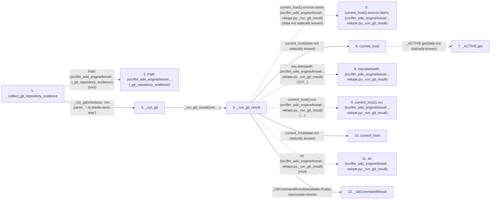

# collect_git_repository_evidence

**Entry point:** `collect_git_repository_evidence` (`api`)
**Source:** [knowledge_envelope](../modules/knowledge_envelope.md)
**Modules touched:** [host](../modules/host.md), [knowledge_envelope](../modules/knowledge_envelope.md), [validation](../modules/validation.md)

## Call sequence

> Static overview in presentation order, not runtime execution order. Arrows retain captured callers; representative internal continuations and boundary examples precede repeated helper detail.

<!-- Auto-generated from static call edges. Dashed arrows are external or unresolved calls. Reviewed runtime conditions and side effects belong in Behavior. -->

```mermaid
sequenceDiagram
    participant p0 as collect_git_repository_evidence
    participant p1 as _run_git
    participant p2 as _worktree_pathspecs
    participant p3 as _effective_line_ending_overrides
    participant p4 as _filtered_worktree_status_is_dirty
    participant p5 as _local_config_values
    participant p6 as RepositoryEvidence
    participant p7 as _is_full_git_oid
    participant p8 as _run_git_result
    participant p9 as _parse_local_remote_config
    participant p10 as _run_effective_git_config
    participant p11 as _repository_relative_path
    participant p12 as require_repository_relative_path
    participant p13 as require_portable_relative_path
    participant p14 as _default_path_error
    participant p15 as _check_path_collision
    participant p16 as require_portable_path_component
    participant p17 as current_host
    participant p18 as KnowledgeEnvelopeError
    participant p19 as _GitCommandResult
    participant p20 as _syntax_key
    participant p21 as _known_syntax
    participant p22 as _remember_syntax
    participant p23 as SharedValidationError
    participant p24 as portable_path_key
    participant p25 as Path (src/llm_wiki_engine/knowl…t_git_repository_evidence)
    participant p26 as Path(…).resolve (src/llm_wiki_engine/knowl…t_git_repository_evidence)
    participant p27 as bool
    participant p28 as len (src/llm_wiki_engine/knowl…t_git_repository_evidence)
    p0->>p1: _run_git
    p0->>p2: _worktree_pathspecs
    p0->>p3: _effective_line_ending_overrides
    p0->>p4: _filtered_worktree_status_is_dirty
    p0->>p5: _local_config_values
    p0->>p6: RepositoryEvidence
    p0->>p7: _is_full_git_oid
    p0->>p8: _run_git_result
    p0->>p9: _parse_local_remote_config
    p3->>p10: _run_effective_git_config
    p4->>p11: _repository_relative_path
    p11->>p12: require_repository_relative_path
    p12->>p13: require_portable_relative_path
    p13->>p14: _default_path_error
    p13->>p15: _check_path_collision
    p13->>p16: require_portable_path_component
    p8->>p17: current_host
    p11->>p18: KnowledgeEnvelopeError
    p8->>p19: _GitCommandResult
    p12->>p20: _syntax_key
    p12->>p21: _known_syntax
    p12->>p22: _remember_syntax
    p14->>p23: SharedValidationError
    p15->>p24: portable_path_key
    p0-->>p25: Path (src/llm_wiki_engine/knowl…t_git_repository_evidence)(root)
    p0-->>p26: Path(…).resolve (src/llm_wiki_engine/knowl…t_git_repository_evidence)
    p0-->>p25: Path (src/llm_wiki_engine/knowl…t_git_repository_evidence)(raw_top_level)
    p0-->>p27: bool(status)
    p0-->>p28: len (src/llm_wiki_engine/knowl…t_git_repository_evidence)(branch_remotes)
    p0-->>p28: len (src/llm_wiki_engine/knowl…t_git_repository_evidence)(branch_merges)
```

> Call sequence diagram shows 30 of 187 interactions; 157 omitted to keep the visualization within the 30-interaction and generated-diagram limits, with uncertain identities omitted rather than inferred.

> Captured boundary calls: external 5 of 66 (61 omitted); unresolved 1 of 60 (59 omitted). These counts cover the captured static trace.

Omitted captured detail, grouped by actual caller occurrence and target module:

| Caller | Parent step | Target module | Kind | Omitted interactions |
| --- | --- | --- | --- | --- |
| `src/llm_wiki_engine/knowledge_envelope.py:_run_git` | 3 | [src/llm_wiki_engine/knowledge_envelope.py](../modules/knowledge_envelope.md) | internal | 1 |
| `src/llm_wiki_engine/knowledge_envelope.py:_run_git_result` | 4 | - | unresolved | 4 |
| `src/llm_wiki_engine/host.py:current_host` | 6 | - | unresolved | 1 |
| `src/llm_wiki_engine/knowledge_envelope.py:_run_git_result` | 4 | [src/llm_wiki_engine/host.py](../modules/host.md) | internal | 1 |
| `src/llm_wiki_engine/knowledge_envelope.py:_run_git_result` | 4 | - | external | 1 |
| `src/llm_wiki_engine/knowledge_envelope.py:_run_git_result` | 4 | [src/llm_wiki_engine/knowledge_envelope.py](../modules/knowledge_envelope.md) | internal | 1 |
| `src/llm_wiki_engine/knowledge_envelope.py:collect_git_repository_evidence` | 1 | [src/llm_wiki_engine/knowledge_envelope.py](../modules/knowledge_envelope.md) | internal | 7 |
| `src/llm_wiki_engine/knowledge_envelope.py:_is_full_git_oid` | 17 | - | external | 3 |
> Omission summary shows 8 of 41 groups; 33 further groups are not expanded here. Counts above include all omitted interactions.
> Detailed flow queries retain their own coverage and limits; omitted paths may execute at runtime.

> Trace truncated at the depth limit; deeper calls are omitted.

## Data flow

<!-- Auto-generated static analysis. Treat values and boundaries as best-effort hints, not runtime proof. -->

### Analysis coverage

**Effect analysis partially available.** Flow assembly and source effect analysis are separate; empty observations do not prove an empty handler body.

Source steps: 62; effect analysis evaluated: 43, partial: 3, unavailable: 16. Counts include steps omitted from the displayed trace.

Collector observations for 46 source steps with known totals: observed: 299, emitted: 284, omitted: 15. Unavailable totals are excluded.

- Callable record unavailable for one or more source steps; those steps have no represented callable body.
- Effect collector omitted observations before flow assembly; displayed effects are partial.
- Effect collector totals unavailable; observed counts cover captured records only.

| Step | Callable record | Effect analysis | Collector totals | Observed | Emitted | Omitted |
|---|---|---|---|---:|---:|---:|
| `collect_git_repository_evidence` | `available` | `evaluated` | `available` | `10` | `10` | `0` |
| `Path (src/llm_wiki_engine/knowl…t_git_repository_evidence)` | `not_applicable` | `not_applicable` | `not_applicable` | — | — | — |
| `_run_git` | `available` | `evaluated` | `available` | `6` | `6` | `0` |
| `_run_git_result` | `available` | `evaluated` | `available` | `11` | `11` | `0` |
| `current_host().environ.items (src/llm_wiki_engine/knowl…velope.py:_run_git_result)` | `not_applicable` | `not_applicable` | `not_applicable` | — | — | — |
| `current_host` | `available` | `evaluated` | `available` | `2` | `2` | `0` |
| `_ACTIVE.get` | `not_applicable` | `not_applicable` | `not_applicable` | — | — | — |
| `key.startswith (src/llm_wiki_engine/knowl…velope.py:_run_git_result)` | `not_applicable` | `not_applicable` | `not_applicable` | — | — | — |
| `current_host().run (src/llm_wiki_engine/knowl…velope.py:_run_git_result)` | `not_applicable` | `not_applicable` | `not_applicable` | — | — | — |
| `current_host` | `available` | `evaluated` | `available` | `2` | `2` | `0` |
| `str (src/llm_wiki_engine/knowl…velope.py:_run_git_result)` | `not_applicable` | `not_applicable` | `not_applicable` | — | — | — |
| `_GitCommandResult` | `unavailable` | `unavailable` | `unavailable` | — | — | — |

```mermaid
flowchart LR
    s1["1. collect_git_repository_evidence"]
    s2["2. Path (src/llm_wiki_engine/knowl…t_git_repository_evidence)"]
    s3["3. _run_git"]
    s4["4. _run_git_result"]
    s5["5. current_host().environ.items (src/llm_wiki_engine/knowl…velope.py:_run_git_result)"]
    s6["6. current_host"]
    s7["7. _ACTIVE.get"]
    s8["8. key.startswith (src/llm_wiki_engine/knowl…velope.py:_run_git_result)"]
    s9["9. current_host().run (src/llm_wiki_engine/knowl…velope.py:_run_git_result)"]
    s10["10. current_host"]
    s11["11. str (src/llm_wiki_engine/knowl…velope.py:_run_git_result)"]
    s12["12. _GitCommandResult"]
    s1 -. "Path (src/llm_wiki_engine/knowl…t_git_repository_evidence)(root)" .-> s2
    s1 -->|"_run_git(checkout, 'rev-parse', '--is-inside-work-tree')"| s3
    s3 -->|"_run_git_result(root, ...)"| s4
    s4 -. "current_host().environ.items (src/llm_wiki_engine/knowl…velope.py:_run_git_result)(data not statically known)" .-> s5
    s4 -->|"current_host(data not statically known)"| s6
    s6 -. "_ACTIVE.get(data not statically known)" .-> s7
    s4 -. "key.startswith (src/llm_wiki_engine/knowl…velope.py:_run_git_result)('GIT_')" .-> s8
    s4 -. "current_host().run (src/llm_wiki_engine/knowl…velope.py:_run_git_result)(…)" .-> s9
    s4 -->|"current_host(data not statically known)"| s10
    s4 -. "str (src/llm_wiki_engine/knowl…velope.py:_run_git_result)(root)" .-> s11
    s4 -->|"_GitCommandResult(available=False, returncode=None)"| s12
    click s1 "../modules/knowledge_envelope.md"
    click s3 "../modules/knowledge_envelope.md"
    click s4 "../modules/knowledge_envelope.md"
    click s6 "../modules/host.md"
    click s10 "../modules/host.md"
    click s12 "../modules/knowledge_envelope.md"
```

### Step data

| Step | Inputs | Reads | Writes | Returns |
|---|---|---|---|---|
| `collect_git_repository_evidence` | `root: str \| Path`, `included_worktree_paths: Iterable[str \| Path] \| None`, `excluded_worktree_paths: Iterable[str \| Path]`, `excluded_worktree_globs: Iterable[str]`, `worktree_path_filter: Callable[[Path], bool] \| None` | `WorkingTreeState`, `WorkingTreeState`, `WorkingTreeState` | - | `RepositoryEvidence(...)`, `RepositoryEvidence(...)` |
| `Path (src/llm_wiki_engine/knowl…t_git_repository_evidence)` | - | - | - | - |
| `_run_git` | `root: Path`, `args: str`, `preserve_empty: bool` | - | - | `None`, `result.output`, `None` |
| `_run_git_result` | `root: Path`, `args: str`, `preserve_output: bool` | `os`, `subprocess` | `git_environment[...]`, `git_environment[...]`, `git_environment[...]`, `git_environment[...]` | `_GitCommandResult(...)`, `_GitCommandResult(...)` |
| `current_host().environ.items (src/llm_wiki_engine/knowl…velope.py:_run_git_result)` | - | - | - | - |
| `current_host` | - | `_DEFAULT` | - | `...` |
| `_ACTIVE.get` | - | - | - | - |
| `key.startswith (src/llm_wiki_engine/knowl…velope.py:_run_git_result)` | - | - | - | - |
| `current_host().run (src/llm_wiki_engine/knowl…velope.py:_run_git_result)` | - | - | - | - |
| `current_host` | - | `_DEFAULT` | - | `...` |
| `str (src/llm_wiki_engine/knowl…velope.py:_run_git_result)` | - | - | - | - |
| `_GitCommandResult` | - | - | - | - |

### Call data

| From | To | Line | Call |
|---|---|---:|---|
| collect_git_repository_evidence | Path (src/llm_wiki_engine/knowl…t_git_repository_evidence) | 312 | `Path(root)` |
| collect_git_repository_evidence | _run_git | 313 | `_run_git(checkout, 'rev-parse', '--is-inside-work-tree')` |
| _run_git | _run_git_result | 1189 | `_run_git_result(root, ...)` |
| _run_git_result | current_host().environ.items (src/llm_wiki_engine/knowl…velope.py:_run_git_result) | 1203 | `current_host().environ.items(data not statically known)` |
| _run_git_result | current_host | 1203 | `current_host(data not statically known)` |
| current_host | _ACTIVE.get | 166 | `_ACTIVE.get(data not statically known)` |
| _run_git_result | key.startswith (src/llm_wiki_engine/knowl…velope.py:_run_git_result) | 1203 | `key.startswith('GIT_')` |
| _run_git_result | current_host().run (src/llm_wiki_engine/knowl…velope.py:_run_git_result) | 1210 | `current_host().run([...], input='', capture_output=True, text=True, encoding='utf-8', errors='strict', env=git_environment, timeout=15, check=False)` |
| _run_git_result | current_host | 1210 | `current_host(data not statically known)` |
| _run_git_result | str (src/llm_wiki_engine/knowl…velope.py:_run_git_result) | 1211 | `str(root)` |
| _run_git_result | _GitCommandResult | 1229 | `_GitCommandResult(available=False, returncode=None)` |

### Boundary effects

*No boundary-effect observations were captured in this static trace.*

### Static analysis gaps

| Kind | Step | Target | Line |
|---|---|---|---:|
| unresolved_call | `_run_git_result` | `current_host().environ.items` | 1203 |
| unresolved_call | `current_host` | `_ACTIVE.get` | 166 |
| unresolved_call | `_run_git_result` | `key.startswith` | 1203 |
| unresolved_call | `_run_git_result` | `current_host().run` | 1210 |
| step_limit | `collect_git_repository_evidence` | `first 12 steps` | 0 |
| truncated_flow | `collect_git_repository_evidence` | `depth limit` | 0 |

## Behavior

This flow starts at `collect_git_repository_evidence` and is classified as `api`. The generated call and data-flow sections are bounded static projections; runtime conditions and side effects require source-level confirmation.
