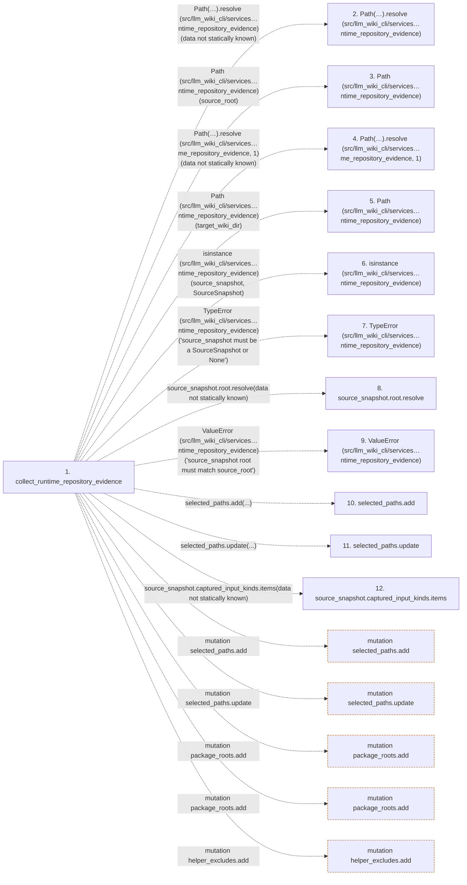

# collect_runtime_repository_evidence

**Entry point:** `collect_runtime_repository_evidence` (`api`)
**Source:** [knowledge_orchestration](../modules/knowledge_orchestration.md)
**Modules touched:** [common](../modules/common.md), [knowledge_envelope](../modules/knowledge_envelope.md), [knowledge_orchestration](../modules/knowledge_orchestration.md), [validation](../modules/validation.md)

## Call sequence

```mermaid
sequenceDiagram
    participant p0 as collect_runtime_repository_evidence
    participant p1 as Path(…).resolve (src/llm_wiki_cli/services…ntime_repository_evidence)
    participant p2 as Path (src/llm_wiki_cli/services…ntime_repository_evidence)
    participant p3 as Path(…).resolve (src/llm_wiki_cli/services…me_repository_evidence, 1)
    participant p4 as isinstance (src/llm_wiki_cli/services…ntime_repository_evidence)
    participant p5 as TypeError (src/llm_wiki_cli/services…ntime_repository_evidence)
    participant p6 as source_snapshot.root.resolve
    participant p7 as ValueError (src/llm_wiki_cli/services…ntime_repository_evidence)
    participant p8 as selected_paths.add
    participant p9 as selected_paths.update
    participant p10 as source_snapshot.captured_input_kinds.items
    participant p11 as tuple (src/llm_wiki_cli/services…ntime_repository_evidence)
    participant p12 as sorted (src/llm_wiki_cli/services…ntime_repository_evidence)
    participant p13 as str (src/llm_wiki_cli/services…ntime_repository_evidence)
    participant p14 as set (src/llm_wiki_cli/services…ntime_repository_evidence)
    participant p15 as enumerate (src/llm_wiki_cli/services…ntime_repository_evidence)
    participant p16 as package_roots.add
    participant p17 as source.joinpath
    participant p18 as Path(…).relative_to
    participant p19 as is_bundled_helper_implementation_path
    participant p20 as _normalize_path_text
    participant p21 as isinstance (src/llm_wiki_cli/extracto…n.py:_normalize_path_text)
    participant p22 as path.as_posix (src/llm_wiki_cli/extracto…n.py:_normalize_path_text)
    participant p23 as str(…).replace
    p0-->>p1: Path(…).resolve (src/llm_wiki_cli/services…ntime_repository_evidence)
    p0-->>p2: Path (src/llm_wiki_cli/services…ntime_repository_evidence)
    p0-->>p3: Path(…).resolve (src/llm_wiki_cli/services…me_repository_evidence, 1)
    p0-->>p2: Path (src/llm_wiki_cli/services…ntime_repository_evidence)
    p0-->>p4: isinstance (src/llm_wiki_cli/services…ntime_repository_evidence)
    p0-->>p5: TypeError (src/llm_wiki_cli/services…ntime_repository_evidence)
    p0-->>p6: source_snapshot.root.resolve
    p0-->>p7: ValueError (src/llm_wiki_cli/services…ntime_repository_evidence)
    p0-->>p8: selected_paths.add
    p0-->>p9: selected_paths.update
    p0-->>p10: source_snapshot.captured_input_kinds.items
    p0-->>p11: tuple (src/llm_wiki_cli/services…ntime_repository_evidence)
    p0-->>p12: sorted (src/llm_wiki_cli/services…ntime_repository_evidence)
    p0-->>p13: str (src/llm_wiki_cli/services…ntime_repository_evidence)
    p0-->>p14: set (src/llm_wiki_cli/services…ntime_repository_evidence)
    p0-->>p14: set (src/llm_wiki_cli/services…ntime_repository_evidence)
    p0-->>p14: set (src/llm_wiki_cli/services…ntime_repository_evidence)
    p0-->>p14: set (src/llm_wiki_cli/services…ntime_repository_evidence)
    p0-->>p2: Path (src/llm_wiki_cli/services…ntime_repository_evidence)
    p0-->>p15: enumerate (src/llm_wiki_cli/services…ntime_repository_evidence)
    p0-->>p16: package_roots.add
    p0-->>p17: source.joinpath
    p0-->>p16: package_roots.add
    p0-->>p18: Path(…).relative_to
    p0-->>p2: Path (src/llm_wiki_cli/services…ntime_repository_evidence)
    p0->>p19: is_bundled_helper_implementation_path
    p19->>p20: _normalize_path_text
    p20-->>p21: isinstance (src/llm_wiki_cli/extracto…n.py:_normalize_path_text)
    p20-->>p22: path.as_posix (src/llm_wiki_cli/extracto…n.py:_normalize_path_text)
    p20-->>p23: str(…).replace
```

<!-- Auto-generated from static call edges. Dashed arrows are external or unresolved calls. Reviewed runtime conditions and side effects belong in Behavior. -->

> Call sequence diagram shows 30 of 224 interactions; 194 omitted to keep the visualization within the 30-interaction and generated-diagram limits.

> Trace truncated at the depth limit; deeper calls are omitted.

## Data flow

<!-- Auto-generated static analysis. Treat values and boundaries as best-effort hints, not runtime proof. -->

### Step data

| Step | Inputs | Reads | Writes | Returns |
|---|---|---|---|---|
| `collect_runtime_repository_evidence` | `source_root: str \| Path`, `target_wiki_dir: str \| Path`, `source_snapshot: SourceSnapshot \| None` | `SourceSnapshot`, `ConsumedInputKind`, `BUNDLED_HELPER_IMPLEMENTATION_PATHS`, `SURFACE_INDEX_FILENAME`, `KNOWLEDGE_INDEX_FILENAME`, `MANIFEST_FILENAME`, `EXCLUDED_DIRS`, `AGENT_WORKTREE_DIR_PATTERNS` | - | `collect_git_repository_evidence(...)` |
| `Path(…).resolve (src/llm_wiki_cli/services…ntime_repository_evidence)` | - | - | - | - |
| `Path (src/llm_wiki_cli/services…ntime_repository_evidence)` | - | - | - | - |
| `Path(…).resolve (src/llm_wiki_cli/services…me_repository_evidence, 1)` | - | - | - | - |
| `Path (src/llm_wiki_cli/services…ntime_repository_evidence)` | - | - | - | - |
| `isinstance (src/llm_wiki_cli/services…ntime_repository_evidence)` | - | - | - | - |
| `TypeError (src/llm_wiki_cli/services…ntime_repository_evidence)` | - | - | - | - |
| `source_snapshot.root.resolve` | - | - | - | - |
| `ValueError (src/llm_wiki_cli/services…ntime_repository_evidence)` | - | - | - | - |
| `selected_paths.add` | - | - | - | - |
| `selected_paths.update` | - | - | - | - |
| `source_snapshot.captured_input_kinds.items` | - | - | - | - |

### Call data

| From | To | Line | Call |
|---|---|---:|---|
| collect_runtime_repository_evidence | Path(…).resolve (src/llm_wiki_cli/services…ntime_repository_evidence) | 939 | `Path(source_root).resolve(data not statically known)` |
| collect_runtime_repository_evidence | Path (src/llm_wiki_cli/services…ntime_repository_evidence) | 939 | `Path(source_root)` |
| collect_runtime_repository_evidence | Path(…).resolve (src/llm_wiki_cli/services…me_repository_evidence, 1) | 940 | `Path(target_wiki_dir).resolve(data not statically known)` |
| collect_runtime_repository_evidence | Path (src/llm_wiki_cli/services…ntime_repository_evidence) | 940 | `Path(target_wiki_dir)` |
| collect_runtime_repository_evidence | isinstance (src/llm_wiki_cli/services…ntime_repository_evidence) | 945 | `isinstance(source_snapshot, SourceSnapshot)` |
| collect_runtime_repository_evidence | TypeError (src/llm_wiki_cli/services…ntime_repository_evidence) | 946 | `TypeError('source_snapshot must be a SourceSnapshot or None')` |
| collect_runtime_repository_evidence | source_snapshot.root.resolve | 947 | `source_snapshot.root.resolve(data not statically known)` |
| collect_runtime_repository_evidence | ValueError (src/llm_wiki_cli/services…ntime_repository_evidence) | 948 | `ValueError('source_snapshot root must match source_root')` |
| collect_runtime_repository_evidence | selected_paths.add | 956 | `selected_paths.add(...)` |
| collect_runtime_repository_evidence | selected_paths.update | 957 | `selected_paths.update(...)` |
| collect_runtime_repository_evidence | source_snapshot.captured_input_kinds.items | 959 | `source_snapshot.captured_input_kinds.items(data not statically known)` |

### Boundary effects

| Kind | Target | Step | Line |
|---|---|---|---:|
| mutation | `selected_paths.add` | `collect_runtime_repository_evidence` | 956 |
| mutation | `selected_paths.update` | `collect_runtime_repository_evidence` | 957 |
| mutation | `package_roots.add` | `collect_runtime_repository_evidence` | 972 |
| mutation | `package_roots.add` | `collect_runtime_repository_evidence` | 974 |
| mutation | `helper_excludes.add` | `collect_runtime_repository_evidence` | 980 |

### Static analysis gaps

| Kind | Step | Target | Line |
|---|---|---|---:|
| unresolved_call | `collect_runtime_repository_evidence` | `Path(source_root).resolve` | 939 |
| unresolved_call | `collect_runtime_repository_evidence` | `Path(target_wiki_dir).resolve` | 940 |
| external_call | `collect_runtime_repository_evidence` | `isinstance` | 945 |
| external_call | `collect_runtime_repository_evidence` | `TypeError` | 946 |
| unresolved_call | `collect_runtime_repository_evidence` | `source_snapshot.root.resolve` | 947 |
| external_call | `collect_runtime_repository_evidence` | `ValueError` | 948 |
| unresolved_call | `collect_runtime_repository_evidence` | `source_snapshot.captured_input_kinds.items` | 959 |
| step_limit | `collect_runtime_repository_evidence` | `first 12 steps` | 0 |
| truncated_flow | `collect_runtime_repository_evidence` | `depth limit` | 0 |

## Behavior

This flow starts at `collect_runtime_repository_evidence` and is classified as `api`. The generated call and data-flow sections are bounded static projections; runtime conditions and side effects require source-level confirmation.
