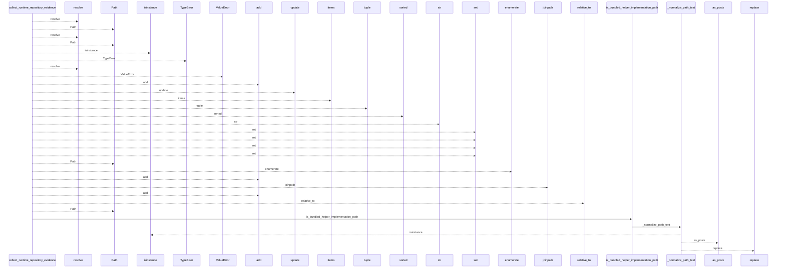
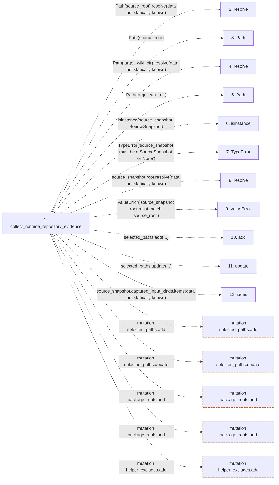

# collect_runtime_repository_evidence

**Entry point:** `collect_runtime_repository_evidence` (`api`)
**Source:** [knowledge_orchestration](../modules/knowledge_orchestration.md)
**Modules touched:** [common](../modules/common.md), [knowledge_envelope](../modules/knowledge_envelope.md), [knowledge_orchestration](../modules/knowledge_orchestration.md), [validation](../modules/validation.md)

## Call sequence

<!-- Auto-generated from static call edges. Dashed arrows are external or unresolved calls. Reviewed runtime conditions and side effects belong in Behavior. -->

> Call sequence diagram shows 30 of 204 interactions; 174 omitted to keep the visualization within the 30-interaction and generated-diagram limits.

> Trace truncated at the depth limit; deeper calls are omitted.

## Data flow

<!-- Auto-generated static analysis. Treat values and boundaries as best-effort hints, not runtime proof. -->

### Step data

| Step | Inputs | Reads | Writes | Returns |
|---|---|---|---|---|
| `collect_runtime_repository_evidence` | `source_root: str \| Path`, `target_wiki_dir: str \| Path`, `source_snapshot: SourceSnapshot \| None` | `SourceSnapshot`, `ConsumedInputKind`, `BUNDLED_HELPER_IMPLEMENTATION_PATHS`, `SURFACE_INDEX_FILENAME`, `KNOWLEDGE_INDEX_FILENAME`, `MANIFEST_FILENAME`, `EXCLUDED_DIRS`, `AGENT_WORKTREE_DIR_PATTERNS` | - | `collect_git_repository_evidence(...)` |
| `resolve` | - | - | - | - |
| `Path` | - | - | - | - |
| `resolve` | - | - | - | - |
| `Path` | - | - | - | - |
| `isinstance` | - | - | - | - |
| `TypeError` | - | - | - | - |
| `resolve` | - | - | - | - |
| `ValueError` | - | - | - | - |
| `add` | - | - | - | - |
| `update` | - | - | - | - |
| `items` | - | - | - | - |

### Call data

| From | To | Line | Call |
|---|---|---:|---|
| collect_runtime_repository_evidence | resolve | 768 | `Path(source_root).resolve(data not statically known)` |
| collect_runtime_repository_evidence | Path | 768 | `Path(source_root)` |
| collect_runtime_repository_evidence | resolve | 769 | `Path(target_wiki_dir).resolve(data not statically known)` |
| collect_runtime_repository_evidence | Path | 769 | `Path(target_wiki_dir)` |
| collect_runtime_repository_evidence | isinstance | 774 | `isinstance(source_snapshot, SourceSnapshot)` |
| collect_runtime_repository_evidence | TypeError | 775 | `TypeError('source_snapshot must be a SourceSnapshot or None')` |
| collect_runtime_repository_evidence | resolve | 776 | `source_snapshot.root.resolve(data not statically known)` |
| collect_runtime_repository_evidence | ValueError | 777 | `ValueError('source_snapshot root must match source_root')` |
| collect_runtime_repository_evidence | add | 785 | `selected_paths.add(...)` |
| collect_runtime_repository_evidence | update | 786 | `selected_paths.update(...)` |
| collect_runtime_repository_evidence | items | 788 | `source_snapshot.captured_input_kinds.items(data not statically known)` |

### Boundary effects

| Kind | Target | Step | Line |
|---|---|---|---:|
| mutation | `selected_paths.add` | `collect_runtime_repository_evidence` | 785 |
| mutation | `selected_paths.update` | `collect_runtime_repository_evidence` | 786 |
| mutation | `package_roots.add` | `collect_runtime_repository_evidence` | 801 |
| mutation | `package_roots.add` | `collect_runtime_repository_evidence` | 803 |
| mutation | `helper_excludes.add` | `collect_runtime_repository_evidence` | 809 |

### Static analysis gaps

| Kind | Step | Target | Line |
|---|---|---|---:|
| unresolved_call | `collect_runtime_repository_evidence` | `Path(source_root).resolve` | 768 |
| unresolved_call | `collect_runtime_repository_evidence` | `Path(target_wiki_dir).resolve` | 769 |
| unresolved_call | `collect_runtime_repository_evidence` | `isinstance` | 774 |
| unresolved_call | `collect_runtime_repository_evidence` | `TypeError` | 775 |
| unresolved_call | `collect_runtime_repository_evidence` | `source_snapshot.root.resolve` | 776 |
| unresolved_call | `collect_runtime_repository_evidence` | `ValueError` | 777 |
| unresolved_call | `collect_runtime_repository_evidence` | `source_snapshot.captured_input_kinds.items` | 788 |
| step_limit | `collect_runtime_repository_evidence` | `first 12 steps` | 0 |
| truncated_flow | `collect_runtime_repository_evidence` | `depth limit` | 0 |

## Behavior

This flow starts at `collect_runtime_repository_evidence` and is classified as `api`. The generated call and data-flow sections are bounded static projections; runtime conditions and side effects require source-level confirmation.
