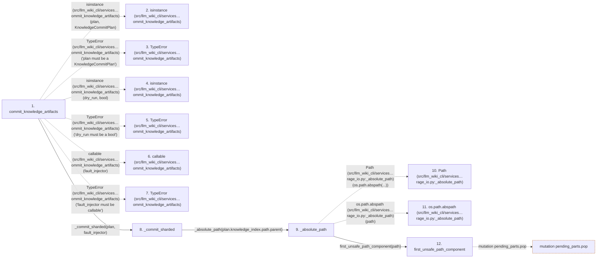

# commit_knowledge_artifacts

**Entry point:** `commit_knowledge_artifacts` (`api`)
**Source:** [knowledge_artifacts](../modules/knowledge_artifacts.md)
**Modules touched:** [filesystem_guard](../modules/filesystem_guard.md), [io](../modules/io.md), [knowledge_artifacts](../modules/knowledge_artifacts.md), [knowledge_evidence](../modules/knowledge_evidence.md), and 3 more

**Complete modules touched:**

- [filesystem_guard](../modules/filesystem_guard.md)
- [io](../modules/io.md)
- [knowledge_artifacts](../modules/knowledge_artifacts.md)
- [knowledge_evidence](../modules/knowledge_evidence.md)
- [knowledge_governance](../modules/knowledge_governance.md)
- [knowledge_storage](../modules/knowledge_storage.md)
- [knowledge_storage_io](../modules/knowledge_storage_io.md)

## Call sequence

```mermaid
sequenceDiagram
    participant p0 as commit_knowledge_artifacts
    participant p1 as isinstance (src/llm_wiki_cli/services…ommit_knowledge_artifacts)
    participant p2 as TypeError (src/llm_wiki_cli/services…ommit_knowledge_artifacts)
    participant p3 as callable (src/llm_wiki_cli/services…ommit_knowledge_artifacts)
    participant p4 as _commit_sharded
    participant p5 as _absolute_path
    participant p6 as Path (src/llm_wiki_cli/services…rage_io.py:_absolute_path)
    participant p7 as os.path.abspath (src/llm_wiki_cli/services…rage_io.py:_absolute_path)
    participant p8 as first_unsafe_path_component
    participant p9 as Path (src/llm_wiki_cli/services…rst_unsafe_path_component)
    participant p10 as os.fspath (src/llm_wiki_cli/services…rst_unsafe_path_component)
    participant p11 as os.path.abspath (src/llm_wiki_cli/services…rst_unsafe_path_component)
    participant p12 as lexical.is_absolute
    participant p13 as Path.cwd
    participant p14 as list
    participant p15 as pending_parts.pop
    participant p16 as current.lstat
    participant p17 as getattr (src/llm_wiki_cli/services…rst_unsafe_path_component)
    participant p18 as stat.S_ISLNK
    participant p19 as bool (src/llm_wiki_cli/services…rst_unsafe_path_component)
    participant p20 as trusted_symlink_owner
    participant p21 as callable (src/llm_wiki_cli/services…rst_unsafe_path_component)
    p0-->>p1: isinstance (src/llm_wiki_cli/services…ommit_knowledge_artifacts)
    p0-->>p2: TypeError (src/llm_wiki_cli/services…ommit_knowledge_artifacts)
    p0-->>p1: isinstance (src/llm_wiki_cli/services…ommit_knowledge_artifacts)
    p0-->>p2: TypeError (src/llm_wiki_cli/services…ommit_knowledge_artifacts)
    p0-->>p3: callable (src/llm_wiki_cli/services…ommit_knowledge_artifacts)
    p0-->>p2: TypeError (src/llm_wiki_cli/services…ommit_knowledge_artifacts)
    p0->>p4: _commit_sharded
    p4->>p5: _absolute_path
    p5-->>p6: Path (src/llm_wiki_cli/services…rage_io.py:_absolute_path)
    p5-->>p7: os.path.abspath (src/llm_wiki_cli/services…rage_io.py:_absolute_path)
    p5->>p8: first_unsafe_path_component
    p8-->>p9: Path (src/llm_wiki_cli/services…rst_unsafe_path_component)
    p8-->>p10: os.fspath (src/llm_wiki_cli/services…rst_unsafe_path_component)
    p8-->>p9: Path (src/llm_wiki_cli/services…rst_unsafe_path_component)
    p8-->>p11: os.path.abspath (src/llm_wiki_cli/services…rst_unsafe_path_component)
    p8-->>p12: lexical.is_absolute
    p8-->>p13: Path.cwd
    p8-->>p9: Path (src/llm_wiki_cli/services…rst_unsafe_path_component)
    p8-->>p14: list
    p8-->>p15: pending_parts.pop
    p8-->>p16: current.lstat
    p8-->>p17: getattr (src/llm_wiki_cli/services…rst_unsafe_path_component)
    p8-->>p17: getattr (src/llm_wiki_cli/services…rst_unsafe_path_component)
    p8-->>p18: stat.S_ISLNK
    p8-->>p19: bool (src/llm_wiki_cli/services…rst_unsafe_path_component)
    p8-->>p19: bool (src/llm_wiki_cli/services…rst_unsafe_path_component)
    p8-->>p17: getattr (src/llm_wiki_cli/services…rst_unsafe_path_component)
    p8-->>p20: trusted_symlink_owner
    p8-->>p21: callable (src/llm_wiki_cli/services…rst_unsafe_path_component)
    p8-->>p17: getattr (src/llm_wiki_cli/services…rst_unsafe_path_component)
```

<!-- Auto-generated from static call edges. Dashed arrows are external or unresolved calls. Reviewed runtime conditions and side effects belong in Behavior. -->

> Call sequence diagram shows 30 of 305 interactions; 275 omitted to keep the visualization within the 30-interaction and generated-diagram limits.

> Trace truncated at the depth limit; deeper calls are omitted.

## Data flow

<!-- Auto-generated static analysis. Treat values and boundaries as best-effort hints, not runtime proof. -->

### Step data

| Step | Inputs | Reads | Writes | Returns |
|---|---|---|---|---|
| `commit_knowledge_artifacts` | `plan: KnowledgeCommitPlan`, `dry_run: bool`, `fault_injector: FaultInjector \| None` | `KnowledgeCommitPlan`, `CommitStage`, `CommitStage`, `CommitStage` | - | `KnowledgeCommitResult(...)` |
| `isinstance (src/llm_wiki_cli/services…ommit_knowledge_artifacts)` | - | - | - | - |
| `TypeError (src/llm_wiki_cli/services…ommit_knowledge_artifacts)` | - | - | - | - |
| `isinstance (src/llm_wiki_cli/services…ommit_knowledge_artifacts)` | - | - | - | - |
| `TypeError (src/llm_wiki_cli/services…ommit_knowledge_artifacts)` | - | - | - | - |
| `callable (src/llm_wiki_cli/services…ommit_knowledge_artifacts)` | - | - | - | - |
| `TypeError (src/llm_wiki_cli/services…ommit_knowledge_artifacts)` | - | - | - | - |
| `_commit_sharded` | `plan: KnowledgeCommitPlan`, `fault: FaultInjector \| None` | `CommitStage`, `CommitStage`, `CommitStage`, `CommitStage` | - | - |
| `_absolute_path` | `path: Path` | - | - | `path` |
| `Path (src/llm_wiki_cli/services…rage_io.py:_absolute_path)` | - | - | - | - |
| `os.path.abspath (src/llm_wiki_cli/services…rage_io.py:_absolute_path)` | - | - | - | - |
| `first_unsafe_path_component` | `path: str \| Path`, `trusted_symlink_uids: Set[int] \| None`, `trusted_symlink_owner: Callable[[Path], bool] \| None` | `stat`, `os` | - | `lexical`, `None`, `current`, `current`, `current`, `current`, `current`, `None` |

### Call data

| From | To | Line | Call |
|---|---|---:|---|
| commit_knowledge_artifacts | isinstance (src/llm_wiki_cli/services…ommit_knowledge_artifacts) | 618 | `isinstance(plan, KnowledgeCommitPlan)` |
| commit_knowledge_artifacts | TypeError (src/llm_wiki_cli/services…ommit_knowledge_artifacts) | 619 | `TypeError('plan must be a KnowledgeCommitPlan')` |
| commit_knowledge_artifacts | isinstance (src/llm_wiki_cli/services…ommit_knowledge_artifacts) | 620 | `isinstance(dry_run, bool)` |
| commit_knowledge_artifacts | TypeError (src/llm_wiki_cli/services…ommit_knowledge_artifacts) | 621 | `TypeError('dry_run must be a bool')` |
| commit_knowledge_artifacts | callable (src/llm_wiki_cli/services…ommit_knowledge_artifacts) | 622 | `callable(fault_injector)` |
| commit_knowledge_artifacts | TypeError (src/llm_wiki_cli/services…ommit_knowledge_artifacts) | 623 | `TypeError('fault_injector must be callable')` |
| commit_knowledge_artifacts | _commit_sharded | 626 | `_commit_sharded(plan, fault_injector)` |
| _commit_sharded | _absolute_path | 738 | `_absolute_path(plan.knowledge_index.path.parent)` |
| _absolute_path | Path (src/llm_wiki_cli/services…rage_io.py:_absolute_path) | 49 | `Path(os.path.abspath(...))` |
| _absolute_path | os.path.abspath (src/llm_wiki_cli/services…rage_io.py:_absolute_path) | 49 | `os.path.abspath(path)` |
| _absolute_path | first_unsafe_path_component | 50 | `first_unsafe_path_component(path)` |

### Boundary effects

| Kind | Target | Step | Line |
|---|---|---|---:|
| mutation | `pending_parts.pop` | `first_unsafe_path_component` | 71 |

### Static analysis gaps

| Kind | Step | Target | Line |
|---|---|---|---:|
| external_call | `commit_knowledge_artifacts` | `isinstance` | 618 |
| external_call | `commit_knowledge_artifacts` | `TypeError` | 619 |
| external_call | `commit_knowledge_artifacts` | `isinstance` | 620 |
| external_call | `commit_knowledge_artifacts` | `TypeError` | 621 |
| external_call | `commit_knowledge_artifacts` | `callable` | 622 |
| external_call | `commit_knowledge_artifacts` | `TypeError` | 623 |
| external_call | `_absolute_path` | `os.path.abspath` | 49 |
| step_limit | `commit_knowledge_artifacts` | `first 12 steps` | 0 |
| truncated_flow | `commit_knowledge_artifacts` | `depth limit` | 0 |

## Behavior

This flow starts at `commit_knowledge_artifacts` and is classified as `api`. The generated call and data-flow sections are bounded static projections; runtime conditions and side effects require source-level confirmation.
