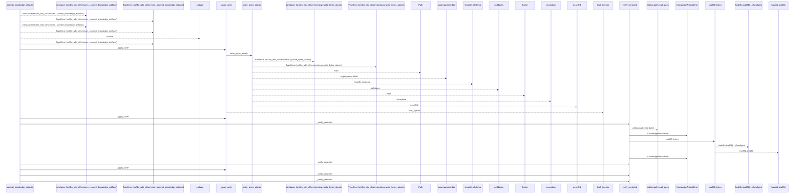
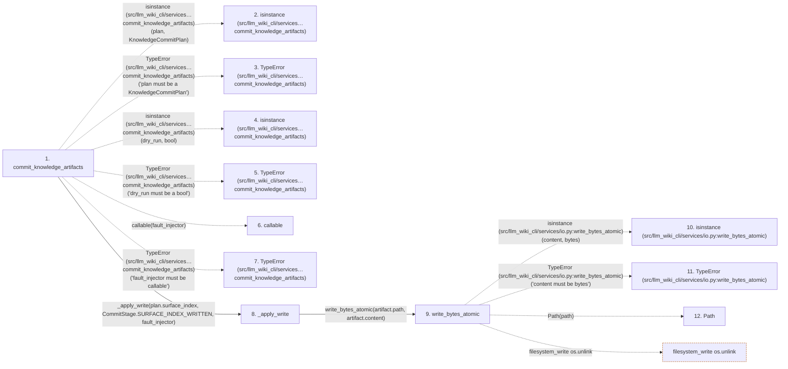

# commit_knowledge_artifacts

**Entry point:** `commit_knowledge_artifacts` (`api`)
**Source:** [knowledge_artifacts](../modules/knowledge_artifacts.md)
**Modules touched:** [io](../modules/io.md), [knowledge_artifacts](../modules/knowledge_artifacts.md), [knowledge_evidence](../modules/knowledge_evidence.md)

## Call sequence

<!-- Auto-generated from static call edges. Dashed arrows are external or unresolved calls. Reviewed runtime conditions and side effects belong in Behavior. -->

> Call sequence diagram shows 30 of 32 interactions; 2 omitted to keep the visualization within the 30-interaction and generated-diagram limits.

## Data flow

<!-- Auto-generated static analysis. Treat values and boundaries as best-effort hints, not runtime proof. -->

### Step data

| Step | Inputs | Reads | Writes | Returns |
|---|---|---|---|---|
| `commit_knowledge_artifacts` | `plan: KnowledgeCommitPlan`, `dry_run: bool`, `fault_injector: FaultInjector \| None` | `KnowledgeCommitPlan`, `CommitStage`, `CommitStage`, `CommitStage` | - | `KnowledgeCommitResult(...)` |
| `isinstance (src/llm_wiki_cli/services…commit_knowledge_artifacts)` | - | - | - | - |
| `TypeError (src/llm_wiki_cli/services…commit_knowledge_artifacts)` | - | - | - | - |
| `isinstance (src/llm_wiki_cli/services…commit_knowledge_artifacts)` | - | - | - | - |
| `TypeError (src/llm_wiki_cli/services…commit_knowledge_artifacts)` | - | - | - | - |
| `callable` | - | - | - | - |
| `TypeError (src/llm_wiki_cli/services…commit_knowledge_artifacts)` | - | - | - | - |
| `_apply_write` | `artifact: PlannedArtifactWrite`, `stage: CommitStage`, `fault_injector: FaultInjector \| None` | - | - | `none` |
| `write_bytes_atomic` | `path: str \| Path`, `content: bytes` | - | - | `target` |
| `isinstance (src/llm_wiki_cli/services/io.py:write_bytes_atomic)` | - | - | - | - |
| `TypeError (src/llm_wiki_cli/services/io.py:write_bytes_atomic)` | - | - | - | - |
| `Path` | - | - | - | - |

### Call data

| From | To | Line | Call |
|---|---|---:|---|
| commit_knowledge_artifacts | isinstance (src/llm_wiki_cli/services…commit_knowledge_artifacts) | 477 | `isinstance(plan, KnowledgeCommitPlan)` |
| commit_knowledge_artifacts | TypeError (src/llm_wiki_cli/services…commit_knowledge_artifacts) | 478 | `TypeError('plan must be a KnowledgeCommitPlan')` |
| commit_knowledge_artifacts | isinstance (src/llm_wiki_cli/services…commit_knowledge_artifacts) | 479 | `isinstance(dry_run, bool)` |
| commit_knowledge_artifacts | TypeError (src/llm_wiki_cli/services…commit_knowledge_artifacts) | 480 | `TypeError('dry_run must be a bool')` |
| commit_knowledge_artifacts | callable | 481 | `callable(fault_injector)` |
| commit_knowledge_artifacts | TypeError (src/llm_wiki_cli/services…commit_knowledge_artifacts) | 482 | `TypeError('fault_injector must be callable')` |
| commit_knowledge_artifacts | _apply_write | 485 | `_apply_write(plan.surface_index, CommitStage.SURFACE_INDEX_WRITTEN, fault_injector)` |
| _apply_write | write_bytes_atomic | 550 | `write_bytes_atomic(artifact.path, artifact.content)` |
| write_bytes_atomic | isinstance (src/llm_wiki_cli/services/io.py:write_bytes_atomic) | 164 | `isinstance(content, bytes)` |
| write_bytes_atomic | TypeError (src/llm_wiki_cli/services/io.py:write_bytes_atomic) | 165 | `TypeError('content must be bytes')` |
| write_bytes_atomic | Path | 166 | `Path(path)` |

### Boundary effects

| Kind | Target | Step | Line |
|---|---|---|---:|
| filesystem_write | `os.unlink` | `write_bytes_atomic` | 179 |

### Static analysis gaps

| Kind | Step | Target | Line |
|---|---|---|---:|
| external_call | `commit_knowledge_artifacts` | `isinstance` | 477 |
| external_call | `commit_knowledge_artifacts` | `TypeError` | 478 |
| external_call | `commit_knowledge_artifacts` | `isinstance` | 479 |
| external_call | `commit_knowledge_artifacts` | `TypeError` | 480 |
| external_call | `commit_knowledge_artifacts` | `callable` | 481 |
| external_call | `commit_knowledge_artifacts` | `TypeError` | 482 |
| external_call | `write_bytes_atomic` | `isinstance` | 164 |
| external_call | `write_bytes_atomic` | `TypeError` | 165 |
| step_limit | `commit_knowledge_artifacts` | `first 12 steps` | 0 |

## Behavior

This flow starts at `commit_knowledge_artifacts` and is classified as `api`. The generated call and data-flow sections are bounded static projections; runtime conditions and side effects require source-level confirmation.
