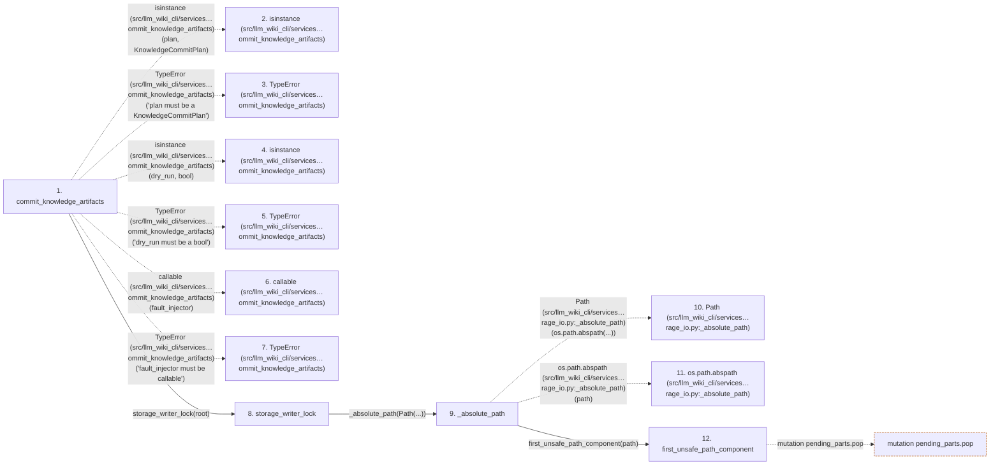

# commit_knowledge_artifacts

**Entry point:** `commit_knowledge_artifacts` (`api`)
**Source:** [knowledge_artifacts](../modules/knowledge_artifacts.md)
**Modules touched:** [common](../modules/common.md), [filesystem_guard](../modules/filesystem_guard.md), [io](../modules/io.md), [knowledge_artifacts](../modules/knowledge_artifacts.md), and 11 more

**Complete modules touched:**

- [common](../modules/common.md)
- [filesystem_guard](../modules/filesystem_guard.md)
- [io](../modules/io.md)
- [knowledge_artifacts](../modules/knowledge_artifacts.md)
- [knowledge_evidence](../modules/knowledge_evidence.md)
- [knowledge_governance](../modules/knowledge_governance.md)
- [knowledge_storage](../modules/knowledge_storage.md)
- [knowledge_storage_io](../modules/knowledge_storage_io.md)
- [maintenance_protocol](../modules/maintenance_protocol.md)
- [maintenance_shapes](../modules/maintenance_shapes.md)
- [maintenance_state](../modules/maintenance_state.md)
- [manifest_storage](../modules/manifest_storage.md)
- [sync_manifest](../modules/sync_manifest.md)
- [validation](../modules/validation.md)
- [wiki_write_basis](../modules/wiki_write_basis.md)

## Call sequence

> Static overview in presentation order, not runtime execution order. Arrows retain captured callers; siblings are shown before deeper helper detail.

<!-- Auto-generated from static call edges. Dashed arrows are external or unresolved calls. Reviewed runtime conditions and side effects belong in Behavior. -->

```mermaid
sequenceDiagram
    participant p0 as commit_knowledge_artifacts
    participant p1 as isinstance (src/llm_wiki_cli/services…ommit_knowledge_artifacts)
    participant p2 as TypeError (src/llm_wiki_cli/services…ommit_knowledge_artifacts)
    participant p3 as callable (src/llm_wiki_cli/services…ommit_knowledge_artifacts)
    participant p4 as storage_writer_lock
    participant p5 as load_adoption_marker
    participant p6 as KnowledgeArtifactError
    participant p7 as guard_maintenance_owner
    participant p8 as _commit_sharded
    participant p9 as _commit_flat
    participant p10 as KnowledgeCommitResult
    participant p11 as _absolute_path
    participant p12 as _apply_write
    participant p13 as Path (src/llm_wiki_cli/services…ol.py:storage_writer_lock)
    participant p14 as Path (src/llm_wiki_cli/services…l.py:load_adoption_marker)
    participant p15 as Path (src/llm_wiki_cli/services…y:guard_maintenance_owner)
    participant p16 as ensure_guarded_directory
    participant p17 as str (src/llm_wiki_cli/services…ol.py:storage_writer_lock)
    participant p18 as path.exists
    participant p19 as _verify_persisted
    participant p20 as _identity (src/llm_wiki_cli/services/maintenance_protocol.py)
    participant p21 as path.is_symlink
    p0-->>p1: isinstance (src/llm_wiki_cli/services…ommit_knowledge_artifacts)(plan, KnowledgeCommitPlan)
    p0-->>p2: TypeError (src/llm_wiki_cli/services…ommit_knowledge_artifacts)('plan must be a KnowledgeCommitPlan')
    p0-->>p1: isinstance (src/llm_wiki_cli/services…ommit_knowledge_artifacts)(dry_run, bool)
    p0-->>p2: TypeError (src/llm_wiki_cli/services…ommit_knowledge_artifacts)('dry_run must be a bool')
    p0-->>p3: callable (src/llm_wiki_cli/services…ommit_knowledge_artifacts)(fault_injector)
    p0-->>p2: TypeError (src/llm_wiki_cli/services…ommit_knowledge_artifacts)('fault_injector must be callable')
    p0->>p4: storage_writer_lock
    p0->>p5: load_adoption_marker
    p0->>p6: KnowledgeArtifactError
    p0->>p7: guard_maintenance_owner
    p0->>p8: _commit_sharded
    p0->>p9: _commit_flat
    p0->>p10: KnowledgeCommitResult
    p4->>p11: _absolute_path
    p5->>p11: _absolute_path
    p7->>p11: _absolute_path
    p8->>p11: _absolute_path
    p9->>p12: _apply_write
    p4-->>p13: Path (src/llm_wiki_cli/services…ol.py:storage_writer_lock)(wiki_dir)
    p5-->>p14: Path (src/llm_wiki_cli/services…l.py:load_adoption_marker)(wiki_dir)
    p7-->>p15: Path (src/llm_wiki_cli/services…y:guard_maintenance_owner)(wiki_dir)
    p8->>p16: ensure_guarded_directory
    p9->>p12: _apply_write
    p4-->>p17: str (src/llm_wiki_cli/services…ol.py:storage_writer_lock)(root)
    p5-->>p18: path.exists
    p7->>p5: load_adoption_marker
    p8->>p4: storage_writer_lock
    p9->>p19: _verify_persisted
    p4->>p20: _identity (src/llm_wiki_cli/services/maintenance_protocol.py)
    p5-->>p21: path.is_symlink
```

> Call sequence diagram shows 30 of 802 interactions; 772 omitted to keep the visualization within the 30-interaction and generated-diagram limits, with uncertain identities omitted rather than inferred.

> Captured boundary calls: external 10 of 332 (322 omitted); unresolved 2 of 141 (139 omitted). These counts cover the captured static trace.

Omitted captured detail, grouped by actual caller occurrence and target module:

| Caller | Parent step | Target module | Kind | Omitted interactions |
| --- | --- | --- | --- | --- |
| `src/llm_wiki_cli/services/knowledge_storage_io.py:_absolute_path` | 9 | - | external | 4 |
| `src/llm_wiki_cli/services/knowledge_storage_io.py:_absolute_path` | 9 | [src/llm_wiki_cli/services/io.py](../modules/io.md) | internal | 1 |
| `src/llm_wiki_cli/services/io.py:first_unsafe_path_component` | 12 | - | external | 20 |
| `src/llm_wiki_cli/services/io.py:first_unsafe_path_component` | 12 | - | unresolved | 5 |
| `src/llm_wiki_cli/services/knowledge_storage_io.py:_absolute_path` | 9 | [src/llm_wiki_cli/services/knowledge_storage.py](../modules/knowledge_storage.md) | internal | 1 |
| `src/llm_wiki_cli/services/knowledge_storage_io.py:_absolute_path` | 9 | - | unresolved | 3 |
| `src/llm_wiki_cli/services/maintenance_protocol.py:_identity` | 46 | - | external | 4 |
| `src/llm_wiki_cli/services/maintenance_protocol.py:storage_writer_lock` | 8 | - | unresolved | 3 |
> Omission summary shows 8 of 194 groups; 186 further groups are not expanded here. Counts above include all omitted interactions.
> Detailed flow queries retain their own coverage and limits; omitted paths may execute at runtime.

> Trace truncated at the depth limit; deeper calls are omitted.

## Data flow

<!-- Auto-generated static analysis. Treat values and boundaries as best-effort hints, not runtime proof. -->

```mermaid
flowchart LR
    s1["1. commit_knowledge_artifacts"]
    s2["2. isinstance (src/llm_wiki_cli/services…ommit_knowledge_artifacts)"]
    s3["3. TypeError (src/llm_wiki_cli/services…ommit_knowledge_artifacts)"]
    s4["4. isinstance (src/llm_wiki_cli/services…ommit_knowledge_artifacts)"]
    s5["5. TypeError (src/llm_wiki_cli/services…ommit_knowledge_artifacts)"]
    s6["6. callable (src/llm_wiki_cli/services…ommit_knowledge_artifacts)"]
    s7["7. TypeError (src/llm_wiki_cli/services…ommit_knowledge_artifacts)"]
    s8["8. storage_writer_lock"]
    s9["9. _absolute_path"]
    s10["10. Path (src/llm_wiki_cli/services…rage_io.py:_absolute_path)"]
    s11["11. os.path.abspath (src/llm_wiki_cli/services…rage_io.py:_absolute_path)"]
    s12["12. first_unsafe_path_component"]
    s1 -. "isinstance (src/llm_wiki_cli/services…ommit_knowledge_artifacts)(plan, KnowledgeCommitPlan)" .-> s2
    s1 -. "TypeError (src/llm_wiki_cli/services…ommit_knowledge_artifacts)('plan must be a KnowledgeCommitPlan')" .-> s3
    s1 -. "isinstance (src/llm_wiki_cli/services…ommit_knowledge_artifacts)(dry_run, bool)" .-> s4
    s1 -. "TypeError (src/llm_wiki_cli/services…ommit_knowledge_artifacts)('dry_run must be a bool')" .-> s5
    s1 -. "callable (src/llm_wiki_cli/services…ommit_knowledge_artifacts)(fault_injector)" .-> s6
    s1 -. "TypeError (src/llm_wiki_cli/services…ommit_knowledge_artifacts)('fault_injector must be callable')" .-> s7
    s1 -->|"storage_writer_lock(root)"| s8
    s8 -->|"_absolute_path(Path(...))"| s9
    s9 -. "Path (src/llm_wiki_cli/services…rage_io.py:_absolute_path)(os.path.abspath(...))" .-> s10
    s9 -. "os.path.abspath (src/llm_wiki_cli/services…rage_io.py:_absolute_path)(path)" .-> s11
    s9 -->|"first_unsafe_path_component(path)"| s12
    b0["mutation pending_parts.pop"]
    s12 -. "mutation pending_parts.pop" .-> b0
    click s1 "../modules/knowledge_artifacts.md"
    click s8 "../modules/maintenance_protocol.md"
    click s9 "../modules/knowledge_storage_io.md"
    click s12 "../modules/io.md"
    classDef boundary stroke:#b45309,stroke-dasharray: 4 2
    class b0 boundary
```

### Step data

| Step | Inputs | Reads | Writes | Returns |
|---|---|---|---|---|
| `commit_knowledge_artifacts` | `plan: KnowledgeCommitPlan`, `dry_run: bool`, `fault_injector: FaultInjector \| None` | `KnowledgeCommitPlan` | - | `KnowledgeCommitResult(...)` |
| `isinstance (src/llm_wiki_cli/services…ommit_knowledge_artifacts)` | - | - | - | - |
| `TypeError (src/llm_wiki_cli/services…ommit_knowledge_artifacts)` | - | - | - | - |
| `isinstance (src/llm_wiki_cli/services…ommit_knowledge_artifacts)` | - | - | - | - |
| `TypeError (src/llm_wiki_cli/services…ommit_knowledge_artifacts)` | - | - | - | - |
| `callable (src/llm_wiki_cli/services…ommit_knowledge_artifacts)` | - | - | - | - |
| `TypeError (src/llm_wiki_cli/services…ommit_knowledge_artifacts)` | - | - | - | - |
| `storage_writer_lock` | `wiki_dir: str \| Path` | `STORAGE_LOCK_FILENAME` | - | `none` |
| `_absolute_path` | `path: Path` | - | - | `path` |
| `Path (src/llm_wiki_cli/services…rage_io.py:_absolute_path)` | - | - | - | - |
| `os.path.abspath (src/llm_wiki_cli/services…rage_io.py:_absolute_path)` | - | - | - | - |
| `first_unsafe_path_component` | `path: str \| Path`, `trusted_symlink_uids: Set[int] \| None`, `trusted_symlink_owner: Callable[[Path], bool] \| None` | `stat`, `os` | - | `lexical`, `None`, `current`, `current`, `current`, `current`, `current`, `None` |

### Call data

| From | To | Line | Call |
|---|---|---:|---|
| commit_knowledge_artifacts | isinstance (src/llm_wiki_cli/services…ommit_knowledge_artifacts) | 709 | `isinstance(plan, KnowledgeCommitPlan)` |
| commit_knowledge_artifacts | TypeError (src/llm_wiki_cli/services…ommit_knowledge_artifacts) | 710 | `TypeError('plan must be a KnowledgeCommitPlan')` |
| commit_knowledge_artifacts | isinstance (src/llm_wiki_cli/services…ommit_knowledge_artifacts) | 711 | `isinstance(dry_run, bool)` |
| commit_knowledge_artifacts | TypeError (src/llm_wiki_cli/services…ommit_knowledge_artifacts) | 712 | `TypeError('dry_run must be a bool')` |
| commit_knowledge_artifacts | callable (src/llm_wiki_cli/services…ommit_knowledge_artifacts) | 713 | `callable(fault_injector)` |
| commit_knowledge_artifacts | TypeError (src/llm_wiki_cli/services…ommit_knowledge_artifacts) | 714 | `TypeError('fault_injector must be callable')` |
| commit_knowledge_artifacts | storage_writer_lock | 720 | `storage_writer_lock(root)` |
| storage_writer_lock | _absolute_path | 49 | `_absolute_path(Path(...))` |
| _absolute_path | Path (src/llm_wiki_cli/services…rage_io.py:_absolute_path) | 49 | `Path(os.path.abspath(...))` |
| _absolute_path | os.path.abspath (src/llm_wiki_cli/services…rage_io.py:_absolute_path) | 49 | `os.path.abspath(path)` |
| _absolute_path | first_unsafe_path_component | 50 | `first_unsafe_path_component(path)` |

### Boundary effects

| Kind | Target | Step | Line |
|---|---|---|---:|
| mutation | `pending_parts.pop` | `first_unsafe_path_component` | 71 |

### Static analysis gaps

| Kind | Step | Target | Line |
|---|---|---|---:|
| external_call | `commit_knowledge_artifacts` | `isinstance` | 709 |
| external_call | `commit_knowledge_artifacts` | `TypeError` | 710 |
| external_call | `commit_knowledge_artifacts` | `isinstance` | 711 |
| external_call | `commit_knowledge_artifacts` | `TypeError` | 712 |
| external_call | `commit_knowledge_artifacts` | `callable` | 713 |
| external_call | `commit_knowledge_artifacts` | `TypeError` | 714 |
| external_call | `_absolute_path` | `os.path.abspath` | 49 |
| step_limit | `commit_knowledge_artifacts` | `first 12 steps` | 0 |
| truncated_flow | `commit_knowledge_artifacts` | `depth limit` | 0 |

## Behavior

This flow starts at `commit_knowledge_artifacts` and is classified as `api`. The generated call and data-flow sections are bounded static projections; runtime conditions and side effects require source-level confirmation.
