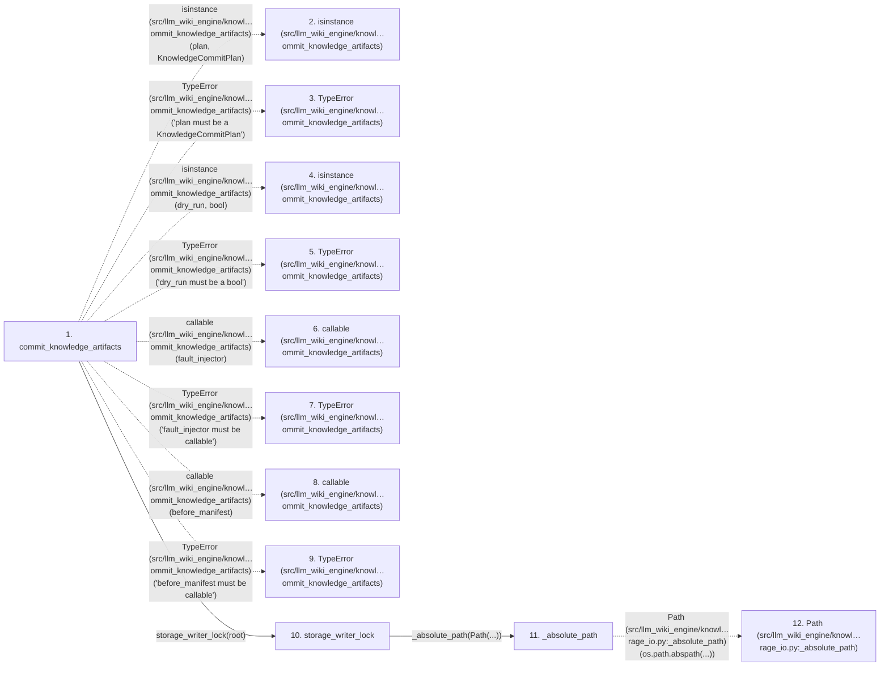

# commit_knowledge_artifacts

**Entry point:** `commit_knowledge_artifacts` (`api`)
**Source:** [knowledge_artifacts](../modules/knowledge_artifacts.md)
**Modules touched:** [canonical_json](../modules/canonical_json.md), [filesystem_guard](../modules/filesystem_guard.md), [host](../modules/host.md), [integrations](../modules/integrations.md), and 13 more

**Complete modules touched:**

- [canonical_json](../modules/canonical_json.md)
- [filesystem_guard](../modules/filesystem_guard.md)
- [host](../modules/host.md)
- [integrations](../modules/integrations.md)
- [io](../modules/io.md)
- [knowledge_artifacts](../modules/knowledge_artifacts.md)
- [knowledge_evidence](../modules/knowledge_evidence.md)
- [knowledge_governance](../modules/knowledge_governance.md)
- [knowledge_storage](../modules/knowledge_storage.md)
- [knowledge_storage_io](../modules/knowledge_storage_io.md)
- [maintenance_protocol](../modules/maintenance_protocol.md)
- [maintenance_shapes](../modules/maintenance_shapes.md)
- [maintenance_state](../modules/maintenance_state.md)
- [manifest_storage](../modules/manifest_storage.md)
- [sync_manifest](../modules/sync_manifest.md)
- [validation](../modules/validation.md)
- [wiki_write_basis](../modules/wiki_write_basis.md)

## Call sequence

> Static overview in presentation order, not runtime execution order. Arrows retain captured callers; representative internal continuations and boundary examples precede repeated helper detail.

<!-- Auto-generated from static call edges. Dashed arrows are external or unresolved calls. Reviewed runtime conditions and side effects belong in Behavior. -->

```mermaid
sequenceDiagram
    participant p0 as commit_knowledge_artifacts
    participant p1 as storage_writer_lock
    participant p2 as load_adoption_marker
    participant p3 as guard_maintenance_owner
    participant p4 as _commit_sharded
    participant p5 as _commit_flat
    participant p6 as KnowledgeArtifactError
    participant p7 as KnowledgeCommitResult
    participant p8 as _absolute_path
    participant p9 as _apply_write
    participant p10 as ensure_guarded_directory
    participant p11 as _verify_persisted
    participant p12 as read_guarded
    participant p13 as governance_lock
    participant p14 as SyncManifest.load
    participant p15 as validate_maintenance_adoption
    participant p16 as canonical_bytes
    participant p17 as _validate_range
    participant p18 as _detached
    participant p19 as compact_line_bytes
    participant p20 as write_bytes_atomic
    participant p21 as first_unsafe_path_component
    participant p22 as guard_windows_directory_chain
    participant p23 as maintenance_core
    participant p24 as _governance_lock_root
    participant p25 as open_windows_readonly_file
    participant p26 as _assert_windows_file_binding
    participant p27 as StorageReadSession.read
    participant p28 as SyncManifest.from_payload
    participant p29 as isinstance (src/llm_wiki_engine/knowl…ommit_knowledge_artifacts)
    participant p30 as path.exists
    p0->>p1: storage_writer_lock
    p0->>p2: load_adoption_marker
    p0->>p3: guard_maintenance_owner
    p0->>p4: _commit_sharded
    p0->>p5: _commit_flat
    p0->>p6: KnowledgeArtifactError
    p0->>p7: KnowledgeCommitResult
    p1->>p8: _absolute_path
    p5->>p9: _apply_write
    p4->>p10: ensure_guarded_directory
    p5->>p11: _verify_persisted
    p2->>p12: read_guarded
    p1->>p13: governance_lock
    p3->>p14: SyncManifest.load
    p2->>p15: validate_maintenance_adoption
    p2->>p16: canonical_bytes
    p12->>p17: _validate_range
    p15->>p18: _detached
    p16->>p19: compact_line_bytes
    p9->>p20: write_bytes_atomic
    p8->>p21: first_unsafe_path_component
    p12->>p22: guard_windows_directory_chain
    p15->>p23: maintenance_core
    p13->>p24: _governance_lock_root
    p12->>p25: open_windows_readonly_file
    p12->>p26: _assert_windows_file_binding
    p14->>p27: StorageReadSession.read
    p14->>p28: SyncManifest.from_payload
    p0-->>p29: isinstance (src/llm_wiki_engine/knowl…ommit_knowledge_artifacts)(plan, KnowledgeCommitPlan)
    p2-->>p30: path.exists
```

> Call sequence diagram shows 30 of 880 interactions; 850 omitted to keep the visualization within the 30-interaction and generated-diagram limits, with uncertain identities omitted rather than inferred.

> Captured boundary calls: external 1 of 358 (357 omitted); unresolved 1 of 156 (155 omitted). These counts cover the captured static trace.

Omitted captured detail, grouped by actual caller occurrence and target module:

| Caller | Parent step | Target module | Kind | Omitted interactions |
| --- | --- | --- | --- | --- |
| `src/llm_wiki_engine/knowledge_artifacts.py:commit_knowledge_artifacts` | 1 | - | external | 7 |
| `src/llm_wiki_engine/knowledge_storage_io.py:_absolute_path` | 11 | - | external | 4 |
| `src/llm_wiki_engine/io.py:first_unsafe_path_component` | 14 | - | external | 19 |
| `src/llm_wiki_engine/io.py:first_unsafe_path_component` | 14 | - | unresolved | 6 |
| `src/llm_wiki_engine/io.py:first_unsafe_path_component` | 14 | [src/llm_wiki_engine/host.py](../modules/host.md) | internal | 1 |
| `src/llm_wiki_engine/host.py:current_host` | 21 | - | unresolved | 1 |
| `src/llm_wiki_engine/knowledge_storage_io.py:_absolute_path` | 11 | [src/llm_wiki_engine/knowledge_storage.py](../modules/knowledge_storage.md) | internal | 1 |
| `src/llm_wiki_engine/knowledge_storage_io.py:_absolute_path` | 11 | - | unresolved | 3 |
> Omission summary shows 8 of 214 groups; 206 further groups are not expanded here. Counts above include all omitted interactions.
> Detailed flow queries retain their own coverage and limits; omitted paths may execute at runtime.

> Trace truncated at the depth limit; deeper calls are omitted.

## Data flow

<!-- Auto-generated static analysis. Treat values and boundaries as best-effort hints, not runtime proof. -->

### Analysis coverage

**Effect analysis partially available.** Flow assembly and source effect analysis are separate; empty observations do not prove an empty handler body.

Source steps: 367; effect analysis evaluated: 204, partial: 15, unavailable: 148. Counts include steps omitted from the displayed trace.

Collector observations for 219 source steps with known totals: observed: 1143, emitted: 1106, omitted: 37. Unavailable totals are excluded.

- Callable record unavailable for one or more source steps; those steps have no represented callable body.
- Effect collector omitted observations before flow assembly; displayed effects are partial.
- Effect collector totals unavailable; observed counts cover captured records only.

| Step | Callable record | Effect analysis | Collector totals | Observed | Emitted | Omitted |
|---|---|---|---|---:|---:|---:|
| `commit_knowledge_artifacts` | `available` | `evaluated` | `available` | `6` | `6` | `0` |
| `isinstance (src/llm_wiki_engine/knowl…ommit_knowledge_artifacts)` | `not_applicable` | `not_applicable` | `not_applicable` | — | — | — |
| `TypeError (src/llm_wiki_engine/knowl…ommit_knowledge_artifacts)` | `not_applicable` | `not_applicable` | `not_applicable` | — | — | — |
| `isinstance (src/llm_wiki_engine/knowl…ommit_knowledge_artifacts)` | `not_applicable` | `not_applicable` | `not_applicable` | — | — | — |
| `TypeError (src/llm_wiki_engine/knowl…ommit_knowledge_artifacts)` | `not_applicable` | `not_applicable` | `not_applicable` | — | — | — |
| `callable (src/llm_wiki_engine/knowl…ommit_knowledge_artifacts)` | `not_applicable` | `not_applicable` | `not_applicable` | — | — | — |
| `TypeError (src/llm_wiki_engine/knowl…ommit_knowledge_artifacts)` | `not_applicable` | `not_applicable` | `not_applicable` | — | — | — |
| `callable (src/llm_wiki_engine/knowl…ommit_knowledge_artifacts)` | `not_applicable` | `not_applicable` | `not_applicable` | — | — | — |
| `TypeError (src/llm_wiki_engine/knowl…ommit_knowledge_artifacts)` | `not_applicable` | `not_applicable` | `not_applicable` | — | — | — |
| `storage_writer_lock` | `available` | `evaluated` | `available` | `3` | `3` | `0` |
| `_absolute_path` | `available` | `evaluated` | `available` | `2` | `2` | `0` |
| `Path (src/llm_wiki_engine/knowl…rage_io.py:_absolute_path)` | `not_applicable` | `not_applicable` | `not_applicable` | — | — | — |

```mermaid
flowchart LR
    s1["1. commit_knowledge_artifacts"]
    s2["2. isinstance (src/llm_wiki_engine/knowl…ommit_knowledge_artifacts)"]
    s3["3. TypeError (src/llm_wiki_engine/knowl…ommit_knowledge_artifacts)"]
    s4["4. isinstance (src/llm_wiki_engine/knowl…ommit_knowledge_artifacts)"]
    s5["5. TypeError (src/llm_wiki_engine/knowl…ommit_knowledge_artifacts)"]
    s6["6. callable (src/llm_wiki_engine/knowl…ommit_knowledge_artifacts)"]
    s7["7. TypeError (src/llm_wiki_engine/knowl…ommit_knowledge_artifacts)"]
    s8["8. callable (src/llm_wiki_engine/knowl…ommit_knowledge_artifacts)"]
    s9["9. TypeError (src/llm_wiki_engine/knowl…ommit_knowledge_artifacts)"]
    s10["10. storage_writer_lock"]
    s11["11. _absolute_path"]
    s12["12. Path (src/llm_wiki_engine/knowl…rage_io.py:_absolute_path)"]
    s1 -. "isinstance (src/llm_wiki_engine/knowl…ommit_knowledge_artifacts)(plan, KnowledgeCommitPlan)" .-> s2
    s1 -. "TypeError (src/llm_wiki_engine/knowl…ommit_knowledge_artifacts)('plan must be a KnowledgeCommitPlan')" .-> s3
    s1 -. "isinstance (src/llm_wiki_engine/knowl…ommit_knowledge_artifacts)(dry_run, bool)" .-> s4
    s1 -. "TypeError (src/llm_wiki_engine/knowl…ommit_knowledge_artifacts)('dry_run must be a bool')" .-> s5
    s1 -. "callable (src/llm_wiki_engine/knowl…ommit_knowledge_artifacts)(fault_injector)" .-> s6
    s1 -. "TypeError (src/llm_wiki_engine/knowl…ommit_knowledge_artifacts)('fault_injector must be callable')" .-> s7
    s1 -. "callable (src/llm_wiki_engine/knowl…ommit_knowledge_artifacts)(before_manifest)" .-> s8
    s1 -. "TypeError (src/llm_wiki_engine/knowl…ommit_knowledge_artifacts)('before_manifest must be callable')" .-> s9
    s1 -->|"storage_writer_lock(root)"| s10
    s10 -->|"_absolute_path(Path(...))"| s11
    s11 -. "Path (src/llm_wiki_engine/knowl…rage_io.py:_absolute_path)(os.path.abspath(...))" .-> s12
    click s1 "../modules/knowledge_artifacts.md"
    click s10 "../modules/maintenance_protocol.md"
    click s11 "../modules/knowledge_storage_io.md"
```

### Step data

| Step | Inputs | Reads | Writes | Returns |
|---|---|---|---|---|
| `commit_knowledge_artifacts` | `plan: KnowledgeCommitPlan`, `dry_run: bool`, `fault_injector: FaultInjector \| None`, `before_manifest: Callable[[], None] \| None` | `KnowledgeCommitPlan` | - | `KnowledgeCommitResult(...)` |
| `isinstance (src/llm_wiki_engine/knowl…ommit_knowledge_artifacts)` | - | - | - | - |
| `TypeError (src/llm_wiki_engine/knowl…ommit_knowledge_artifacts)` | - | - | - | - |
| `isinstance (src/llm_wiki_engine/knowl…ommit_knowledge_artifacts)` | - | - | - | - |
| `TypeError (src/llm_wiki_engine/knowl…ommit_knowledge_artifacts)` | - | - | - | - |
| `callable (src/llm_wiki_engine/knowl…ommit_knowledge_artifacts)` | - | - | - | - |
| `TypeError (src/llm_wiki_engine/knowl…ommit_knowledge_artifacts)` | - | - | - | - |
| `callable (src/llm_wiki_engine/knowl…ommit_knowledge_artifacts)` | - | - | - | - |
| `TypeError (src/llm_wiki_engine/knowl…ommit_knowledge_artifacts)` | - | - | - | - |
| `storage_writer_lock` | `wiki_dir: str \| Path` | `STORAGE_LOCK_FILENAME` | - | `none` |
| `_absolute_path` | `path: Path` | - | - | `path` |
| `Path (src/llm_wiki_engine/knowl…rage_io.py:_absolute_path)` | - | - | - | - |

### Call data

| From | To | Line | Call |
|---|---|---:|---|
| commit_knowledge_artifacts | isinstance (src/llm_wiki_engine/knowl…ommit_knowledge_artifacts) | 865 | `isinstance(plan, KnowledgeCommitPlan)` |
| commit_knowledge_artifacts | TypeError (src/llm_wiki_engine/knowl…ommit_knowledge_artifacts) | 866 | `TypeError('plan must be a KnowledgeCommitPlan')` |
| commit_knowledge_artifacts | isinstance (src/llm_wiki_engine/knowl…ommit_knowledge_artifacts) | 867 | `isinstance(dry_run, bool)` |
| commit_knowledge_artifacts | TypeError (src/llm_wiki_engine/knowl…ommit_knowledge_artifacts) | 868 | `TypeError('dry_run must be a bool')` |
| commit_knowledge_artifacts | callable (src/llm_wiki_engine/knowl…ommit_knowledge_artifacts) | 869 | `callable(fault_injector)` |
| commit_knowledge_artifacts | TypeError (src/llm_wiki_engine/knowl…ommit_knowledge_artifacts) | 870 | `TypeError('fault_injector must be callable')` |
| commit_knowledge_artifacts | callable (src/llm_wiki_engine/knowl…ommit_knowledge_artifacts) | 871 | `callable(before_manifest)` |
| commit_knowledge_artifacts | TypeError (src/llm_wiki_engine/knowl…ommit_knowledge_artifacts) | 872 | `TypeError('before_manifest must be callable')` |
| commit_knowledge_artifacts | storage_writer_lock | 878 | `storage_writer_lock(root)` |
| storage_writer_lock | _absolute_path | 59 | `_absolute_path(Path(...))` |
| _absolute_path | Path (src/llm_wiki_engine/knowl…rage_io.py:_absolute_path) | 49 | `Path(os.path.abspath(...))` |

### Boundary effects

*No boundary-effect observations were captured in this static trace.*

### Static analysis gaps

| Kind | Step | Target | Line |
|---|---|---|---:|
| external_call | `commit_knowledge_artifacts` | `isinstance` | 865 |
| external_call | `commit_knowledge_artifacts` | `TypeError` | 866 |
| external_call | `commit_knowledge_artifacts` | `isinstance` | 867 |
| external_call | `commit_knowledge_artifacts` | `TypeError` | 868 |
| external_call | `commit_knowledge_artifacts` | `callable` | 869 |
| external_call | `commit_knowledge_artifacts` | `TypeError` | 870 |
| external_call | `commit_knowledge_artifacts` | `callable` | 871 |
| external_call | `commit_knowledge_artifacts` | `TypeError` | 872 |
| step_limit | `commit_knowledge_artifacts` | `first 12 steps` | 0 |
| truncated_flow | `commit_knowledge_artifacts` | `depth limit` | 0 |

## Behavior

This flow starts at `commit_knowledge_artifacts` and is classified as `api`. The generated call and data-flow sections are bounded static projections; runtime conditions and side effects require source-level confirmation.
