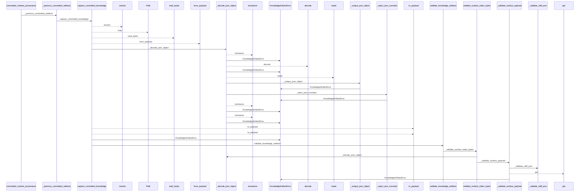
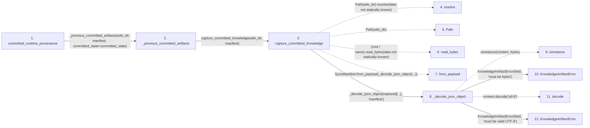

# committed_runtime_provenance

**Entry point:** `committed_runtime_provenance` (`api`)
**Source:** [knowledge_orchestration](../modules/knowledge_orchestration.md)
**Modules touched:** [immutable](../modules/immutable.md), [infrastructure_sync](../modules/infrastructure_sync.md), [knowledge_artifacts](../modules/knowledge_artifacts.md), and 12 more

**Complete modules touched:**

- [immutable](../modules/immutable.md)
- [infrastructure_sync](../modules/infrastructure_sync.md)
- [knowledge_artifacts](../modules/knowledge_artifacts.md)
- [knowledge_envelope](../modules/knowledge_envelope.md)
- [knowledge_evidence](../modules/knowledge_evidence.md)
- [knowledge_governance](../modules/knowledge_governance.md)
- [knowledge_graph](../modules/knowledge_graph.md)
- [knowledge_index](../modules/knowledge_index.md)
- [knowledge_model](../modules/knowledge_model.md)
- [knowledge_orchestration](../modules/knowledge_orchestration.md)
- [knowledge_reuse](../modules/knowledge_reuse.md)
- [markdown_sections](../modules/markdown_sections.md)
- [section_ownership](../modules/section_ownership.md)
- [validation](../modules/validation.md)
- [wiki_surface](../modules/wiki_surface.md)

## Call sequence

<!-- Auto-generated from static call edges. Dashed arrows are external or unresolved calls. Reviewed runtime conditions and side effects belong in Behavior. -->

> Call sequence diagram shows 30 of 499 interactions; 469 omitted to keep the visualization within the 30-interaction and generated-diagram limits.

> Trace truncated at the depth limit; deeper calls are omitted.

## Data flow

<!-- Auto-generated static analysis. Treat values and boundaries as best-effort hints, not runtime proof. -->

### Step data

| Step | Inputs | Reads | Writes | Returns |
|---|---|---|---|---|
| `committed_runtime_provenance` | `wiki_dir: str \| Path`, `manifest: SyncManifest \| None`, `committed_state: CommittedKnowledgeState \| None` | - | - | `None`, `CommittedRuntimeProvenance(...)` |
| `_previous_committed_artifacts` | `wiki_dir: str \| Path`, `manifest: SyncManifest \| None`, `committed_state: CommittedKnowledgeState \| None` | - | - | `state.artifacts` |
| `capture_committed_knowledge` | `wiki_dir: str \| Path`, `manifest: SyncManifest \| None` | `SURFACE_INDEX_FILENAME`, `KNOWLEDGE_INDEX_FILENAME`, `MANIFEST_FILENAME`, `MANIFEST_FILENAME`, `SURFACE_INDEX_FILENAME`, `KNOWLEDGE_INDEX_FILENAME`, `KnowledgeArtifactError`, `_COMMITTED_STATE_TOKEN` | `captured[...]`, `captured[...]` | `state` |
| `resolve` | - | - | - | - |
| `Path` | - | - | - | - |
| `read_bytes` | - | - | - | - |
| `from_payload` | - | - | - | - |
| `_decode_json_object` | `content: bytes`, `field: str` | `KnowledgeArtifactError`, `Mapping` | - | `value` |
| `isinstance` | - | - | - | - |
| `KnowledgeArtifactError` | - | - | - | - |
| `decode` | - | - | - | - |
| `KnowledgeArtifactError` | - | - | - | - |

### Call data

| From | To | Line | Call |
|---|---|---:|---|
| committed_runtime_provenance | _previous_committed_artifacts | 719 | `_previous_committed_artifacts(wiki_dir, manifest, committed_state=committed_state)` |
| _previous_committed_artifacts | capture_committed_knowledge | 690 | `capture_committed_knowledge(wiki_dir, manifest)` |
| capture_committed_knowledge | resolve | 226 | `Path(wiki_dir).resolve(data not statically known)` |
| capture_committed_knowledge | Path | 226 | `Path(wiki_dir)` |
| capture_committed_knowledge | read_bytes | 230 | `(root / name).read_bytes(data not statically known)` |
| capture_committed_knowledge | from_payload | 237 | `SyncManifest.from_payload(_decode_json_object(...))` |
| capture_committed_knowledge | _decode_json_object | 238 | `_decode_json_object(captured[...], 'manifest')` |
| _decode_json_object | isinstance | 574 | `isinstance(content, bytes)` |
| _decode_json_object | KnowledgeArtifactError | 575 | `KnowledgeArtifactError(field, 'must be bytes')` |
| _decode_json_object | decode | 577 | `content.decode('utf-8')` |
| _decode_json_object | KnowledgeArtifactError | 579 | `KnowledgeArtifactError(field, 'must be valid UTF-8')` |

### Boundary effects

*No boundary effects detected.*

### Static analysis gaps

| Kind | Step | Target | Line |
|---|---|---|---:|
| unresolved_call | `capture_committed_knowledge` | `Path(wiki_dir).resolve` | 226 |
| unresolved_call | `capture_committed_knowledge` | `(root / name).read_bytes` | 230 |
| external_call | `capture_committed_knowledge` | `SyncManifest.from_payload` | 237 |
| unresolved_call | `_decode_json_object` | `isinstance` | 574 |
| unresolved_call | `_decode_json_object` | `content.decode` | 577 |
| step_limit | `committed_runtime_provenance` | `first 12 steps` | 0 |
| truncated_flow | `committed_runtime_provenance` | `depth limit` | 0 |

## Behavior

This flow starts at `committed_runtime_provenance` and is classified as `api`. The generated call and data-flow sections are bounded static projections; runtime conditions and side effects require source-level confirmation.
