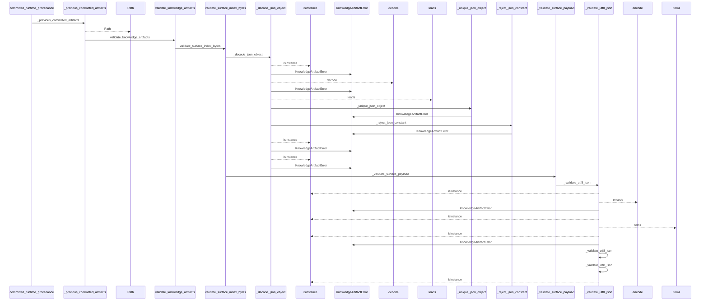
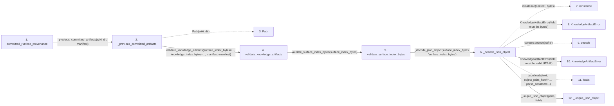

# committed_runtime_provenance

**Entry point:** `committed_runtime_provenance` (`api`)
**Source:** [knowledge_orchestration](../modules/knowledge_orchestration.md)
**Modules touched:** [infrastructure_sync](../modules/infrastructure_sync.md), [knowledge_artifacts](../modules/knowledge_artifacts.md), [knowledge_envelope](../modules/knowledge_envelope.md), and 11 more

**Complete modules touched:**

- [infrastructure_sync](../modules/infrastructure_sync.md)
- [knowledge_artifacts](../modules/knowledge_artifacts.md)
- [knowledge_envelope](../modules/knowledge_envelope.md)
- [knowledge_evidence](../modules/knowledge_evidence.md)
- [knowledge_governance](../modules/knowledge_governance.md)
- [knowledge_graph](../modules/knowledge_graph.md)
- [knowledge_index](../modules/knowledge_index.md)
- [knowledge_links](../modules/knowledge_links.md)
- [knowledge_model](../modules/knowledge_model.md)
- [knowledge_orchestration](../modules/knowledge_orchestration.md)
- [section_ownership](../modules/section_ownership.md)
- [validation](../modules/validation.md)
- [wiki_media](../modules/wiki_media.md)
- [wiki_surface](../modules/wiki_surface.md)

## Call sequence

<!-- Auto-generated from static call edges. Dashed arrows are external or unresolved calls. Reviewed runtime conditions and side effects belong in Behavior. -->

> Call sequence diagram shows 30 of 738 interactions; 708 omitted to keep the visualization within the 30-interaction and generated-diagram limits.

> Trace truncated at the depth limit; deeper calls are omitted.

## Data flow

<!-- Auto-generated static analysis. Treat values and boundaries as best-effort hints, not runtime proof. -->

### Step data

| Step | Inputs | Reads | Writes | Returns |
|---|---|---|---|---|
| `committed_runtime_provenance` | `wiki_dir: str \| Path`, `manifest: SyncManifest \| None` | - | - | `None`, `CommittedRuntimeProvenance(...)` |
| `_previous_committed_artifacts` | `wiki_dir: str \| Path`, `manifest: SyncManifest \| None` | `KnowledgeArtifactError` | - | `None`, `None`, `None`, `validated` |
| `Path` | - | - | - | - |
| `validate_knowledge_artifacts` | `surface_index_bytes: bytes`, `knowledge_index_bytes: bytes`, `manifest: SyncManifest` | `KNOWLEDGE_SCHEMA_VERSION`, `_KNOWLEDGE_SCHEMA_VERSION_RE`, `ConceptKind`, `KnowledgeGraphError`, `TYPED_GRAPH_EXTENSION_KEY`, `INVENTORY_HASH_EXTENSION`, `TYPED_GRAPH_EXTENSION_KEY`, `SECTION_OWNERSHIP_EXTENSION_KEY` | - | `ValidatedKnowledgeArtifacts(...)` |
| `validate_surface_index_bytes` | `surface_index_bytes: bytes` | - | - | `surface_payload` |
| `_decode_json_object` | `content: bytes`, `field: str` | `KnowledgeArtifactError`, `Mapping` | - | `value` |
| `isinstance` | - | - | - | - |
| `KnowledgeArtifactError` | - | - | - | - |
| `decode` | - | - | - | - |
| `KnowledgeArtifactError` | - | - | - | - |
| `loads` | - | - | - | - |
| `_unique_json_object` | `pairs: list[tuple[str, Any]]`, `field: str` | - | `result[...]` | `result` |

### Call data

| From | To | Line | Call |
|---|---|---:|---|
| committed_runtime_provenance | _previous_committed_artifacts | 614 | `_previous_committed_artifacts(wiki_dir, manifest)` |
| _previous_committed_artifacts | Path | 576 | `Path(wiki_dir)` |
| _previous_committed_artifacts | validate_knowledge_artifacts | 578 | `validate_knowledge_artifacts(surface_index_bytes=..., knowledge_index_bytes=..., manifest=manifest)` |
| validate_knowledge_artifacts | validate_surface_index_bytes | 205 | `validate_surface_index_bytes(surface_index_bytes)` |
| validate_surface_index_bytes | _decode_json_object | 174 | `_decode_json_object(surface_index_bytes, 'surface_index_bytes')` |
| _decode_json_object | isinstance | 502 | `isinstance(content, bytes)` |
| _decode_json_object | KnowledgeArtifactError | 503 | `KnowledgeArtifactError(field, 'must be bytes')` |
| _decode_json_object | decode | 505 | `content.decode('utf-8')` |
| _decode_json_object | KnowledgeArtifactError | 507 | `KnowledgeArtifactError(field, 'must be valid UTF-8')` |
| _decode_json_object | loads | 509 | `json.loads(text, object_pairs_hook=..., parse_constant=...)` |
| _decode_json_object | _unique_json_object | 511 | `_unique_json_object(pairs, field)` |

### Boundary effects

*No boundary effects detected.*

### Static analysis gaps

| Kind | Step | Target | Line |
|---|---|---|---:|
| unresolved_call | `_decode_json_object` | `isinstance` | 502 |
| unresolved_call | `_decode_json_object` | `content.decode` | 505 |
| external_call | `_decode_json_object` | `json.loads` | 509 |
| step_limit | `committed_runtime_provenance` | `first 12 steps` | 0 |
| truncated_flow | `committed_runtime_provenance` | `depth limit` | 0 |

## Behavior

This flow starts at `committed_runtime_provenance` and is classified as `api`. The generated call and data-flow sections are bounded static projections; runtime conditions and side effects require source-level confirmation.
