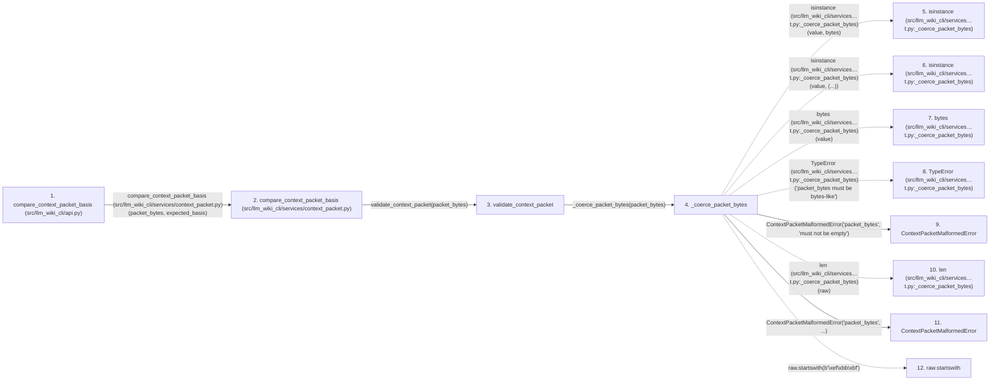

# compare_context_packet_basis

**Entry point:** `compare_context_packet_basis` (`api`)
**Source:** [api](../modules/api.md)
**Modules touched:** [api](../modules/api.md), [context_packet](../modules/context_packet.md), [context_service](../modules/context_service.md), [knowledge_evidence](../modules/knowledge_evidence.md)

## Call sequence

```mermaid
sequenceDiagram
    participant p0 as compare_context_packet_basis (src/llm_wiki_cli/api.py)
    participant p1 as compare_context_packet_basis (src/llm_wiki_cli/services/context_packet.py)
    participant p2 as validate_context_packet
    participant p3 as _coerce_packet_bytes
    participant p4 as isinstance (src/llm_wiki_cli/services…t.py:_coerce_packet_bytes)
    participant p5 as bytes (src/llm_wiki_cli/services…t.py:_coerce_packet_bytes)
    participant p6 as TypeError (src/llm_wiki_cli/services…t.py:_coerce_packet_bytes)
    participant p7 as ContextPacketMalformedError
    participant p8 as len (src/llm_wiki_cli/services…t.py:_coerce_packet_bytes)
    participant p9 as raw.startswith
    participant p10 as raw.endswith
    participant p11 as _strict_json_payload
    participant p12 as raw.decode
    participant p13 as json.loads
    participant p14 as isinstance (src/llm_wiki_cli/services…t.py:_strict_json_payload)
    participant p15 as _validate_json_tree
    participant p16 as set (src/llm_wiki_cli/services…et.py:_validate_json_tree)
    participant p17 as visit (src/llm_wiki_cli/services…et.py:_validate_json_tree)
    participant p18 as _packet_contract_for_schema
    participant p19 as isinstance (src/llm_wiki_cli/services…acket_contract_for_schema)
    participant p20 as _PACKET_CONTRACT_BY_SCHEMA.get
    p0->>p1: compare_context_packet_basis (src/llm_wiki_cli/services/context_packet.py)
    p1->>p2: validate_context_packet
    p2->>p3: _coerce_packet_bytes
    p3-->>p4: isinstance (src/llm_wiki_cli/services…t.py:_coerce_packet_bytes)
    p3-->>p4: isinstance (src/llm_wiki_cli/services…t.py:_coerce_packet_bytes)
    p3-->>p5: bytes (src/llm_wiki_cli/services…t.py:_coerce_packet_bytes)
    p3-->>p6: TypeError (src/llm_wiki_cli/services…t.py:_coerce_packet_bytes)
    p3->>p7: ContextPacketMalformedError
    p3-->>p8: len (src/llm_wiki_cli/services…t.py:_coerce_packet_bytes)
    p3->>p7: ContextPacketMalformedError
    p3-->>p9: raw.startswith
    p3->>p7: ContextPacketMalformedError
    p3-->>p10: raw.endswith
    p3-->>p10: raw.endswith
    p3->>p7: ContextPacketMalformedError
    p2->>p11: _strict_json_payload
    p11-->>p12: raw.decode
    p11->>p7: ContextPacketMalformedError
    p11-->>p13: json.loads
    p11->>p7: ContextPacketMalformedError
    p11-->>p14: isinstance (src/llm_wiki_cli/services…t.py:_strict_json_payload)
    p11->>p7: ContextPacketMalformedError
    p11->>p15: _validate_json_tree
    p15-->>p16: set (src/llm_wiki_cli/services…et.py:_validate_json_tree)
    p15-->>p17: visit (src/llm_wiki_cli/services…et.py:_validate_json_tree)
    p2->>p18: _packet_contract_for_schema
    p18-->>p19: isinstance (src/llm_wiki_cli/services…acket_contract_for_schema)
    p18->>p7: ContextPacketMalformedError
    p18-->>p20: _PACKET_CONTRACT_BY_SCHEMA.get
    p18->>p7: ContextPacketMalformedError
```

<!-- Auto-generated from static call edges. Dashed arrows are external or unresolved calls. Reviewed runtime conditions and side effects belong in Behavior. -->

> Call sequence diagram shows 30 of 411 interactions; 381 omitted to keep the visualization within the 30-interaction and generated-diagram limits.

> Trace truncated at the depth limit; deeper calls are omitted.

## Data flow

<!-- Auto-generated static analysis. Treat values and boundaries as best-effort hints, not runtime proof. -->

### Step data

| Step | Inputs | Reads | Writes | Returns |
|---|---|---|---|---|
| `compare_context_packet_basis (src/llm_wiki_cli/api.py)` | `packet_bytes: bytes \| bytearray \| memoryview`, `expected_basis: Mapping[str, Any]` | `context_packet_service`, `context_packet_service` | - | `comparison` |
| `compare_context_packet_basis (src/llm_wiki_cli/services/context_packet.py)` | `packet_bytes: bytes \| bytearray \| memoryview`, `expected_basis: Mapping[str, Any]` | `Mapping` | - | `ContextBasisComparison(...)` |
| `validate_context_packet` | `packet_bytes: bytes \| bytearray \| memoryview` | - | - | `ContextPacketValidation(...)` |
| `_coerce_packet_bytes` | `value: bytes \| bytearray \| memoryview` | `_MAX_PACKET_BYTES`, `_MAX_PACKET_BYTES` | - | `raw` |
| `isinstance (src/llm_wiki_cli/services…t.py:_coerce_packet_bytes)` | - | - | - | - |
| `isinstance (src/llm_wiki_cli/services…t.py:_coerce_packet_bytes)` | - | - | - | - |
| `bytes (src/llm_wiki_cli/services…t.py:_coerce_packet_bytes)` | - | - | - | - |
| `TypeError (src/llm_wiki_cli/services…t.py:_coerce_packet_bytes)` | - | - | - | - |
| `ContextPacketMalformedError` | - | - | - | - |
| `len (src/llm_wiki_cli/services…t.py:_coerce_packet_bytes)` | - | - | - | - |
| `ContextPacketMalformedError` | - | - | - | - |
| `raw.startswith` | - | - | - | - |

### Call data

| From | To | Line | Call |
|---|---|---:|---|
| compare_context_packet_basis (src/llm_wiki_cli/api.py) | compare_context_packet_basis (src/llm_wiki_cli/services/context_packet.py) | 1020 | `context_packet_service.compare_context_packet_basis(packet_bytes, expected_basis)` |
| compare_context_packet_basis (src/llm_wiki_cli/services/context_packet.py) | validate_context_packet | 1537 | `validate_context_packet(packet_bytes)` |
| validate_context_packet | _coerce_packet_bytes | 1488 | `_coerce_packet_bytes(packet_bytes)` |
| _coerce_packet_bytes | isinstance (src/llm_wiki_cli/services…t.py:_coerce_packet_bytes) | 2251 | `isinstance(value, bytes)` |
| _coerce_packet_bytes | isinstance (src/llm_wiki_cli/services…t.py:_coerce_packet_bytes) | 2253 | `isinstance(value, (...))` |
| _coerce_packet_bytes | bytes (src/llm_wiki_cli/services…t.py:_coerce_packet_bytes) | 2254 | `bytes(value)` |
| _coerce_packet_bytes | TypeError (src/llm_wiki_cli/services…t.py:_coerce_packet_bytes) | 2256 | `TypeError('packet_bytes must be bytes-like')` |
| _coerce_packet_bytes | ContextPacketMalformedError | 2258 | `ContextPacketMalformedError('packet_bytes', 'must not be empty')` |
| _coerce_packet_bytes | len (src/llm_wiki_cli/services…t.py:_coerce_packet_bytes) | 2259 | `len(raw)` |
| _coerce_packet_bytes | ContextPacketMalformedError | 2260 | `ContextPacketMalformedError('packet_bytes', ...)` |
| _coerce_packet_bytes | raw.startswith | 2264 | `raw.startswith(b'\xef\xbb\xbf')` |

### Boundary effects

*No boundary effects detected.*

### Static analysis gaps

| Kind | Step | Target | Line |
|---|---|---|---:|
| external_call | `_coerce_packet_bytes` | `isinstance` | 2251 |
| external_call | `_coerce_packet_bytes` | `isinstance` | 2253 |
| external_call | `_coerce_packet_bytes` | `bytes` | 2254 |
| external_call | `_coerce_packet_bytes` | `TypeError` | 2256 |
| unresolved_call | `_coerce_packet_bytes` | `raw.startswith` | 2264 |
| step_limit | `compare_context_packet_basis` | `first 12 steps` | 0 |
| truncated_flow | `compare_context_packet_basis` | `depth limit` | 0 |

## Behavior

This flow starts at `compare_context_packet_basis` and is classified as `api`. The generated call and data-flow sections are bounded static projections; runtime conditions and side effects require source-level confirmation.
