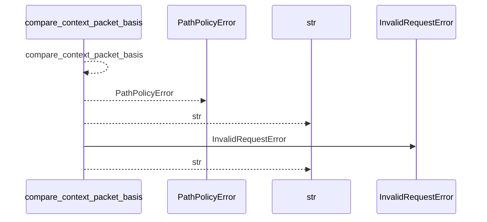
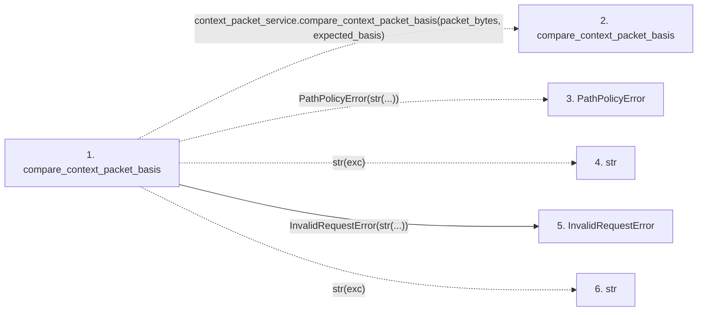

# compare_context_packet_basis

**Entry point:** `compare_context_packet_basis` (`api`)
**Source:** [api](../modules/api.md)
**Modules touched:** [api](../modules/api.md)

## Call sequence

<!-- Auto-generated from static call edges. Dashed arrows are external or unresolved calls. Reviewed runtime conditions and side effects belong in Behavior. -->

## Data flow

<!-- Auto-generated static analysis. Treat values and boundaries as best-effort hints, not runtime proof. -->

### Step data

| Step | Inputs | Reads | Writes | Returns |
|---|---|---|---|---|
| `compare_context_packet_basis` | `packet_bytes: bytes \| bytearray \| memoryview`, `expected_basis: Mapping[str, Any]` | `context_packet_service`, `context_packet_service` | - | `comparison` |
| `compare_context_packet_basis` | - | - | - | - |
| `PathPolicyError` | - | - | - | - |
| `str` | - | - | - | - |
| `InvalidRequestError` | - | - | - | - |
| `str` | - | - | - | - |

### Call data

| From | To | Line | Call |
|---|---|---:|---|
| compare_context_packet_basis | compare_context_packet_basis | 960 | `context_packet_service.compare_context_packet_basis(packet_bytes, expected_basis)` |
| compare_context_packet_basis | PathPolicyError | 965 | `PathPolicyError(str(...))` |
| compare_context_packet_basis | str | 965 | `str(exc)` |
| compare_context_packet_basis | InvalidRequestError | 967 | `InvalidRequestError(str(...))` |
| compare_context_packet_basis | str | 967 | `str(exc)` |

### Boundary effects

*No boundary effects detected.*

### Static analysis gaps

| Kind | Step | Target | Line |
|---|---|---|---:|
| external_call | `compare_context_packet_basis` | `context_packet_service.compare_context_packet_basis` | 960 |
| unresolved_call | `compare_context_packet_basis` | `PathPolicyError` | 965 |

## Behavior

This flow starts at `compare_context_packet_basis` and is classified as `api`. The generated call and data-flow sections are bounded static projections; runtime conditions and side effects require source-level confirmation.
