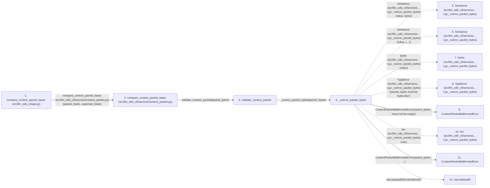

# compare_context_packet_basis

**Entry point:** `compare_context_packet_basis` (`api`)
**Source:** [api](../modules/api.md)
**Modules touched:** [api](../modules/api.md), [context_packet](../modules/context_packet.md), [context_service](../modules/context_service.md), [knowledge_evidence](../modules/knowledge_evidence.md), and 2 more

**Complete modules touched:**

- [api](../modules/api.md)
- [context_packet](../modules/context_packet.md)
- [context_service](../modules/context_service.md)
- [knowledge_evidence](../modules/knowledge_evidence.md)
- [maintenance_status](../modules/maintenance_status.md)
- [packet_field_policy](../modules/packet_field_policy.md)

## Call sequence

> Static overview in presentation order, not runtime execution order. Arrows retain captured callers; siblings are shown before deeper helper detail.

<!-- Auto-generated from static call edges. Dashed arrows are external or unresolved calls. Reviewed runtime conditions and side effects belong in Behavior. -->

```mermaid
sequenceDiagram
    participant p0 as compare_context_packet_basis (src/llm_wiki_cli/api.py)
    participant p1 as compare_context_packet_basis (src/llm_wiki_cli/services/context_packet.py)
    participant p2 as _raise_context_packet_api_error
    participant p3 as validate_context_packet
    participant p4 as _raise_required_knowledge_api_error
    participant p5 as isinstance (src/llm_wiki_cli/services…pare_context_packet_basis)
    participant p6 as describe_context_packet_error
    participant p7 as TypeError (src/llm_wiki_cli/services…pare_context_packet_basis)
    participant p8 as leaf
    participant p9 as validation.packet.to_payload
    participant p10 as set (src/llm_wiki_cli/services…pare_context_packet_basis)
    participant p11 as sorted (src/llm_wiki_cli/services…pare_context_packet_basis)
    participant p12 as ContextPacketMalformedError
    participant p13 as ContextBasisComparison
    participant p14 as all (src/llm_wiki_cli/services…pare_context_packet_basis)
    participant p15 as facet_matches.values
    participant p16 as MappingProxyType (src/llm_wiki_cli/services…pare_context_packet_basis)
    participant p17 as _coerce_packet_bytes
    participant p18 as _required_knowledge_failure
    participant p19 as getattr (src/llm_wiki_cli/services…ribe_context_packet_error)
    participant p20 as _strict_json_payload
    participant p21 as WorkspaceStateError
    participant p22 as isinstance (src/llm_wiki_cli/services…ribe_context_packet_error)
    participant p23 as _packet_contract_for_schema
    participant p24 as str (src/llm_wiki_cli/api.py:_…uired_knowledge_api_error)
    participant p25 as payload.get
    participant p26 as {'source': 'source_snapshot', 'wiki': 'wiki_dir'}.get
    p0->>p1: compare_context_packet_basis (src/llm_wiki_cli/services/context_packet.py)
    p0->>p2: _raise_context_packet_api_error
    p1->>p3: validate_context_packet
    p2->>p4: _raise_required_knowledge_api_error
    p1-->>p5: isinstance (src/llm_wiki_cli/services…pare_context_packet_basis)(expected_basis, Mapping)
    p2->>p6: describe_context_packet_error
    p1-->>p7: TypeError (src/llm_wiki_cli/services…pare_context_packet_basis)('expected_basis must be a mapping')
    p2-->>p8: leaf(failure[...], code=failure[...], details=failure[...])
    p1-->>p9: validation.packet.to_payload
    p1-->>p10: set (src/llm_wiki_cli/services…pare_context_packet_basis)(packet_basis)
    p1-->>p11: sorted (src/llm_wiki_cli/services…pare_context_packet_basis)(...)
    p1-->>p10: set (src/llm_wiki_cli/services…pare_context_packet_basis)(expected_basis)
    p1->>p12: ContextPacketMalformedError
    p1->>p12: ContextPacketMalformedError
    p1-->>p11: sorted (src/llm_wiki_cli/services…pare_context_packet_basis)(expected_basis)
    p1->>p13: ContextBasisComparison
    p1-->>p14: all (src/llm_wiki_cli/services…pare_context_packet_basis)(facet_matches.values(...))
    p1-->>p15: facet_matches.values
    p1-->>p16: MappingProxyType (src/llm_wiki_cli/services…pare_context_packet_basis)(facet_matches)
    p3->>p17: _coerce_packet_bytes
    p4->>p18: _required_knowledge_failure
    p6-->>p19: getattr (src/llm_wiki_cli/services…ribe_context_packet_error)(error, 'field', None)
    p3->>p20: _strict_json_payload
    p4->>p21: WorkspaceStateError
    p6-->>p22: isinstance (src/llm_wiki_cli/services…ribe_context_packet_error)(error, ContextPacketMalformedError)
    p3->>p23: _packet_contract_for_schema
    p4-->>p24: str (src/llm_wiki_cli/api.py:_…uired_knowledge_api_error)(exc)
    p6-->>p22: isinstance (src/llm_wiki_cli/services…ribe_context_packet_error)(error, ContextPacketSourceMutationError)
    p3-->>p25: payload.get('schema_version')
    p6-->>p26: {'source': 'source_snapshot', 'wiki': 'wiki_dir'}.get(error.facet, error.facet)
```

> Call sequence diagram shows 30 of 467 interactions; 437 omitted to keep the visualization within the 30-interaction and generated-diagram limits, with uncertain identities omitted rather than inferred.

> Captured boundary calls: external 12 of 140 (128 omitted); unresolved 5 of 94 (89 omitted). These counts cover the captured static trace.

Omitted captured detail, grouped by actual caller occurrence and target module:

| Caller | Parent step | Target module | Kind | Omitted interactions |
| --- | --- | --- | --- | --- |
| `src/llm_wiki_cli/services/context_packet.py:_coerce_packet_bytes` | 4 | - | external | 5 |
| `src/llm_wiki_cli/services/context_packet.py:_coerce_packet_bytes` | 4 | [src/llm_wiki_cli/services/context_packet.py](../modules/context_packet.md) | internal | 4 |
| `src/llm_wiki_cli/services/context_packet.py:_coerce_packet_bytes` | 4 | - | unresolved | 3 |
| `src/llm_wiki_cli/services/context_packet.py:_strict_json_payload` | 17 | - | unresolved | 1 |
| `src/llm_wiki_cli/services/context_packet.py:_strict_json_payload` | 17 | [src/llm_wiki_cli/services/context_packet.py](../modules/context_packet.md) | internal | 4 |
| `src/llm_wiki_cli/services/context_packet.py:_strict_json_payload` | 17 | - | external | 2 |
| `src/llm_wiki_cli/services/context_packet.py:_validate_json_tree` | 24 | - | external | 1 |
| `src/llm_wiki_cli/services/context_packet.py:_validate_json_tree` | 24 | - | unresolved | 1 |
> Omission summary shows 8 of 105 groups; 97 further groups are not expanded here. Counts above include all omitted interactions.
> Detailed flow queries retain their own coverage and limits; omitted paths may execute at runtime.

> Trace truncated at the depth limit; deeper calls are omitted.

## Data flow

<!-- Auto-generated static analysis. Treat values and boundaries as best-effort hints, not runtime proof. -->

```mermaid
flowchart LR
    s1["1. compare_context_packet_basis (src/llm_wiki_cli/api.py)"]
    s2["2. compare_context_packet_basis (src/llm_wiki_cli/services/context_packet.py)"]
    s3["3. validate_context_packet"]
    s4["4. _coerce_packet_bytes"]
    s5["5. isinstance (src/llm_wiki_cli/services…t.py:_coerce_packet_bytes)"]
    s6["6. isinstance (src/llm_wiki_cli/services…t.py:_coerce_packet_bytes)"]
    s7["7. bytes (src/llm_wiki_cli/services…t.py:_coerce_packet_bytes)"]
    s8["8. TypeError (src/llm_wiki_cli/services…t.py:_coerce_packet_bytes)"]
    s9["9. ContextPacketMalformedError"]
    s10["10. len (src/llm_wiki_cli/services…t.py:_coerce_packet_bytes)"]
    s11["11. ContextPacketMalformedError"]
    s12["12. raw.startswith"]
    s1 -->|"compare_context_packet_basis (src/llm_wiki_cli/services/context_packet.py)(packet_bytes, expected_basis)"| s2
    s2 -->|"validate_context_packet(packet_bytes)"| s3
    s3 -->|"_coerce_packet_bytes(packet_bytes)"| s4
    s4 -. "isinstance (src/llm_wiki_cli/services…t.py:_coerce_packet_bytes)(value, bytes)" .-> s5
    s4 -. "isinstance (src/llm_wiki_cli/services…t.py:_coerce_packet_bytes)(value, (...))" .-> s6
    s4 -. "bytes (src/llm_wiki_cli/services…t.py:_coerce_packet_bytes)(value)" .-> s7
    s4 -. "TypeError (src/llm_wiki_cli/services…t.py:_coerce_packet_bytes)('packet_bytes must be bytes-like')" .-> s8
    s4 -->|"ContextPacketMalformedError('packet_bytes', 'must not be empty')"| s9
    s4 -. "len (src/llm_wiki_cli/services…t.py:_coerce_packet_bytes)(raw)" .-> s10
    s4 -->|"ContextPacketMalformedError('packet_bytes', ...)"| s11
    s4 -. "raw.startswith(b'\xef\xbb\xbf')" .-> s12
    click s1 "../modules/api.md"
    click s2 "../modules/context_packet.md"
    click s3 "../modules/context_packet.md"
    click s4 "../modules/context_packet.md"
    click s9 "../modules/context_packet.md"
    click s11 "../modules/context_packet.md"
```

### Step data

| Step | Inputs | Reads | Writes | Returns |
|---|---|---|---|---|
| `compare_context_packet_basis (src/llm_wiki_cli/api.py)` | `packet_bytes: bytes \| bytearray \| memoryview`, `expected_basis: Mapping[str, Any]` | `context_packet_service` | - | `comparison` |
| `compare_context_packet_basis (src/llm_wiki_cli/services/context_packet.py)` | `packet_bytes: bytes \| bytearray \| memoryview`, `expected_basis: Mapping[str, Any]` | `Mapping` | - | `ContextBasisComparison(...)` |
| `validate_context_packet` | `packet_bytes: bytes \| bytearray \| memoryview` | - | - | `ContextPacketValidation(...)` |
| `_coerce_packet_bytes` | `value: bytes \| bytearray \| memoryview` | `_MAX_PACKET_BYTES`, `_MAX_PACKET_BYTES` | - | `raw` |
| `isinstance (src/llm_wiki_cli/services…t.py:_coerce_packet_bytes)` | - | - | - | - |
| `isinstance (src/llm_wiki_cli/services…t.py:_coerce_packet_bytes)` | - | - | - | - |
| `bytes (src/llm_wiki_cli/services…t.py:_coerce_packet_bytes)` | - | - | - | - |
| `TypeError (src/llm_wiki_cli/services…t.py:_coerce_packet_bytes)` | - | - | - | - |
| `ContextPacketMalformedError` | - | - | - | - |
| `len (src/llm_wiki_cli/services…t.py:_coerce_packet_bytes)` | - | - | - | - |
| `ContextPacketMalformedError` | - | - | - | - |
| `raw.startswith` | - | - | - | - |

### Call data

| From | To | Line | Call |
|---|---|---:|---|
| compare_context_packet_basis (src/llm_wiki_cli/api.py) | compare_context_packet_basis (src/llm_wiki_cli/services/context_packet.py) | 1767 | `context_packet_service.compare_context_packet_basis(packet_bytes, expected_basis)` |
| compare_context_packet_basis (src/llm_wiki_cli/services/context_packet.py) | validate_context_packet | 1761 | `validate_context_packet(packet_bytes)` |
| validate_context_packet | _coerce_packet_bytes | 1712 | `_coerce_packet_bytes(packet_bytes)` |
| _coerce_packet_bytes | isinstance (src/llm_wiki_cli/services…t.py:_coerce_packet_bytes) | 2493 | `isinstance(value, bytes)` |
| _coerce_packet_bytes | isinstance (src/llm_wiki_cli/services…t.py:_coerce_packet_bytes) | 2495 | `isinstance(value, (...))` |
| _coerce_packet_bytes | bytes (src/llm_wiki_cli/services…t.py:_coerce_packet_bytes) | 2496 | `bytes(value)` |
| _coerce_packet_bytes | TypeError (src/llm_wiki_cli/services…t.py:_coerce_packet_bytes) | 2498 | `TypeError('packet_bytes must be bytes-like')` |
| _coerce_packet_bytes | ContextPacketMalformedError | 2500 | `ContextPacketMalformedError('packet_bytes', 'must not be empty')` |
| _coerce_packet_bytes | len (src/llm_wiki_cli/services…t.py:_coerce_packet_bytes) | 2501 | `len(raw)` |
| _coerce_packet_bytes | ContextPacketMalformedError | 2502 | `ContextPacketMalformedError('packet_bytes', ...)` |
| _coerce_packet_bytes | raw.startswith | 2506 | `raw.startswith(b'\xef\xbb\xbf')` |

### Boundary effects

*No boundary effects detected.*

### Static analysis gaps

| Kind | Step | Target | Line |
|---|---|---|---:|
| external_call | `_coerce_packet_bytes` | `isinstance` | 2493 |
| external_call | `_coerce_packet_bytes` | `isinstance` | 2495 |
| external_call | `_coerce_packet_bytes` | `bytes` | 2496 |
| external_call | `_coerce_packet_bytes` | `TypeError` | 2498 |
| unresolved_call | `_coerce_packet_bytes` | `raw.startswith` | 2506 |
| step_limit | `compare_context_packet_basis` | `first 12 steps` | 0 |
| truncated_flow | `compare_context_packet_basis` | `depth limit` | 0 |

## Behavior

This flow starts at `compare_context_packet_basis` and is classified as `api`. The generated call and data-flow sections are bounded static projections; runtime conditions and side effects require source-level confirmation.
