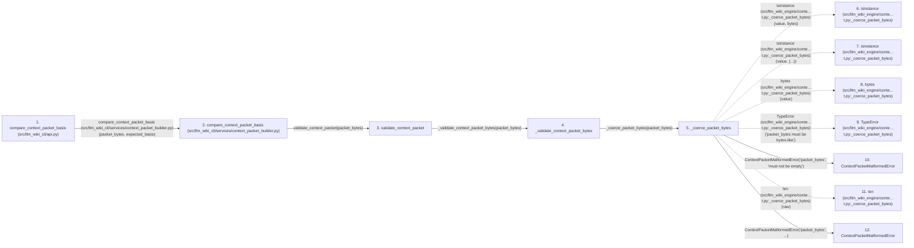

# compare_context_packet_basis

**Entry point:** `compare_context_packet_basis` (`api`)
**Source:** [api](../modules/api.md)
**Modules touched:** [api](../modules/api.md), [canonical_json](../modules/canonical_json.md), [context_packet](../modules/context_packet.md), [context_packet_builder](../modules/context_packet_builder.md), and 2 more

**Complete modules touched:**

- [api](../modules/api.md)
- [canonical_json](../modules/canonical_json.md)
- [context_packet](../modules/context_packet.md)
- [context_packet_builder](../modules/context_packet_builder.md)
- [knowledge_evidence](../modules/knowledge_evidence.md)
- [packet_field_policy](../modules/packet_field_policy.md)

## Call sequence

> Static overview in presentation order, not runtime execution order. Arrows retain captured callers; representative internal continuations and boundary examples precede repeated helper detail.

<!-- Auto-generated from static call edges. Dashed arrows are external or unresolved calls. Reviewed runtime conditions and side effects belong in Behavior. -->

```mermaid
sequenceDiagram
    participant p0 as compare_context_packet_basis (src/llm_wiki_cli/api.py)
    participant p1 as compare_context_packet_basis (src/llm_wiki_cli/services/context_packet_builder.py)
    participant p2 as _raise_context_packet_api_error
    participant p3 as validate_context_packet
    participant p4 as _raise_required_knowledge_api_error
    participant p5 as _validate_context_packet_bytes
    participant p6 as _coerce_packet_bytes
    participant p7 as _strict_json_payload
    participant p8 as _packet_contract_for_schema
    participant p9 as _validate_packet_shape
    participant p10 as _encode_packet_payload
    participant p11 as _packet_id
    participant p12 as _path_policy_receipt
    participant p13 as QualifiedContextPacket._from_validated_payload
    participant p14 as _exact_fields
    participant p15 as compact_bytes
    participant p16 as _freeze_json
    participant p17 as _validate_assurance
    participant p18 as _validate_packet_request
    participant p19 as _validate_response
    participant p20 as _validate_basis
    participant p21 as _validate_response_basis_consistency
    participant p22 as _validate_delivery
    participant p23 as _validate_path_policy_shape
    participant p24 as describe_context_packet_error
    participant p25 as ContextPacketMalformedError
    participant p26 as ContextBasisComparison
    participant p27 as _required_knowledge_failure
    participant p28 as WorkspaceStateError
    participant p29 as isinstance (src/llm_wiki_cli/services…pare_context_packet_basis)
    participant p30 as leaf
    p0->>p1: compare_context_packet_basis (src/llm_wiki_cli/services/context_packet_builder.py)
    p0->>p2: _raise_context_packet_api_error
    p1->>p3: validate_context_packet
    p2->>p4: _raise_required_knowledge_api_error
    p3->>p5: _validate_context_packet_bytes
    p5->>p6: _coerce_packet_bytes
    p5->>p7: _strict_json_payload
    p5->>p8: _packet_contract_for_schema
    p5->>p9: _validate_packet_shape
    p5->>p10: _encode_packet_payload
    p5->>p11: _packet_id
    p5->>p12: _path_policy_receipt
    p5->>p13: QualifiedContextPacket._from_validated_payload
    p9->>p14: _exact_fields
    p10->>p15: compact_bytes
    p13->>p16: _freeze_json
    p9->>p17: _validate_assurance
    p9->>p18: _validate_packet_request
    p9->>p19: _validate_response
    p9->>p20: _validate_basis
    p9->>p21: _validate_response_basis_consistency
    p9->>p22: _validate_delivery
    p9->>p23: _validate_path_policy_shape
    p2->>p24: describe_context_packet_error
    p1->>p25: ContextPacketMalformedError
    p1->>p26: ContextBasisComparison
    p4->>p27: _required_knowledge_failure
    p4->>p28: WorkspaceStateError
    p1-->>p29: isinstance (src/llm_wiki_cli/services…pare_context_packet_basis)(expected_basis, Mapping)
    p2-->>p30: leaf(failure[...], code=failure[...], details=failure[...])
```

> Call sequence diagram shows 30 of 295 interactions; 265 omitted to keep the visualization within the 30-interaction and generated-diagram limits, with uncertain identities omitted rather than inferred.

> Captured boundary calls: external 1 of 92 (91 omitted); unresolved 1 of 65 (64 omitted). These counts cover the captured static trace.

Omitted captured detail, grouped by actual caller occurrence and target module:

| Caller | Parent step | Target module | Kind | Omitted interactions |
| --- | --- | --- | --- | --- |
| `src/llm_wiki_engine/context_packet.py:_coerce_packet_bytes` | 5 | - | external | 5 |
| `src/llm_wiki_engine/context_packet.py:_coerce_packet_bytes` | 5 | [src/llm_wiki_engine/context_packet.py](../modules/context_packet.md) | internal | 4 |
| `src/llm_wiki_engine/context_packet.py:_coerce_packet_bytes` | 5 | - | unresolved | 3 |
| `src/llm_wiki_engine/context_packet.py:_strict_json_payload` | 18 | - | unresolved | 1 |
| `src/llm_wiki_engine/context_packet.py:_strict_json_payload` | 18 | [src/llm_wiki_engine/context_packet.py](../modules/context_packet.md) | internal | 4 |
| `src/llm_wiki_engine/context_packet.py:_strict_json_payload` | 18 | - | external | 2 |
| `src/llm_wiki_engine/context_packet.py:_validate_json_tree` | 25 | - | external | 1 |
| `src/llm_wiki_engine/context_packet.py:_validate_json_tree` | 25 | - | unresolved | 1 |
> Omission summary shows 8 of 71 groups; 63 further groups are not expanded here. Counts above include all omitted interactions.
> Detailed flow queries retain their own coverage and limits; omitted paths may execute at runtime.

> Trace truncated at the depth limit; deeper calls are omitted.

## Data flow

<!-- Auto-generated static analysis. Treat values and boundaries as best-effort hints, not runtime proof. -->

### Analysis coverage

**Effect analysis partially available.** Flow assembly and source effect analysis are separate; empty observations do not prove an empty handler body.

Source steps: 139; effect analysis evaluated: 75, partial: 1, unavailable: 63. Counts include steps omitted from the displayed trace.

Collector observations for 76 source steps with known totals: observed: 319, emitted: 314, omitted: 5. Unavailable totals are excluded.

- Callable record unavailable for one or more source steps; those steps have no represented callable body.
- Effect collector omitted observations before flow assembly; displayed effects are partial.
- Effect collector totals unavailable; observed counts cover captured records only.

| Step | Callable record | Effect analysis | Collector totals | Observed | Emitted | Omitted |
|---|---|---|---|---:|---:|---:|
| `compare_context_packet_basis (src/llm_wiki_cli/api.py)` | `available` | `evaluated` | `available` | `4` | `4` | `0` |
| `compare_context_packet_basis (src/llm_wiki_cli/services/context_packet_builder.py)` | `available` | `evaluated` | `available` | `4` | `4` | `0` |
| `validate_context_packet` | `available` | `evaluated` | `available` | `4` | `4` | `0` |
| `_validate_context_packet_bytes` | `available` | `evaluated` | `available` | `2` | `2` | `0` |
| `_coerce_packet_bytes` | `available` | `evaluated` | `available` | `4` | `4` | `0` |
| `isinstance (src/llm_wiki_engine/conte…t.py:_coerce_packet_bytes)` | `not_applicable` | `not_applicable` | `not_applicable` | — | — | — |
| `isinstance (src/llm_wiki_engine/conte…t.py:_coerce_packet_bytes)` | `not_applicable` | `not_applicable` | `not_applicable` | — | — | — |
| `bytes (src/llm_wiki_engine/conte…t.py:_coerce_packet_bytes)` | `not_applicable` | `not_applicable` | `not_applicable` | — | — | — |
| `TypeError (src/llm_wiki_engine/conte…t.py:_coerce_packet_bytes)` | `not_applicable` | `not_applicable` | `not_applicable` | — | — | — |
| `ContextPacketMalformedError` | `unavailable` | `unavailable` | `unavailable` | — | — | — |
| `len (src/llm_wiki_engine/conte…t.py:_coerce_packet_bytes)` | `not_applicable` | `not_applicable` | `not_applicable` | — | — | — |
| `ContextPacketMalformedError` | `unavailable` | `unavailable` | `unavailable` | — | — | — |

```mermaid
flowchart LR
    s1["1. compare_context_packet_basis (src/llm_wiki_cli/api.py)"]
    s2["2. compare_context_packet_basis (src/llm_wiki_cli/services/context_packet_builder.py)"]
    s3["3. validate_context_packet"]
    s4["4. _validate_context_packet_bytes"]
    s5["5. _coerce_packet_bytes"]
    s6["6. isinstance (src/llm_wiki_engine/conte…t.py:_coerce_packet_bytes)"]
    s7["7. isinstance (src/llm_wiki_engine/conte…t.py:_coerce_packet_bytes)"]
    s8["8. bytes (src/llm_wiki_engine/conte…t.py:_coerce_packet_bytes)"]
    s9["9. TypeError (src/llm_wiki_engine/conte…t.py:_coerce_packet_bytes)"]
    s10["10. ContextPacketMalformedError"]
    s11["11. len (src/llm_wiki_engine/conte…t.py:_coerce_packet_bytes)"]
    s12["12. ContextPacketMalformedError"]
    s1 -->|"compare_context_packet_basis (src/llm_wiki_cli/services/context_packet_builder.py)(packet_bytes, expected_basis)"| s2
    s2 -->|"validate_context_packet(packet_bytes)"| s3
    s3 -->|"_validate_context_packet_bytes(packet_bytes)"| s4
    s4 -->|"_coerce_packet_bytes(packet_bytes)"| s5
    s5 -. "isinstance (src/llm_wiki_engine/conte…t.py:_coerce_packet_bytes)(value, bytes)" .-> s6
    s5 -. "isinstance (src/llm_wiki_engine/conte…t.py:_coerce_packet_bytes)(value, (...))" .-> s7
    s5 -. "bytes (src/llm_wiki_engine/conte…t.py:_coerce_packet_bytes)(value)" .-> s8
    s5 -. "TypeError (src/llm_wiki_engine/conte…t.py:_coerce_packet_bytes)('packet_bytes must be bytes-like')" .-> s9
    s5 -->|"ContextPacketMalformedError('packet_bytes', 'must not be empty')"| s10
    s5 -. "len (src/llm_wiki_engine/conte…t.py:_coerce_packet_bytes)(raw)" .-> s11
    s5 -->|"ContextPacketMalformedError('packet_bytes', ...)"| s12
    click s1 "../modules/api.md"
    click s2 "../modules/context_packet_builder.md"
    click s3 "../modules/context_packet.md"
    click s4 "../modules/context_packet.md"
    click s5 "../modules/context_packet.md"
    click s10 "../modules/context_packet.md"
    click s12 "../modules/context_packet.md"
```

### Step data

| Step | Inputs | Reads | Writes | Returns |
|---|---|---|---|---|
| `compare_context_packet_basis (src/llm_wiki_cli/api.py)` | `packet_bytes: bytes \| bytearray \| memoryview`, `expected_basis: Mapping[str, Any]` | `context_packet_service` | - | `comparison` |
| `compare_context_packet_basis (src/llm_wiki_cli/services/context_packet_builder.py)` | `packet_bytes: bytes \| bytearray \| memoryview`, `expected_basis: Mapping[str, Any]` | `Mapping` | - | `ContextBasisComparison(...)` |
| `validate_context_packet` | `packet_bytes: bytes \| bytearray \| memoryview`, `accepted_generators: Iterable[str] \| None` | - | - | `_validate_context_packet_bytes(...)`, `_validate_context_packet_bytes(...)` |
| `_validate_context_packet_bytes` | `packet_bytes: bytes \| bytearray \| memoryview` | - | - | `ContextPacketValidation(...)` |
| `_coerce_packet_bytes` | `value: bytes \| bytearray \| memoryview` | `_MAX_PACKET_BYTES`, `_MAX_PACKET_BYTES` | - | `raw` |
| `isinstance (src/llm_wiki_engine/conte…t.py:_coerce_packet_bytes)` | - | - | - | - |
| `isinstance (src/llm_wiki_engine/conte…t.py:_coerce_packet_bytes)` | - | - | - | - |
| `bytes (src/llm_wiki_engine/conte…t.py:_coerce_packet_bytes)` | - | - | - | - |
| `TypeError (src/llm_wiki_engine/conte…t.py:_coerce_packet_bytes)` | - | - | - | - |
| `ContextPacketMalformedError` | - | - | - | - |
| `len (src/llm_wiki_engine/conte…t.py:_coerce_packet_bytes)` | - | - | - | - |
| `ContextPacketMalformedError` | - | - | - | - |

### Call data

| From | To | Line | Call |
|---|---|---:|---|
| compare_context_packet_basis (src/llm_wiki_cli/api.py) | compare_context_packet_basis (src/llm_wiki_cli/services/context_packet_builder.py) | 2043 | `context_packet_builder.compare_context_packet_basis(packet_bytes, expected_basis)` |
| compare_context_packet_basis (src/llm_wiki_cli/services/context_packet_builder.py) | validate_context_packet | 1549 | `validate_context_packet(packet_bytes)` |
| validate_context_packet | _validate_context_packet_bytes | 319 | `_validate_context_packet_bytes(packet_bytes)` |
| _validate_context_packet_bytes | _coerce_packet_bytes | 335 | `_coerce_packet_bytes(packet_bytes)` |
| _coerce_packet_bytes | isinstance (src/llm_wiki_engine/conte…t.py:_coerce_packet_bytes) | 616 | `isinstance(value, bytes)` |
| _coerce_packet_bytes | isinstance (src/llm_wiki_engine/conte…t.py:_coerce_packet_bytes) | 618 | `isinstance(value, (...))` |
| _coerce_packet_bytes | bytes (src/llm_wiki_engine/conte…t.py:_coerce_packet_bytes) | 619 | `bytes(value)` |
| _coerce_packet_bytes | TypeError (src/llm_wiki_engine/conte…t.py:_coerce_packet_bytes) | 621 | `TypeError('packet_bytes must be bytes-like')` |
| _coerce_packet_bytes | ContextPacketMalformedError | 623 | `ContextPacketMalformedError('packet_bytes', 'must not be empty')` |
| _coerce_packet_bytes | len (src/llm_wiki_engine/conte…t.py:_coerce_packet_bytes) | 624 | `len(raw)` |
| _coerce_packet_bytes | ContextPacketMalformedError | 625 | `ContextPacketMalformedError('packet_bytes', ...)` |

### Boundary effects

*No boundary-effect observations were captured in this static trace.*

### Static analysis gaps

| Kind | Step | Target | Line |
|---|---|---|---:|
| external_call | `_coerce_packet_bytes` | `isinstance` | 616 |
| external_call | `_coerce_packet_bytes` | `isinstance` | 618 |
| external_call | `_coerce_packet_bytes` | `bytes` | 619 |
| external_call | `_coerce_packet_bytes` | `TypeError` | 621 |
| step_limit | `compare_context_packet_basis` | `first 12 steps` | 0 |
| truncated_flow | `compare_context_packet_basis` | `depth limit` | 0 |

## Behavior

This flow starts at `compare_context_packet_basis` and is classified as `api`. The generated call and data-flow sections are bounded static projections; runtime conditions and side effects require source-level confirmation.
