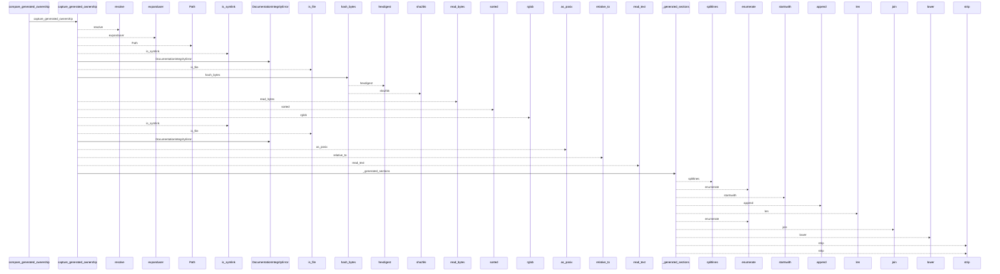
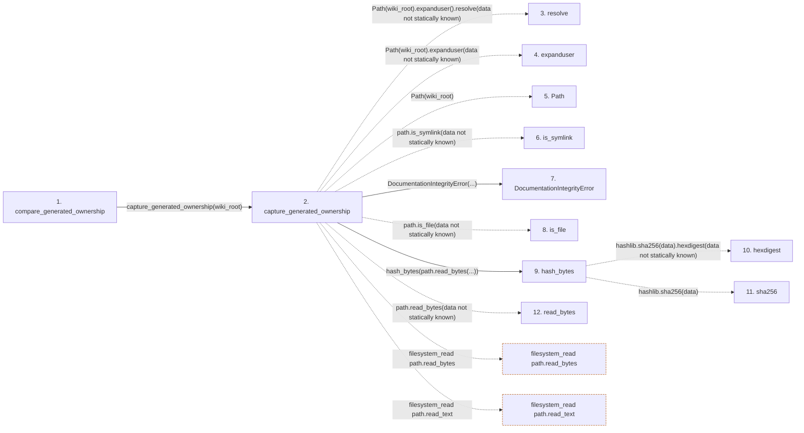

# compare_generated_ownership

**Entry point:** `compare_generated_ownership` (`api`)
**Source:** [integrity](../modules/integrity.md)
**Modules touched:** [documentation_policy](../modules/documentation_policy.md), [documentation_run_contracts](../modules/documentation_run_contracts.md), [integrity](../modules/integrity.md)

## Call sequence

<!-- Auto-generated from static call edges. Dashed arrows are external or unresolved calls. Reviewed runtime conditions and side effects belong in Behavior. -->

> Call sequence diagram shows 30 of 45 interactions; 15 omitted to keep the visualization within the 30-interaction and generated-diagram limits.

## Data flow

<!-- Auto-generated static analysis. Treat values and boundaries as best-effort hints, not runtime proof. -->

### Step data

| Step | Inputs | Reads | Writes | Returns |
|---|---|---|---|---|
| `compare_generated_ownership` | `baseline: Mapping[str, str]`, `wiki_root: str \| Path` | - | - | `{...}` |
| `capture_generated_ownership` | `wiki_root: str \| Path` | - | `fingerprints[...]` | `fingerprints` |
| `resolve` | - | - | - | - |
| `expanduser` | - | - | - | - |
| `Path` | - | - | - | - |
| `is_symlink` | - | - | - | - |
| `DocumentationIntegrityError` | - | - | - | - |
| `is_file` | - | - | - | - |
| `hash_bytes` | `data: bytes` | - | - | `...` |
| `hexdigest` | - | - | - | - |
| `sha256` | - | - | - | - |
| `read_bytes` | - | - | - | - |

### Call data

| From | To | Line | Call |
|---|---|---:|---|
| compare_generated_ownership | capture_generated_ownership | 44 | `capture_generated_ownership(wiki_root)` |
| capture_generated_ownership | resolve | 13 | `Path(wiki_root).expanduser().resolve(data not statically known)` |
| capture_generated_ownership | expanduser | 13 | `Path(wiki_root).expanduser(data not statically known)` |
| capture_generated_ownership | Path | 13 | `Path(wiki_root)` |
| capture_generated_ownership | is_symlink | 23 | `path.is_symlink(data not statically known)` |
| capture_generated_ownership | DocumentationIntegrityError | 24 | `DocumentationIntegrityError(...)` |
| capture_generated_ownership | is_file | 27 | `path.is_file(data not statically known)` |
| capture_generated_ownership | hash_bytes | 28 | `hash_bytes(path.read_bytes(...))` |
| hash_bytes | hexdigest | 520 | `hashlib.sha256(data).hexdigest(data not statically known)` |
| hash_bytes | sha256 | 520 | `hashlib.sha256(data)` |
| capture_generated_ownership | read_bytes | 28 | `path.read_bytes(data not statically known)` |

### Boundary effects

| Kind | Target | Step | Line |
|---|---|---|---:|
| filesystem_read | `path.read_bytes` | `capture_generated_ownership` | 28 |
| filesystem_read | `path.read_text` | `capture_generated_ownership` | 35 |

### Static analysis gaps

| Kind | Step | Target | Line |
|---|---|---|---:|
| unresolved_call | `capture_generated_ownership` | `Path(wiki_root).expanduser().resolve` | 13 |
| unresolved_call | `capture_generated_ownership` | `Path(wiki_root).expanduser` | 13 |
| unresolved_call | `capture_generated_ownership` | `path.is_symlink` | 23 |
| unresolved_call | `capture_generated_ownership` | `path.is_file` | 27 |
| external_call | `hash_bytes` | `hashlib.sha256(data).hexdigest` | 520 |
| external_call | `hash_bytes` | `hashlib.sha256` | 520 |
| step_limit | `compare_generated_ownership` | `first 12 steps` | 0 |

## Behavior

This flow starts at `compare_generated_ownership` and is classified as `api`. The generated call and data-flow sections are bounded static projections; runtime conditions and side effects require source-level confirmation.
