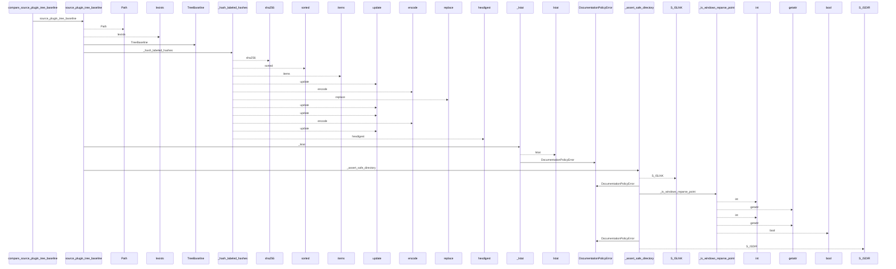
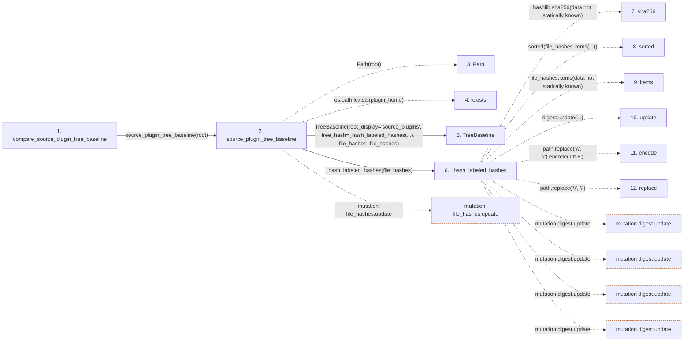

# compare_source_plugin_tree_baseline

**Entry point:** `compare_source_plugin_tree_baseline` (`api`)
**Source:** [documentation_policy](../modules/documentation_policy.md)
**Modules touched:** [documentation_policy](../modules/documentation_policy.md), [filesystem_guard](../modules/filesystem_guard.md)

## Call sequence

<!-- Auto-generated from static call edges. Dashed arrows are external or unresolved calls. Reviewed runtime conditions and side effects belong in Behavior. -->

> Call sequence diagram shows 30 of 273 interactions; 243 omitted to keep the visualization within the 30-interaction and generated-diagram limits.

> Trace truncated at the depth limit; deeper calls are omitted.

## Data flow

<!-- Auto-generated static analysis. Treat values and boundaries as best-effort hints, not runtime proof. -->

### Step data

| Step | Inputs | Reads | Writes | Returns |
|---|---|---|---|---|
| `compare_source_plugin_tree_baseline` | `baseline: TreeBaseline`, `root: str \| Path` | - | - | `IntegrityDifference(...)` |
| `source_plugin_tree_baseline` | `root: str \| Path` | `DEFAULT_MAX_BASELINE_FILE_BYTES`, `DEFAULT_MAX_BASELINE_FILE_BYTES`, `DEFAULT_MAX_BASELINE_FILES` | `file_hashes[...]` | `TreeBaseline(...)`, `TreeBaseline(...)` |
| `Path` | - | - | - | - |
| `lexists` | - | - | - | - |
| `TreeBaseline` | - | - | - | - |
| `_hash_labeled_hashes` | `file_hashes: dict[str, str]` | - | - | `...` |
| `sha256` | - | - | - | - |
| `sorted` | - | - | - | - |
| `items` | - | - | - | - |
| `update` | - | - | - | - |
| `encode` | - | - | - | - |
| `replace` | - | - | - | - |

### Call data

| From | To | Line | Call |
|---|---|---:|---|
| compare_source_plugin_tree_baseline | source_plugin_tree_baseline | 500 | `source_plugin_tree_baseline(root)` |
| source_plugin_tree_baseline | Path | 427 | `Path(root)` |
| source_plugin_tree_baseline | lexists | 432 | `os.path.lexists(plugin_home)` |
| source_plugin_tree_baseline | TreeBaseline | 433 | `TreeBaseline(root_display='source_plugins', tree_hash=_hash_labeled_hashes(...), file_hashes=file_hashes)` |
| source_plugin_tree_baseline | _hash_labeled_hashes | 435 | `_hash_labeled_hashes(file_hashes)` |
| _hash_labeled_hashes | sha256 | 905 | `hashlib.sha256(data not statically known)` |
| _hash_labeled_hashes | sorted | 906 | `sorted(file_hashes.items(...))` |
| _hash_labeled_hashes | items | 906 | `file_hashes.items(data not statically known)` |
| _hash_labeled_hashes | update | 907 | `digest.update(...)` |
| _hash_labeled_hashes | encode | 907 | `path.replace('\\', '/').encode('utf-8')` |
| _hash_labeled_hashes | replace | 907 | `path.replace('\\', '/')` |

### Boundary effects

| Kind | Target | Step | Line |
|---|---|---|---:|
| mutation | `file_hashes.update` | `source_plugin_tree_baseline` | 467 |
| mutation | `digest.update` | `_hash_labeled_hashes` | 907 |
| mutation | `digest.update` | `_hash_labeled_hashes` | 908 |
| mutation | `digest.update` | `_hash_labeled_hashes` | 909 |
| mutation | `digest.update` | `_hash_labeled_hashes` | 910 |

### Static analysis gaps

| Kind | Step | Target | Line |
|---|---|---|---:|
| external_call | `source_plugin_tree_baseline` | `os.path.lexists` | 432 |
| external_call | `_hash_labeled_hashes` | `hashlib.sha256` | 905 |
| unresolved_call | `_hash_labeled_hashes` | `sorted` | 906 |
| unresolved_call | `_hash_labeled_hashes` | `file_hashes.items` | 906 |
| step_limit | `compare_source_plugin_tree_baseline` | `first 12 steps` | 0 |
| truncated_flow | `compare_source_plugin_tree_baseline` | `depth limit` | 0 |

## Behavior

This flow starts at `compare_source_plugin_tree_baseline` and is classified as `api`. The generated call and data-flow sections are bounded static projections; runtime conditions and side effects require source-level confirmation.
