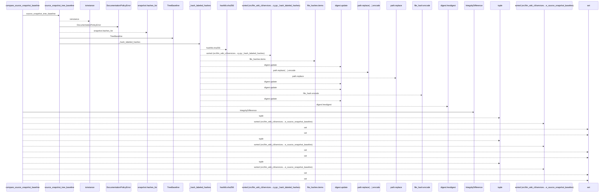
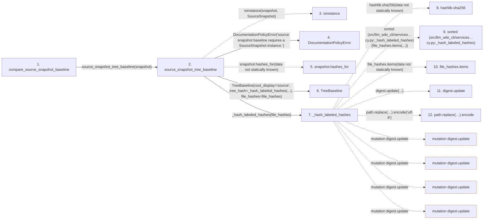

# compare_source_snapshot_baseline

**Entry point:** `compare_source_snapshot_baseline` (`api`)
**Source:** [documentation_policy](../modules/documentation_policy.md)
**Modules touched:** [documentation_policy](../modules/documentation_policy.md)

## Call sequence

<!-- Auto-generated from static call edges. Dashed arrows are external or unresolved calls. Reviewed runtime conditions and side effects belong in Behavior. -->

## Data flow

<!-- Auto-generated static analysis. Treat values and boundaries as best-effort hints, not runtime proof. -->

### Step data

| Step | Inputs | Reads | Writes | Returns |
|---|---|---|---|---|
| `compare_source_snapshot_baseline` | `baseline: TreeBaseline`, `snapshot: SourceSnapshot` | - | - | `IntegrityDifference(...)` |
| `source_snapshot_tree_baseline` | `snapshot: SourceSnapshot` | - | - | `TreeBaseline(...)` |
| `isinstance` | - | - | - | - |
| `DocumentationPolicyError` | - | - | - | - |
| `snapshot.hashes_for` | - | - | - | - |
| `TreeBaseline` | - | - | - | - |
| `_hash_labeled_hashes` | `file_hashes: dict[str, str]` | - | - | `...` |
| `hashlib.sha256` | - | - | - | - |
| `sorted (src/llm_wiki_cli/services…cy.py:_hash_labeled_hashes)` | - | - | - | - |
| `file_hashes.items` | - | - | - | - |
| `digest.update` | - | - | - | - |
| `path.replace(…).encode` | - | - | - | - |

### Call data

| From | To | Line | Call |
|---|---|---:|---|
| compare_source_snapshot_baseline | source_snapshot_tree_baseline | 404 | `source_snapshot_tree_baseline(snapshot)` |
| source_snapshot_tree_baseline | isinstance | 386 | `isinstance(snapshot, SourceSnapshot)` |
| source_snapshot_tree_baseline | DocumentationPolicyError | 387 | `DocumentationPolicyError('source snapshot baseline requires a SourceSnapshot instance.')` |
| source_snapshot_tree_baseline | snapshot.hashes_for | 390 | `snapshot.hashes_for(data not statically known)` |
| source_snapshot_tree_baseline | TreeBaseline | 391 | `TreeBaseline(root_display='source', tree_hash=_hash_labeled_hashes(...), file_hashes=file_hashes)` |
| source_snapshot_tree_baseline | _hash_labeled_hashes | 393 | `_hash_labeled_hashes(file_hashes)` |
| _hash_labeled_hashes | hashlib.sha256 | 905 | `hashlib.sha256(data not statically known)` |
| _hash_labeled_hashes | sorted (src/llm_wiki_cli/services…cy.py:_hash_labeled_hashes) | 906 | `sorted(file_hashes.items(...))` |
| _hash_labeled_hashes | file_hashes.items | 906 | `file_hashes.items(data not statically known)` |
| _hash_labeled_hashes | digest.update | 907 | `digest.update(...)` |
| _hash_labeled_hashes | path.replace(…).encode | 907 | `path.replace('\\', '/').encode('utf-8')` |

### Boundary effects

| Kind | Target | Step | Line |
|---|---|---|---:|
| mutation | `digest.update` | `_hash_labeled_hashes` | 907 |
| mutation | `digest.update` | `_hash_labeled_hashes` | 908 |
| mutation | `digest.update` | `_hash_labeled_hashes` | 909 |
| mutation | `digest.update` | `_hash_labeled_hashes` | 910 |

### Static analysis gaps

| Kind | Step | Target | Line |
|---|---|---|---:|
| external_call | `source_snapshot_tree_baseline` | `isinstance` | 386 |
| unresolved_call | `source_snapshot_tree_baseline` | `snapshot.hashes_for` | 390 |
| external_call | `_hash_labeled_hashes` | `hashlib.sha256` | 905 |
| external_call | `_hash_labeled_hashes` | `sorted` | 906 |
| unresolved_call | `_hash_labeled_hashes` | `file_hashes.items` | 906 |
| step_limit | `compare_source_snapshot_baseline` | `first 12 steps` | 0 |

## Behavior

This flow starts at `compare_source_snapshot_baseline` and is classified as `api`. The generated call and data-flow sections are bounded static projections; runtime conditions and side effects require source-level confirmation.
