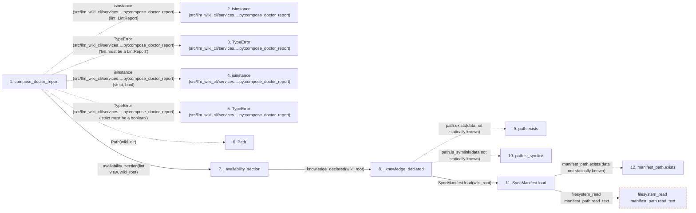

# compose_doctor_report

**Entry point:** `compose_doctor_report` (`api`)
**Source:** [doctor_service](../modules/doctor_service.md)
**Modules touched:** [doctor_service](../modules/doctor_service.md), [knowledge_observability](../modules/knowledge_observability.md), [knowledge_storage](../modules/knowledge_storage.md), and 4 more

**Complete modules touched:**

- [doctor_service](../modules/doctor_service.md)
- [knowledge_observability](../modules/knowledge_observability.md)
- [knowledge_storage](../modules/knowledge_storage.md)
- [knowledge_storage_io](../modules/knowledge_storage_io.md)
- [manifest_storage](../modules/manifest_storage.md)
- [sync_manifest](../modules/sync_manifest.md)
- [validation](../modules/validation.md)

## Call sequence

```mermaid
sequenceDiagram
    participant p0 as compose_doctor_report
    participant p1 as isinstance (src/llm_wiki_cli/services….py:compose_doctor_report)
    participant p2 as TypeError (src/llm_wiki_cli/services….py:compose_doctor_report)
    participant p3 as Path
    participant p4 as _availability_section
    participant p5 as _knowledge_declared
    participant p6 as path.exists
    participant p7 as path.is_symlink
    participant p8 as SyncManifest.load
    participant p9 as manifest_path.exists
    participant p10 as FileNotFoundError
    participant p11 as json.loads (src/llm_wiki_cli/services…fest.py:SyncManifest.load)
    participant p12 as manifest_path.read_text
    participant p13 as isinstance (src/llm_wiki_cli/services…fest.py:SyncManifest.load)
    participant p14 as data.get (src/llm_wiki_cli/services…fest.py:SyncManifest.load)
    participant p15 as StorageReadSession
    participant p16 as session.read
    participant p17 as SyncManifest.from_payload
    participant p18 as _mapping_value
    participant p19 as require_mapping
    participant p20 as SyncManifestError
    participant p21 as data.get (src/llm_wiki_cli/services…SyncManifest.from_payload)
    participant p22 as type
    participant p23 as ManifestStoreReader
    participant p24 as reader.materialize
    participant p25 as isinstance (src/llm_wiki_cli/services…SyncManifest.from_payload)
    p0-->>p1: isinstance (src/llm_wiki_cli/services….py:compose_doctor_report)
    p0-->>p2: TypeError (src/llm_wiki_cli/services….py:compose_doctor_report)
    p0-->>p1: isinstance (src/llm_wiki_cli/services….py:compose_doctor_report)
    p0-->>p2: TypeError (src/llm_wiki_cli/services….py:compose_doctor_report)
    p0-->>p3: Path
    p0->>p4: _availability_section
    p4->>p5: _knowledge_declared
    p5-->>p6: path.exists
    p5-->>p7: path.is_symlink
    p5->>p8: SyncManifest.load
    p8-->>p9: manifest_path.exists
    p8-->>p10: FileNotFoundError
    p8-->>p11: json.loads (src/llm_wiki_cli/services…fest.py:SyncManifest.load)
    p8-->>p12: manifest_path.read_text
    p8-->>p13: isinstance (src/llm_wiki_cli/services…fest.py:SyncManifest.load)
    p8-->>p14: data.get (src/llm_wiki_cli/services…fest.py:SyncManifest.load)
    p8->>p15: StorageReadSession
    p8-->>p16: session.read
    p8->>p17: SyncManifest.from_payload
    p17->>p18: _mapping_value
    p18->>p19: require_mapping
    p18->>p20: SyncManifestError
    p18->>p20: SyncManifestError
    p17-->>p21: data.get (src/llm_wiki_cli/services…SyncManifest.from_payload)
    p17-->>p22: type
    p17->>p20: SyncManifestError
    p17->>p23: ManifestStoreReader
    p17->>p17: SyncManifest.from_payload
    p17-->>p24: reader.materialize
    p17-->>p25: isinstance (src/llm_wiki_cli/services…SyncManifest.from_payload)
```

<!-- Auto-generated from static call edges. Dashed arrows are external or unresolved calls. Reviewed runtime conditions and side effects belong in Behavior. -->

> Call sequence diagram shows 30 of 261 interactions; 231 omitted to keep the visualization within the 30-interaction and generated-diagram limits.

> Trace truncated at the depth limit; deeper calls are omitted.

## Data flow

<!-- Auto-generated static analysis. Treat values and boundaries as best-effort hints, not runtime proof. -->

### Step data

| Step | Inputs | Reads | Writes | Returns |
|---|---|---|---|---|
| `compose_doctor_report` | `lint: LintReport`, `strict: bool`, `wiki_dir: str`, `src_dir: str` | `LintReport` | - | `DoctorReport(...)` |
| `isinstance (src/llm_wiki_cli/services….py:compose_doctor_report)` | - | - | - | - |
| `TypeError (src/llm_wiki_cli/services….py:compose_doctor_report)` | - | - | - | - |
| `isinstance (src/llm_wiki_cli/services….py:compose_doctor_report)` | - | - | - | - |
| `TypeError (src/llm_wiki_cli/services….py:compose_doctor_report)` | - | - | - | - |
| `Path` | - | - | - | - |
| `_availability_section` | `lint: LintReport`, `view: KnowledgeReadView \| None`, `wiki_root: Path` | `KnowledgeAvailability`, `KnowledgeAvailability`, `KnowledgeAvailability`, `KnowledgeAvailability`, `KnowledgeAvailability` | - | `{...}`, `{...}`, `{...}`, `{...}` |
| `_knowledge_declared` | `wiki_root: Path` | `SURFACE_INDEX_FILENAME`, `KNOWLEDGE_INDEX_FILENAME`, `GOVERNANCE_FILENAME`, `VERIFICATION_RECEIPT_FILENAME` | - | `True`, `False`, `...` |
| `path.exists` | - | - | - | - |
| `path.is_symlink` | - | - | - | - |
| `SyncManifest.load` | `wiki_dir: Path` | `MANIFEST_FILENAME`, `MANIFEST_FILENAME` | - | `manifest`, `cls.from_payload(...)` |
| `manifest_path.exists` | - | - | - | - |

### Call data

| From | To | Line | Call |
|---|---|---:|---|
| compose_doctor_report | isinstance (src/llm_wiki_cli/services….py:compose_doctor_report) | 192 | `isinstance(lint, LintReport)` |
| compose_doctor_report | TypeError (src/llm_wiki_cli/services….py:compose_doctor_report) | 193 | `TypeError('lint must be a LintReport')` |
| compose_doctor_report | isinstance (src/llm_wiki_cli/services….py:compose_doctor_report) | 194 | `isinstance(strict, bool)` |
| compose_doctor_report | TypeError (src/llm_wiki_cli/services….py:compose_doctor_report) | 195 | `TypeError('strict must be a boolean')` |
| compose_doctor_report | Path | 198 | `Path(wiki_dir)` |
| compose_doctor_report | _availability_section | 199 | `_availability_section(lint, view, wiki_root)` |
| _availability_section | _knowledge_declared | 306 | `_knowledge_declared(wiki_root)` |
| _knowledge_declared | path.exists | 340 | `path.exists(data not statically known)` |
| _knowledge_declared | path.is_symlink | 340 | `path.is_symlink(data not statically known)` |
| _knowledge_declared | SyncManifest.load | 343 | `SyncManifest.load(wiki_root)` |
| SyncManifest.load | manifest_path.exists | 1125 | `manifest_path.exists(data not statically known)` |

### Boundary effects

| Kind | Target | Step | Line |
|---|---|---|---:|
| filesystem_read | `manifest_path.read_text` | `SyncManifest.load` | 1146 |

### Static analysis gaps

| Kind | Step | Target | Line |
|---|---|---|---:|
| external_call | `compose_doctor_report` | `isinstance` | 192 |
| external_call | `compose_doctor_report` | `TypeError` | 193 |
| external_call | `compose_doctor_report` | `isinstance` | 194 |
| external_call | `compose_doctor_report` | `TypeError` | 195 |
| unresolved_call | `_knowledge_declared` | `path.exists` | 340 |
| unresolved_call | `_knowledge_declared` | `path.is_symlink` | 340 |
| unresolved_call | `SyncManifest.load` | `manifest_path.exists` | 1125 |
| step_limit | `compose_doctor_report` | `first 12 steps` | 0 |
| truncated_flow | `compose_doctor_report` | `depth limit` | 0 |

## Behavior

This flow starts at `compose_doctor_report` and is classified as `api`. The generated call and data-flow sections are bounded static projections; runtime conditions and side effects require source-level confirmation.
