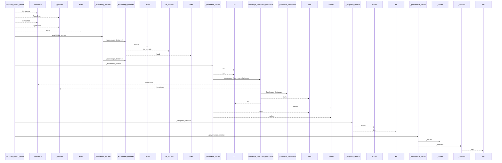
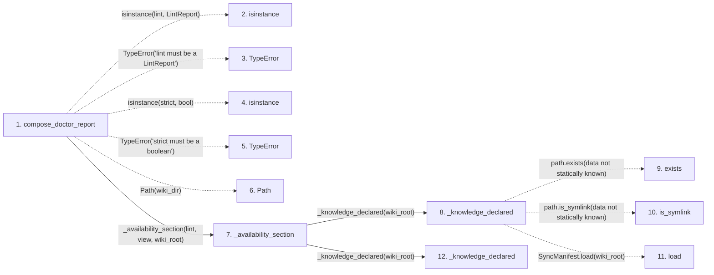

# compose_doctor_report

**Entry point:** `compose_doctor_report` (`api`)
**Source:** [doctor_service](../modules/doctor_service.md)
**Modules touched:** [doctor_service](../modules/doctor_service.md), [knowledge_observability](../modules/knowledge_observability.md)

## Call sequence

<!-- Auto-generated from static call edges. Dashed arrows are external or unresolved calls. Reviewed runtime conditions and side effects belong in Behavior. -->

> Call sequence diagram shows 30 of 84 interactions; 54 omitted to keep the visualization within the 30-interaction and generated-diagram limits.

## Data flow

<!-- Auto-generated static analysis. Treat values and boundaries as best-effort hints, not runtime proof. -->

### Step data

| Step | Inputs | Reads | Writes | Returns |
|---|---|---|---|---|
| `compose_doctor_report` | `lint: LintReport`, `strict: bool`, `wiki_dir: str`, `src_dir: str` | `LintReport` | - | `DoctorReport(...)` |
| `isinstance` | - | - | - | - |
| `TypeError` | - | - | - | - |
| `isinstance` | - | - | - | - |
| `TypeError` | - | - | - | - |
| `Path` | - | - | - | - |
| `_availability_section` | `lint: LintReport`, `view: KnowledgeReadView \| None`, `wiki_root: Path` | `KnowledgeAvailability`, `KnowledgeAvailability`, `KnowledgeAvailability`, `KnowledgeAvailability`, `KnowledgeAvailability` | - | `{...}`, `{...}`, `{...}`, `{...}` |
| `_knowledge_declared` | `wiki_root: Path` | `SURFACE_INDEX_FILENAME`, `KNOWLEDGE_INDEX_FILENAME`, `GOVERNANCE_FILENAME`, `VERIFICATION_RECEIPT_FILENAME` | - | `True`, `False`, `...` |
| `exists` | - | - | - | - |
| `is_symlink` | - | - | - | - |
| `load` | - | - | - | - |
| `_knowledge_declared` | `wiki_root: Path` | `SURFACE_INDEX_FILENAME`, `KNOWLEDGE_INDEX_FILENAME`, `GOVERNANCE_FILENAME`, `VERIFICATION_RECEIPT_FILENAME` | - | `True`, `False`, `...` |

### Call data

| From | To | Line | Call |
|---|---|---:|---|
| compose_doctor_report | isinstance | 175 | `isinstance(lint, LintReport)` |
| compose_doctor_report | TypeError | 176 | `TypeError('lint must be a LintReport')` |
| compose_doctor_report | isinstance | 177 | `isinstance(strict, bool)` |
| compose_doctor_report | TypeError | 178 | `TypeError('strict must be a boolean')` |
| compose_doctor_report | Path | 181 | `Path(wiki_dir)` |
| compose_doctor_report | _availability_section | 182 | `_availability_section(lint, view, wiki_root)` |
| _availability_section | _knowledge_declared | 286 | `_knowledge_declared(wiki_root)` |
| _knowledge_declared | exists | 320 | `path.exists(data not statically known)` |
| _knowledge_declared | is_symlink | 320 | `path.is_symlink(data not statically known)` |
| _knowledge_declared | load | 323 | `SyncManifest.load(wiki_root)` |
| _availability_section | _knowledge_declared | 299 | `_knowledge_declared(wiki_root)` |

### Boundary effects

*No boundary effects detected.*

### Static analysis gaps

| Kind | Step | Target | Line |
|---|---|---|---:|
| unresolved_call | `compose_doctor_report` | `isinstance` | 175 |
| unresolved_call | `compose_doctor_report` | `TypeError` | 176 |
| unresolved_call | `compose_doctor_report` | `isinstance` | 177 |
| unresolved_call | `compose_doctor_report` | `TypeError` | 178 |
| unresolved_call | `_knowledge_declared` | `path.exists` | 320 |
| unresolved_call | `_knowledge_declared` | `path.is_symlink` | 320 |
| external_call | `_knowledge_declared` | `SyncManifest.load` | 323 |
| step_limit | `compose_doctor_report` | `first 12 steps` | 0 |

## Behavior

This flow starts at `compose_doctor_report` and is classified as `api`. The generated call and data-flow sections are bounded static projections; runtime conditions and side effects require source-level confirmation.
