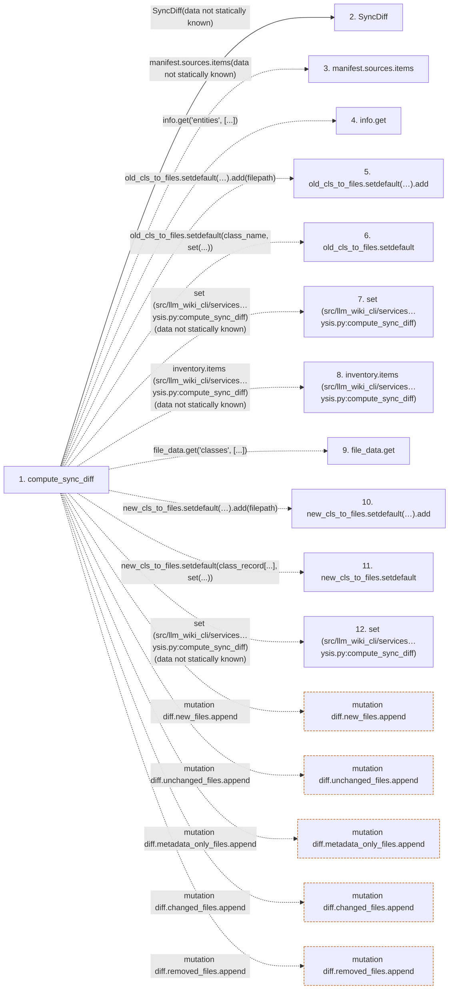

# compute_sync_diff

**Entry point:** `compute_sync_diff` (`api`)
**Source:** [sync_analysis](../modules/sync_analysis.md)
**Modules touched:** [bootstrap_runtime](../modules/bootstrap_runtime.md), [knowledge_evidence](../modules/knowledge_evidence.md), [sync_analysis](../modules/sync_analysis.md)

## Call sequence

```mermaid
sequenceDiagram
    participant p0 as compute_sync_diff
    participant p1 as SyncDiff
    participant p2 as manifest.sources.items
    participant p3 as info.get
    participant p4 as old_cls_to_files.setdefault(…).add
    participant p5 as old_cls_to_files.setdefault
    participant p6 as set (src/llm_wiki_cli/services…ysis.py:compute_sync_diff)
    participant p7 as inventory.items (src/llm_wiki_cli/services…ysis.py:compute_sync_diff)
    participant p8 as file_data.get
    participant p9 as new_cls_to_files.setdefault(…).add
    participant p10 as new_cls_to_files.setdefault
    participant p11 as old_cls_to_files.items
    participant p12 as new_cls_to_files.get
    participant p13 as len (src/llm_wiki_cli/services…ysis.py:compute_sync_diff)
    participant p14 as next (src/llm_wiki_cli/services…ysis.py:compute_sync_diff)
    participant p15 as iter
    participant p16 as diff.new_files.append
    participant p17 as hash_file
    participant p18 as sha256_bytes
    participant p19 as hashlib.sha256(…).hexdigest
    participant p20 as hashlib.sha256
    participant p21 as path.read_bytes
    participant p22 as Path (src/llm_wiki_cli/services…ysis.py:compute_sync_diff)
    participant p23 as manifest.sources[…].get
    participant p24 as diff.unchanged_files.append
    p0->>p1: SyncDiff
    p0-->>p2: manifest.sources.items
    p0-->>p3: info.get
    p0-->>p4: old_cls_to_files.setdefault(…).add
    p0-->>p5: old_cls_to_files.setdefault
    p0-->>p6: set (src/llm_wiki_cli/services…ysis.py:compute_sync_diff)
    p0-->>p7: inventory.items (src/llm_wiki_cli/services…ysis.py:compute_sync_diff)
    p0-->>p8: file_data.get
    p0-->>p9: new_cls_to_files.setdefault(…).add
    p0-->>p10: new_cls_to_files.setdefault
    p0-->>p6: set (src/llm_wiki_cli/services…ysis.py:compute_sync_diff)
    p0-->>p11: old_cls_to_files.items
    p0-->>p12: new_cls_to_files.get
    p0-->>p6: set (src/llm_wiki_cli/services…ysis.py:compute_sync_diff)
    p0-->>p13: len (src/llm_wiki_cli/services…ysis.py:compute_sync_diff)
    p0-->>p13: len (src/llm_wiki_cli/services…ysis.py:compute_sync_diff)
    p0-->>p14: next (src/llm_wiki_cli/services…ysis.py:compute_sync_diff)
    p0-->>p15: iter
    p0-->>p14: next (src/llm_wiki_cli/services…ysis.py:compute_sync_diff)
    p0-->>p15: iter
    p0-->>p7: inventory.items (src/llm_wiki_cli/services…ysis.py:compute_sync_diff)
    p0-->>p16: diff.new_files.append
    p0->>p17: hash_file
    p17->>p18: sha256_bytes
    p18-->>p19: hashlib.sha256(…).hexdigest
    p18-->>p20: hashlib.sha256
    p17-->>p21: path.read_bytes
    p0-->>p22: Path (src/llm_wiki_cli/services…ysis.py:compute_sync_diff)
    p0-->>p23: manifest.sources[…].get
    p0-->>p24: diff.unchanged_files.append
```

<!-- Auto-generated from static call edges. Dashed arrows are external or unresolved calls. Reviewed runtime conditions and side effects belong in Behavior. -->

> Call sequence diagram shows 30 of 140 interactions; 110 omitted to keep the visualization within the 30-interaction and generated-diagram limits.

> Trace truncated at the depth limit; deeper calls are omitted.

## Data flow

<!-- Auto-generated static analysis. Treat values and boundaries as best-effort hints, not runtime proof. -->

### Step data

| Step | Inputs | Reads | Writes | Returns |
|---|---|---|---|---|
| `compute_sync_diff` | `manifest: SyncManifest`, `inventory: dict`, `src_dir: str`, `entity_page_cache: dict[tuple[str, str], str] \| None`, `module_page_map: dict[str, str] \| None`, `source_content_hashes: Mapping[str, str] \| None` | - | `diff.moved_entities[...]`, `diff.renamed_module_pages[...]` | `diff` |
| `SyncDiff` | - | - | - | - |
| `manifest.sources.items` | - | - | - | - |
| `info.get` | - | - | - | - |
| `old_cls_to_files.setdefault(…).add` | - | - | - | - |
| `old_cls_to_files.setdefault` | - | - | - | - |
| `set (src/llm_wiki_cli/services…ysis.py:compute_sync_diff)` | - | - | - | - |
| `inventory.items (src/llm_wiki_cli/services…ysis.py:compute_sync_diff)` | - | - | - | - |
| `file_data.get` | - | - | - | - |
| `new_cls_to_files.setdefault(…).add` | - | - | - | - |
| `new_cls_to_files.setdefault` | - | - | - | - |
| `set (src/llm_wiki_cli/services…ysis.py:compute_sync_diff)` | - | - | - | - |

### Call data

| From | To | Line | Call |
|---|---|---:|---|
| compute_sync_diff | SyncDiff | 58 | `SyncDiff(data not statically known)` |
| compute_sync_diff | manifest.sources.items | 61 | `manifest.sources.items(data not statically known)` |
| compute_sync_diff | info.get | 62 | `info.get('entities', [...])` |
| compute_sync_diff | old_cls_to_files.setdefault(…).add | 63 | `old_cls_to_files.setdefault(class_name, set()).add(filepath)` |
| compute_sync_diff | old_cls_to_files.setdefault | 63 | `old_cls_to_files.setdefault(class_name, set(...))` |
| compute_sync_diff | set (src/llm_wiki_cli/services…ysis.py:compute_sync_diff) | 63 | `set(data not statically known)` |
| compute_sync_diff | inventory.items (src/llm_wiki_cli/services…ysis.py:compute_sync_diff) | 66 | `inventory.items(data not statically known)` |
| compute_sync_diff | file_data.get | 67 | `file_data.get('classes', [...])` |
| compute_sync_diff | new_cls_to_files.setdefault(…).add | 68 | `new_cls_to_files.setdefault(class_record['name'], set()).add(filepath)` |
| compute_sync_diff | new_cls_to_files.setdefault | 68 | `new_cls_to_files.setdefault(class_record[...], set(...))` |
| compute_sync_diff | set (src/llm_wiki_cli/services…ysis.py:compute_sync_diff) | 68 | `set(data not statically known)` |

### Boundary effects

| Kind | Target | Step | Line |
|---|---|---|---:|
| mutation | `diff.new_files.append` | `compute_sync_diff` | 81 |
| mutation | `diff.unchanged_files.append` | `compute_sync_diff` | 89 |
| mutation | `diff.metadata_only_files.append` | `compute_sync_diff` | 93 |
| mutation | `diff.changed_files.append` | `compute_sync_diff` | 95 |
| mutation | `diff.removed_files.append` | `compute_sync_diff` | 99 |

### Static analysis gaps

| Kind | Step | Target | Line |
|---|---|---|---:|
| unresolved_call | `compute_sync_diff` | `manifest.sources.items` | 61 |
| unresolved_call | `compute_sync_diff` | `info.get` | 62 |
| unresolved_call | `compute_sync_diff` | `old_cls_to_files.setdefault(class_name, set()).add` | 63 |
| unresolved_call | `compute_sync_diff` | `old_cls_to_files.setdefault` | 63 |
| unresolved_call | `compute_sync_diff` | `inventory.items` | 66 |
| unresolved_call | `compute_sync_diff` | `file_data.get` | 67 |
| unresolved_call | `compute_sync_diff` | `new_cls_to_files.setdefault(class_record['name'], set()).add` | 68 |
| unresolved_call | `compute_sync_diff` | `new_cls_to_files.setdefault` | 68 |
| step_limit | `compute_sync_diff` | `first 12 steps` | 0 |
| truncated_flow | `compute_sync_diff` | `depth limit` | 0 |

## Behavior

This flow starts at `compute_sync_diff` and is classified as `api`. The generated call and data-flow sections are bounded static projections; runtime conditions and side effects require source-level confirmation.
