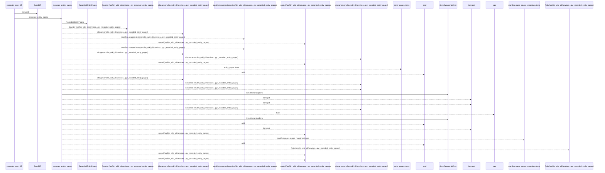
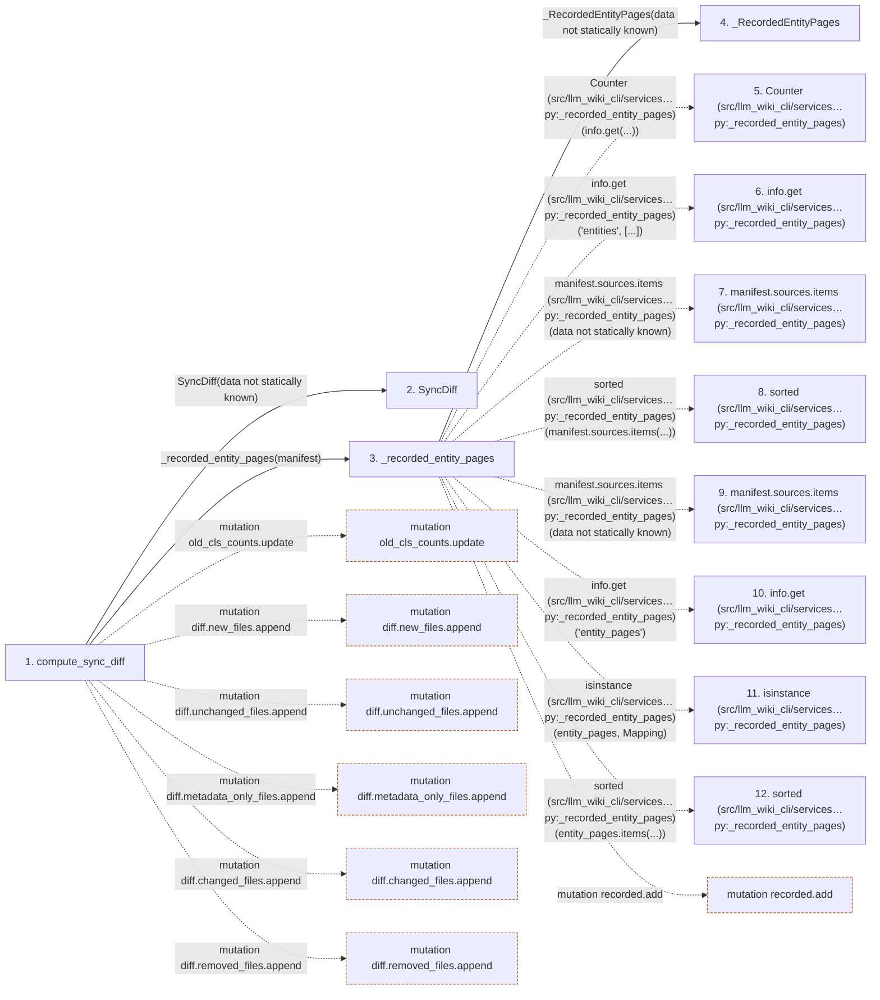

# compute_sync_diff

**Entry point:** `compute_sync_diff` (`api`)
**Source:** [sync_analysis](../modules/sync_analysis.md)
**Modules touched:** [bootstrap_runtime](../modules/bootstrap_runtime.md), [knowledge_evidence](../modules/knowledge_evidence.md), [sync_analysis](../modules/sync_analysis.md), [validation](../modules/validation.md)

## Call sequence

<!-- Auto-generated from static call edges. Dashed arrows are external or unresolved calls. Reviewed runtime conditions and side effects belong in Behavior. -->

```mermaid
sequenceDiagram
    participant p0 as compute_sync_diff
    participant p1 as SyncDiff
    participant p2 as _recorded_entity_pages
    participant p3 as _RecordedEntityPages
    participant p4 as Counter (src/llm_wiki_cli/services…py:_recorded_entity_pages)
    participant p5 as info.get (src/llm_wiki_cli/services…py:_recorded_entity_pages)
    participant p6 as manifest.sources.items (src/llm_wiki_cli/services…py:_recorded_entity_pages)
    participant p7 as sorted (src/llm_wiki_cli/services…py:_recorded_entity_pages)
    participant p8 as isinstance (src/llm_wiki_cli/services…py:_recorded_entity_pages)
    participant p9 as entity_pages.items
    participant p10 as add
    participant p11 as SyncOwnershipError
    participant p12 as item.get
    participant p13 as type
    participant p14 as manifest.page_source_mappings.items
    participant p15 as Path (src/llm_wiki_cli/services…py:_recorded_entity_pages)
    p0->>p1: SyncDiff
    p0->>p2: _recorded_entity_pages
    p2->>p3: _RecordedEntityPages
    p2-->>p4: Counter (src/llm_wiki_cli/services…py:_recorded_entity_pages)
    p2-->>p5: info.get (src/llm_wiki_cli/services…py:_recorded_entity_pages)
    p2-->>p6: manifest.sources.items (src/llm_wiki_cli/services…py:_recorded_entity_pages)
    p2-->>p7: sorted (src/llm_wiki_cli/services…py:_recorded_entity_pages)
    p2-->>p6: manifest.sources.items (src/llm_wiki_cli/services…py:_recorded_entity_pages)
    p2-->>p5: info.get (src/llm_wiki_cli/services…py:_recorded_entity_pages)
    p2-->>p8: isinstance (src/llm_wiki_cli/services…py:_recorded_entity_pages)
    p2-->>p7: sorted (src/llm_wiki_cli/services…py:_recorded_entity_pages)
    p2-->>p9: entity_pages.items
    p2-->>p10: add
    p2-->>p5: info.get (src/llm_wiki_cli/services…py:_recorded_entity_pages)
    p2-->>p8: isinstance (src/llm_wiki_cli/services…py:_recorded_entity_pages)
    p2-->>p8: isinstance (src/llm_wiki_cli/services…py:_recorded_entity_pages)
    p2->>p11: SyncOwnershipError
    p2-->>p12: item.get
    p2-->>p12: item.get
    p2-->>p8: isinstance (src/llm_wiki_cli/services…py:_recorded_entity_pages)
    p2-->>p13: type
    p2->>p11: SyncOwnershipError
    p2-->>p10: add
    p2-->>p12: item.get
    p2-->>p7: sorted (src/llm_wiki_cli/services…py:_recorded_entity_pages)
    p2-->>p14: manifest.page_source_mappings.items
    p2-->>p10: add
    p2-->>p15: Path (src/llm_wiki_cli/services…py:_recorded_entity_pages)
    p2-->>p7: sorted (src/llm_wiki_cli/services…py:_recorded_entity_pages)
    p2-->>p7: sorted (src/llm_wiki_cli/services…py:_recorded_entity_pages)
```

> Call sequence diagram shows 30 of 199 interactions; 169 omitted to keep the visualization within the 30-interaction and generated-diagram limits.

> Trace truncated at the depth limit; deeper calls are omitted.

## Data flow

<!-- Auto-generated static analysis. Treat values and boundaries as best-effort hints, not runtime proof. -->

```mermaid
flowchart LR
    s1["1. compute_sync_diff"]
    s2["2. SyncDiff"]
    s3["3. _recorded_entity_pages"]
    s4["4. _RecordedEntityPages"]
    s5["5. Counter (src/llm_wiki_cli/services…py:_recorded_entity_pages)"]
    s6["6. info.get (src/llm_wiki_cli/services…py:_recorded_entity_pages)"]
    s7["7. manifest.sources.items (src/llm_wiki_cli/services…py:_recorded_entity_pages)"]
    s8["8. sorted (src/llm_wiki_cli/services…py:_recorded_entity_pages)"]
    s9["9. manifest.sources.items (src/llm_wiki_cli/services…py:_recorded_entity_pages)"]
    s10["10. info.get (src/llm_wiki_cli/services…py:_recorded_entity_pages)"]
    s11["11. isinstance (src/llm_wiki_cli/services…py:_recorded_entity_pages)"]
    s12["12. sorted (src/llm_wiki_cli/services…py:_recorded_entity_pages)"]
    s1 -->|"SyncDiff(data not statically known)"| s2
    s1 -->|"_recorded_entity_pages(manifest)"| s3
    s3 -->|"_RecordedEntityPages(data not statically known)"| s4
    s3 -. "Counter (src/llm_wiki_cli/services…py:_recorded_entity_pages)(info.get(...))" .-> s5
    s3 -. "info.get (src/llm_wiki_cli/services…py:_recorded_entity_pages)('entities', [...])" .-> s6
    s3 -. "manifest.sources.items (src/llm_wiki_cli/services…py:_recorded_entity_pages)(data not statically known)" .-> s7
    s3 -. "sorted (src/llm_wiki_cli/services…py:_recorded_entity_pages)(manifest.sources.items(...))" .-> s8
    s3 -. "manifest.sources.items (src/llm_wiki_cli/services…py:_recorded_entity_pages)(data not statically known)" .-> s9
    s3 -. "info.get (src/llm_wiki_cli/services…py:_recorded_entity_pages)('entity_pages')" .-> s10
    s3 -. "isinstance (src/llm_wiki_cli/services…py:_recorded_entity_pages)(entity_pages, Mapping)" .-> s11
    s3 -. "sorted (src/llm_wiki_cli/services…py:_recorded_entity_pages)(entity_pages.items(...))" .-> s12
    b0["mutation old_cls_counts.update"]
    s1 -. "mutation old_cls_counts.update" .-> b0
    b1["mutation diff.new_files.append"]
    s1 -. "mutation diff.new_files.append" .-> b1
    b2["mutation diff.unchanged_files.append"]
    s1 -. "mutation diff.unchanged_files.append" .-> b2
    b3["mutation diff.metadata_only_files.append"]
    s1 -. "mutation diff.metadata_only_files.append" .-> b3
    b4["mutation diff.changed_files.append"]
    s1 -. "mutation diff.changed_files.append" .-> b4
    b5["mutation diff.removed_files.append"]
    s1 -. "mutation diff.removed_files.append" .-> b5
    b6["mutation recorded.add"]
    s3 -. "mutation recorded.add" .-> b6
    click s1 "../modules/sync_analysis.md"
    click s2 "../modules/sync_analysis.md"
    click s3 "../modules/sync_analysis.md"
    click s4 "../modules/sync_analysis.md"
    classDef boundary stroke:#b45309,stroke-dasharray: 4 2
    class b0 boundary
    class b1 boundary
    class b2 boundary
    class b3 boundary
    class b4 boundary
    class b5 boundary
    class b6 boundary
```

### Step data

| Step | Inputs | Reads | Writes | Returns |
|---|---|---|---|---|
| `compute_sync_diff` | `manifest: SyncManifest`, `inventory: dict`, `src_dir: str`, `entity_page_cache: dict[tuple[str, str], str] \| None`, `module_page_map: dict[str, str] \| None`, `source_content_hashes: Mapping[str, str] \| None` | - | `diff.moved_entities[...]`, `diff.renamed_module_pages[...]`, `seen[...]` | `diff` |
| `SyncDiff` | - | - | - | - |
| `_recorded_entity_pages` | `manifest: SyncManifest` | `Mapping`, `Mapping` | - | `recorded` |
| `_RecordedEntityPages` | - | - | - | - |
| `Counter (src/llm_wiki_cli/services…py:_recorded_entity_pages)` | - | - | - | - |
| `info.get (src/llm_wiki_cli/services…py:_recorded_entity_pages)` | - | - | - | - |
| `manifest.sources.items (src/llm_wiki_cli/services…py:_recorded_entity_pages)` | - | - | - | - |
| `sorted (src/llm_wiki_cli/services…py:_recorded_entity_pages)` | - | - | - | - |
| `manifest.sources.items (src/llm_wiki_cli/services…py:_recorded_entity_pages)` | - | - | - | - |
| `info.get (src/llm_wiki_cli/services…py:_recorded_entity_pages)` | - | - | - | - |
| `isinstance (src/llm_wiki_cli/services…py:_recorded_entity_pages)` | - | - | - | - |
| `sorted (src/llm_wiki_cli/services…py:_recorded_entity_pages)` | - | - | - | - |

### Call data

| From | To | Line | Call |
|---|---|---:|---|
| compute_sync_diff | SyncDiff | 187 | `SyncDiff(data not statically known)` |
| compute_sync_diff | _recorded_entity_pages | 188 | `_recorded_entity_pages(manifest)` |
| _recorded_entity_pages | _RecordedEntityPages | 76 | `_RecordedEntityPages(data not statically known)` |
| _recorded_entity_pages | Counter (src/llm_wiki_cli/services…py:_recorded_entity_pages) | 78 | `Counter(info.get(...))` |
| _recorded_entity_pages | info.get (src/llm_wiki_cli/services…py:_recorded_entity_pages) | 78 | `info.get('entities', [...])` |
| _recorded_entity_pages | manifest.sources.items (src/llm_wiki_cli/services…py:_recorded_entity_pages) | 79 | `manifest.sources.items(data not statically known)` |
| _recorded_entity_pages | sorted (src/llm_wiki_cli/services…py:_recorded_entity_pages) | 96 | `sorted(manifest.sources.items(...))` |
| _recorded_entity_pages | manifest.sources.items (src/llm_wiki_cli/services…py:_recorded_entity_pages) | 96 | `manifest.sources.items(data not statically known)` |
| _recorded_entity_pages | info.get (src/llm_wiki_cli/services…py:_recorded_entity_pages) | 97 | `info.get('entity_pages')` |
| _recorded_entity_pages | isinstance (src/llm_wiki_cli/services…py:_recorded_entity_pages) | 98 | `isinstance(entity_pages, Mapping)` |
| _recorded_entity_pages | sorted (src/llm_wiki_cli/services…py:_recorded_entity_pages) | 99 | `sorted(entity_pages.items(...))` |

### Boundary effects

| Kind | Target | Step | Line |
|---|---|---|---:|
| mutation | `old_cls_counts.update` | `compute_sync_diff` | 193 |
| mutation | `diff.new_files.append` | `compute_sync_diff` | 221 |
| mutation | `diff.unchanged_files.append` | `compute_sync_diff` | 229 |
| mutation | `diff.metadata_only_files.append` | `compute_sync_diff` | 233 |
| mutation | `diff.changed_files.append` | `compute_sync_diff` | 235 |
| mutation | `diff.removed_files.append` | `compute_sync_diff` | 239 |
| mutation | `recorded.add` | `_recorded_entity_pages` | 133 |

### Static analysis gaps

| Kind | Step | Target | Line |
|---|---|---|---:|
| external_call | `_recorded_entity_pages` | `Counter` | 78 |
| unresolved_call | `_recorded_entity_pages` | `info.get` | 78 |
| unresolved_call | `_recorded_entity_pages` | `manifest.sources.items` | 79 |
| external_call | `_recorded_entity_pages` | `sorted` | 96 |
| unresolved_call | `_recorded_entity_pages` | `manifest.sources.items` | 96 |
| unresolved_call | `_recorded_entity_pages` | `info.get` | 97 |
| external_call | `_recorded_entity_pages` | `isinstance` | 98 |
| external_call | `_recorded_entity_pages` | `sorted` | 99 |
| step_limit | `compute_sync_diff` | `first 12 steps` | 0 |
| truncated_flow | `compute_sync_diff` | `depth limit` | 0 |

## Behavior

This flow starts at `compute_sync_diff` and is classified as `api`. The generated call and data-flow sections are bounded static projections; runtime conditions and side effects require source-level confirmation.
