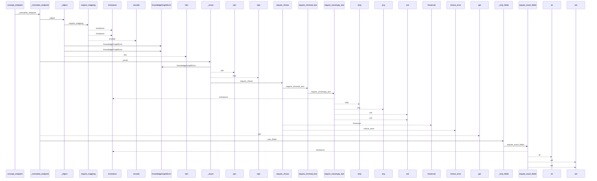
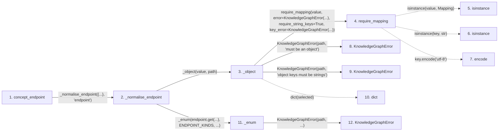

# concept_endpoint

**Entry point:** `concept_endpoint` (`api`)
**Source:** [knowledge_graph](../modules/knowledge_graph.md)
**Modules touched:** [knowledge_evidence](../modules/knowledge_evidence.md), [knowledge_graph](../modules/knowledge_graph.md), [validation](../modules/validation.md), [wiki_media](../modules/wiki_media.md), and 1 more

**Complete modules touched:**

- [knowledge_evidence](../modules/knowledge_evidence.md)
- [knowledge_graph](../modules/knowledge_graph.md)
- [validation](../modules/validation.md)
- [wiki_media](../modules/wiki_media.md)
- [wiki_surface](../modules/wiki_surface.md)

## Call sequence

<!-- Auto-generated from static call edges. Dashed arrows are external or unresolved calls. Reviewed runtime conditions and side effects belong in Behavior. -->

> Call sequence diagram shows 30 of 201 interactions; 171 omitted to keep the visualization within the 30-interaction and generated-diagram limits.

> Trace truncated at the depth limit; deeper calls are omitted.

## Data flow

<!-- Auto-generated static analysis. Treat values and boundaries as best-effort hints, not runtime proof. -->

### Step data

| Step | Inputs | Reads | Writes | Returns |
|---|---|---|---|---|
| `concept_endpoint` | `locator: str` | - | - | `_normalise_endpoint(...)` |
| `_normalise_endpoint` | `value: object`, `path: str` | `ENDPOINT_KINDS` | `result[...]`, `result[...]` | `{...}`, `{...}`, `{...}`, `result`, `result` |
| `_object` | `value: object`, `path: str` | - | - | `dict(...)` |
| `require_mapping` | `value: object`, `error: Exception`, `require_string_keys: bool`, `key_error: Exception \| None`, `require_utf8_keys: bool`, `utf8_key_error: Exception \| None` | `Mapping` | - | `value` |
| `isinstance` | - | - | - | - |
| `isinstance` | - | - | - | - |
| `encode` | - | - | - | - |
| `KnowledgeGraphError` | - | - | - | - |
| `KnowledgeGraphError` | - | - | - | - |
| `dict` | - | - | - | - |
| `_enum` | `value: object`, `values: Sequence[str]`, `path: str` | - | - | `require_choice(...)` |
| `KnowledgeGraphError` | - | - | - | - |

### Call data

| From | To | Line | Call |
|---|---|---:|---|
| concept_endpoint | _normalise_endpoint | 253 | `_normalise_endpoint({...}, 'endpoint')` |
| _normalise_endpoint | _object | 1390 | `_object(value, path)` |
| _object | require_mapping | 2282 | `require_mapping(value, error=KnowledgeGraphError(...), require_string_keys=True, key_error=KnowledgeGraphError(...))` |
| require_mapping | isinstance | 727 | `isinstance(value, Mapping)` |
| require_mapping | isinstance | 731 | `isinstance(key, str)` |
| require_mapping | encode | 736 | `key.encode('utf-8')` |
| _object | KnowledgeGraphError | 2284 | `KnowledgeGraphError(path, 'must be an object')` |
| _object | KnowledgeGraphError | 2286 | `KnowledgeGraphError(path, 'object keys must be strings')` |
| _object | dict | 2288 | `dict(selected)` |
| _normalise_endpoint | _enum | 1391 | `_enum(endpoint.get(...), ENDPOINT_KINDS, ...)` |
| _enum | KnowledgeGraphError | 2321 | `KnowledgeGraphError(path, ...)` |

### Boundary effects

*No boundary effects detected.*

### Static analysis gaps

| Kind | Step | Target | Line |
|---|---|---|---:|
| unresolved_call | `require_mapping` | `isinstance` | 727 |
| unresolved_call | `require_mapping` | `isinstance` | 731 |
| unresolved_call | `require_mapping` | `key.encode` | 736 |
| step_limit | `concept_endpoint` | `first 12 steps` | 0 |
| truncated_flow | `concept_endpoint` | `depth limit` | 0 |

## Behavior

This flow starts at `concept_endpoint` and is classified as `api`. The generated call and data-flow sections are bounded static projections; runtime conditions and side effects require source-level confirmation.
